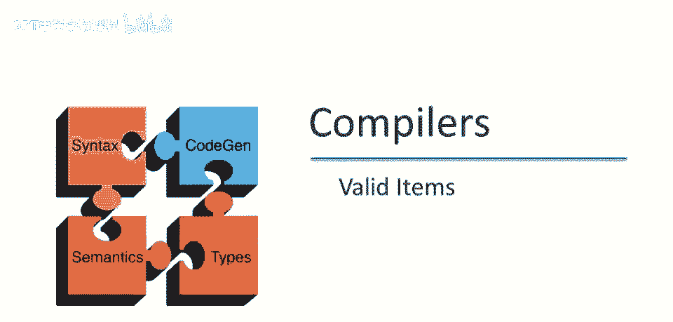
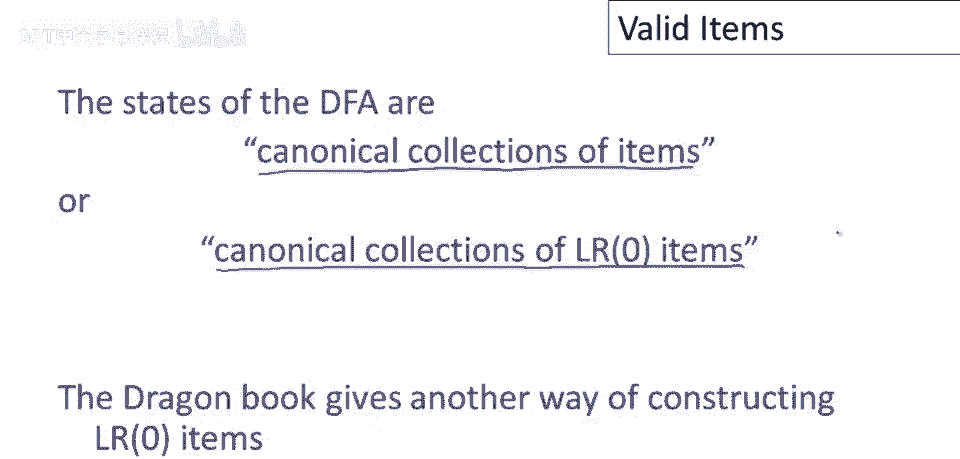
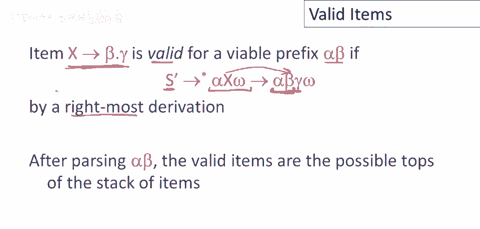
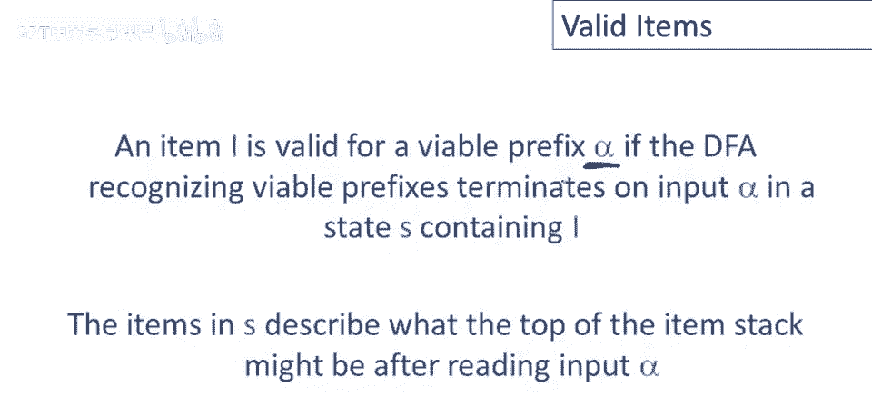
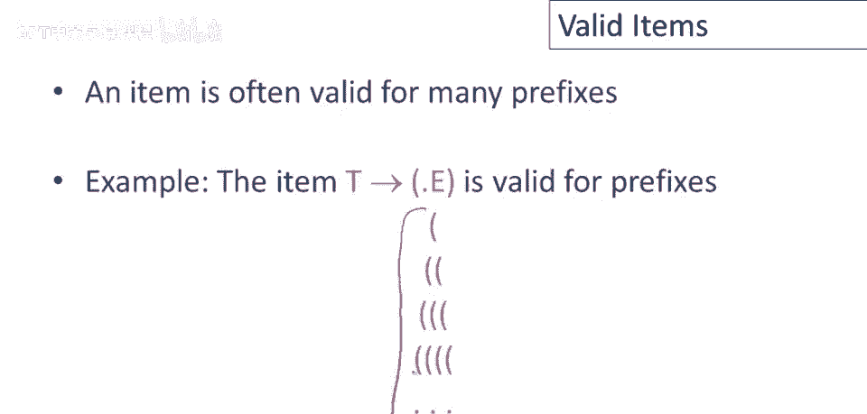

# 课程 P36：有效项（Valid Items） 🧩

在本节课中，我们将学习编译原理中的一个核心概念——**有效项**。我们将通过一个具体的示例自动机，来理解如何识别有效前缀，并深入探讨有效项的定义和意义。

---

## 有效项的概念

上一节我们介绍了用于识别语法有效前缀的非确定自动机（NFA）及其对应的确定自动机（DFA）。本节中，我们来看看什么是“有效项”。

为了唤醒你的记忆，下图是我们上次停止的地方。这是一个完整的非确定自动机，用于识别示例语法的有效前缀。

通过使用标准的子集构造法，我们可以构建一个等效于该非确定自动机的确定自动机。

这个确定自动机识别与NFA完全相同的语言，即示例语法的有效前缀。现在请注意，DFA中的每个状态都是一个**项集**（Item Set）。这些状态包含了NFA可能处于的状态集合。

回忆一下，这意味着NFA可能处于这些状态中的任何一个。特别是，这个状态是起始状态，因为它包含了项 `S' -> .E`。在《龙书》中，这种DFA的状态被称为**规范LR(0)项集**。

> 注：《龙书》给出了另一种构建LR(0)项集的方法，与我给出的方法略有不同。我的方法有所简化，但我认为对于初学者来说更容易理解。

现在，我们需要引入一个新的定义。

---

## 有效项的定义

我们将说，一个项对于有效前缀 `αβ` 是**有效的**，如果满足以下条件：
存在一个从起始符号 `S'` 出发的推导：`S' =>* αAω => αβγω`。

更直观地解释，在解析了前缀 `αβ` 之后（即 `αβ` 已经在栈上），**有效项**描述了此时解析器可能处于的“状态”集合。它指明了接下来可能应用的产生式规则。

一个更简单的理解方式是：对于一个给定的有效前缀 `α`，对该前缀有效的项，正是DFA在读取该前缀后，所到达的**最终状态**中包含的项。这些项描述了在看到栈内容 `α` 之后，解析器可能面临的所有情况。

---

## 有效项的性质

一个项通常对许多不同的前缀都有效。

例如，考虑项 `E -> ( . E )`。下图展示了它在自动机中的情况：

通过查看自动机可以确认，如果我们从起始状态开始，读取一个开括号 `(`，我们会进行状态转换，最终到达包含该项的状态。之后，每多读一个开括号，我们都会在这个状态中循环。

因此，如果输入序列是5个开括号，我们会在这个状态循环5次。请注意，项 `E -> ( . E )` 始终存在于这个状态中。这仅仅意味着，**此项对任何由开括号组成的前缀序列都是有效的**。

---

## 总结

本节课中，我们一起学习了**有效项**的概念。我们了解到：

1.  **有效项**与**有效前缀**紧密相关，它描述了在解析器处理了某个有效前缀后，接下来可能应用的语法规则。
2.  可以通过观察识别有效前缀的**确定有限自动机（DFA）** 来找到对某个前缀有效的所有项：即DFA读完该前缀后所处状态中包含的项集。
3.  一个项可能对多个不同的前缀有效，这反映了语法中规则应用的灵活性。

理解有效项是构建LR类语法分析器（如LR(0)、SLR、LR(1)分析器）的关键一步，它帮助我们确定在解析的每一步应该采取“移进”还是“归约”动作。