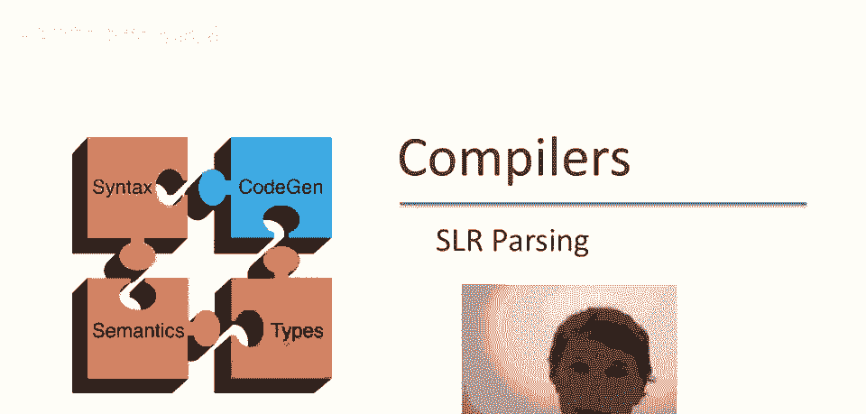
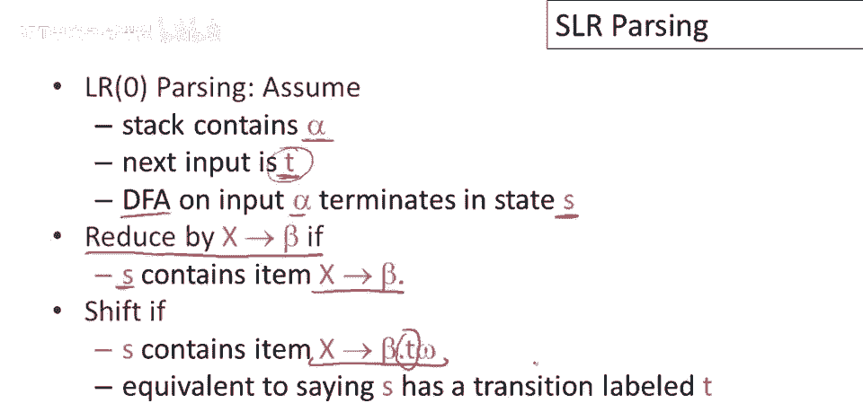
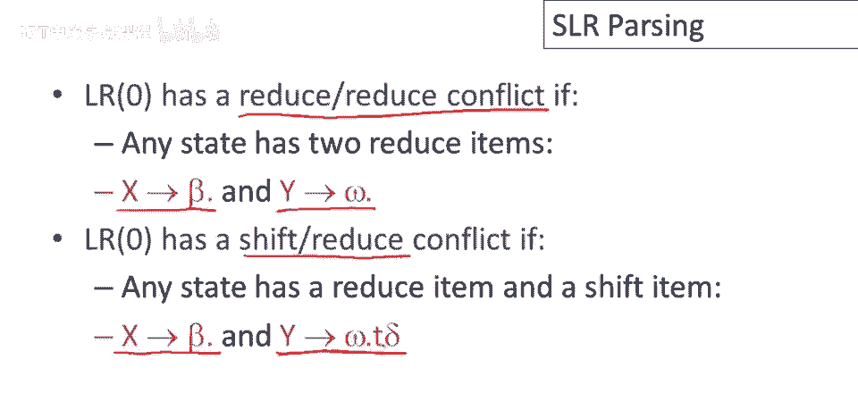
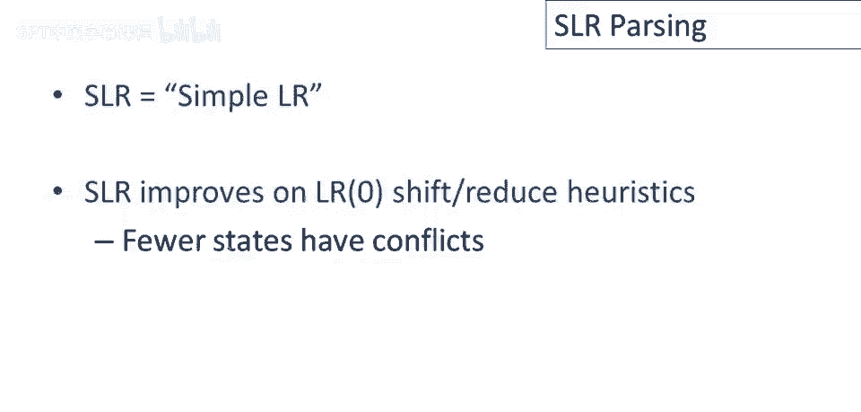
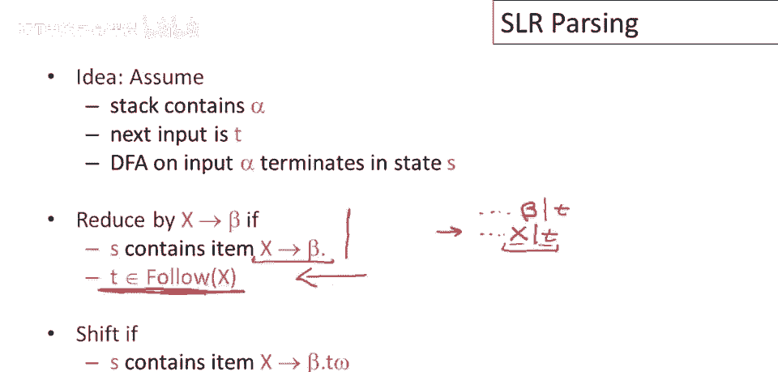
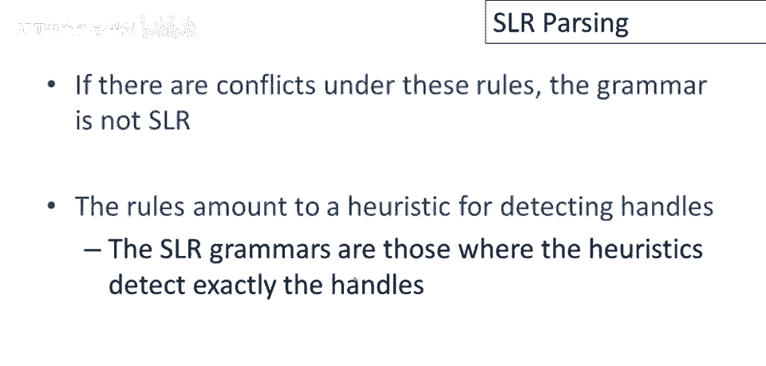
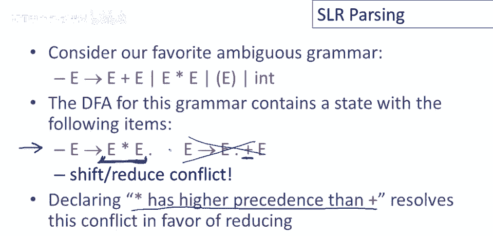
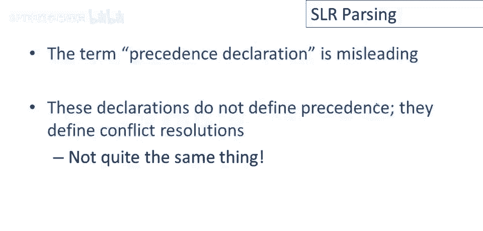
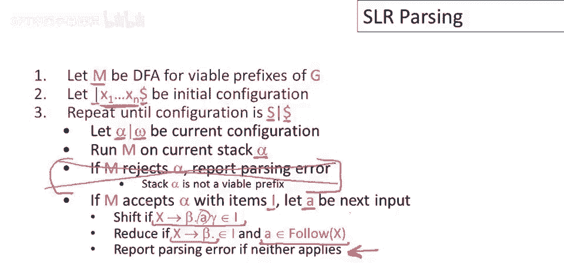
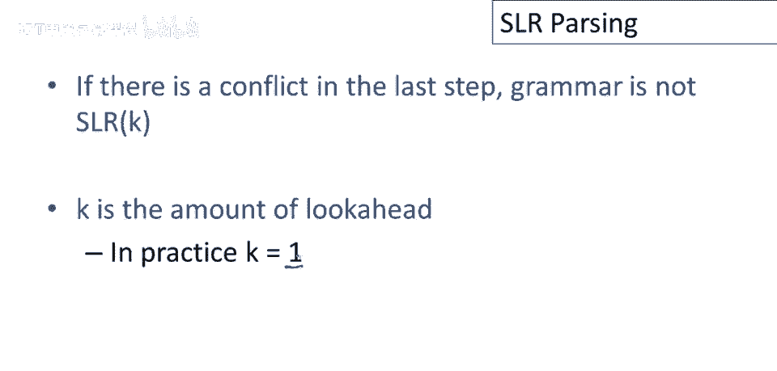

# 编译原理课程 P37：SLR 解析算法详解 🧩



在本节课中，我们将学习如何实现一个自底向上的解析算法，具体来说，我们将深入探讨 **SLR（简单LR）解析**。SLR解析建立在 **有效项** 和 **可行前缀** 这两个核心概念之上，这些概念我们在之前的课程中已经介绍过。


---

## 从 LR(0) 解析开始

上一节我们介绍了可行前缀和有效项的概念，本节中我们来看看如何基于这些概念构建一个基础的解析算法。

首先，我们定义一个非常基础的自底向上解析算法，称为 **LR(0) 解析**。其核心思想如下：

*   假设解析栈中的内容是 `α`，下一个输入标记是 `t`。
*   我们有一个识别可行前缀的 **确定性有限自动机（DFA）**。当它读取栈内容 `α` 后，会终止于某个状态 `s`。



解析算法只需要处理两种情况：

1.  **归约**：如果状态 `s` 是 DFA 的 **最终状态**，并且包含一个形如 `X -> β.` 的项（点在最右端），这意味着我们在栈顶看到了产生式 `X -> β` 的完整右侧（`β`）。此时，我们可以通过这个产生式进行归约。
2.  **移进**：如果状态 `s` 包含一个形如 `X -> β . t γ` 的项（点后面是终结符 `t`），这意味着在当前栈内容 `α` 后添加一个 `t` 是合适的。如果下一个输入正好是 `t`，那么我们就应该执行移进操作。

### LR(0) 解析的冲突问题



LR(0) 解析在什么情况下会遇到麻烦呢？主要有两种冲突：

以下是两种主要的冲突类型：

*   **归约-归约冲突**：如果 DFA 的某个状态包含两个（或更多）形如 `A -> β.` 和 `B -> γ.` 的项，这意味着栈顶同时看到了两个完整产生式的右侧。解析器没有足够的信息来决定执行哪一个归约，算法将不再是确定性的。
*   **移进-归约冲突**：如果 DFA 的某个状态同时包含一个形如 `X -> β.` 的项（指示归约）和一个形如 `Y -> γ . t δ` 的项（指示如果下一个输入是 `t` 则移进）。在这种情况下，解析器无法决定是应该移进 `t` 还是执行归约。

让我们看看之前课程中构建的、用于识别可行前缀的 DFA。这个 DFA 确实存在一些冲突。

*   在某个状态，我们既可以按 `E -> T` 进行归约，也可以（如果下一个输入是 `+`）进行移进。这个状态存在一个 **移进-归约冲突**。
*   在另一个状态，我们既可以按 `T -> int` 进行归约，也可以（如果下一个输入是 `*`）进行移进。这个状态同样存在一个 **移进-归约冲突**。



改进 LR(0) 解析并不困难。接下来，我们将介绍一种改进方法——**SLR 解析**。

---

## 改进为 SLR 解析

上一节我们看到了 LR(0) 解析的局限性，本节中我们来看看如何通过添加启发式信息来解决冲突，从而得到 SLR 解析。



将 LR(0) 解析修改为 SLR 解析的改动实际上非常小。我们只是在 **归约** 的情况下添加了一个新的条件。

*   **LR(0) 归约条件**：如果状态包含 `X -> β.`，则总是可以归约。
*   **SLR 归约条件**：如果状态包含 `X -> β.`，**并且**下一个输入符号 `t` 属于 **FOLLOW(X)**（即非终结符 `X` 的跟随集），我们才执行归约。

这个改变背后的逻辑是：归约操作将栈顶的 `β` 替换为 `X`。如果下一个输入符号 `t` 根本不可能出现在 `X` 之后（即 `t` 不在 `FOLLOW(X)` 中），那么这次归约就是没有意义的。通过利用输入流中下一个符号的信息，我们可以更精确地决定何时归约。



在这些新规则下，如果解析表中仍然存在冲突（无论是移进-归约还是归约-归约），那么这个语法就不是 **SLR(1) 语法**。SLR 解析利用了两个信息源：
1.  栈的内容（由 DFA 分析）。
2.  输入中的下一个符号（用于细化归约决策）。

---

## 示例：SLR 如何解决冲突

让我们看看 SLR 规则如何解决之前示例中的冲突。

回顾之前存在移进-归约冲突的两个状态：

1.  **第一个状态**（包含 `E -> T.` 和 `E -> E . + T`）：
    *   **移进**：如果下一个输入是 `+`，根据项 `E -> E . + T`，我们应该移进。
    *   **归约**：根据 SLR 规则，只有当下一个输入属于 `FOLLOW(E)` 时，我们才按 `E -> T` 归约。`FOLLOW(E)` 包含 `$`（输入结束）和 `)`。
    *   **结果**：对于输入 `+`，唯一动作是移进；对于输入 `$` 或 `)`，唯一动作是归约。**冲突解决**。

2.  **第二个状态**（包含 `T -> int.` 和 `T -> T . * int`）：
    *   **移进**：如果下一个输入是 `*`，我们应该移进。
    *   **归约**：只有当下一个输入属于 `FOLLOW(T)` 时才归约。`FOLLOW(T)` 包含 `+`， `)`， `$`。
    *   **结果**：对于输入 `*`，唯一动作是移进；对于输入 `+`， `)` 或 `$`，唯一动作是归约。**冲突解决**。


因此，这个语法是 **SLR(1) 语法**。许多语法不是 SLR(1)，所有歧义语法都不是 SLR(1)。但我们可以通过 **优先级声明** 来进一步扩展 SLR 解析器的能力。

---

## 优先级声明的作用

考虑最自然的（也是歧义的）加法和乘法表达式语法：
```
E -> E + E | E * E | int
```
为这个语法构建 DFA，会发现在某个状态同时包含项 `E -> E * E.`（可归约）和 `E -> E . + E`（如果输入是 `+` 则可移进）。这正好对应了“乘法是否比加法优先级高”的问题。



*   如果选择 **归约**，意味着先将 `E * E` 组合起来，体现了乘法优先级更高。
*   如果选择 **移进**，则会让加号先入栈，可能导致加法先被计算。

在这种情况下，我们可以通过声明“`*` 的优先级高于 `+`”来解决这个移进-归约冲突。解析器生成工具（如 Yacc/Bison）会利用这个声明，在冲突时选择 **归约**，从而强制执行我们期望的优先级。

> **注意**：“优先级声明”这个术语有些误导。它并不直接定义优先级，而是定义了当解析表出现冲突时应该如何解决。在简单的算术表达式语法中，这种冲突解决恰好产生了优先级的效果。对于更复杂的语法，建议检查生成的解析自动机，以确保冲突解决符合预期。



---

## SLR 解析算法描述

现在，我们可以给出完整的 SLR 解析算法。设 `M` 是识别可行前缀的 DFA。

**算法步骤如下：**

1.  **初始化**：初始配置为 `| ω$`（栈为空，输入为 `ω` 并在末尾附加结束符 `$`）。
2.  **循环**：重复以下步骤，直到配置变为 `E | $`（栈中只剩开始符号 `E`，输入只剩 `$`）。
    *   设当前配置为 `α | tω`，其中 `α` 是栈内容，`t` 是下一个输入符号。
    *   让 DFA `M` 读取栈内容 `α`，到达状态 `s`。
    *   检查状态 `s` 中的项和下一个输入符号 `t`：
        a. **移进**：如果 `s` 包含形如 `X -> β . t γ` 的项，则执行移进：配置变为 `αt | ω`。
        b. **归约**：如果 `s` 包含形如 `X -> β.` 的项，**且** `t ∈ FOLLOW(X)`，则执行归约：从栈顶弹出 `|β|` 个符号，压入 `X`，配置变为 `α‘ X | tω`（其中 `α‘` 是弹出后的栈）。
        c. **接受**：如果配置为 `E | $`，则解析成功。
        d. **报错**：如果以上都不适用，则报告语法错误。

**关于冲突**：如果在构造解析表时，发现某个状态对某个输入符号存在多个可选动作（多个移进、多个归约或移进归约皆有），则该语法不是 **SLR(1)** 语法。实践中，`k` 通常为 1，即只前瞻一个输入符号。

---



## 总结



本节课中我们一起学习了 **SLR 解析算法**。我们从基础的 LR(0) 解析出发，了解了它因缺乏前瞻信息而容易产生 **移进-归约冲突** 和 **归约-归约冲突**。为了解决这个问题，SLR 解析引入了一个关键改进：只有在下一个输入符号属于 **归约产生式左部非终结符的 FOLLOW 集** 时，才执行归约。这使得解析决策更加精确，能够处理一大类实用的上下文无关文法。我们还了解了如何通过 **优先级声明** 来指导解析器解决特定的冲突，从而处理像表达式优先级这样的常见需求。SLR 是构建高效、确定性自底向上解析器的重要基础。