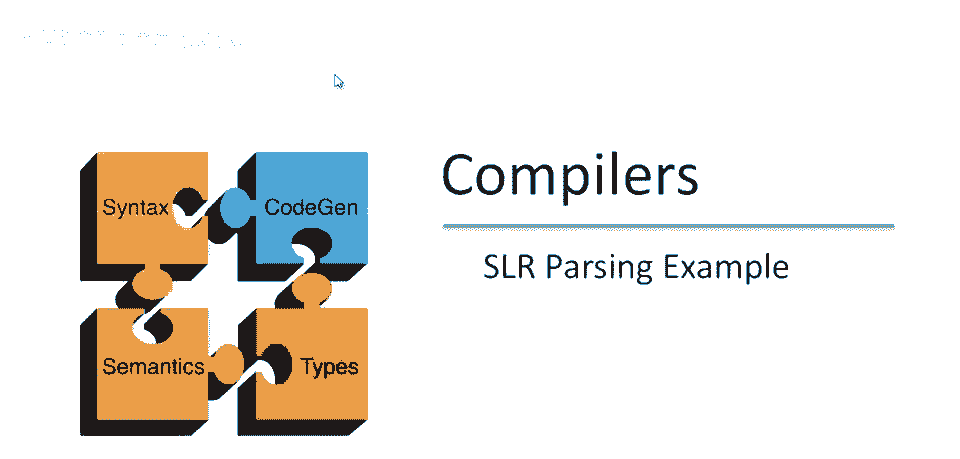
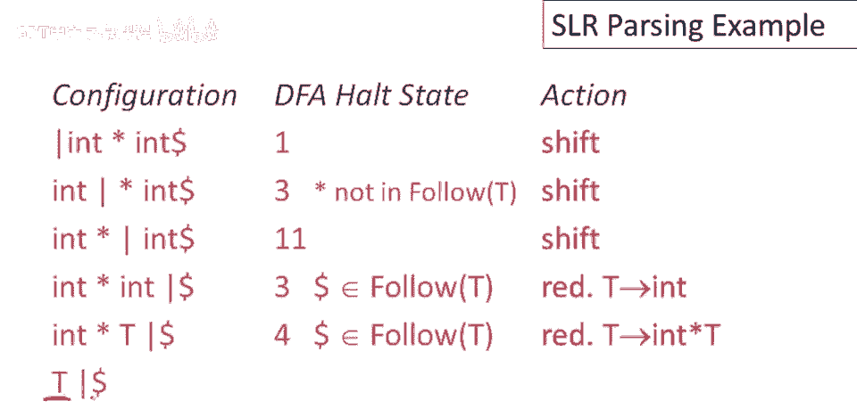
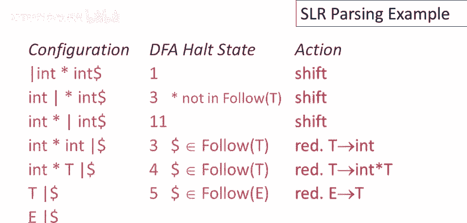

# P38：p38 08-06-_SLR_Parsing_Exam - 加加zero - BV1Mb42177J7

欢迎回到本视频，我们将做一次扩展的SLR解析示例。

回顾一下，这是语法解析自动机，我们在前几期视频中一直在看的，这是非确定性自动机的确定性版本，我们上次构建的，我已经把所有状态都编了号，让我们看看解析输入int时会发生什么，乘以int，回顾一下。

我们在末尾添加了美元符号，以指示输入结束的位置，这只是输入结束的标记，因为这是解析的开始，我们还没有看到任何输入，因此竖线位于输入的最左侧，机器从状态一开始，栈上没有任何东西，竖线再次位于输入的最左侧。

所以栈为空，所以它在状态一终止，这些是解析器初始状态中有效的可能项，所以在这项中，我们看到，有两个告诉我们在这个状态下移入整数是可以的，当然第一个输入是整数，所以没有归约动作。

这里面的其他项也都有它们的点，都在项的最左边，当前状态无减步可能，唯一可能操作是移位，整数移位是可以的，总结一下，嗯，在解析器的初始配置中，dfa在状态一停止，它甚至从未离开状态一，从那里开始，结束。

未读任何输入，因为栈为空，状态指示我们行动：移位，于是我们处于以下状态，栈上有整数，输入中有乘法，那种情况会发生什么，嗯，自动机会再次读取栈，从栈底开始，我们在起始状态，然后我们读取一个整数。

栈上有整型，我们进入此状态，此状态告诉我们能做什么，它告诉我们一种可能是归约t到整型，但再次我们只会，如果后续输入是t和times的序列，哪个是后续输入项不在t的后续，所以times不在t的后续。

因此在此处归约不是可能的选择，只剩下另一项考虑，这里我们看到这项说我们可以移入一个times，所以如果times，输入中的下一个东西，就是它，移入是可以的，所以DFA在状态三保持。

因为输入中有times，呃，移动是移入，这让我们进入此配置，栈上有整型和times，times在栈顶，整型在它下面，输入中有整型，现在又发生了什么，DFA将读取整个栈，所以从栈底开始。

它首先看到的是一个整型，它移动到那个状态，然后它看到一个times，所以它移动到这个状态，现在在这个特定状态，有哪些可能性，首先我们可以看到没有归约移动，没有项目点的右边是全部，所以唯一的可能性是移入。

我们可以移入如果后续输入是a开头的，这没有更多用处，我们可以移入如果后续输入是整型，这正是我们看到的，所以DFA在状态十一终止，在那个状态下的移动是移入，这让我们进入此状态，栈上有整型times整型。

输入已完，我们到了输入的末尾，让我们看看栈上的整型times整型会发生什么，自动机读取整型times整型，最终回到状态三，状态三，告诉我们如果下一个输入项是times，我们可以移入，但它不是。

或者我们可以归约如果输入中的任何东西是t的后续，在输入中是，实际上，美元跟在t之后，因此在输入的末尾，t可以跟在栈上，这意味着减少t到int是可行的，所以一旦我们做了，一旦我们做了减少，T变成int。

我们最终处于状态，Int乘t，这是栈的内容，当然我们仍然在输入的末尾，因此，dfa将再次读取整个栈内容，从底部到顶部，首先，它读取栈底部的int，然后它看到乘号，最后，它读取栈顶部的t。

最终处于一个新状态，状态四，关于这一步有趣的是，dfa通过状态图走了不同的路径，而不是上次，这是因为栈的内容改变了，我们不仅仅是在栈上添加东西，我们没有延长之前的路径，实际上。

我们用新的符号替换了栈上的某些符号或符号，在这种情况下，非终结符t，导致dfa走了不同的路径，现在，状态四中的这一项告诉我们该做什么，它说，如果输入的后续内容在t的跟随集中，我们可以通过t到n乘t减少。

再一次，美元在t的跟随集中，我们将做那个减少，现在我们只剩下栈内容t。

当然我们仍然在输入的末尾，让我们看看现在会发生什么，所以现在当然栈的内容发生了更根本的变化，因此，dfa只是朝着完全不同的方向前进，它读取t，最终处于这个状态，这个状态说，我们可以推入一个加号。

如果有加号在输入中，再次，没有更多的输入，或者我们可以通过e到t减少，如果美元，即输入的结束，在e的跟随集中，它是，我们将做的减少将是那个，现在我们只有栈内容e。

让我们看看在这种情况下会发生什么，现在我们转移到状态二，我们只有一项，S'到e点，这是一个减少移动，美元紧随S'，因为那是开始符号，因为那是开始符号，此时接受，一旦到达该项即为归约动作。

