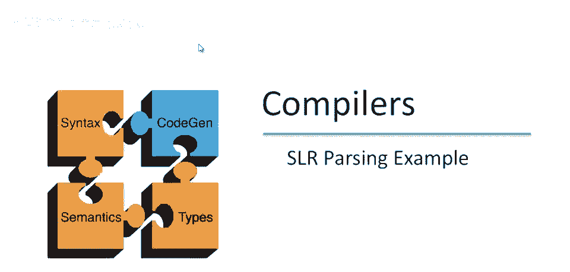
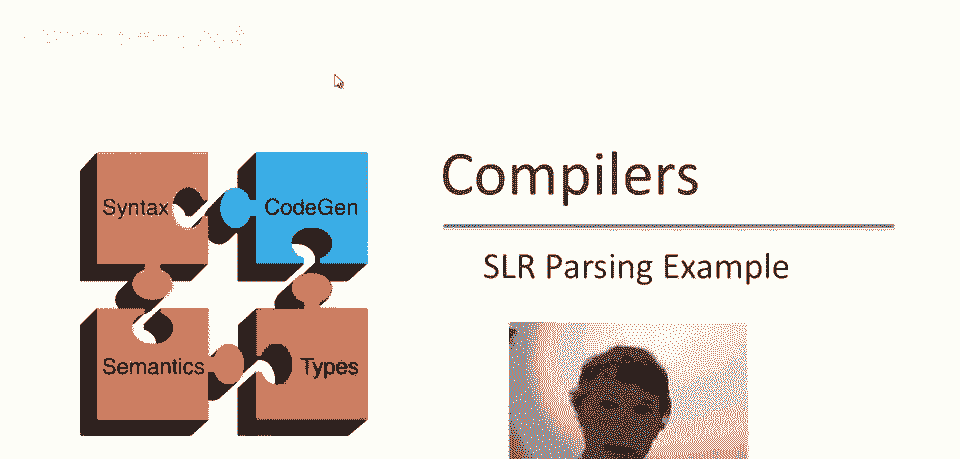

# 📚 课程 P38：SLR 解析示例详解

在本节课中，我们将通过一个具体的例子，详细学习 SLR 解析器的工作过程。我们将解析输入 `int * int`，并一步步跟踪解析器的状态、栈和输入的变化，以理解移入和归约动作是如何协同工作，最终完成语法分析的。

---

## 🧠 概述：解析器初始状态

首先，我们回顾一下解析器自动机。这是一个确定性自动机，我们在之前的课程中已经构建完成。所有状态都已编号。

解析开始时，我们在输入末尾添加了美元符号 `$` 作为结束标记。此时，我们尚未读取任何输入，解析器指针位于输入的最左侧。

解析器从**状态 1** 开始，栈为空。以下是状态 1 中有效的项目：

*   `E -> .T`
*   `T -> .int`
*   `T -> .T * int`

在这些项目中，点 `.` 都位于最左侧，表示我们期待看到这些符号。当前输入是 `int`，因此没有归约动作的可能，**唯一可能的操作是移入**。

**初始配置总结：**
*   **栈：** 空
*   **输入：** `int * int $`
*   **DFA 状态：** 状态 1
*   **动作：** 移入 `int`

---

## 🔄 第一步：移入 `int`

根据状态 1 的指示，我们执行移入动作，将输入中的 `int` 移入栈中。

执行后，配置变为：
*   **栈：** `int`
*   **输入：** `* int $`
*   **动作：** 移入完成

现在，自动机需要根据新的栈内容 `int` 来决定下一个状态。它从栈底开始读取：
1.  从初始状态开始。
2.  读取栈上的 `int`，进入**状态 3**。

状态 3 中的项目告诉我们接下来能做什么：
*   `T -> int .` （点在最右边，表示可以归约）
*   `T -> T .* int` （点后面是 `*`，表示可以移入 `*`）

此时，我们需要根据**向前看符号**（即输入中的下一个标记 `*`）来决定动作。`*` 是否在 `T` 的**后继集合**中？检查语法规则 `T -> T * int`，可知 `*` 是 `T` 的后继。因此，**移入 `*`** 是可行的，而归约 `T -> int` 不可行（因为 `*` 不在 `int` 的后继集合中）。

所以，DFA 保持在状态 3，并决定移入 `*`。

---

## 🔄 第二步：移入 `*`

我们执行移入动作，将输入中的 `*` 移入栈顶。

执行后，配置变为：
*   **栈：** `int *`
*   **输入：** `int $`
*   **动作：** 移入完成

自动机再次读取整个栈 `int *` 来决定状态：
1.  从初始状态开始。
2.  读取 `int`，进入状态 3。
3.  读取 `*`，进入**状态 11**。

状态 11 中只有一项：`T -> T * . int`。点后面是 `int`，而输入中的下一个符号正是 `int`。因此，**唯一的动作是移入 `int`**。

---

## 🔄 第三步：移入第二个 `int`

我们执行移入动作，将输入中最后一个 `int` 移入栈中。

执行后，配置变为：
*   **栈：** `int * int`
*   **输入：** `$`
*   **动作：** 移入完成，输入结束

现在栈内容是 `int * int`，输入已结束（只剩下 `$`）。自动机读取栈：
1.  读取 `int`，进入状态 3。
2.  读取 `*`，进入状态 11。
3.  读取 `int`，最终回到**状态 3**（根据 `T -> T * int .` 项目）。

此时，状态 3 中的项目再次是：
*   `T -> int .` （可归约）
*   `T -> T .* int` （可移入 `*`，但输入是 `$`，不匹配）

输入是 `$`，它是否在 `T` 的后继集合中？检查语法 `E -> T` 和 `T -> T * int`，`$` 可以是 `T` 的后继（当 `T` 作为 `E` 的一部分时）。因此，**归约动作 `T -> int` 是可行的**。

我们执行归约 `T -> int`。这意味着将栈顶的 `int` 替换为非终结符 `T`。

---

## 🔄 第四步：归约 `T -> int`

执行归约后，栈内容发生变化：
*   **栈（归约前）：** `int * int`
*   **栈（归约后）：** `int * T`
*   **输入：** `$`

**关键点：** 栈的内容发生了改变，我们不是简单地添加符号，而是用非终结符 `T` 替换了栈顶的 `int`。这导致 DFA 需要沿着一条**新的路径**重新计算状态。

自动机读取新栈 `int * T`：
1.  读取 `int`，进入状态 3。
2.  读取 `*`，进入状态 11。
3.  读取 `T`，最终进入**状态 4**。

状态 4 中的项目是 `T -> T * T .`。点在最右边，表示可以归约。同样，检查向前看符号 `$` 是否在 `T` 的后继集合中（根据更高层的语法规则）。是的，`$` 在 `T` 的后继集合中。因此，我们执行归约 `T -> T * T`。

---

## 🔄 第五步：归约 `T -> T * T`

执行归约 `T -> T * T`。这意味着将栈顶的三个符号 `T * T` 替换为一个 `T`。

执行后，配置变为：
*   **栈：** `T`
*   **输入：** `$`

栈内容发生了根本性变化。自动机读取栈顶的 `T`，进入**状态 5**。

状态 5 中的项目是：
*   `E -> T .` （可归约）
*   `E -> E .+ T` （可移入 `+`，但输入是 `$`，不匹配）

输入是 `$`，它是否在 `E` 的后继集合中？对于开始符号 `E`（或 `S‘`），`$` 是其后继。因此，我们执行归约 `E -> T`。

---

## 🔄 第六步：归约 `E -> T` 与接受

执行归约 `E -> T`，将栈顶的 `T` 替换为 `E`。

执行后，配置变为：
*   **栈：** `E`
*   **输入：** `$`

自动机读取栈顶的 `E`，进入**状态 2**。

状态 2 中只有一项：`S‘ -> E .`。点在最右边，并且向前看符号是 `$`，这正好是开始符号 `S‘` 的后继。这表示解析成功，我们执行**接受**动作。

---

## ✅ 总结

本节课中，我们一起学习了 SLR 解析器解析输入 `int * int` 的完整过程。我们一步步跟踪了解析器的状态、栈和输入的变化：

1.  **初始状态**：栈空，准备移入。
2.  **移入阶段**：依次移入 `int`、`*`、`int`，同时 DFA 根据栈内容转换状态。
3.  **归约阶段**：当输入结束或遇到合适的前看符号时，根据项目点的位置和 FOLLOW 集，执行归约动作（`T -> int` 和 `T -> T * T`），用非终结符替换栈顶的符号串。
4.  **路径变化**：归约动作会改变栈的内容，导致 DFA 重新计算状态，可能走上与之前不同的路径。
5.  **最终接受**：当栈中只剩下开始符号 `E`（或 `S‘`），且输入结束时，解析器接受该输入字符串。

通过这个详细的例子，你应该对 SLR 解析器中移入-归约的冲突解决、状态转换以及 FOLLOW 集的作用有了更直观的理解。