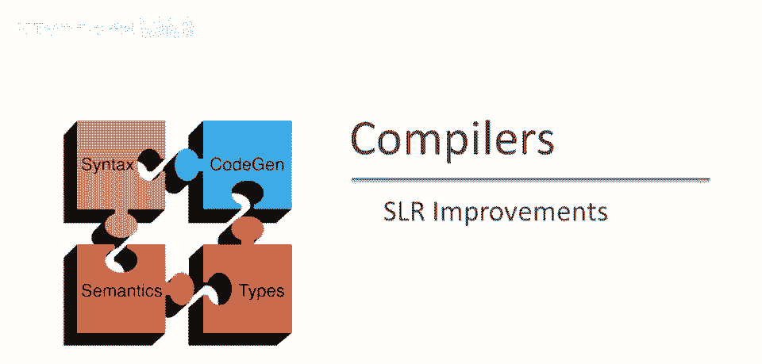
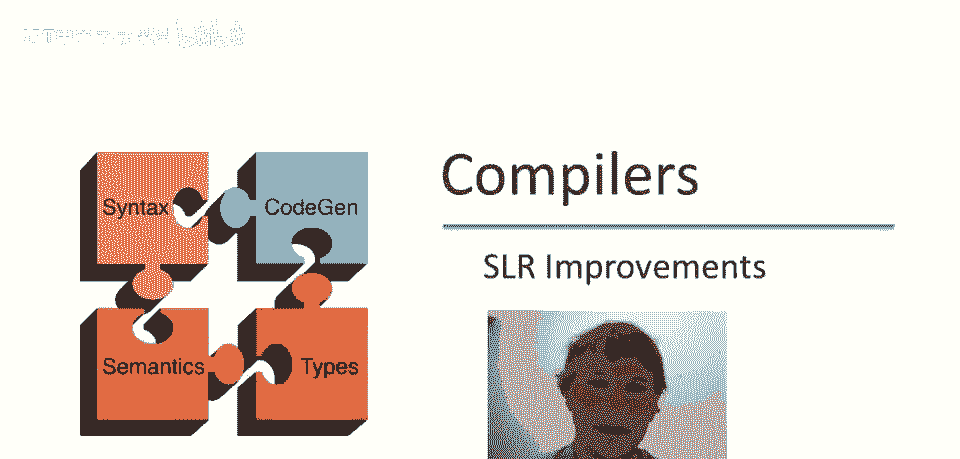
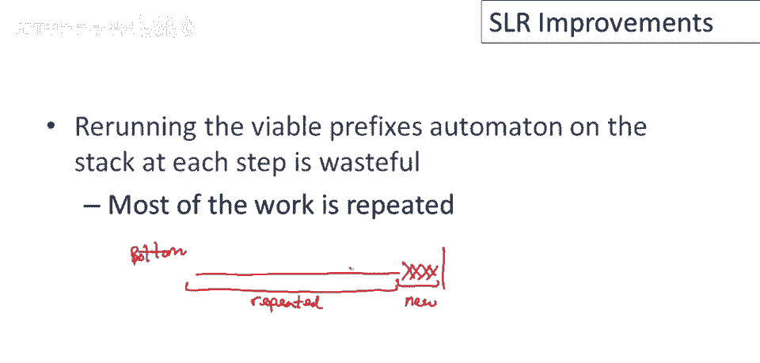
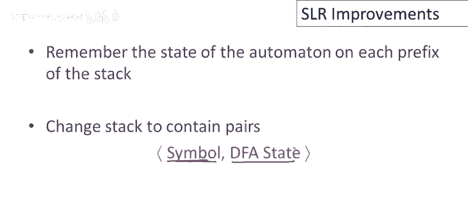
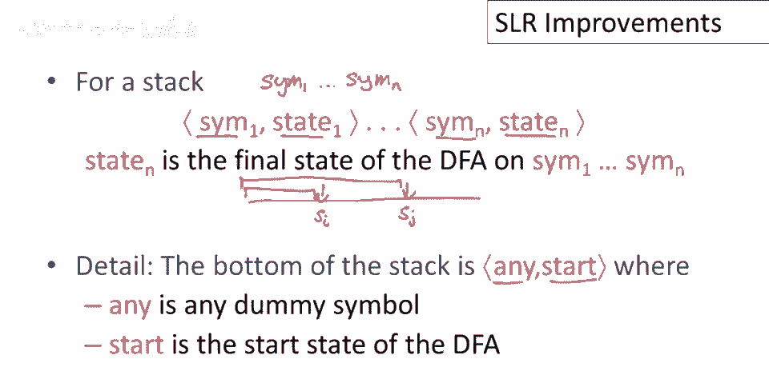
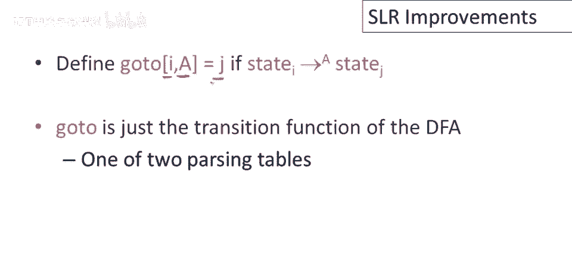
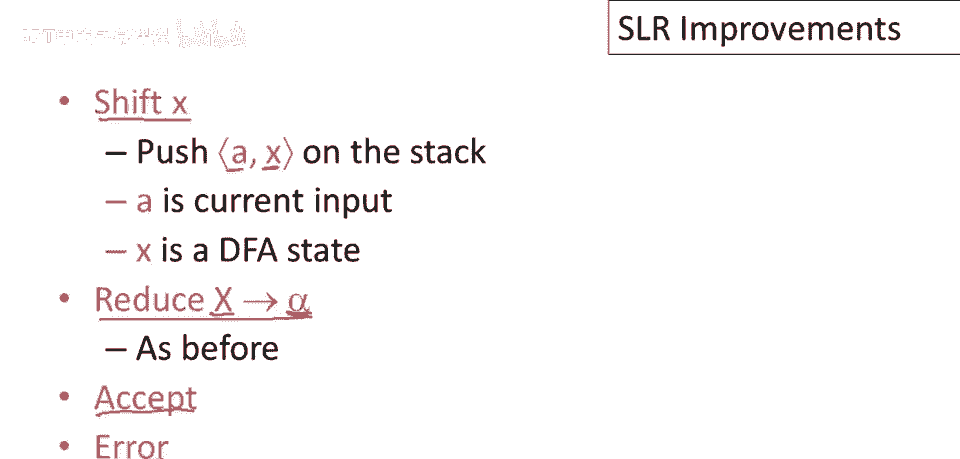
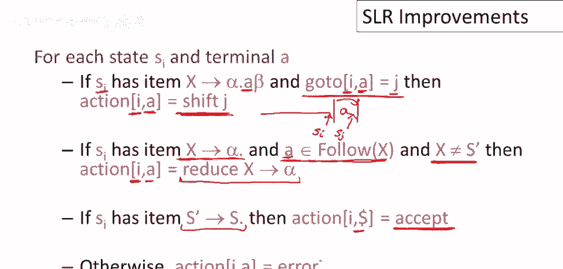

# P39：p39 08-07-_SLR_Improvements - 加加zero - BV1Mb42177J7

本视频中，我们将结束关于SLR解析的讨论，我们将给出完整的SLR解析算法，并讨论一些重要改进。

上期视频中讨论的SLR解析算法有一个主要低效，那就是当自动机，当它读取栈时，实际上大部分工作是多余的，要看到这一点，请考虑栈，因此我们有我们的栈，这里是底部，这是栈顶，每一步都在做什么。

可能会将东西推入栈中，可能会添加一个符号，可能会弹出一些符号并推入一个符号，但基本上，栈顶的符号数量很少会改变，每一步，但大部分栈保持不变，然后重新运行自动机在整栈上，因此，所有工作都重复。

一切与上次堆栈相同，重复工作，然后在堆栈顶部做一点新工作，显然，如果可以避免，我们可以让算法运行得更快。

利用自动机大部分工作重复的观察，在每个步骤中，只需记住自动机在每个堆栈前缀上的状态，我们将改变堆栈的表示，我们将改变堆栈中放入的内容，之前，我们只在堆栈上有符号，但现在我们将成对。

栈中的每个元素将是一个符号和DFA状态的配对。

因此，栈现在将是一个配对栈，而之前，栈将仅由符号组成，Sim 1到Sim n，现在我们将有相同的符号，但每一个都将与一个DFA状态配对，该DFA状态将是运行DFA的结果，在其左侧的所有符号上，因此。

在栈中低于它的所有符号，若我考虑栈，画栈为线，DFA在此状态，称此状态为，运行DFA栈结果，点左内容，再看栈中另一点，状态，存储的栈状态，运行DFA栈结果，联系内容至该点，底部有一个小细节。

我们必须开始，需要将起始状态存储在底部，只需用任何占位符存储。

选取的符号无关紧要，现在准备好详细解析算法，定义一张表，转到，映射一个状态，和一个符号到另一个状态，这就是dfa的转换函数，dfa的图以数组形式写出。

我们的slr解析算法将有四种可能动作，一个shift x动作将推入一对到栈上，X是dfa状态，现在命名为shift动作，而配对的另一元素是当前输入，然后我们也会有减少动作，和之前一样，回顾一下。

减少动作将弹出栈上一定数量的元素，等于右侧长度的元素，然后将左侧推入栈上，最后接受错误动作，用于成功解析输入，以及解析器卡住时。

第二个解析表是动作表，它告诉我们每个可能状态下应采取哪种动作，动作表由自动机的状态和下一个输入符号索引，可能的动作包括像shift，减少，接受，或错误，所以让我们考虑当我们做shift时。

如果栈顶自动机的最终状态，有一个项目说可以shift一个a并转到，这意味着从这个状态我们可以在输入a时转到状态j，那么在状态i上输入a的动作将是shift a j到栈上，想想这意味着什么。

这意味着我们有一个栈，然后下一个输入是a，然后在这个点上可以shift一个a到栈上，并且进一步说，当前自动机的状态si是ok的，栈顶自动机的状态是si，下一个输入是a，记住go to表是机器的转换函数。

所以如果我们移动竖线，如果我们shift那个a到栈上，我们不仅仅把a放到栈上，我们必须把一对放到栈上，问题是应该放置哪个机器状态，将从状态i到状态si达到的状态，输入a，在这种情况下。

goto表告诉我们状态是sj，因此，终止于状态i时的动作，下一个输入是a，将a，j对推入栈中，动作表中另外三个移动是我们已见过的，所以，如果自动机的最终状态，栈顶项表示我们可以归约，且后续条件满足。

即下一个输入可遵循，产生式左侧非终结符，则在状态si，输入a时，可按该产生式规约，X 归为 α，但有一个例外，不会进行该规约，若左侧为特殊开始符，添加到文法中的新开始符S'，因为在这种情况下。

如果我们要减少的项是s的质数，它变为s点，并且我们到达输入的末尾，那么我们想要接受，任何其他情况都是错误，所以在任何其他情况下，如果我们处于状态i并且我们有下一个，下一个输入是一个井号。

我们不知道是否要移位，减少或接受，因此这是一个错误状态。

最终这里是完整的SLR解析算法，我将带你逐步了解，为了了解我们讨论的所有想法，所有碎片都完美契合，让我们把初始输入称为i，我们就给它取个名字，索引将被称作j，最初是零，因此我们指向输入流的第一个标记。

我们假设dfa的第一个状态称为状态一，这意味着我们的初始栈将包含状态一，对于自动机的状态，和一些我们不关心的其他占位符号在第一位置，因此栈只是一个包含它的对，表示我们在dfa的起始状态。

现在我们将重复以下循环，直到我们成功解析输入或检测到错误，那么在每一步我们要做什么呢，我们将查看下一个输入符号，并查看自动机的最终状态，栈内容，总是堆顶对的状态，将在动作表中查找这两项。

将告诉我们进行哪种移动，让我们按顺序查看移动，首先考虑移位移动，所以如果我们，如果说明我们应该移位并进入状态k，那么我们将要做的是，我们将移位输入，这意味着我们将获取下一个输入符号，抱歉。

并将它推入栈中，连同自动机状态k，这对将进入栈中，我们还将输入指针向前移动，这样我们正在查看下一个输入字符，让我擦掉它，这样您现在可以继续阅读，关于规约移动，这个有点有趣，首先我们要做的是。

我们将从栈中弹出一定数量的项，等于右侧长度的堆栈，我们将弹出与右侧等效数量的项，等于产生式的右侧，然后我们将什么推入栈中呢，我们将左侧的非终结符推入栈中，现在的问题是栈上的状态是什么，什么dfa状态。

但现在我们已经弹出栈，我们可以查看新的栈顶状态，所以dfa状态和现在的栈顶状态，在我们完成弹出后将告诉我们a的最终状态，栈中剩余的内容，现在我们将x推入栈中。

我们想了解dfa在标记x的转换上会进入什么状态，因此我们使用goto表进行查找，栈顶状态和符号x，dfa会去哪里，这就是被推入栈的状态，最后，如果移动是接受，我们正常停止，如果移动是错误。

我们停止并报告错误或执行错误恢复程序。

关于这个算法的一个有趣之处是它仅使用dfa状态和输入，栈符号并没有以任何真正有趣的方式使用，因此我们实际上可以消除栈符号，仅使用栈上的dfa状态进行解析，但那样，当然，意味着放弃程序。

我们实际上还需要程序的后期阶段，因此，为了类型检查和代码生成。

我们现在仍然需要保留符号，简单LR解析被称为简单是有原因的，实际上，实践中它有点太简单，广泛使用的自底向上解析算法基于更强大的语法类，称为LR语法，LR语法和SLR语法的基本区别在于。

向前看被内置到项中，那么这意味着，一个LR1项将是一个对，它由我们之前看到的项组成，这意味着与之前完全相同，以及向前看，在LR1项的情况下，只有1个向前看标记，如果是LR2项，那里可以有2个向前看标记。

这对的意义是，如果我们最终到达一个状态，我们已经看到了所有这些生产，这个生产的所有右侧，那么减少将是可行的，如果向前看在那时是美元，如果是输入的结束，当然，那里可以有任何其他标记，任何其他终端符号。

除了美元，这比仅仅使用后缀集更准确，回想一下，在SLR解析中做出减少决策的点，我们只是看左侧符号的整个后缀集，将向前看编码到项中的机制，允许我们跟踪更细的粒度，哪些向前看实际上可能在特定生产序列中。

如果你看你的解析器的自动机，实际上它不是LR1自动机，它是一个LALR1自动机，这是非常接近LR的东西，它是对LR的一个小优化，一个纯LR自动机，但无论如何，它使用完全相同的项。

带有标准LR零项和向前看的对，如果你看那个自动机，你会看到像这样的事项，那应该帮助你阅读自动机并弄清楚它在做什么。

