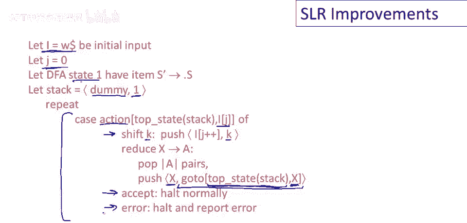
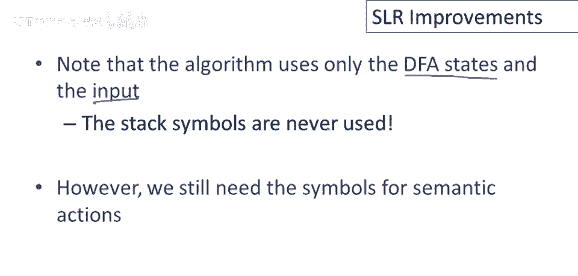
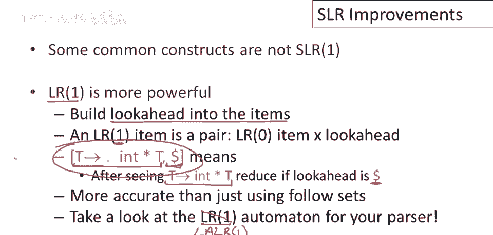

# 编译原理课程 P39：SLR解析算法改进与完整实现 🚀


在本节课中，我们将结束关于SLR（简单LR）解析的讨论。我们将介绍完整的SLR解析算法，并探讨如何通过优化栈操作来提升其效率。最后，我们会简要介绍比SLR更强大的LR解析算法。

---

## 回顾SLR解析的低效问题


上一节我们介绍了SLR解析的基本概念。本节中我们来看看原始SLR算法中存在的一个主要低效问题。

原始SLR解析算法在每一步都需要重新扫描整个栈，以确定自动机的状态。考虑解析过程中的栈操作：每一步可能会压入或弹出符号，但栈的大部分内容保持不变。重新运行自动机在整个栈上意味着大量重复工作。


以下是栈操作的示意图：

```
栈底 [符号1, 符号2, ..., 符号n-1] 栈顶
```

每一步只在栈顶进行微小改动，却要重新计算整个栈对应的自动机状态，这显然是可以优化的。


---

## 改进思路：在栈中存储状态


利用“自动机大部分工作重复”的观察，我们可以改进算法。核心思想是：**在每一步中，记住自动机在每个栈前缀上的状态**。

我们将改变栈的表示方式。之前，栈中只存放符号。现在，栈中的每个元素将是一个 **(符号, DFA状态)** 对。


改进后的栈结构如下：

```
栈底 [(占位符, 状态1), (符号1, 状态2), ..., (符号n, 状态m)] 栈顶
```

其中，每个存储的DFA状态是运行DFA在其**左侧所有栈内容**上的结果。栈底需要一个起始状态，通常用一个占位符符号（如`$`）和DFA的初始状态`S0`配对。

---

## 完整的SLR解析表与算法

基于改进的栈结构，我们现在可以定义完整的SLR解析算法。算法依赖于两张表：

1.  **GOTO表**：这是一个二维数组，表示DFA的转换函数。`GOTO[状态i, 符号X] = 状态j` 意味着从状态`i`遇到符号`X`时，DFA将转移到状态`j`。
2.  **ACTION表**：这也是一个二维数组，由**当前栈顶状态**和**下一个输入符号**索引，指示解析器应执行的动作。

ACTION表可能包含四种动作：


*   **Shift (移进)**: `shift sj`
*   **Reduce (规约)**: `reduce by A -> β`
*   **Accept (接受)**: `accept`
*   **Error (报错)**: `error`

以下是确定ACTION表项的规则：

*   **Shift动作**: 如果栈顶状态`si`有一个项目表明可以移进输入符号`a`并进入状态`sj`（即 `GOTO[si, a] = sj`），则 `ACTION[si, a] = shift sj`。
*   **Reduce动作**: 如果栈顶状态`si`有一个完整项目（点在最右端）`A -> α.`，**并且**下一个输入符号`a`属于`FOLLOW(A)`集合，则 `ACTION[si, a] = reduce by A -> α`。有一个例外：如果规约的产生式是`S' -> S.`（其中`S'`是文法的增强开始符号），且下一个输入是结束符`$`，则执行`accept`动作。
*   **Error动作**: 所有其他未定义的情况都标记为`error`。

---

## 算法步骤详解

以下是结合了状态栈的完整SLR解析算法步骤：

1.  **初始化**:
    *   设输入字符串为 `w$`（`$`是结束符）。
    *   初始化栈为 `[(任何占位符, 状态1)]`，其中状态1是DFA的起始状态。
    *   设置输入指针 `ip` 指向 `w` 的第一个符号。

2.  **主循环**:
    重复以下步骤，直到接受或报错：
    a.  设 `s` 为当前栈顶的状态（即栈顶对的第二个元素）。
    b.  设 `a` 为 `ip` 所指向的当前输入符号。
    c.  查询动作表 `ACTION[s, a]`，根据结果执行相应操作：
        *   **如果 `ACTION[s, a] = shift s'`**:
            *   将符号-状态对 `(a, s')` 压入栈中。
            *   将输入指针 `ip` 前进到下一个符号。
        *   **如果 `ACTION[s, a] = reduce by A -> β`**:
            *   从栈顶弹出 `|β|`（β的长度）个符号-状态对。
            *   设新的栈顶状态为 `s''`。
            *   查询 `GOTO[s'', A] = s_new`。
            *   将符号-状态对 `(A, s_new)` 压入栈中。
            *   （**注意**：输入指针 `ip` 在此步骤中不前进）。
        *   **如果 `ACTION[s, a] = accept`**:
            *   解析成功，终止循环。
        *   **如果 `ACTION[s, a] = error`**:
            *   调用错误恢复例程或报告语法错误。

---



## 从SLR到更强大的LR解析

简单LR解析被称为“简单”是有原因的。在实践中，它对于某些文法的处理能力有限。更广泛使用的自底向上解析算法基于更强大的 **LR文法**。



LR文法与SLR文法的核心区别在于 **向前看符号(Lookahead)被直接编码到了项目项中**。

*   **LR(1)项** 是一个二元组 `[A -> α . β, a]`，其中：
    *   `A -> α . β` 是标准的LR(0)项。
    *   `a` 是一个向前看符号（终结符）。
*   这个项的含义是：当栈顶内容匹配 `α`（即 `β` 已全部被看到），**并且**下一个输入符号是 `a` 时，才可以按 `A -> αβ` 进行规约。

这比SLR中简单地使用 `FOLLOW(A)` 集合来决定规约要精确得多。SLR可能允许在 `FOLLOW(A)` 中但实际上下文中不可能出现的符号触发规约，导致冲突。LR(1)通过精确的向前看信息避免了这种情况。

实践中，最常用的是 **LALR(1)**（向前看LR）解析器，它是对LR(1)的一种优化，在保持强大解析能力的同时，大大减少了自动机的状态数，使其更适用于实际编译器构造。

---

## 总结

本节课中我们一起学习了：
1.  **SLR解析的优化**：通过将DFA状态与符号一同存入栈中，避免了每一步重新扫描整个栈的低效操作。
2.  **完整的SLR算法**：定义了 **GOTO表** 和 **ACTION表**，并详细阐述了基于状态栈的解析步骤。
3.  **更强大的解析器**：简要介绍了 **LR(1)** 和 **LALR(1)** 解析器，它们通过将向前看符号集成到项目项中，提供了比SLR更精确、更强大的语法分析能力。



理解SLR是学习更复杂自底向上解析算法的基础。虽然实际编译器（如GCC、Clang的早期版本）多使用LALR(1)或更现代的算法，但SLR的原理和优化思想仍然至关重要。