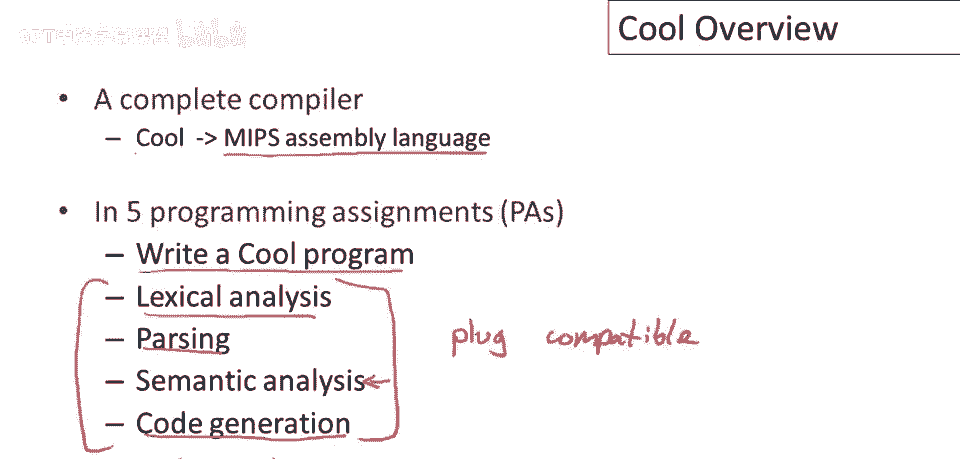
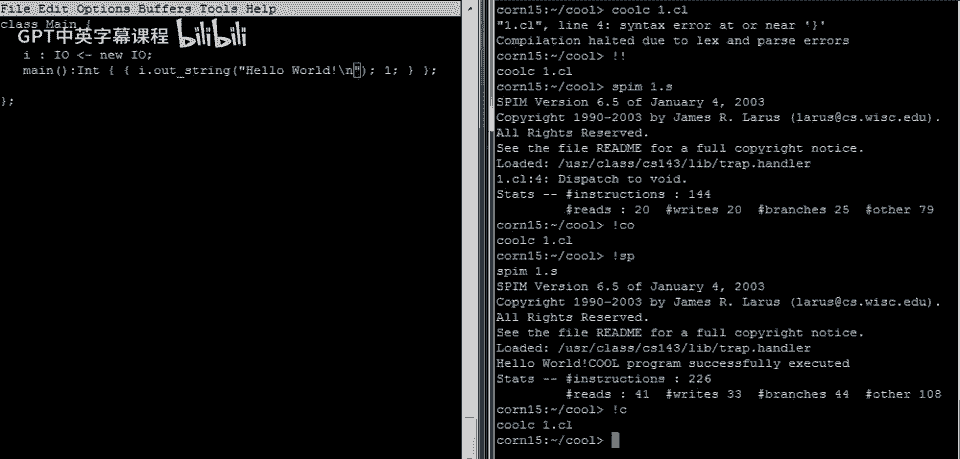
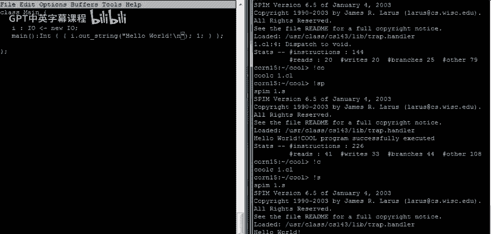
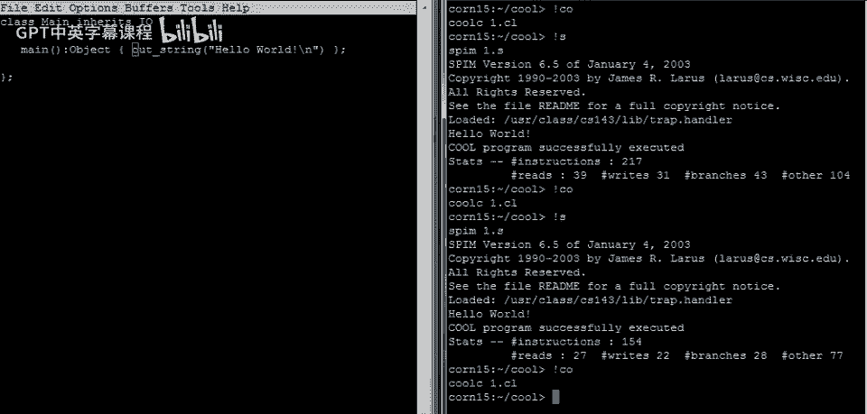
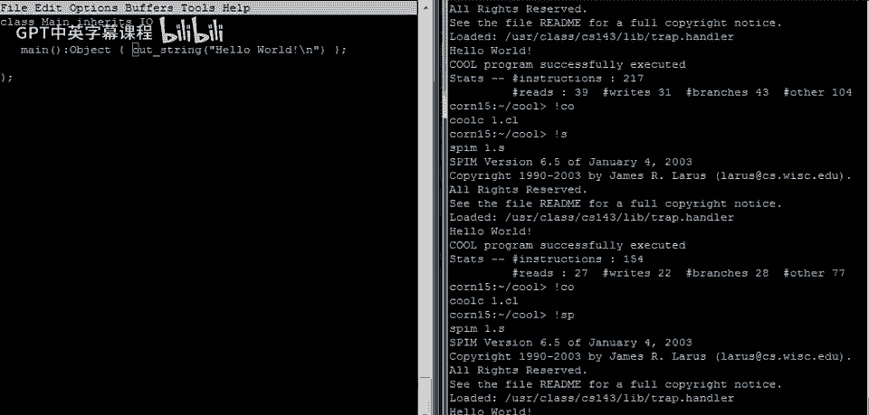

# 课程 P4：Cool 语言概述 🧑‍🏫

在本节课中，我们将学习 Cool 语言的基本概念、设计目标以及如何编写和运行一个最简单的 Cool 程序。Cool 是一门面向对象的课堂教学语言，其核心设计目标是让学生能在一个学期内编写出完整的编译器。

## 语言设计目标 🎯

Cool 是“面向对象的课堂语言”的缩写。其独特的设计要求是，编译器必须在相对较短的时间内编写完成。学生通常只有一个学期的时间来编写编译器，因此它必须易于快速实现。Cool 主要用于教学编译器设计。

世界上 Cool 编译器的数量远超 Cool 程序的数量。可能有成千上万个 Cool 编译器被编写出来，但只有几十或几百个 Cool 程序。这可能是唯一一种编译器数量超过程序数量的语言。这揭示了 Cool 的主要设计要求：**编译器易于编写**比程序易于编写更重要。

为了简化实现而不损害教学价值，语言包含了一些“怪癖”，这些特性对于日常编程工作可能并不方便。

## 语言特性概览 📚

Cool 的设计旨在让你体验现代编程语言的抽象概念，包括：
*   **静态类型**
*   **通过继承实现代码重用**
*   **自动内存管理**

当然，语言中也省略了许多内容，因为我们无法将所有功能都塞进一门语言并期望它能被快速实现。本课程将涵盖其中一部分，但遗憾的是，一些有趣的语言思想无法在本课中涉及。



## 课程项目：构建 Cool 编译器 ⚙️

本课程的项目是构建一个完整的编译器。具体来说，你将把 Cool 语言编译到 **MIPS 汇编语言**。MIPS 是为 80 年代设计的机器指令集，现在有可以在任何硬件上运行的模拟器，这使得整个项目具有很好的可移植性。

运行你的编译器，它会生成 MIPS 汇编代码，然后这些代码可以在任何机器上的模拟器中运行。

项目被分为 5 个作业：
1.  首先，你将编写一个 Cool 程序，这个程序本身将是一个解释器，以获得编写简单解释器的经验。
2.  编译器本身将包括我们讨论的 4 个阶段：**词法分析**、**语法分析**、**语义分析**和**代码生成**。

所有这些阶段都是“可插拔”的，这意味着我们有每个阶段的独立参考实现。例如，当你正在处理语义分析时，你可以从参考编译器中取出词法分析、语法分析和代码生成组件，并将你的语义分析模块插入该框架中进行测试。

这种方式的好处是，如果你在某个组件上遇到困难，或者不确定某个组件是否工作良好，你可以独立地测试它，而不会在处理其他组件时遇到问题。

最后，虽然没有强制性的优化作业，但我们提供了一些建议的优化方案。许多学生已经为 Cool 编写了优化器，这是一个可选的作业。如果你对程序优化感兴趣，可以尝试。

---

## 编写第一个 Cool 程序 ✍️

上一节我们介绍了 Cool 语言和课程项目。本节中，我们来看看如何编写和运行一个最简单的 Cool 程序。

首先要知道的是，Cool 源文件的扩展名是 `.cl`。你可以使用任何文本编辑器来编写程序。

每个 Cool 程序都必须有一个名为 `Main` 的类。类声明以关键字 `class` 开始，后跟类名（这里是 `Main`）和一对花括号 `{}`，花括号内是属于该类的内容。每个类声明必须以分号 `;` 结束。

程序由类声明列表组成，每个类声明以分号结束。

现在我们需要让这个类做点事情，所以我们将在类中定义一个方法，我们称其为 `main`。事实上，`Main` 类的 `main` 方法必须始终存在，这是程序启动时执行的方法。此外，此方法必须不接受任何参数。

方法的参数列表始终为空，方法体位于一对花括号 `{}` 中。类由这样的声明列表组成，并且声明之间必须用分号分隔。即使类中只有一个方法，它也必须以分号结束。

现在，我们可以定义方法具体要做什么。Cool 是一种表达式语言，这意味着在可以放置代码的任何地方，你都可以放置任意表达式。方法没有显式的 `return` 语句，方法体的值就是整个方法的返回值。

以下是一个最简单的 Cool 程序，它仅仅返回数字 `1`：

```cool
class Main {
    main(): Int {
        1
    };
};
```

### 编译与运行 🚀

Cool 编译器称为 `coolc`。要编译程序，只需给编译器一个 Cool 源文件列表。这里我们只有一个文件 `one.cl`：

```bash
coolc one.cl
```

如果编译成功，你会看到目录中生成一个新文件 `one.s`，这就是程序的 MIPS 汇编代码。

要运行代码，我们使用 MIPS 模拟器 `spim`。只需将汇编文件交给它：

```bash
spim one.s
```

它会运行并打印很多信息，包括执行的指令数、加载/存储次数、分支数等性能统计。如果程序成功执行，你会看到类似“程序成功执行”的消息。

### 添加输出功能 📤



上面的程序虽然运行成功，但并没有在屏幕上输出任何内容，因为它只是返回了一个值。若要在 Cool 程序中打印内容，你必须显式地调用输出方法。



Cool 有一个内置的原始类 `IO`，我们可以声明一个 `IO` 类型的属性（字段），然后使用该对象来执行输入/输出操作。

以下是修改后的程序，它打印“Hello, world!”并返回数字 `1`：

```cool
class Main {
    i: IO <- new IO; -- 声明并初始化一个 IO 类型的属性 i

    main(): Int {
        {
            i.out_string("Hello, world!\n"); -- 调用 out_string 方法打印字符串
            1; -- 块中最后一个表达式的值成为整个块的值
        }
    };
};
```

**关键概念解释：**
*   `i: IO <- new IO;` 声明了一个名为 `i`、类型为 `IO` 的属性，并用 `new IO` 表达式将其初始化为一个新的 `IO` 对象。
*   方法体是一个**表达式块**，由花括号 `{}` 包裹，内部是一系列用分号 `;` 分隔的表达式。
*   表达式块按顺序评估其中的表达式，**整个块的值是最后一个表达式的值**。
*   `\n` 是字符串中的换行符。

编译并运行这个程序，你将在屏幕上看到“Hello, world!”。

### 程序的其他写法 🔄

为了让你更熟悉 Cool 的语法，这里展示几个实现相同功能的替代写法：

**1. 更改返回类型**
由于 `out_string` 方法返回的是 `IO` 对象，我们可以将 `main` 方法的返回类型改为 `IO` 或所有类的根类 `Object`。

```cool
class Main {
    main(): IO { -- 返回类型改为 IO
        (new IO).out_string("Hello, world!\n")
    };
};
```

**2. 通过继承获得 IO 功能**
让 `Main` 类继承自 `IO` 类，这样 `Main` 的对象本身就拥有了 `IO` 的所有方法。

```cool
class Main inherits IO { -- Main 继承自 IO
    main(): Object { -- 返回类型可以是 Object
        out_string("Hello, world!\n") -- 直接调用继承来的方法，默认对象是 self
    };
};
```

**关键概念解释：**
*   `inherits IO` 表示 `Main` 类继承了 `IO` 类的所有属性和方法。
*   `self` 是当前对象的名称（类似于 Java/C++ 中的 `this`）。
*   当调用方法时没有明确指定对象，则默认派发给 `self`。

---

## 总结 📝



本节课中，我们一起学习了 Cool 语言。我们了解了它的教学导向设计目标，知道了课程项目是构建一个完整的、将 Cool 编译到 MIPS 汇编的编译器。我们动手编写了第一个 Cool 程序，学习了基本的程序结构、类与方法定义、表达式块以及如何使用 `IO` 类进行输出。我们还看到了通过继承来复用代码的简洁写法。



在接下来的视频中，我们将看到更多 Cool 编程的例子，进一步探索这门语言。