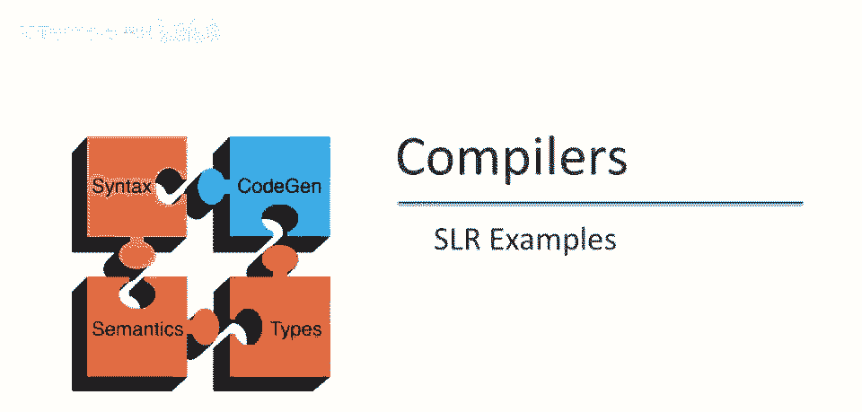
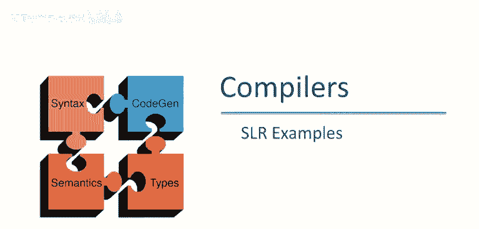

# 课程 P40：SLR解析示例详解 🧩




在本节课中，我们将通过两个具体的语法示例，学习如何构建SLR解析自动机，并判断一个语法是否为SLR(1)文法。我们将从简单的例子开始，逐步过渡到更复杂的结构，以理解SLR解析中的关键概念和潜在冲突。

---

## 示例一：简单左递归语法

上一节我们介绍了SLR解析的基本概念，本节中我们来看看一个非常简单的例子。考虑以下语法：
```
S -> S a
S -> b
```
这个语法生成一个以 `b` 结尾、前面有任意数量 `a` 的字符串。请注意，该语法是左递归的。对于自底向上的解析器（如SLR解析器）来说，左递归语法是完全可接受的。

### 构建解析自动机

第一步是向语法中添加一个新的开始产生式。出于技术原因，我们需要一个新的开始符号 `S'`，其产生式为：
```
S' -> S
```
解析自动机NFA的起始状态是项 `S' -> .S`。我们直接计算DFA的状态，而不显式构建NFA。

以下是DFA第一个状态必须包含的项。由于点 `.` 紧跟在非终结符 `S` 之后，这意味着在NFA中存在ε转换，可以到达所有以 `S` 为左部的产生式的初始项。因此，第一个状态包含以下三项：
*   `S' -> .S`
*   `S -> .S a`
*   `S -> .b`

现在，我们必须考虑每个可能出现在栈上的符号所对应的转换。

以下是可能的转换情况：
*   如果看到输入 `b`，则进入状态：`S -> b.`
*   如果看到输入 `S`，则进入状态：`S' -> S.` 和 `S -> S. a`

状态 `S -> b.` 和 `S' -> S.` 都只有一项，且点都在最右端，表示这些状态已完成，唯一的动作是规约。

### 冲突分析

初始状态只有移入动作，没有规约动作，因此不存在冲突。已完成的状态也只有一个规约动作，没有冲突。

唯一需要关注的是状态 `S' -> S.` 和 `S -> S. a`。在此状态下，我们可以：
*   根据 `S' -> S.` 进行规约。
*   或者，将 `a` 移入栈中。

要判断是否存在移入-规约冲突，我们需要查看 `S'` 的**FOLLOW集**。`S'` 是开始符号，其后面只能跟输入结束符 `$`。这意味着：
*   如果输入是 `$`，则规约。
*   如果输入是 `a`，则移入。

由于 `a` 不在 `S'` 的FOLLOW集中，因此在此状态下没有冲突。**结论：该语法是SLR(1)文法。**


---

## 示例二：稍复杂的语法

在理解了简单示例后，我们来看一个稍复杂的扩展语法。语法如下：
```
S -> S a S
S -> b
```
同样，我们需要添加新的开始产生式：`S' -> S`。

### 构建解析自动机

起始状态与之前类似，包含以下项：
*   `S' -> .S`
*   `S -> .S a S`
*   `S -> .b`

根据可能的输入符号进行状态转换：

以下是状态转换的详细情况：
*   看到 `b`：进入状态 `S -> b.`
*   看到 `S`：进入状态 `S' -> S.` 和 `S -> S. a S`
*   看到 `a`：从状态 `S -> S. a S` 出发，进入新状态 `S -> S a .S`。由于点 `.` 后是非终结符 `S`，需要加入 `S` 的所有产生式初始项，因此该状态包含：
    *   `S -> S a .S`
    *   `S -> .S a S`
    *   `S -> .b`

从这个新状态出发，可能的转换有：
*   看到 `b`：进入 `S -> b.`
*   看到 `S`：进入 `S -> S a S.`

状态 `S -> S a S.` 的唯一可能输入是 `a`，看到 `a` 会转换到状态 `S -> S a .S`，从而形成循环。

### 冲突分析

我们检查所有状态是否存在移入-规约或规约-规约冲突。没有状态包含多个规约项，因此不存在规约-规约冲突。

我们重点关注包含可能冲突动作的状态。状态 `S' -> S.` 和 `S -> S. a S` 与第一个例子相同，没有冲突。

关键状态是 `S -> S a S.`。该状态有一个规约项 `S -> S a S.`。我们需要计算非终结符 `S` 的**FOLLOW集**：
1.  从 `S' -> S` 可知，`$` 在 `FOLLOW(S)` 中。
2.  从产生式 `S -> S a S` 可知，`a` 在 `FOLLOW(S)` 中（因为 `S` 后面可以跟 `a`）。
3.  同样从 `S -> S a S` 可知，右边 `S` 的FOLLOW集也是左边 `S` 的FOLLOW集的子集，但这没有增加新元素。

因此，`FOLLOW(S) = { $, a }`。

这导致了问题：在该状态下，如果下一个输入符号是 `a`，根据FOLLOW集，我们应该进行规约；但同时，该状态也存在看到 `a` 就移入的转换。**因此，该状态存在移入-规约冲突。**

**结论：该语法不是SLR(1)文法。**

---

## 总结 📝

本节课中我们一起学习了两个SLR解析的构建示例。
*   在第一个例子中，我们构建了一个简单左递归文法的SLR自动机，并通过分析FOLLOW集确认其是SLR(1)的，没有冲突。
*   在第二个例子中，我们扩展了语法，构建了更复杂的自动机。分析发现，由于非终结符 `S` 的FOLLOW集中包含了移入符号 `a`，导致了一个状态出现移入-规约冲突，因此该语法不是SLR(1)文法。


通过这两个例子，我们实践了SLR解析表的构建过程，并深入理解了**FOLLOW集**在判断移入-规约冲突时的核心作用。