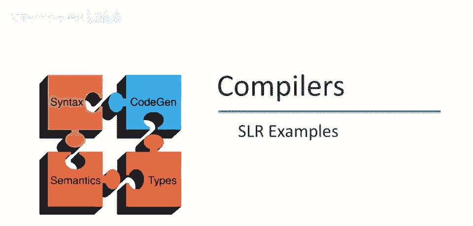
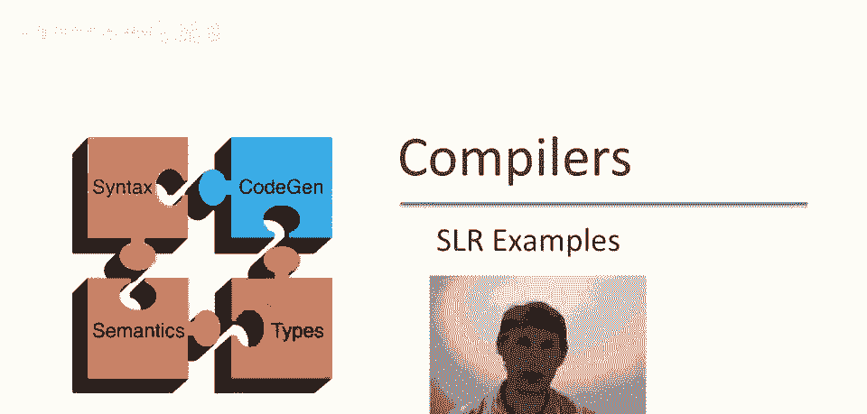
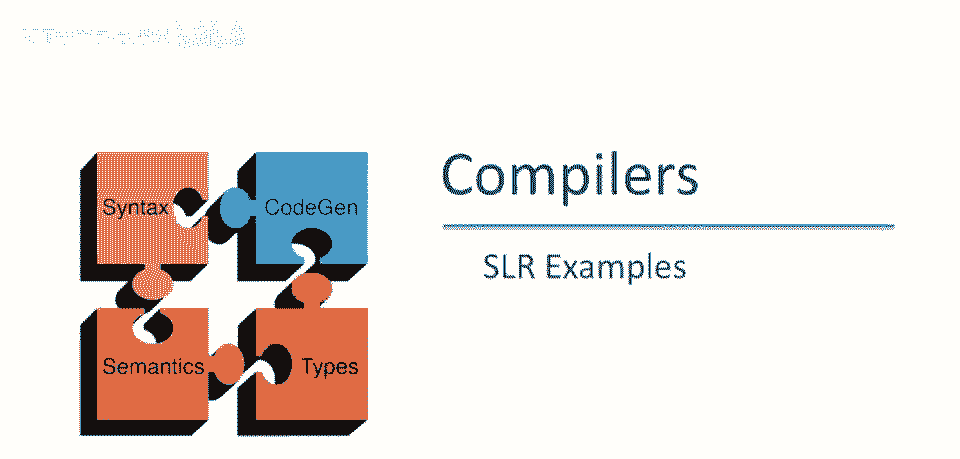
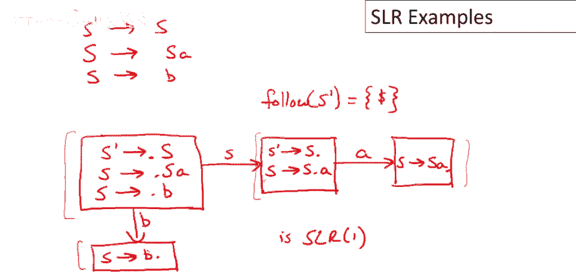
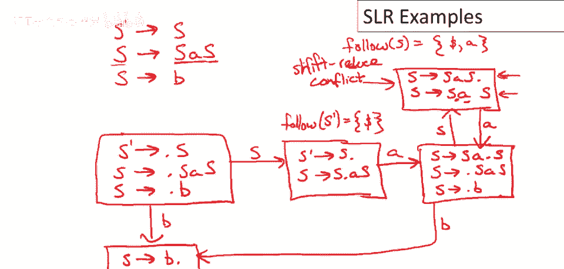

# P40：p40 08-08-_SLR_Examples - 加加zero - BV1Mb42177J7

本视频中，我们将处理几个SLR解析示例。

让我们做一个非常简单的例子，考虑语法S->Sa或S->b，这个语法做什么，它产生a的字符串，然后是b，任意数量的a后跟一个b，注意语法是左递归的，回忆一下，这对自底向上解析器不是问题，SLR解析器。

LR解析器完全接受左递归语法，所以让我们开始计算这个语法的自动机应该是什么，解析自动机应该是什么，回忆一下，第一步是向语法中添加一个新生产，我们必须添加一个新的开始符号，它只有一个生产，指向旧开始符号。

这又是出于技术原因，开始符号或抱歉，解析自动机NFA的起始状态是这一项S'，我们的新开始符号指向点S，我们的旧开始符号，而不是构建NFA，然后进行状态子集构造，让我们直接计算。

DFA的第一个状态中必须包含哪些项，记住，在NFA中的所有epsilon移动，是由于移动发生，因为我们没有看到非终结符在栈上，但它说看到由该非终结符派生的东西，所以如果我们有一个点紧挨着一个非终结符。

这意味着在NFA中有epsilon移动，到所有那些对于该非终结符的所有生产，所有第一个项的所有生产，我指的是什么，我的意思是，这个状态，意味着epsilon生产到S->。Sa。

所以这是识别这个生产的第一个项，点在最左边，对于另一个生产也会有项，对于S S->。b，所以这是NFA中起始项的epsilon闭包，所以这将是第一个状态，这三件事，这三个项将是DFA的第一个状态。

现在我们必须考虑对于每个可能的转换，对于我们在栈上可能看到的每个符号，所以让我们想想如果我们看到一个b，所以如果我们看到一个b在栈上，所以如果我们在栈上看到一个b，那么状态中唯一项将是s到b点，好的。

所以看到a b是可以的，这将是栈内容唯一有效项，现在另一种可能是我们看到一个s，好的，所以如果我们在栈上看到s，会发生什么，我们将进入有两个项的状态，S撇，嗯，转到s点，所以我们在栈上看到了s。

我们准备通过这条产生式规约，可能还有s转到s点a，现在显然在这个状态，实际上，让我们谈谈这个下面的状态，底部的状态，没有更多的转换可能，那里只有一项，点都在最右边，这个状态已完全完成，右边的这一个，嗯。

其中一项已完成，所以最右边，但另一项仍有一个a，因此可能还有一次从这个状态到该项目的转换，S转到点，好吧，现在看看这个，我们看到大部分，这些州状况良好，这两个州，这个和这边这个，它们只有一项。

没有转移的可能性，减少这些州的冲突，只有一项，只有一件事要做，这两个州唯一的可能性是减少这个州，初始起始状态没有减少的移动，所以只有移位操作，因此没有移位归约冲突，因为没有归约项，无项，无可能归约动作。

同样原因，无归约归约冲突，所以感兴趣的唯一状态，实际上，从语法是否为SLR1的角度来看，是这个中间状态，好的，这里我们可以通过s'->s。归约，或者将a移入栈中，问题是什么跟在s'后面。

语法中s'后面能跟什么，如果我们回头看语法，会发现s'后面不能跟任何东西，s'是开始符号，实际上，s'后面的唯一东西是输入结束，这意味着如果输入结束，我们减少s'到s，否则如果有a在栈上。

抱歉如果有a在输入中，我们会把它移入栈中，所以这个语法是SLR1，没有移入，减少或减少冲突，由该解析自动机隐含的减少冲突。

让我们再做另一个稍微复杂的例子，实际上让我们扩展之前的语法，我们会有个产生式s到saas，所以现在s是非终结符两次，中间有个a，或者s可以到b，就像之前，现在让我们计算这个语法的解析自动机。

我们再次需要向语法中添加一个虚拟开始符号，它将，唯一的产生式是生成旧开始符号，现在让我们开始计算，解析自动机中这个特定语法的什么，和之前一样，我们不会费力构建NFA，那是系统化的一种方法。

一种方法是像我们草绘的那样，首先构建NFA，然后进行状态子集构造，但这个语法足够小，足够简单，我们可以直接计算，状态中有什么，DFA状态中的项是什么，和之前一样，因为点紧跟在s后面，我们知道我们可以。

不消耗任何输入，在NFA中做epsilon转移到达开始s的产生式，这些将在，也在DFA状态中，就是这样，我们不能在这里添加其他产生式，所以s是唯一的非终结符，我们已经添加了所有s的初始项，初始项。

所以这是完整的状态，好的，和之前一样，一种可能是我们在栈上看到b，那么这将给我们s到b点的项，该项仅适用于该状态，另一种可能是我们将在栈上看到s，然后确定，在这种情况下，我们将进行状态转换。

S'转到s点，S转到s点，S可以，我们在其他态中见过相同的状态，嗯，现在我们也可以看到a，那会带我们去哪个状态，这将有些不同，在这种状态下，我们可以有该项，或者我们会有该项s a点s。

但现在注意点紧跟在s后面，因此，我们不仅可以看到栈上的s，我们还可以看到栈上s的派生项在下一个位置，因此，我们必须加入所有s的生产式，只有两个，但这意味着我们可以有该项。

S转到点s as s和S转到点b，好吧，现在从这个状态开始，有几个不同的可能转换，我们可以看到s或b，如果我们看到b，那么我们最终会进入这个状态，如果看到s，那么，会发生什么，如果，如果我们看到s。

那么我们最终会进入另一个新状态，我们有了s goes to s a s点，我们看到了该生产式的完整右半部分或s goes to s a点s，嗯，实际上，那个位置不对，让我们擦掉它，把它放在正确的位置。

它在这里，在a之前，不是在a之后，好吧，现在我们必须考虑在这个状态下会发生什么，所以在这个状态下，唯一的可能输入是a，如果是a，会发生什么，我们将有s goes to s a点s。

然后我们必须再次添加s的初始生产式，那将把我们带回这个状态，让我把转换标记在这里，我们从s状态转到该状态，从该状态回到s状态，底部状态从顶部状态通过a，我想如果我们没有犯任何错误。

这就是完整的转换系统和该dfa的所有状态，现在的问题是，这是否是，这是否是slr 1文法的解析自动机，为了回答这个问题，我们必须寻找可能的，归约，归约和移位，妥善处理冲突，快速浏览所有州。

或让你相信没有两个可能减少的动作，因此，这里没有减少减少冲突，在这个自动机中，我们可以忽略只有一项的状态，或没有可能减少动作的状态，因为这些是不会有移位减少冲突的状态，这意味着我们可以忽略这两个状态。

最左边的两个状态，所以现在只剩下这三个状态要考虑，我们上次看的这个状态，嗯，之前s prime的跟随就是美元符号，所以没有移位，减少冲突在这个状态，因为在输入a时，我们只能移位，不能减少，嗯。

由s prime去s现在只剩下看这两个状态，让我们先考虑这个底部的状态，这个状态告诉我们做什么，这个状态说首先，注意从这个状态出去的唯一的转换是b和s，这个状态根本没有减少动作，所以没有移位。

减少冲突的可能性，要么，这就剩下这个状态要考虑，所以现在这个状态确实有减少动作，这里的第一个项目是一个减少，这意味着我们应该通过s去s a s减少，如果接下来的是s的跟随。

所以我们需要知道s的跟随是什么，从s prime去s，我们知道s prime的跟随也在s的跟随中，显然美元符号在s的跟随中，然后从这个语法部分我们可以看到a在s的跟随中，然后从这个s的出现，嗯。

我们知道因为它出现在生产规则的右边，那么右边的非终结符的跟随，也是左边的非终结符的跟随，在这个情况下它们是一样的，它只是说s的跟随是s的跟随的子集，这显然总是正确的，并没有添加什么新东西。

所以我们最终得到s的跟随就是这两个东西，美元符号和a，美元符号和a，但这带来一个问题，因为这说明如果输入有a，我们应该归约，而此移动说明如果输入有a，我们应该移位，因此此状态确实有移位，归约冲突，好的。

