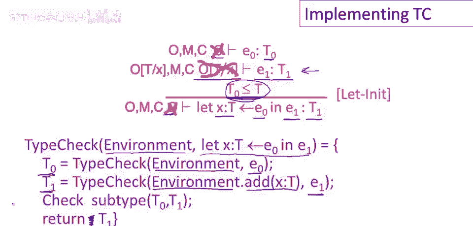

# 课程 P41：类型检查的实现 🧠


在本节课中，我们将学习如何将类型系统的规则转化为具体的代码实现。我们将通过遍历抽象语法树，并利用类型环境来检查和推导表达式的类型。

---

## 概述与高层设计 📋


类型检查的高层概述是：它可以单次遍历抽象语法树实现。实际上，这个过程分为两个阶段。

上一节我们介绍了类型检查的整体流程，本节中我们来看看具体的实现细节。

第一阶段是顶部向下阶段，它负责传递类型环境。我们从树的根部开始，递归地将初始类型环境向下传递，通过抽象语法树的各个节点，直到到达叶子节点。

第二阶段是底部向上阶段，它负责传递类型。从叶子节点开始，我们利用环境来计算子表达式的类型，并将结果类型向上传递。

---

## 实现加法规则 ➕

让我们从类型系统中一个简单的规则开始：加法规则。

简单回顾一下，类型检查表达式 `e1 + e2` 的规则是：首先类型检查 `e1`，然后类型检查 `e2`。两个子表达式必须是 `int` 类型。如果满足，则整个表达式的类型也是 `int` 类型。类型检查在相同的环境中进行。

以下是实现此规则的代码逻辑：

```python
def type_check(env, expr):
    if expr is of form e1 + e2:
        # 类型检查子表达式 e1
        t1 = type_check(env, e1)
        # 类型检查子表达式 e2
        t2 = type_check(env, e2)
        # 确认 t1 和 t2 都是 int 类型
        if t1 == int and t2 == int:
            return int
        else:
            # 打印类型错误信息
            print("Type error: addition operands must be int")
```

代码直接根据规则翻译而来。首先，我们递归调用 `type_check` 来获取 `e1` 和 `e2` 的类型 `t1` 和 `t2`。然后，我们检查它们是否都是 `int` 类型。如果检查成功，则整个表达式的类型为 `int`；否则，应报告错误。

---


## 实现 Let 初始化规则 🔧

现在，让我们看一个稍微更复杂的类型检查规则及其实现：`let` 初始化规则。

我们正在声明一个变量 `x`，类型为 `T`，它将在表达式 `e1` 中可见。但在执行 `e1` 之前，我们将 `x` 初始化为 `e0` 的值。整个 `let` 表达式期望得到类型 `T1`。

以下是规则的前提条件：
1.  `e0` 必须具有某种类型 `T0`，且 `T0` 是 `T` 的子类型。
2.  在扩展了 `x: T` 声明的环境中，`e1` 必须具有类型 `T1`。

以下是实现此规则的代码逻辑：

```python
def type_check(env, expr):
    if expr is of form let x: T = e0 in e1:
        # 在相同环境中类型检查初始化表达式 e0
        t0 = type_check(env, e0)
        # 扩展环境，添加变量 x 的声明
        new_env = env.extend(x, T)
        # 在新环境中类型检查主体表达式 e1
        t1 = type_check(new_env, e1)
        # 检查 t0 是否是 T 的子类型
        if is_subtype(t0, T):
            return t1
        else:
            # 打印类型错误信息
            print("Type error: initializer type does not match variable declaration")
```

首先，我们在原始环境中类型检查初始化表达式 `e0`，得到其类型 `t0`。接着，我们创建一个扩展了 `x: T` 声明的新环境，并在此新环境中类型检查主体表达式 `e1`，得到其类型 `t1`。最后，我们检查 `t0` 是否是 `T` 的子类型。如果所有检查都通过，则整个 `let` 表达式的类型就是 `t1`。

---

## 总结 🎯

本节课中我们一起学习了如何将类型系统的形式化规则转化为可执行的代码。

我们首先了解了类型检查分为向下传递环境和向上推导类型两个阶段。然后，我们通过实现**加法规则**和 **`let`初始化规则**，具体演示了如何将规则中的前提条件逐条翻译成递归函数调用和类型检查语句。



核心在于理解规则中的环境如何传递，以及如何利用递归遍历抽象语法树来完成类型推导。