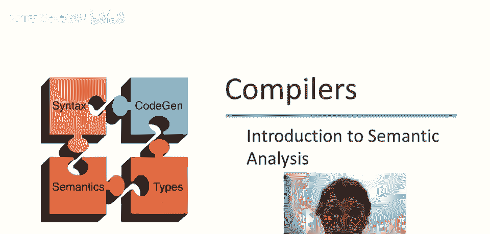
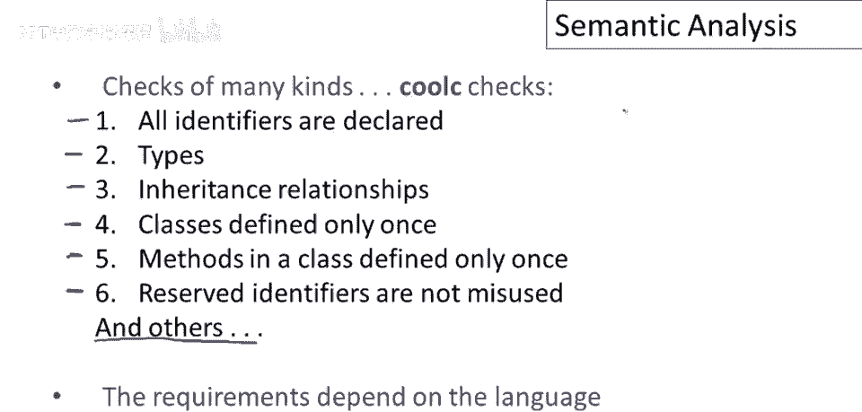

# 编译器原理课程 P42：语义分析入门 🧠

在本节课中，我们将要学习编译器前端的一个重要阶段——语义分析。我们将了解它的作用、必要性，以及它在酷C语言编译器中的具体任务。

## 概述

上一节我们结束了关于语法分析（解析）的讨论。解析的任务是检测语言中所有不正确的句子。本节中，我们来看看编译器前端的最后一个阶段：语义分析。它是逐步过滤输入字符串的管道中的最后一道防线，负责捕获程序中所有潜在的剩余错误，确保最终只有有效的程序可以被编译。

## 为什么需要语义分析？

你可能会问，为什么需要一个独立的语义分析阶段？答案很简单：编程语言的一些特性，其相关错误是语法分析无法捕获的。我们使用的上下文无关文法，其表达能力不足以描述语言定义中我们感兴趣的一切。

这种情况与我们之前从词法分析切换到语法分析时类似：并非所有事情都能用有限自动机完成，我们需要上下文无关文法来描述更强大的语言特征。同样，上下文无关文法本身也不够强大，还有一些额外的特征无法用它轻易表达。

## 酷C语言中的语义分析任务

那么，语义分析在酷C语言编译器中具体做什么呢？它执行多种检查。以下是酷C编译器执行的六类典型检查：

1.  **标识符声明检查**：确保所有使用的标识符都已事先声明。
2.  **标识符作用域检查**：确保标识符的使用遵守其作用域限制。
3.  **类型检查**：这是语义分析器的核心功能，确保表达式和操作中的类型兼容性。
4.  **面向对象特性检查**：检查类之间的继承关系是否合理（例如，避免循环继承）。
5.  **定义唯一性检查**：
    *   确保类没有被重复定义。
    *   确保方法在类内仅被定义一次。
6.  **保留标识符检查**：确保没有误用语言中的保留字或特殊标识符。

实际上，这个列表并不完整，还有许多其他限制将在后续课程中讨论。主要信息是，语义分析器需要执行多种不同的检查，这些检查因编程语言而异。酷C的检查是静态类型、面向对象语言的典型代表，而其他语言家族（如函数式语言）则会有不同的检查重点。

## 总结

本节课中，我们一起学习了语义分析在编译器中的角色。我们了解到，它是继词法分析和语法分析之后的前端最后阶段，负责处理那些无法通过语法规则捕获的程序错误。通过酷C语言的例子，我们看到了语义分析器需要执行诸如类型检查、作用域验证和面向对象规则校验等多种任务，以确保程序的语义正确性。