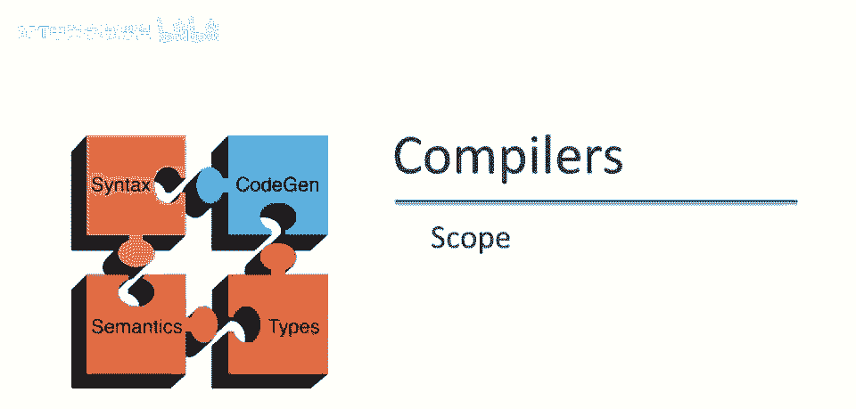
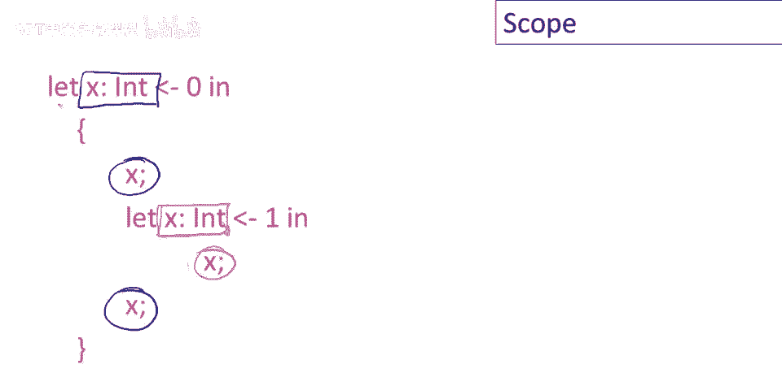
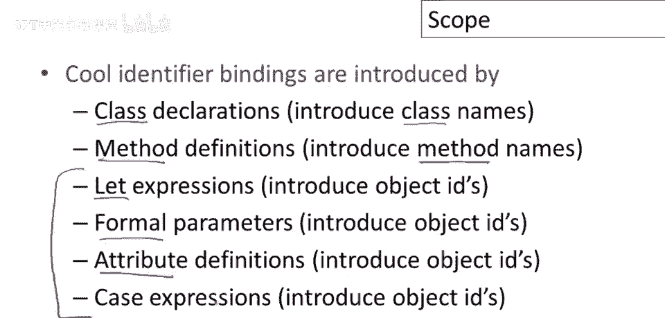
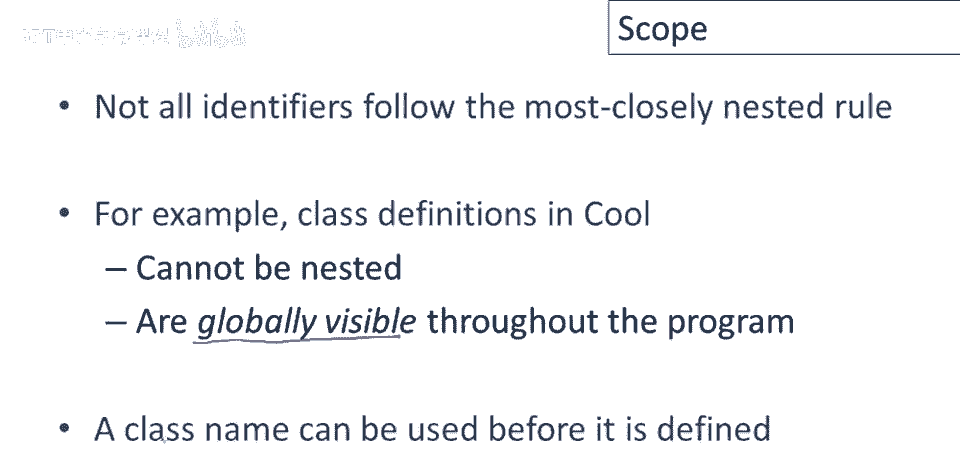
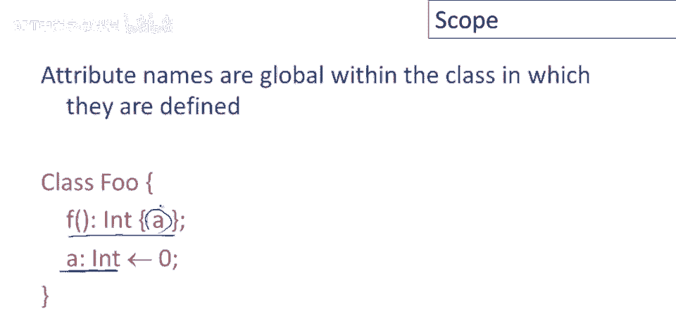

# 课程 P43：语义分析之作用域 🎯

在本节课中，我们将要学习语义分析中的一个核心概念——**作用域**。我们将了解为什么需要分析作用域，以及静态作用域与动态作用域的区别，并探讨 COOL 语言中标识符绑定的特殊规则。


## 概述：什么是作用域？

讨论作用域的动机是，我们希望能够匹配标识符的声明与标识符的使用。当我们说变量 `x` 时，需要知道它指的是哪个变量。如果变量 `x` 在程序中可能有多个定义，那么确定其具体指向哪一个，就是大多数编程语言（包括 COOL）中一个重要的静态分析步骤。


## 作用域示例

以下是来自 COOL 的两个例子，它们说明了作用域分析的必要性。


在第一个例子中，`y` 的声明将与这里的使用匹配。因此，我们知道 `y` 应该是一个字符串。编译器会报错，因为你试图将字符串和数字相加。

在第二个例子中，这里是 `y` 的声明，但在 `let` 的主体中我们没有使用 `y`。声明一个不使用的变量本身不是错误，尽管可能会生成警告。相反，我们在这里看到的是对 `x` 的使用，但没有匹配的定义。如果没有 `x` 的外部定义，那么我们将得到一个未定义或未声明的变量错误。


## 作用域的定义

这两个例子引出了作用域的概念。**标识符的作用域是程序的一部分，在该部分中标识符是可访问的**。关键在于，同一个标识符可能在程序的不同部分指代不同的事物。相同名称的不同作用域不能重叠。因此，在任何给定的程序部分，变量 `x` 只能指代一件事物。

标识符可以有受限的作用域。有很多例子表明，标识符的作用域可以小于整个程序。

## 静态作用域 vs. 动态作用域


当今大多数编程语言都采用**静态作用域**，COOL 就是一个例子。静态作用域的特征是，变量的作用域**仅取决于程序文本**，而不是任何类型的运行时行为。程序在运行时做什么并不重要，作用域纯粹从语法上定义。

你可能会惊讶，静态作用域竟然有替代方案。实际上，有一些语言采用所谓的**动态作用域**。历史上，曾有过关于哪种作用域更优的争论，但今天静态作用域阵营显然已经胜出。Lisp 曾经是动态作用域语言，但很久以前就改为了静态作用域。另一种已成为历史的语言 Snowball 也具有动态作用域。

动态作用域的特征是，变量的作用域**取决于程序的执行**。

### 静态作用域示例

让我们看一个静态作用域的 COOL 代码示例。这里有几个不同的 `x` 声明和一些 `x` 的不同用法。


问题是，这三个 `x` 的用法分别指向哪个定义？实际上，这两个 `x` 指向最外层的定义。而这里的 `x` 则指向内层的定义。我们遵循**最内层规则**：变量绑定到相同名称的、**最接近的**定义。因此，内层定义的 `x` 用于此处的使用，返回值为 `1`；外层定义的 `x` 用于另外两处使用，返回值为 `0`。


### 动态作用域示例

在动态作用域语言中，变量将引用程序执行中**最近的绑定**。请看这个例子：

假设有函数 `g`，它定义了变量 `a` 并初始化为 `4`，然后它调用另一个函数 `f`。函数 `f` 引用了变量 `a`。

```python
def g():
    a = 4
    f()  # 调用 f

def f():
    return a  # 这里的 a 指向什么？
```



在动态作用域下，`f` 中的 `a` 将取 `g` 中定义的值 `4`。因为这个引用将指向执行过程中最近的、活跃的 `a` 绑定（即 `g` 中的定义）。关于动态作用域如何工作，在我们更详细地讨论语言实现之前，暂时不多说，后续课程会再次涉及。

## COOL 语言中的标识符绑定

在 COOL 语言中，标识符绑定由多种机制引入：

*   类声明：引入类名。
*   方法定义：引入方法名。
*   对象标识符：通过以下几种方式引入：
    *   `let` 表达式
    *   函数的形参
    *   类中的属性定义
*   `case` 表达式的分支

## COOL 作用域的特殊规则


重要的是理解，并非所有标识符都遵循之前概述的**最内层规则**。

### 类名的作用域

类定义在 COOL 中不能嵌套，实际上它们在程序中**全局可见**。这意味着类名在程序的任何地方都被定义，可以在定义之前使用。



例如：
```cool
y: Bar; -- 这里使用了 Bar
...
class Bar { ... }; -- Bar 在这里才定义
```
这是完全合法的 COOL 代码。

### 属性名的作用域

属性名在定义它们的类中是**全局性**的。这意味着它们可以在定义之前使用。



例如，在类中可以先定义一个方法使用属性 `a`，然后再定义属性 `a`：
```cool
class C {
    method() : Int { a }; -- 这里使用了属性 a
    a : Int <- 5; -- 属性 a 在这里定义
};
```
这完全合法。类内方法和属性的定义顺序是随意的。

### 方法名的作用域

方法名的规则更复杂。例如，一个方法不必在用到它的类中定义，可以在其父类中定义。方法可以被重定义，实现方法覆盖，即使它已经定义过。目前没有精确的语言描述来概括所有规则，我们将在未来的视频中深入讨论。

## 总结



本节课中，我们一起学习了语义分析中的核心概念——**作用域**。

我们首先了解了分析作用域的目的是为了**匹配标识符的声明与使用**。然后，我们通过例子区分了**静态作用域**（由程序文本决定）和**动态作用域**（由程序执行决定），并明确了现代语言多采用静态作用域。

最后，我们探讨了 COOL 语言中标识符绑定的特殊规则，特别是**类名**和**属性名**具有全局或类内全局作用域，可以在定义前使用，这与局部变量的“最内层规则”不同。方法名的规则则更为复杂，涉及继承和覆盖。


理解这些规则，是构建编译器语义分析阶段的基础。