# P43：p43 09-02-_Scope - 加加zero - BV1Mb42177J7

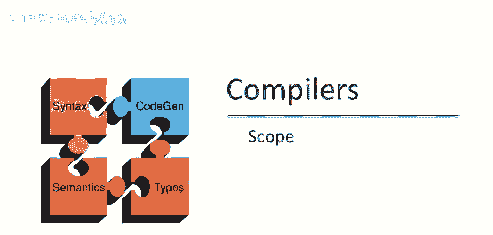

欢迎回到本视频，我们将从范围话题开始讨论语义分析。

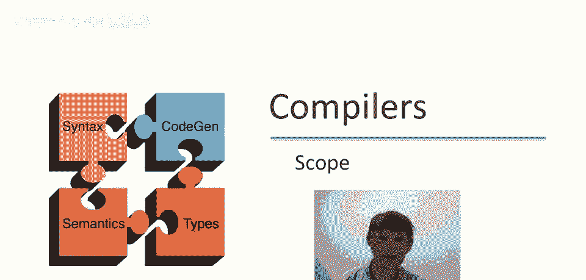

讨论范围的动机是，我们希望能够匹配标识符声明，与那些标识符的使用，当我们说变量x时，需要知道指的是哪个变量，如果变量x，在程序中可能有多个定义，这是大多数编程语言中的重要静态分析步骤，包括在cool中。

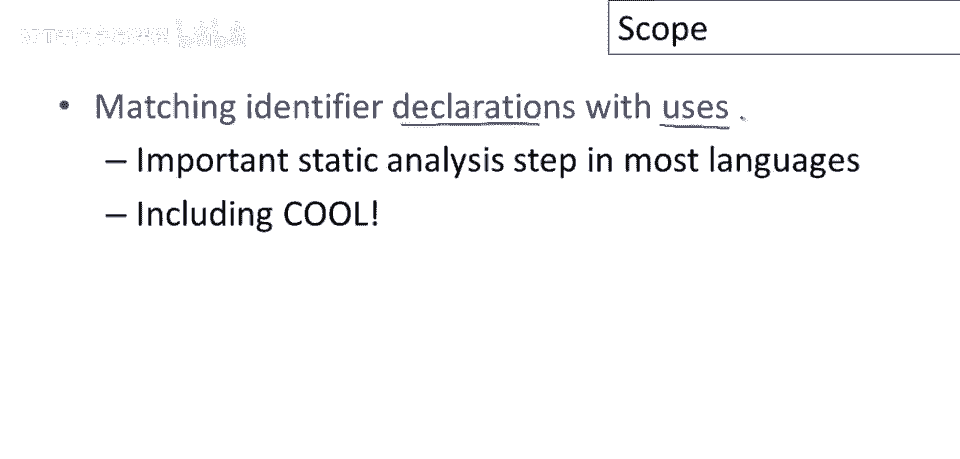

以下是来自cool的几个例子，这个y的定义，这个y的声明，它将与这个使用匹配，因此，在这里我们知道y应该是一个字符串，你将从编译器中得到某种错误，因为你试图将字符串和数字相加，在第二个例子中。

这里是y的声明，然后在let的主体中我们没有，我们没有看到y的使用，这本身不是一个错误，声明一个不使用的变量是完全正常的，尽管你可以想象为它生成一个警告，这实际上并没有使程序表现糟糕，但相反。

我们在这里看到的是对x的使用，但没有匹配的定义，问题是x的定义在哪里，我们看不到，如果没有x的外部定义，那么我们将在这里得到一个未定义或未声明的变量错误。

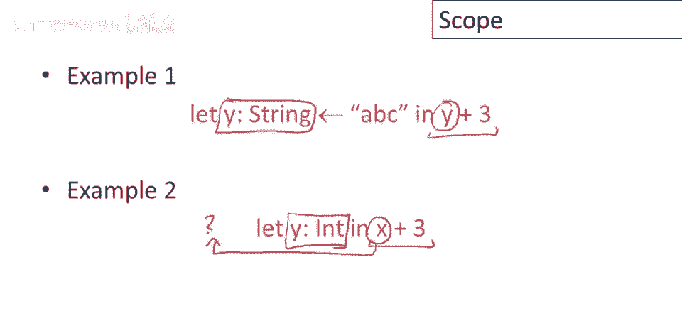

这两个例子说明了范围的概念，标识符的范围是程序的一部分，在该部分中标识符是可访问的，只需知道同一个标识符可能在程序的不同部分指代不同的事物，相同的名称的不同范围不能重叠，因此，无论变量x，例如。

意味着它只能在程序的任何给定部分指代一件事物，标识符可以有受限的范围，有很多例子，我相信你熟悉它们，标识符的范围小于整个程序的例子。

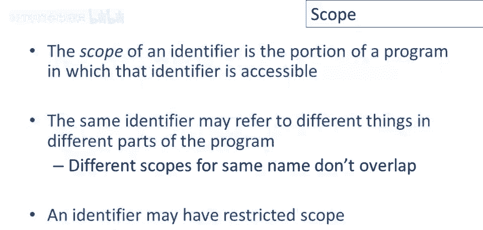

当今大多数编程语言都有所谓的静态范围，cool是一个静态范围语言的例子，静态范围的特征是变量的范围仅取决于程序文本，而不是任何类型的运行时行为，程序实际上在运行时做什么并不重要，范围纯粹从语法上定义。

从你编写程序的方式，现在，如果有任何静态范围的替代方案可能会让人感到惊讶，实际上，你使用过的每种语言可能都有静态作用域，但有一些语言是所谓的动态作用域，很长一段时间。

实际上曾有过关于静态作用域是否优于动态作用域的争论，尽管今天，我认为很明显静态作用域阵营已经赢得了这场讨论，但至少在历史上，Lisp是一个动态作用域的语言，它在一段时间内已经切换，实际上。

它改为静态作用域已经是很久以前的事了，一种现主要为历史语言，不再真正使用，称为雪球，也具有动态作用域，和，动态作用域特征，是变量范围取决于程序执行。

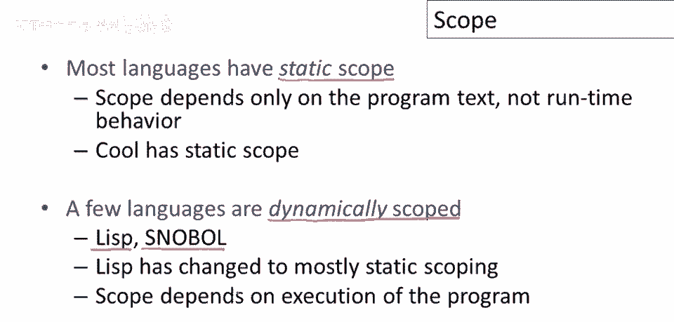

让我们看静态作用域示例，这里有些酷代码和，呃，几个不同x声明，还有一些x的不同用法，让我擦掉这些下划线，这样我就可以用颜色表示绑定，让我们看看这个定义，问题是这些x的哪些用法，我们有3种x的用法。

这里实际上指的是那个定义，实际上就是这两个，这些实际上是指入口外的，这些实际上是指这个定义，这里若指x，则得值为0，但此定义，x的内定义用于此x使用，此x使用得此值，x的含义，在此情况下返回值为1。

正在发生的是，我们使用最接近的规则，因此变量绑定到最接近的相同名称的定义，这就是x最近定义，但这两个x最近，唯一包含定义是外层。

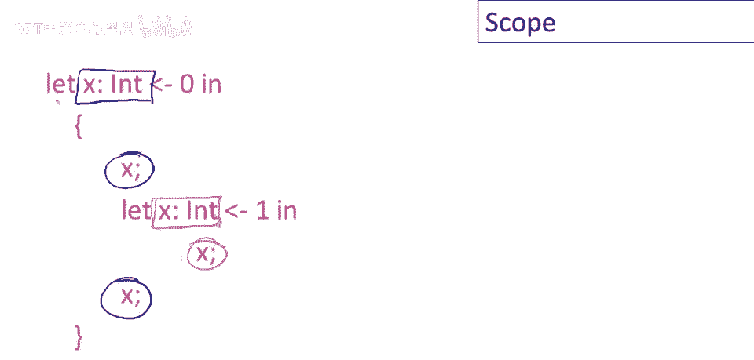

所以在动态语言中，变量将引用程序执行中最近的绑定，意味着变量最近绑定，所以这是一个例子，假设我们有函数g，g定义变量a，这里初始化，比如为4，然后它调用另一个函数，另一个不在同一语法范围的函数。

所以我把f写在了g旁边，但实际上f可能在代码的完全其他部分，f引用了一个，问题是这里的a的值是什么，嗯，如果是动态作用域，那么它将取g中定义的值，这里f(x)实际上将返回for，这将是这个电话的结果。

因为这个引用将指向这个绑定，或这个在g中的a定义，关于高动态，我们无法多说，动态作用域如何工作，在我们更详细地讨论语言如何实现之前，稍后我们还会再次讨论动态作用域。

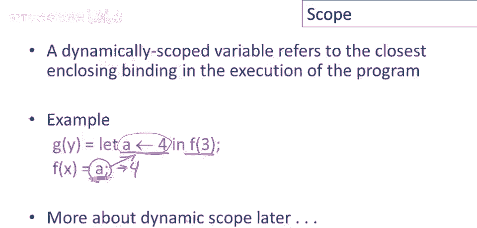

在课程中，酷标识符绑定由多种机制引入，有类声明，引入类名，方法定义，引入方法名，然后有几种不同方式引入对象标识符，这些是引导表达式，函数的形参，类中的属性定义。

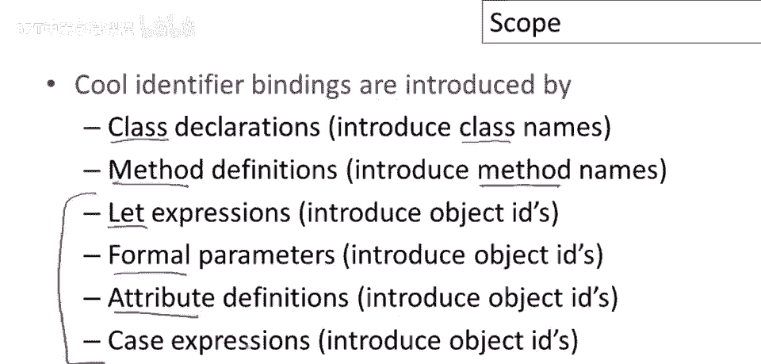

最后在case表达式的分支中，现在，重要的是理解，并非所有标识符都遵循之前概述的最内层规则，例如，这条规则的一个相当大的例外是cool中的类定义，因此类定义不能嵌套，实际上它们在程序中全局可见。

这意味着类名在程序的任何地方都被定义，如果它在程序的任何地方被定义，该类名可用于任何地方，在程序的任何地方或整个程序中，特别是类名可以在定义之前使用。

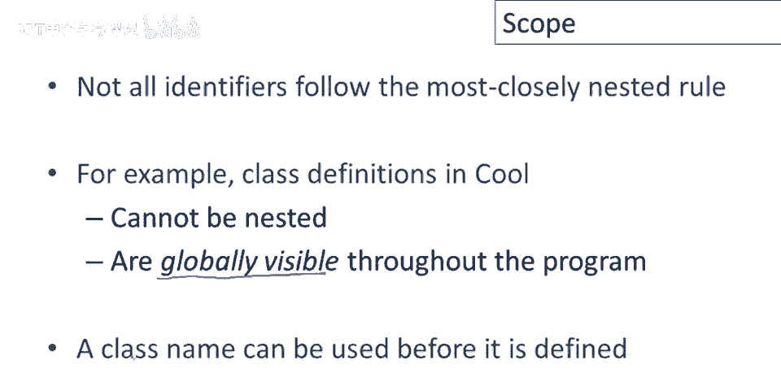

因此例如，我们声明y为bar类型，稍后我们声明类bar，这是完全合法的酷代码，bar在定义前被使用，不影响程序正确性，这是完全合法的酷代码，类似地，对于属性名，属性名在定义它们的类中是全局性的。

这意味着它们可以在定义前再次使用，例如，我可以定义类，定义方法用属性a，稍后，稍后，定义属性a？完全合法，通常先定义属性再定义方法，不是必须，类内方法属性定义顺序随意，属性可先使用后定义。

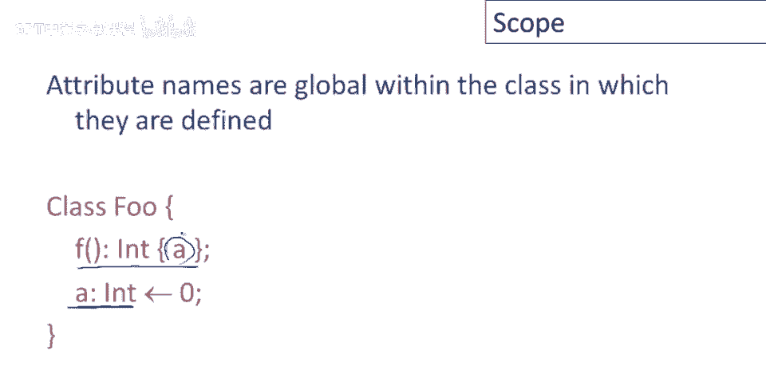

最后，方法名规则复杂，例如，方法不必在用到的类中定义，可在父类中定义，方法可重定义，可实现方法覆盖，给方法新定义，即使已定义过，目前无精确语言描述规则。

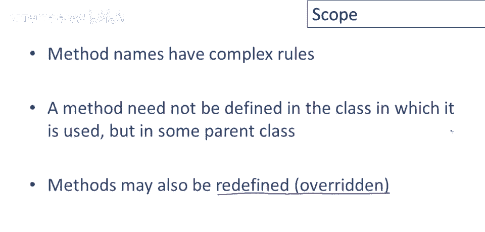

未来视频会深入讨论。