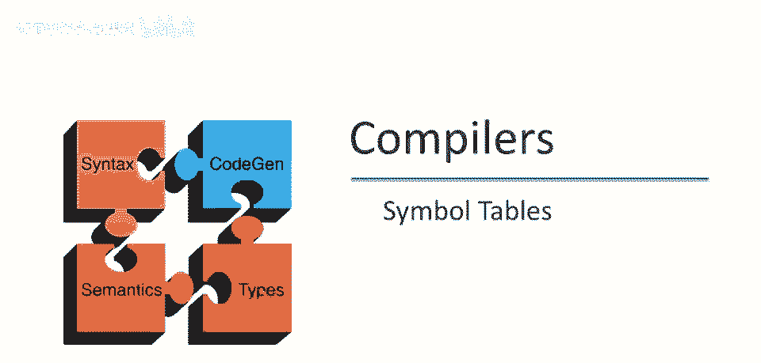
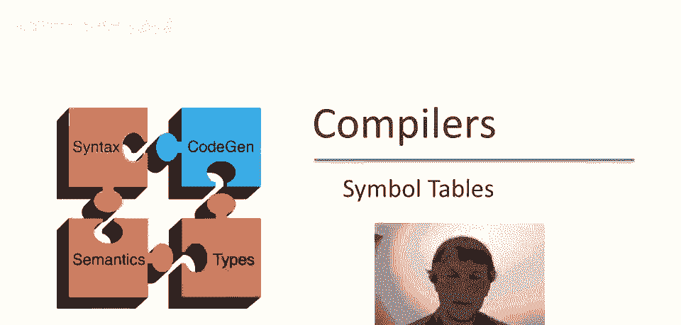
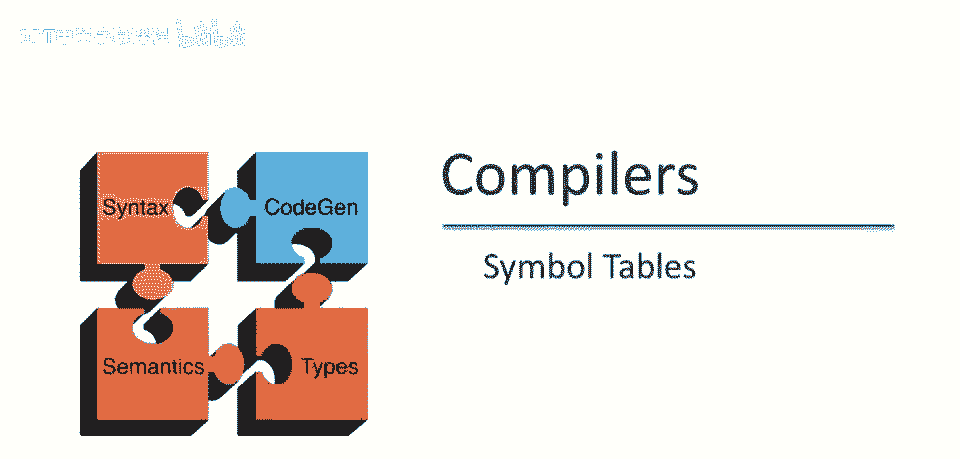
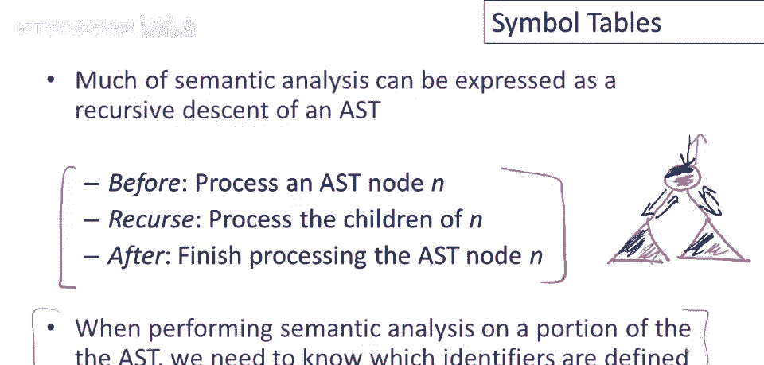
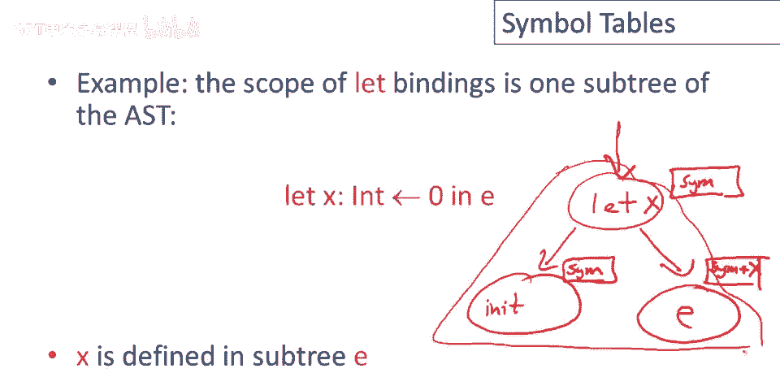
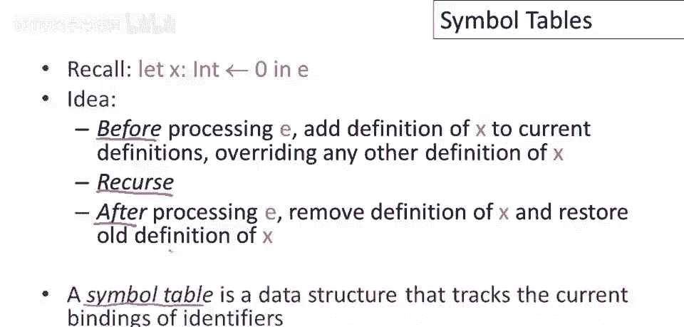
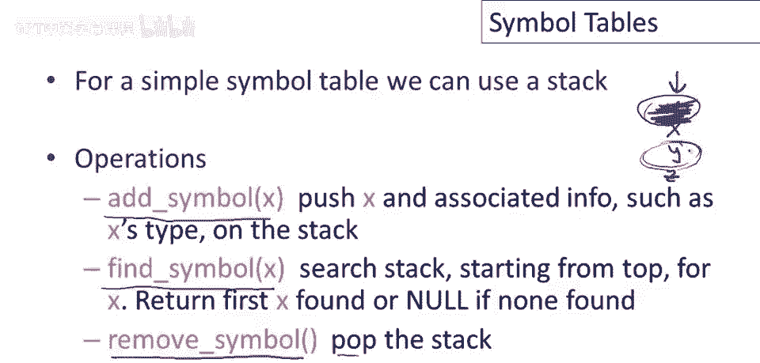
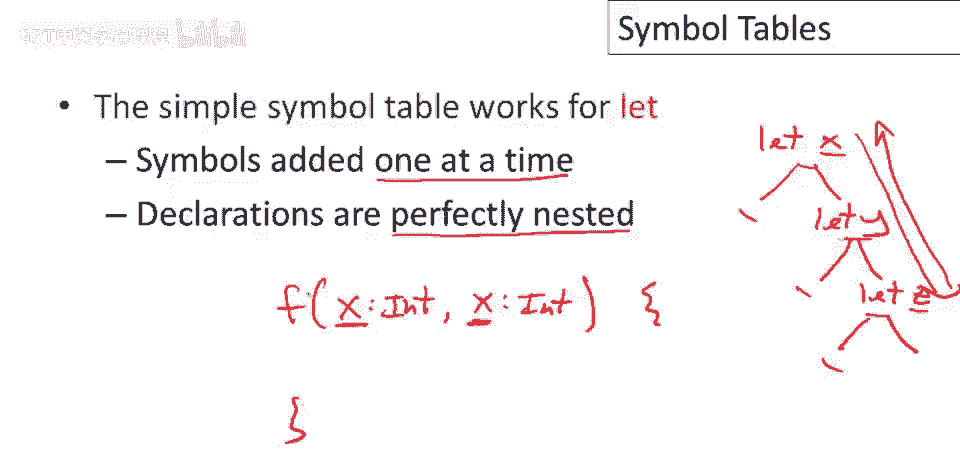
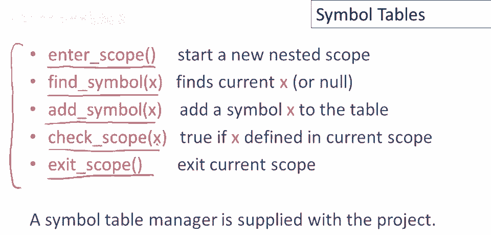
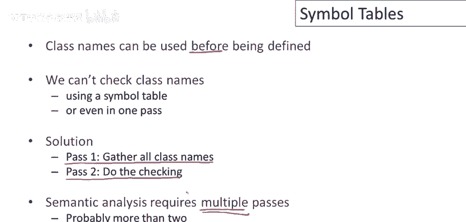

# 编译器设计课程 P44：符号表 🗂️



在本节课中，我们将要学习编译器中的一个核心数据结构——符号表。我们将了解它的基本概念、工作原理、实现方式，以及它在语义分析阶段如何帮助管理程序中的标识符（如变量名、类名）及其作用域。



---

上一节我们介绍了编译器的一般工作流程，本节中我们来看看语义分析中的一个关键工具。

## 符号表与递归下降遍历

许多语义分析和代码生成任务可以表示为对抽象语法树（AST）的递归下降遍历。其基本思想是，在处理树的每个节点时，执行三个步骤：

1.  **前处理**：在访问子节点之前，对当前节点进行一些操作。
2.  **递归处理**：以相同的方式递归处理所有子节点。
3.  **后处理**：在处理完所有子节点后，返回当前节点并进行一些操作。

这种算法被称为**树的自顶向下遍历**。在语义分析中，我们需要知道哪些标识符已被定义，以及它们当前是否在作用域内。符号表就是用来实现这一功能的数据结构。

---



了解了基本算法后，我们来看一个具体的例子，看看符号表如何与递归下降配合工作。

## 符号表应用示例：处理 `let` 表达式

考虑一个 `let` 节点，它包含一个变量 `x` 的初始化表达式和主体表达式 `e`。以下是处理它的递归下降策略：

1.  首先，处理初始化表达式（可能涉及类型检查等）。
2.  然后，在处理主体表达式 `e` 之前，将变量 `x` 添加到当前作用域的符号集合中。
3.  接着，递归处理主体表达式 `e`。
4.  最后，在处理完 `e` 之后，将 `x` 从符号集合中移除。

这样，在离开这个 `let` 子树后，符号表的状态就恢复到了进入它之前的样子。这完美地模拟了局部变量的作用域生命周期。



---

那么，如何具体实现这样一个能跟踪作用域的符号表呢？最简单的方法是使用栈。

## 简单符号表：基于栈的实现



对于一个声明完全嵌套（如多层 `let`）的语言，可以使用栈来实现简单的符号表。它支持三个核心操作：

以下是三个核心操作的伪代码描述：
```pseudocode
操作 push(symbol):        // 添加符号
    将 symbol 及其相关信息（如类型）压入栈顶

操作 lookup(symbol):      // 查找符号
    从栈顶向栈底搜索，返回第一个匹配 symbol 名称的条目

操作 pop():              // 移除符号
    弹出栈顶的符号（离开作用域时调用）
```

这种实现的优点是简单，并且能自动处理**定义隐藏**（内层定义覆盖外层定义）。当离开一个作用域时，只需弹出栈顶元素，外层的定义就会重新可见。

---



然而，栈式符号表有其局限性。当需要处理同一作用域内同时定义多个标识符的情况时，它就力不从心了。

## 增强符号表：支持作用域层级

考虑函数参数列表，多个参数在同一作用域内定义。为了检测“重复定义”这类错误，我们需要一个更强大的符号表接口。

修订后的接口包含以下五个方法：

以下是五个核心方法的描述：
```pseudocode
操作 enterScope():        // 进入新作用域
    压入一个新的、空的作用域到作用域栈顶

操作 exitScope():         // 退出当前作用域
    弹出作用域栈顶的作用域



操作 addSymbol(symbol):   // 添加符号
    将 symbol 添加到当前作用域（栈顶的作用域）中

操作 lookup(symbol):      // 查找符号
    从作用域栈顶向栈底搜索，返回第一个匹配的 symbol

操作 checkScope(symbol):  // 检查当前作用域
    仅检查栈顶的作用域，若 symbol 已存在则返回 true
```

这个结构可以看作一个**作用域栈**，每个栈元素本身是一个容纳该层所有定义的集合。`checkScope` 方法专门用于检查当前作用域内是否有重复定义。

---



最后，我们来讨论一类特殊的标识符——类名，它们的处理方式与普通变量有所不同。

## 类名的特殊处理

与 `let` 变量和函数参数不同，类名允许**前向引用**（即在定义之前使用）。这意味着我们不能通过单次遍历程序来完成所有类名的检查。

解决方案是进行**两次遍历**：

以下是处理类名的两遍扫描策略：
1.  **第一遍**：收集所有类定义，记录下定义的类名。
2.  **第二遍**：检查所有类体的代码，确保使用的类名都在第一遍收集的定义中。

这个例子给我们的启示是：编译器设计不应畏惧增加遍历次数。将复杂任务分解为多个简单步骤（如两遍、三遍扫描），往往比设计一个极度复杂、所有逻辑纠缠在一起的单遍算法更清晰、更易于实现和调试。

---

## 总结



本节课中我们一起学习了符号表这一编译器核心组件。我们了解了它如何与递归下降遍历算法配合，用于管理标识符的作用域和绑定。我们从最简单的栈实现开始，逐步扩展到能处理复杂作用域和重复定义检查的增强版接口。最后，我们还探讨了类名这类需要多遍扫描处理的特殊标识符。理解符号表是构建编译器语义分析阶段坚实的基础。