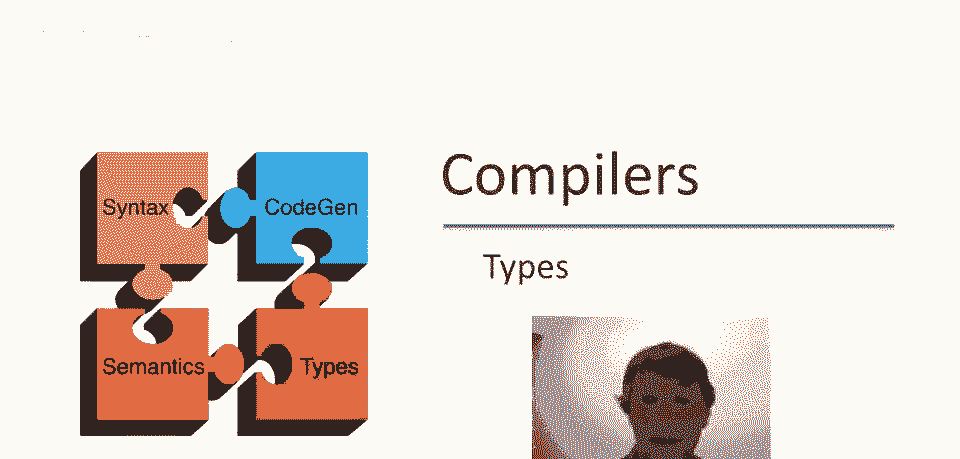
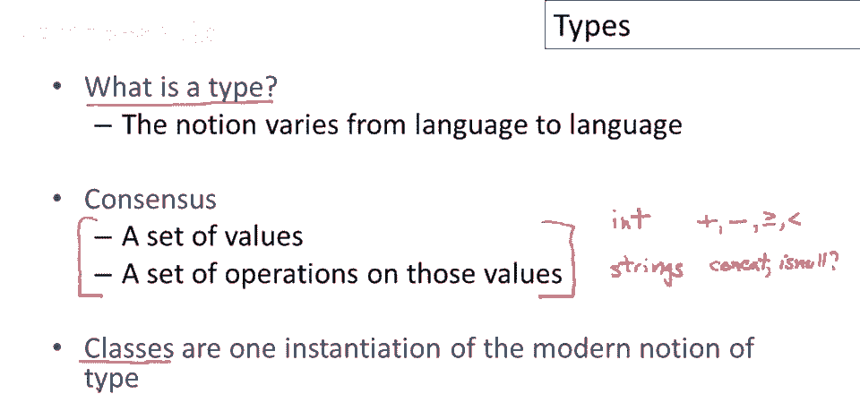
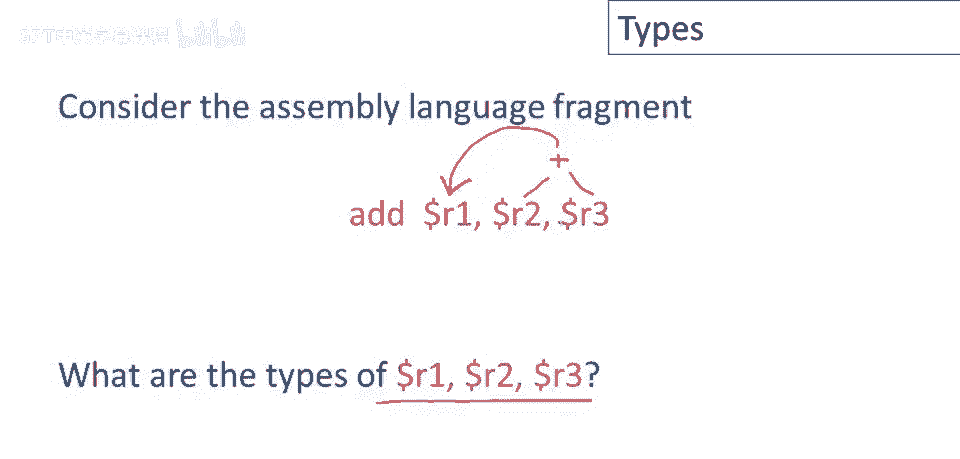
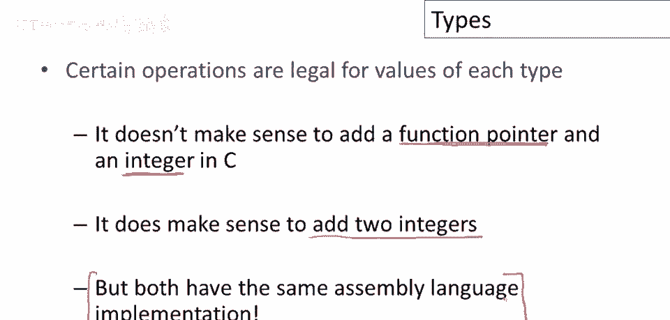
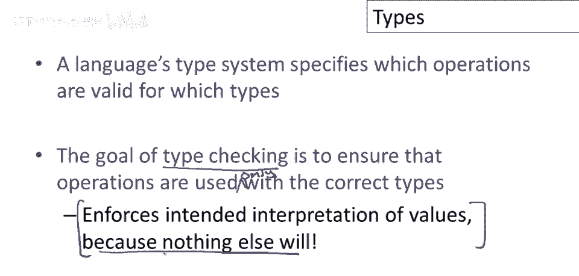
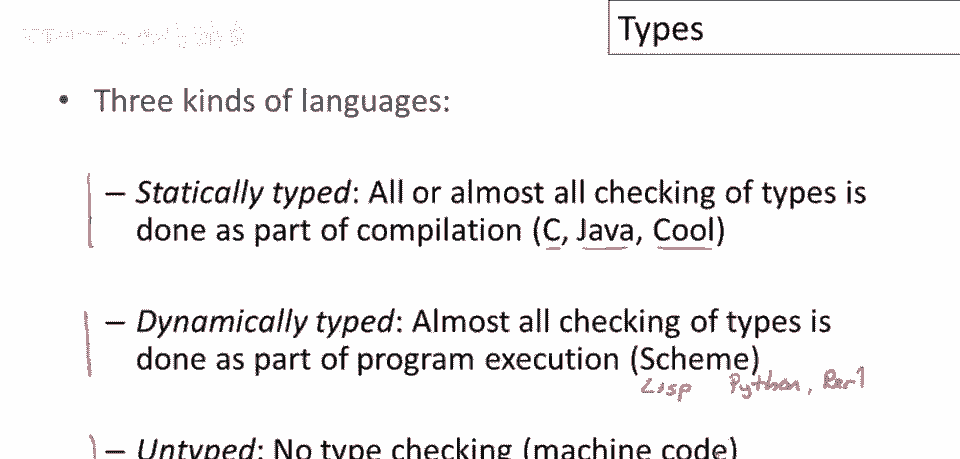
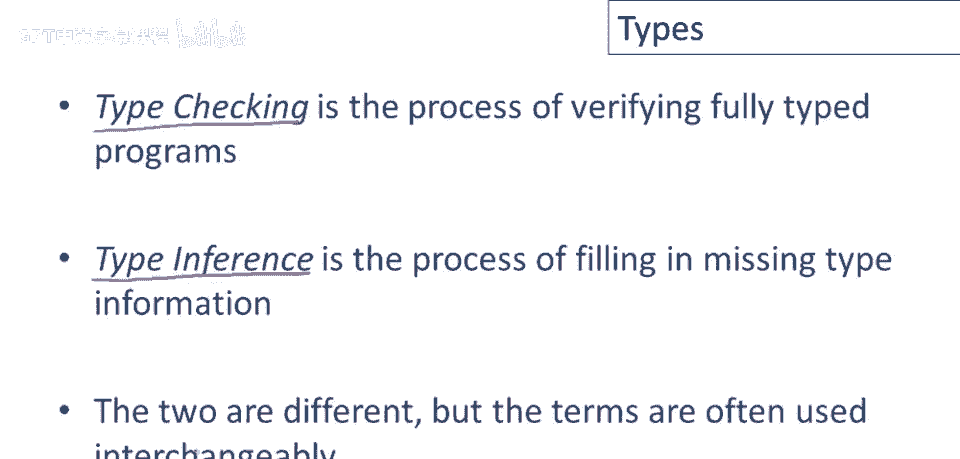

# P45：p45 09-04-_Types - 加加zero - BV1Mb42177J7

欢迎回到本视频。

我们将介绍类型。

一个基本问题是类型是什么，这个问题值得问，因为类型的概念因编程语言而异，大致来说，共识是类型是一组值，更重要的是，一组对这些值独有的操作，一组在这些值上定义的操作，所以，例如，如果我看整数的类型。

你可以对整数执行一些操作，你可以做加法，你可以减整数，你可以比较整数是否大于等于或小于，好的，然后这些操作是，关于数字的，然后字符串有不同类型的操作，它们有像连接和测试的操作，一个字符串是否为空。

你知道还有很多其他函数定义在字符串上，重要的是这些操作不同于整数上定义的操作，我们不想混淆它们，如果我们开始对整数执行字符串操作，例如，我们只会得到无意义的结果，在现代编程语言中，类型以多种方式表达。

在面向对象的语言中，我们经常看到类是类型的概念，所以特别是在Cool中，类名是类型，除了一个例外叫self类型，类名就是类型，我只想指出这不一定是这样，在面向对象语言中，将类和类型等同起来往往很方便。

但还有其他设计，其中类不是唯一的类型，或者它们不是，在一些没有类概念的语言中，类型是完全不同的事物，所以类和类型实际上是两个不同的事物，在大量面向对象语言设计中被识别。

我只想让你知道这不一定是唯一的做法。

考虑汇编语言片段，我加r一，r二，r三，这实际上做了什么，将寄存器r二的值和寄存器r三的值，相加，并将结果放入寄存器r一，问题是r一的类型是什么，r二和r三，你可能希望它们是整数，但实际上这是一个。

这是一个陷阱问题，因为在汇编语言层面，我无法分辨，没有任何东西阻止r一，r二和r三具有任意类型，它们可以是，它们可以是任何类型的代表，因为它们只是一堆包含零和一的寄存器，加法操作将乐于接受它们并相加。

即使没有意义，并产生一个位模式存储到r一，为了使这个更清楚，也许考虑某些对每种类型值合法的操作是有用的，例如，将两个整数相加是完全有意义的，如果我有两个代表整数的位模式，那么当我将它们相加时。

我将得到一个代表这两个整数之和的位模式，但另一方面，如果我取一个函数指针和一个整数，并将它们相加，我真的没有得到任何东西，这是另一个，函数指针是一个位模式，整数是一个位模式，我可以取这两个位模式。

我可以运行它们并通过加法，我确实得到了一个新的位集，但对这个结果没有有用的解释，我得到的结果没有任何意义，但问题是，这两个在汇编语言层面上具有相同的实现，好的，汇编语言层面，这两个操作看起来完全一样。

因此，在汇编语言层面上我无法分辨，我正在做的是哪一个，如果我想有类型，如果我想确保我只对正确的，我只对正确的类型执行某些操作。

那么我需要某种类型描述和一些类型的系统来强制这些区别，所以也许我正在强调这一点，但我觉得这很重要，所以再一次，语言类型系统指定了哪些操作对于哪些类型是有效的，然后类型检查的目标是确保操作仅与。

仅与正确的类型一起使用，只有与正确的类型一起使用，通过类型检查确保值解释，机器码层面无其他检查，仅是许多零和一，机器将执行我们告诉它的操作，无论操作是否合理，类型系统的目的是确保位模式解释。

确保整数位模式不被误用，避免得到无意义结果。

当前编程语言分三类，嗯，关于类型处理，有静态类型语言，编译时检查所有或几乎所有类型，Cool是其中之一，C和Java等语言也是静态类型，然后是动态类型语言，运行时检查几乎所有类型。

Lisp家族语言如Scheme和Lisp在此列，如Python和Perl等我们的语言，你可能使用或听说过至少其中一些语言，最后是无类型语言，完全不检查类型，编译时或运行时，机器码基本如此。

机器码无类型概念，不强制抽象边界，运行数十年。

关于静态与动态类型优劣有争论，不偏袒任何一方，为你列出，各派支持者所说，支持静态类型的人认为，静态检查在编译时捕获许多编程错误，也避免了运行时类型检查的开销，如果在编译时做了所有类型检查，那么。

运行时无需检查类型，进行操作时无需检查，参数是否为正确类型，因为在编译时已彻底检查一次，这些都是绝对正确的，这是静态检查的两个主要优势，首先，证明有些错误不会发生，这些在编译时捕获。

因此我无需担心运行时错误，而且更快，动态类型支持者反驳静态类型系统限制性，本质上静态类型系统必须证明程序类型良好，所有类型有意义，它通过限制可编写的程序类型实现，一些程序在静态类型语言中更难编写。

编译器难以证明其正确，普遍认为快速原型更难，使用静态类型系统，这里的意思是，如果你在原型，如果你在探索某个想法，你可能并不确切知道所有类型，必须承诺某种在所有情况下都能工作的东西，你知道。

有一个类型正确的程序，当你只是在摆弄，并弄清楚你要做什么，这限制很大，工作会慢很多。

那么实际现状如何呢，很多代码是用静态类型语言编写的，人们常用的实用类型语言总有一种逃逸机制，所以在C和Java中，C++，你有一些不安全转换的概念，在C中，不安全转换可能导致运行时崩溃，在Java中。

会导致运行时未捕获异常，当你有不安全或失败的向下转型时，但结果是，现在会因为类型原因出现运行时错误，在动态类型方面，使用动态语言编程的人，他们最终或似乎最终，将静态类型回溯到这些动态类型语言中，因此。

如果动态类型语言变得足够流行，人们开始尝试为它们编写优化编译器，人们想要优化编译器的第一件事是一些类型信息，因为它有助于生成更好的代码，因此，人们最终，回去，尝试弄清如何获取更多类型。

来自这些动态类型语言，一旦他们开始尝试构建，在我看来，是否妥协值得商榷，因为两者都是妥协，静电，或严格动态观点，但这就是我们现在的情况。

实际上，现在Cool是一种静态类型语言，Cool中可用的类型是类名，因此每次你定义一个类，你就定义了一个新类型，以及特殊的保留符号self类型，我们将在单独的视频中讨论它，它自己。

Cool的工作方式是用户声明标识符的类型，对于每个标识符，你需要说明其类型，但编译器完成其余工作，编译器推断表达式的类型，特别是编译器为程序中的每个单个表达式分配类型，我们将遍历整个抽象语法树。

使用标识符的声明类型，它将计算一个类型，嗯。

对于每个表达式和子表达式，总结，值得提及的是，对于计算类型的过程，人们使用了一些不同的术语，它们意味着略有不同，所以更简单的问题是这里所知的类型检查，我们有一个完全类型的程序。

意味着我们有一个抽象语法树，所有节点上都填满了类型，我们唯一的工作是检查类型是否正确，所以我们可以只看每个节点和它的邻居，并确认该部分的类型是正确的，我们可以对树中的每个部分这样做。

并检查程序是否正确类型推断，另一方面，是填充缺失类型信息的过程，所以这里的观点是我们有一个抽象语法树，上面没有类型，或者可能只有一些关键位置的类型，比如声明的变量，然后我们想要填充缺失的类型。

我们有一些节点完全没有类型信息，不仅仅是确认或检查类型是否正确，我们实际上必须填充缺失的类型信息，这两件事是不同的，实际上它们，实际上在许多语言中是非常，非常不同的，但人们经常交替使用这些术语。

我也不会在我的视频中特别小心使用哪个术语。

