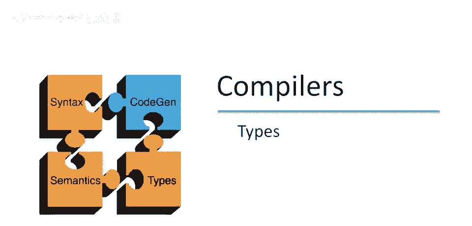
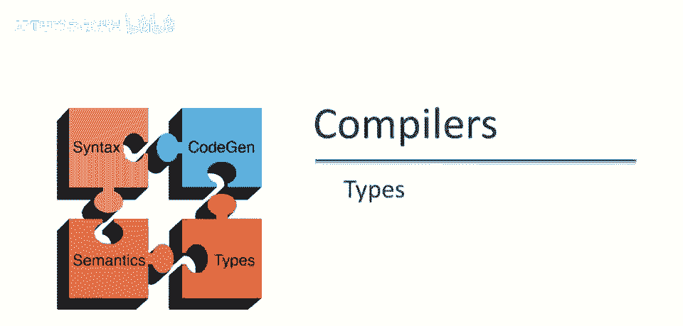
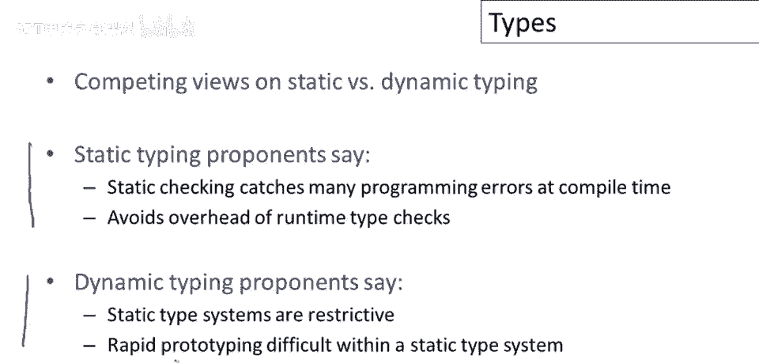
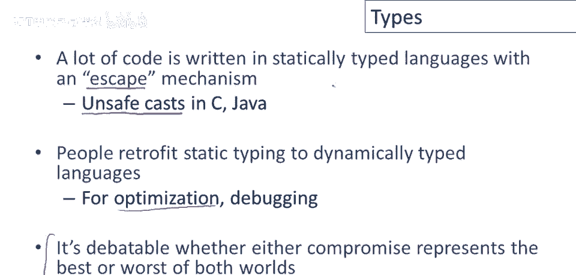
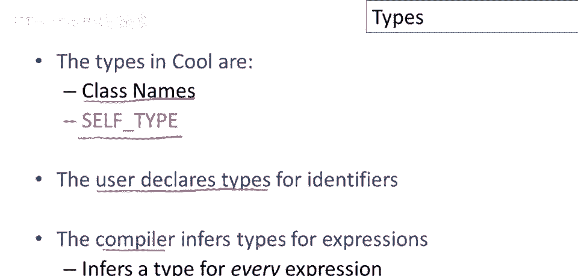

# 课程 P45：类型系统基础 🧩


在本节课中，我们将要学习编程语言中“类型”这一核心概念。我们将探讨类型的定义、不同类型系统的区别，以及它们在语言设计中的作用。



---

## 什么是类型？🤔

上一节我们介绍了本课程的主题，本节中我们来看看“类型”到底是什么。一个基本问题是类型是什么。这个问题值得问，因为类型的概念因编程语言而异。

大致来说，共识是类型是一组值。更重要的是，类型是一组对这些值独有的操作，一组在这些值上定义的操作。

以下是两个核心示例：
*   **整数类型**：你可以对整数执行一些操作，例如加法、减法，以及比较大小（大于、等于或小于）。
*   **字符串类型**：它们有不同类型的操作，例如连接和测试一个字符串是否为空。

重要的是，这些操作不同于整数上定义的操作。我们不想混淆它们。如果我们开始对整数执行字符串操作，我们只会得到无意义的结果。

---


## 类型在语言中的表达方式 🏗️

在现代编程语言中，类型以多种方式表达。在面向对象的语言中，我们经常看到类是类型的概念。特别是在Cool中，类名是类型（除了一个例外叫`self`类型）。

我只想指出这不一定是这样。在面向对象语言中，将类和类型等同起来往往很方便。但还有其他设计，其中类不是唯一的类型。在一些没有类概念的语言中，类型是完全不同的事物。所以类和类型实际上是两个不同的事物，在大量面向对象语言设计中被识别。我只想让你知道这不一定是唯一的做法。


---

## 汇编语言中的类型缺失 ⚠️

考虑以下汇编语言片段：
```assembly
add r1, r2, r3
```
这实际上做了什么？它将寄存器`r2`的值和寄存器`r3`的值相加，并将结果放入寄存器`r1`。

问题是`r1`、`r2`和`r3`的类型是什么？你可能希望它们是整数。但实际上这是一个陷阱问题。因为在汇编语言层面，我无法分辨。没有任何东西阻止`r1`、`r2`和`r3`具有任意类型。它们可以是任何类型的代表，因为它们只是一堆包含零和一的寄存器。加法操作将乐于接受它们并相加。

为了使这个更清楚，也许考虑某些对每种类型值合法的操作是有用的。例如，将两个整数相加是完全有意义的。如果我有两个代表整数的位模式，那么当我将它们相加时，我将得到一个代表这两个整数之和的位模式。

但另一方面，如果我取一个函数指针和一个整数，并将它们相加，我真的没有得到任何东西。函数指针是一个位模式，整数是一个位模式。我可以取这两个位模式，我可以运行它们并通过加法，我确实得到了一个新的位集。但对这个结果没有有用的解释，我得到的结果没有任何意义。


但问题是，这两个操作在汇编语言层面上具有相同的实现。在汇编语言层面上，这两个操作看起来完全一样。因此，在汇编语言层面上我无法分辨我正在做的是哪一个。

---

## 类型系统的必要性 🛡️


如果我想有类型，如果我想确保我只对正确的类型执行某些操作，那么我需要某种类型描述和一些类型的系统来强制这些区别。

所以再一次强调，语言类型系统指定了哪些操作对于哪些类型是有效的。然后类型检查的目标是确保操作仅与正确的类型一起使用。

通过类型检查确保值解释。在机器码层面无其他检查，仅是许多零和一。机器将执行我们告诉它的操作，无论操作是否合理。类型系统的目的是确保位模式解释，确保整数位模式不被误用，避免得到无意义结果。

---


## 编程语言的类型分类 📊

当前编程语言关于类型处理分三类。

以下是三种主要类型系统：
1.  **静态类型语言**：在编译时检查所有或几乎所有类型。Cool是其中之一。C和Java等语言也是静态类型。
2.  **动态类型语言**：在运行时检查几乎所有类型。Lisp家族语言如Scheme和Lisp在此列。如Python和Perl等语言也属于此类。
3.  **无类型语言**：完全不检查类型，编译时或运行时都不检查。机器码基本如此。机器码无类型概念，不强制抽象边界。

---

## 静态类型 vs. 动态类型：争论与现状 ⚖️

关于静态与动态类型优劣有争论。我不偏袒任何一方，为你列出各派支持者所说的观点。



支持静态类型的人认为，静态检查在编译时捕获许多编程错误。也避免了运行时类型检查的开销。如果在编译时做了所有类型检查，那么运行时无需检查类型，进行操作时无需检查参数是否为正确类型。因为在编译时已彻底检查一次。这些都是绝对正确的。这是静态检查的两个主要优势：首先，证明有些错误不会发生；其次，运行更快。

动态类型支持者反驳静态类型系统限制性。本质上静态类型系统必须证明程序类型良好，所有类型有意义。它通过限制可编写的程序类型实现。一些程序在静态类型语言中更难编写，编译器难以证明其正确。普遍认为使用静态类型系统进行快速原型开发更难。这里的意思是，如果你在探索某个想法，你可能并不确切知道所有类型。必须承诺某种在所有情况下都能工作的东西，当你只是在摆弄并弄清楚你要做什么时，这限制很大。

那么实际现状如何呢？很多代码是用静态类型语言编写的。人们常用的实用类型语言总有一种逃逸机制。所以在C和Java中，你有一些不安全转换的概念。在C中，不安全转换可能导致运行时崩溃。在Java中，会导致运行时未捕获异常。但结果是，现在会因为类型原因出现运行时错误。

在动态类型方面，使用动态语言编程的人，他们最终似乎将静态类型回溯到这些动态类型语言中。因此，如果动态类型语言变得足够流行，人们开始尝试为它们编写优化编译器，人们想要优化编译器的第一件事是一些类型信息，因为它有助于生成更好的代码。因此，人们最终尝试弄清如何获取更多类型信息来自这些动态类型语言。

在我看来，是否妥协值得商榷，因为两者都是妥协。但这就是我们现在的情况。



---

## Cool语言中的类型系统 🧊

实际上，现在Cool是一种静态类型语言。Cool中可用的类型是类名。因此每次你定义一个类，你就定义了一个新类型，以及特殊的保留符号`self`类型（我们将在单独的视频中讨论它）。

Cool的工作方式是用户声明标识符的类型。对于每个标识符，你需要说明其类型。但编译器完成其余工作。编译器推断表达式的类型。特别是编译器为程序中的每个单个表达式分配类型。我们将遍历整个抽象语法树，使用标识符的声明类型，它将计算一个类型。



---

## 类型检查与类型推断 🔍

总结时，值得提及的是，对于计算类型的过程，人们使用了一些不同的术语，它们意味着略有不同。

以下是两个相关但不同的概念：
*   **类型检查**：我们有一个完全类型的程序（意味着我们有一个抽象语法树，所有节点上都填满了类型）。我们唯一的工作是检查类型是否正确。所以我们可以只看每个节点和它的邻居，并确认该部分的类型是正确的。
*   **类型推断**：是填充缺失类型信息的过程。这里的观点是我们有一个抽象语法树，上面没有类型，或者可能只有一些关键位置的类型（比如声明的变量），然后我们想要填充缺失的类型。我们有一些节点完全没有类型信息，不仅仅是确认或检查类型是否正确，我们实际上必须填充缺失的类型信息。

这两件事是不同的。实际上在许多语言中是非常不同的，但人们经常交替使用这些术语。我也不会在我的视频中特别小心使用哪个术语。

---


本节课中我们一起学习了编程语言中“类型”的核心概念。我们了解了类型的定义是一组值及其专属操作，探讨了静态类型、动态类型和无类型语言的区别，并分析了它们各自的优缺点。最后，我们介绍了Cool语言作为静态类型语言的实现方式，以及类型检查与类型推断的基本区别。理解类型系统是掌握编程语言设计和实现的关键一步。