# P46：p46 09-05-_Type_Checking - 加加zero - BV1Mb42177J7

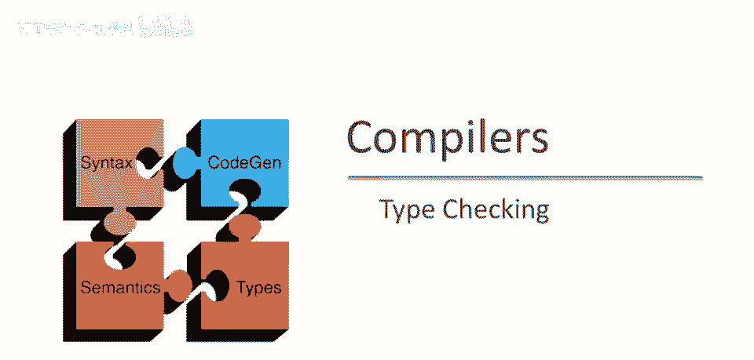

本视频将讨论类型检查。

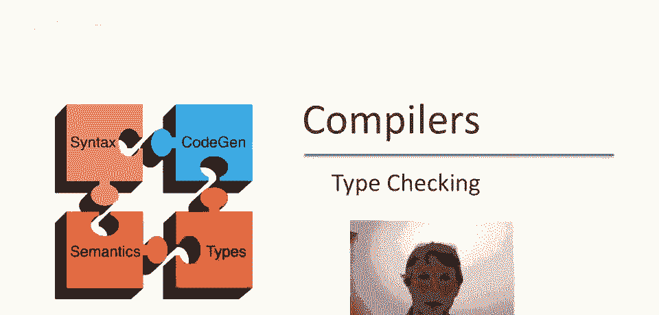

在编译器中，酷，到目前为止，我们已看到两种形式化表示，用于词法分析和解析的上下文无关文法，实际上，还有一种形式已被广泛接受，用于类型检查的逻辑推理规则。

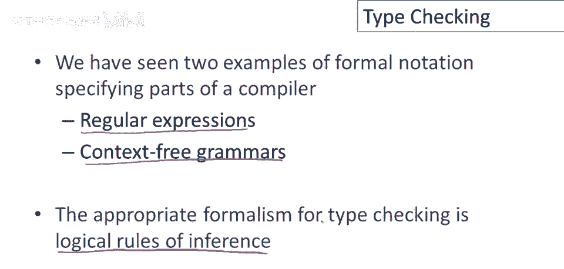

推理规则是逻辑陈述，如果某个假设为真，则某个结论为真，因此，推理规则是蕴含语句，在类型检查中，示例，我们看到的典型推理，如果两个表达式具有某些类型，则另一个表达式保证具有某种类型，显然。

类型检查语句是推理规则的示例，推理规则表示法是编码这些。

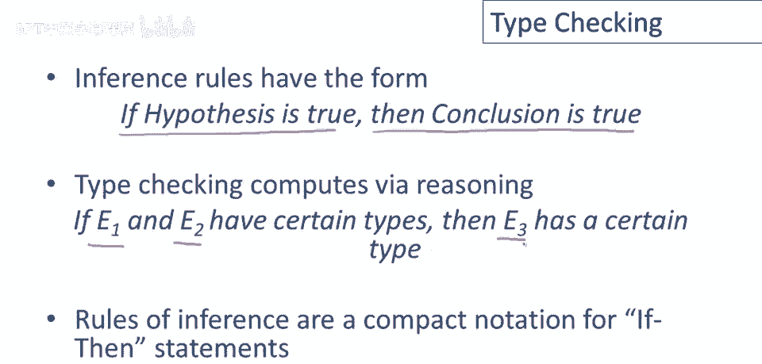

如果-那么语句的简洁方式，如果你以前没见过这种表示法，它会很陌生，但实际上，通过练习很容易读懂，我们将从一个非常简单的系统开始，逐渐添加功能，我们将使用逻辑与表示英语单词，x：t表示x的类型为t。

这是一个逻辑断言，表示x具有特定类型。

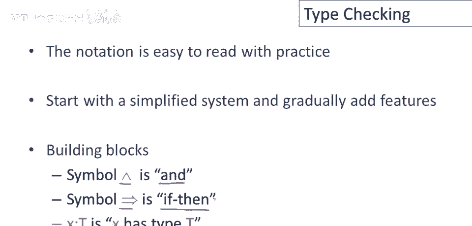

现在考虑以下非常简单的类型规则，如果e1的类型为int，e2的类型为，则e1+e2的类型也为int，我们可以使用上一页的定义，逐渐将其简化为数学陈述，例如，我们可以将如果-那么替换为蕴含。

并将单词和替换为与，现在只剩下这些类型声明，我们有一种表示法，最终得到这个纯数学陈述，表示与e2类型为int的e1类型为int。

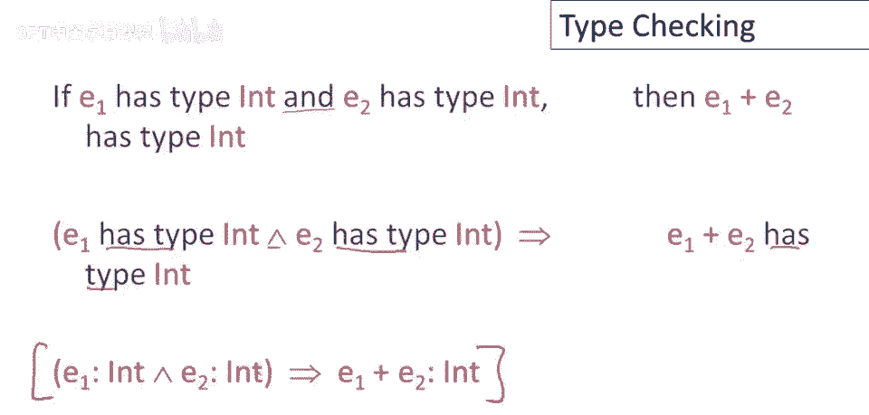

意味着e1+e2的类型为int，注意，我们刚刚写出的陈述是推理规则的特殊情况，是一组假设可以联合起来推导出某个结论。

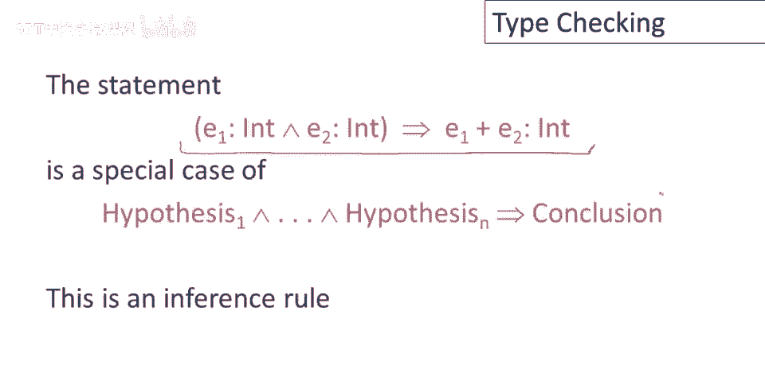

推理规则的常规表示如下，假设写在水平线以上，结论写在水平线以下，与上一页完全相同的意思，即如果水平线以上的所有东西都为真，这些都是假设，则水平线以下的东西可以推断为真，这里有一种新的标记法。

这是用于假设的转义符，结论和转义符被读取，这是可证明的，这意味着我们明确表示某件事是可证明的，在我们定义的规则系统中，所以你会这样读，如果所有这些假设都是可证明的，如果它是可证明的，第一个假设是真的。

所有中间假设，如果最后一个假设是可证明的，那么结论是真的，酷的类型规则将有，以下类型的假设和结论将在系统中证明，某个表达式具有特定类型。

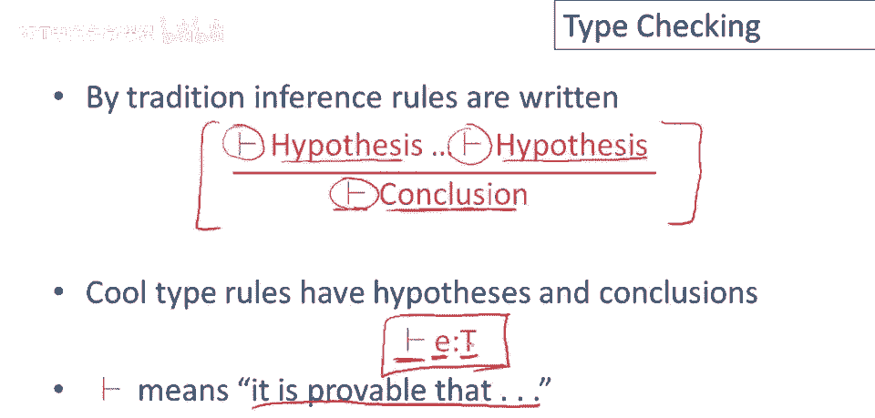

有了这些定义，我们实际上有足够的东西来写至少一些简单的类型规则，如果i是整数字面量，如果它是程序中的整数常数，那么这条规则说i的类型是可证明的，每个整数常数都有类型int。

这是现在用推理规则表示的加法规则，如果e一类型是可证明的int，并且e二类型是可证明的int，那么e一加e二类型是可证明的int。

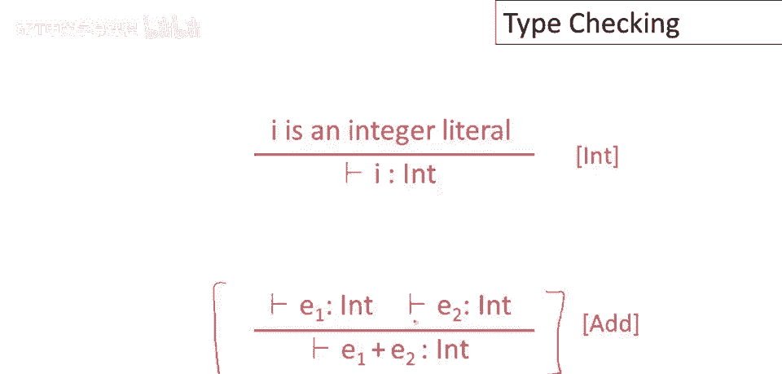

注意这些规则为描述如何类型化整数和表达式提供了模板，整数常数的规则只使用了一个通用的整数，它没有为每个可能的整数提供单独的规则，加法的规则使用了表达式，e一和e二，它没有告诉你什么特定的表达式。

它们是什么，它只是说，给我任何表达式，e一，任何表达式，e一和e二，它们类型是int，所以我们可以插入任何我们想要的表达式，满足假设，然后我们可以为实际表达式产生完整的类型化。

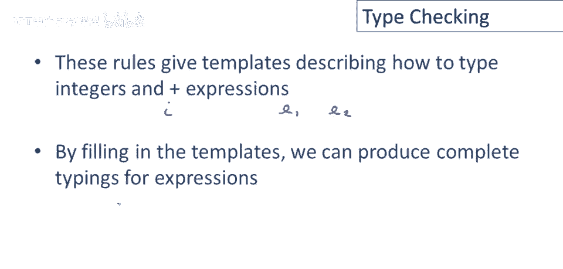

所以作为一个具体例子，让我们展示一加二类型是int，我们想类型化表达式一加二，因为我们知道加法的规则，我们需要构建数字一的类型证明，和数字二的类型证明，我们有一个处理整数常数的规则。

即我们可以证明因为一是整数常数所以类型是int，我们可以证明二是类型int，现在我们有需要的两个假设，我们可以证明1加2的类型为in。

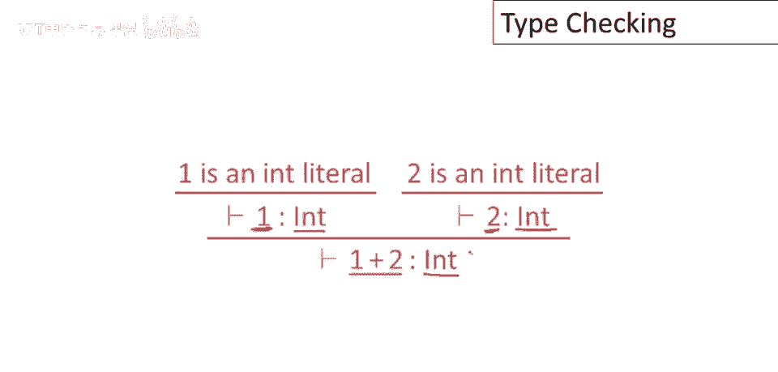

任何合理类型系统的关键属性是它必须是正确的，这是一个正确性条件，我们希望类型系统能证明的表达式具有特定类型，那么如果我实际运行该程序，如果我取e并在计算机上执行，返回的值，运行后返回的值。

实际上具有类型系统预测的类型，所以，如果类型系统能够给出反映运行程序时实际获得值的类型的东西，那么我们可以说类型系统是正确的，显然我们只想要正确的规则，但一些正确的规则实际上比其他规则更好，例如。

如果我有一个整数字面量，并且我想给它一个类型，虽然我之前给你看了最好的可能规则，我们说过i的类型为int，但仅仅说i的类型为object也是正确的，只是不太精确，当然如果我评估一个整数。

我会得到一个对象，因为每个整数和cool都是对象，但这并不十分有用，因为现在我不能做任何整数操作，所以有很多不同的正确规则，对于给定的cool表达式，并不只有一种唯一的正确规则，但其中一些比其他更好。

在整数字面量的例子中，我们真正想要的是整数字面量具有类型int，因为这是我们可以给那种程序的最具体类型，总结：类型检查证明e具有类型t的事实。

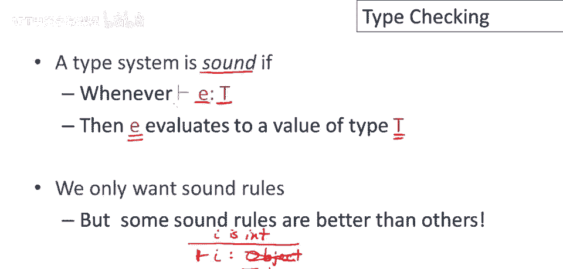

注意，这种证明是基于抽象语法树的结构的，所以对于表达式1加2，我们证明了关于1加2的一些事情，但首先证明了关于每个子表达式的一些事情，所以我们证明了子表达式具有类型in。

然后我们设法证明了整个东西具有类型in，好的，因此，证明与抽象语法树的形状相同，你可以把这个证明看作是一棵树，现在证明树的根在底部，我们通常将抽象语法树以顶部为根绘制，所以这棵树看起来像这样。

而我们通常以相反的方式绘制抽象语法树，但重要的是证明具有抽象语法树的形状。

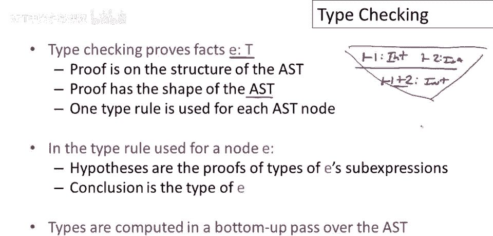

对于每个抽象语法树节点，使用一个类型规则，总结：类型检查证明e具有类型t的事实，所以，证明结构与抽象语法树形状直接对应，抽象语法树特定节点的类型规则，将用于该节点的假设是这些子表达式的证明，因此。

构成E的任何表达式，我们首先需要它们的类型，在该特定节点上的结论将是整个表达式e的类型，这样，你可以看到类型是自下而上计算的，遍历抽象语法树，那就是，我将第一类型分配给叶子，像这样，我知道一个已输入。

两个已输入，然后类型流向根部，我能计算，然后下一级的抽象进入x树等，一旦我计算了节点所有子表达式的类型。

