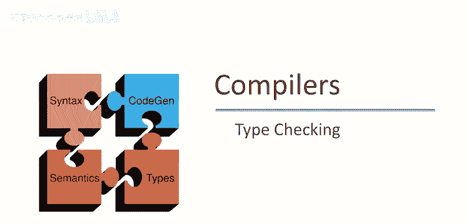
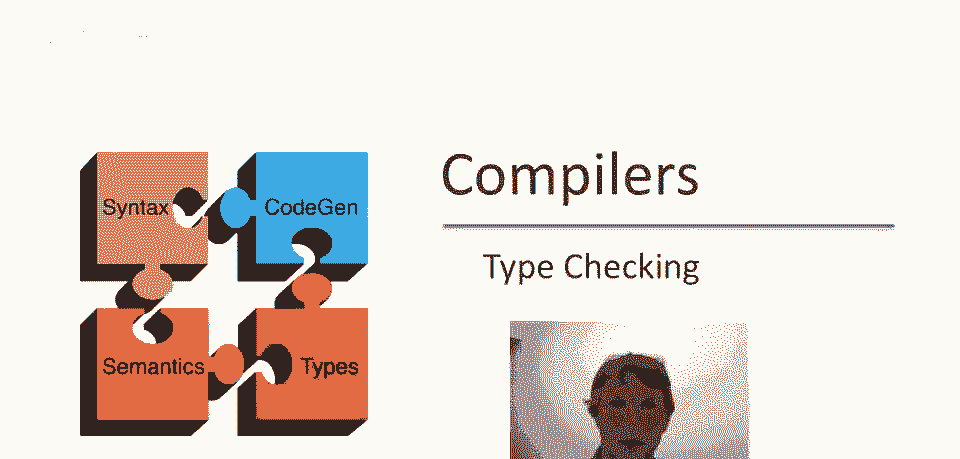
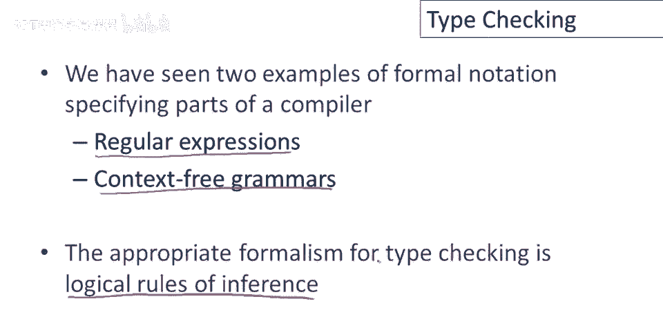
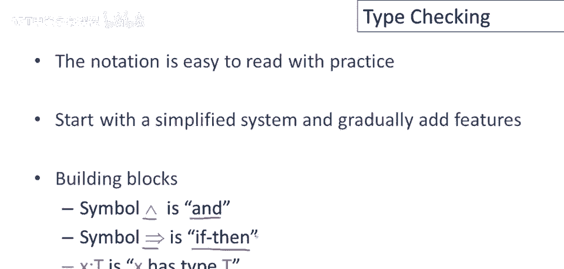
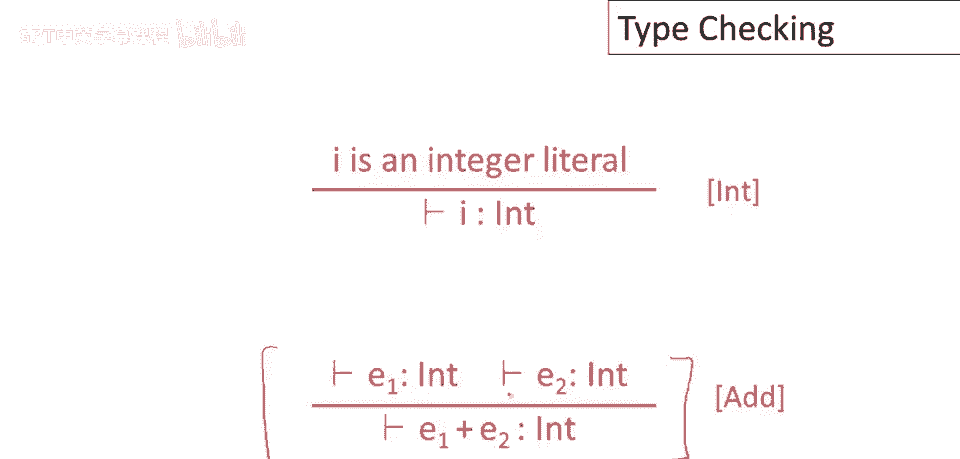
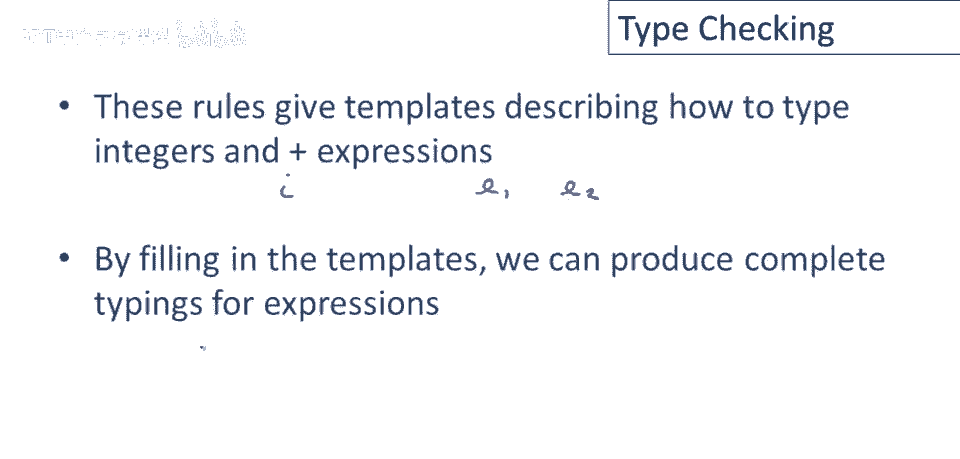
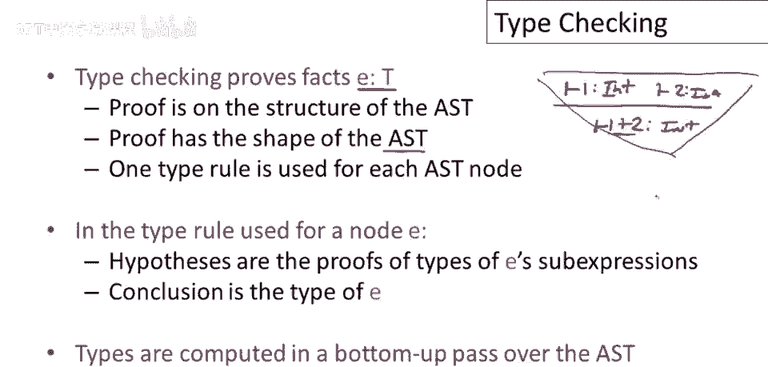

# 编译器原理 P46：类型检查入门 🧠



在本节课中，我们将要学习编译器中的一个核心环节——类型检查。我们将了解如何使用逻辑推理规则来形式化地描述和验证程序中表达式的类型。

---

## 概述



类型检查是编译器确保程序在运行前符合类型规则的过程。它使用一种称为“推理规则”的形式化系统来证明某个表达式具有特定的类型。本节课将介绍推理规则的基本概念、表示方法，并通过简单的例子展示如何构建类型证明。

---

## 推理规则：类型检查的基石


上一节我们介绍了词法分析和语法分析的形式化工具。本节中我们来看看用于类型检查的另一种形式化表示——逻辑推理规则。

推理规则是一种逻辑陈述。它表示：如果某些假设为真，那么某个结论也为真。因此，推理规则本质上是一种蕴含语句。



在类型检查中，典型的推理是：如果两个表达式具有某些类型，则另一个表达式保证具有某种类型。类型检查语句就是推理规则的示例。

---

## 推理规则的表示法

如果你以前没见过这种表示法，可能会感到陌生。但实际上，通过练习很容易读懂。我们将从一个非常简单的系统开始，并逐渐添加功能。


我们使用以下符号：
*   `∧` 表示逻辑“与”（即英语单词“and”）。
*   `x : t` 表示“x的类型为t”。这是一个逻辑断言。

现在考虑一个简单的类型规则：如果 `e1` 的类型为 `int`，并且 `e2` 的类型为 `int`，则 `e1 + e2` 的类型也为 `int`。


我们可以用数学语言逐步重写这个规则：
1.  将“如果-那么”替换为蕴含符号 `⇒`。
2.  将“和”替换为 `∧`。
3.  最终得到一个纯数学陈述：`(e1 : int) ∧ (e2 : int) ⇒ (e1 + e2 : int)`。

这个陈述意味着：`e1` 类型为 `int` 与 `e2` 类型为 `int` 同时成立，蕴含着 `e1 + e2` 的类型为 `int`。

---

## 推理规则的标准格式

我们刚刚写出的陈述是推理规则的一种特殊情况：一组假设联合起来可以推导出某个结论。


推理规则的常规表示法如下：

```
    假设1, 假设2, ..., 假设n
    ————————————————————————————
                结论
```

水平线以上的所有内容是假设，水平线以下是结论。其含义与上一页完全相同：如果水平线以上的所有假设都为真，那么水平线以下的结论可以推断为真。

这里引入一种新的标记法：`⊢`（读作“可证明的”）。它明确表示某件事在定义的规则系统中是可证明的。因此，规则可以这样读：如果所有假设都是可证明的，那么结论也是可证明的。



在类型检查系统中，我们将证明的假设和结论都具有“某个表达式具有特定类型”的形式，即 `⊢ e : t`。

---

## 编写简单的类型规则

有了这些定义，我们现在可以编写一些简单的类型规则了。



以下是两个核心规则：

1.  **整数字面量规则**：如果 `i` 是一个整数字面量（即程序中的整数常量），那么它的类型是可证明的 `int`。
    ```
        i 是整数字面量
        ——————————————————
        ⊢ i : int
    ```
    这条规则表示：每个整数常量都有类型 `int`。

2.  **加法规则**：如果 `e1` 的类型是可证明的 `int`，并且 `e2` 的类型也是可证明的 `int`，那么 `e1 + e2` 的类型是可证明的 `int`。
    ```
        ⊢ e1 : int,   ⊢ e2 : int
        ——————————————————————————
            ⊢ e1 + e2 : int
    ```


注意，这些规则是描述如何为表达式赋予类型的模板。它们使用通用的表达式（如 `e1`, `e2`）和字面量（如 `i`），而不是为每个具体的值或表达式单独制定规则。

---

## 构建类型证明：一个例子

让我们通过一个具体例子来展示如何应用这些规则。我们想证明表达式 `1 + 2` 具有类型 `int`。

证明过程如下：
1.  根据**整数字面量规则**，因为 `1` 是整数字面量，所以可证 `⊢ 1 : int`。
2.  同样，因为 `2` 是整数字面量，所以可证 `⊢ 2 : int`。
3.  现在，我们有了**加法规则**所需的两条假设（`⊢ 1 : int` 和 `⊢ 2 : int`）。
4.  应用加法规则，我们可以得出结论：`⊢ 1 + 2 : int`。

这个证明过程与表达式的抽象语法树（AST）结构完全对应。

---

## 类型系统的正确性与精确性

任何合理的类型系统都必须满足一个关键属性：**正确性**。


正确性条件是指：如果类型系统能够证明某个表达式 `e` 具有类型 `t`，那么当实际运行该程序并计算表达式 `e` 时，返回的值确实具有类型 `t`。我们希望类型系统的预测能反映程序运行时的实际情况。

显然，我们只想要正确的规则。但需要注意的是，对于同一个表达式，可能存在多个都“正确”但“精确度”不同的规则。

例如，对于整数字面量 `i`：
*   **更精确的规则**：`⊢ i : int`（最佳规则）。
*   **正确但不精确的规则**：`⊢ i : Object`。因为在 COOL 语言中，每个整数都是对象，所以这个结论也正确，但它丢失了“这是一个整数”的具体信息，导致后续无法进行整数特有的操作。

因此，在众多正确的规则中，我们通常选择能给出**最具体类型**的那一个。对于整数字面量，最具体的类型就是 `int`。



---

## 总结：类型证明与抽象语法树

本节课中我们一起学习了类型检查的基本原理。

总结如下：
1.  **类型检查**的本质是证明表达式 `e` 具有类型 `t` 的事实。
2.  这种证明是**基于抽象语法树（AST）的结构**自底向上进行的。
3.  证明过程构成一棵“证明树”，其形状与 AST 相同，但根在底部（结论）。
4.  对于 AST 中的每个节点，我们应用一个类型规则。该规则的假设是其子表达式的类型证明，结论是该节点整个表达式的类型。
5.  类型信息从叶子节点（如字面量）开始计算，然后流向根节点。

通过这种方式，编译器可以遍历整个 AST，为每个表达式分配合适的类型，从而在程序运行前发现潜在的类型错误。

---