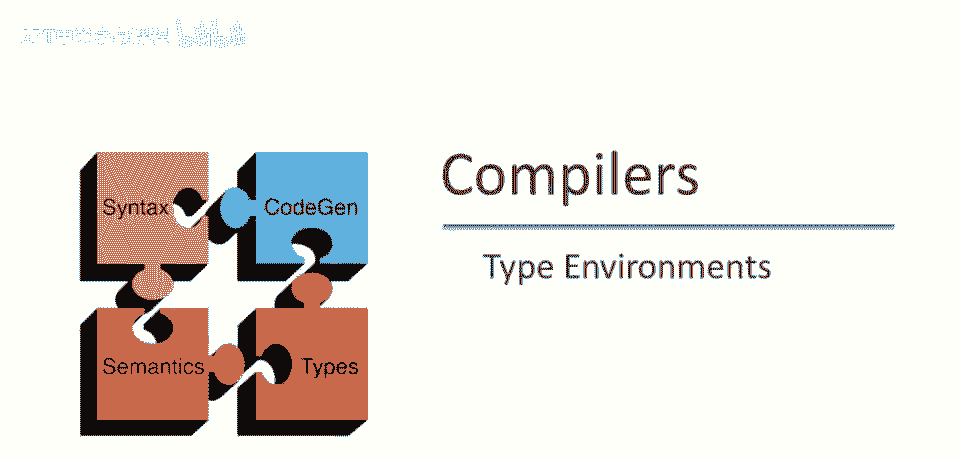

# 课程 P47：类型环境 🧭

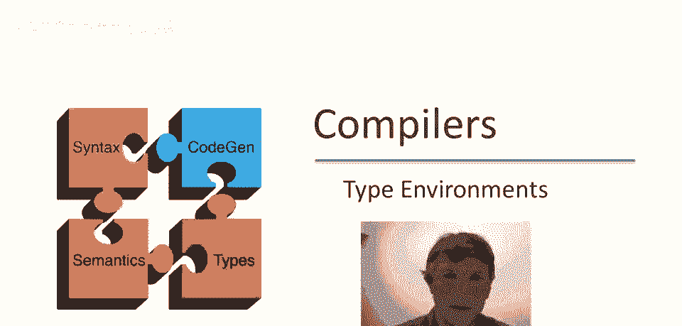

在本节课中，我们将继续开发 Cool 语言的类型检查器，并重点讨论一个核心概念——**类型环境**。我们将学习如何通过类型环境来记录和管理程序中自由变量的类型信息，从而能够为包含变量的表达式赋予类型。

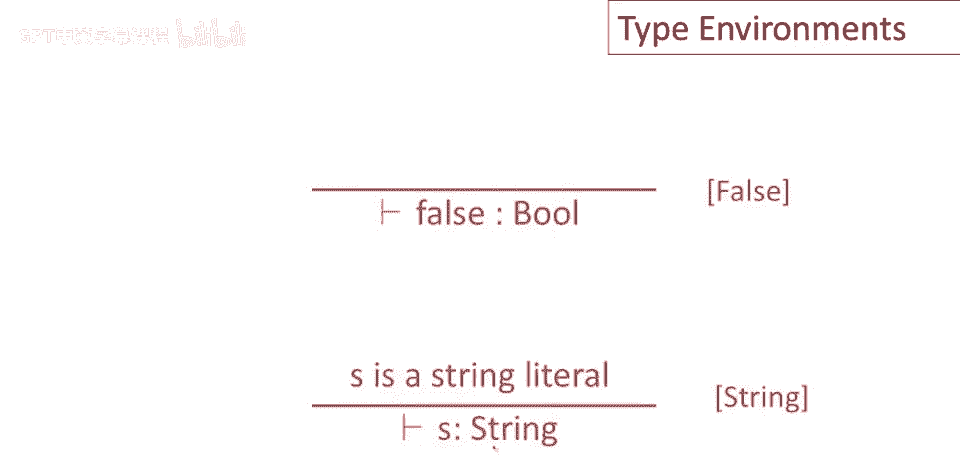

---

上一节我们介绍了为常量、`new`表达式等定义类型规则。本节中，我们来看看如何处理包含变量的表达式，并引入类型环境的概念。

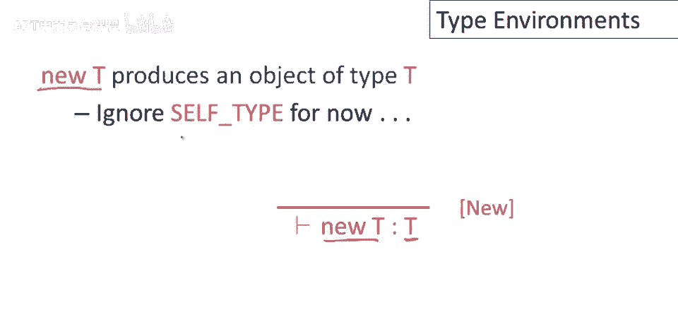

## 更多基础类型规则

以下是几个基础表达式的类型规则：

*   **常量 `false`**：可证明常量 `false` 的类型为 `Bool`。
    *   **规则**：`|- false : Bool`
*   **字符串字面量 `s`**：可证明其类型为 `String`。
    *   **规则**：`|- s : String`
*   **`new` 表达式**：表达式 `new T` 产生类型为 `T` 的对象。
    *   **规则**：`|- new T : T`
    *   *注：此处暂时忽略 `SELF_TYPE`，后续课程会专门处理。*
*   **布尔补运算**：若表达式 `e` 的类型为 `Bool`，则 `not e` 的类型也为 `Bool`。
    *   **规则**：`|- e : Bool` => `|- not e : Bool`
*   **`while` 循环**：这是目前较复杂的规则。`while e1 loop e2 pool` 中，`e1` 是循环条件，`e2` 是循环体。
    *   `e1` 的类型必须为 `Bool`。
    *   `e2` 可以是任意类型 `T`，但其具体类型不重要。
    *   整个 `while` 表达式的类型为 `Object`。这是一个设计决定，目的是避免程序员依赖循环体可能不产生的值（例如，当首次进入循环时条件 `e1` 就为 `false`，`e2` 根本不会执行），从而防止运行时错误。

到目前为止，我们为每个已查看的语言结构定义了合理的类型规则。但现在我们遇到了一个问题。

## 变量类型的问题

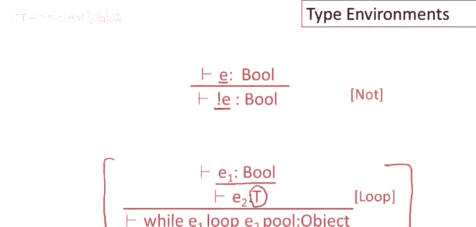

假设有一个仅包含单个变量名 `x` 的表达式。这是一个完全有效的表达式，但问题在于：**仅查看 `x` 本身，我们无法确定它的类型**。

推理规则要求所有信息都必须是局部的。执行规则所需的一切都必须在规则本身中体现，不能依赖外部数据结构。目前，我们的规则中还没有包含如何确定变量类型的信息。

解决方案是向规则中添加更多信息，这就是**类型环境**。

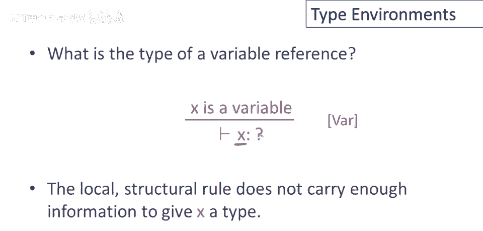

## 引入类型环境

**类型环境**为表达式中的**自由变量**提供类型信息。

*   **自由变量**：在一个表达式中，如果一个变量没有在该表达式内部被定义（例如，通过 `let` 绑定），那么它就是该表达式的自由变量。
    *   例如，在表达式 `x + y` 中，如果 `x` 和 `y` 都没有在表达式内部定义，那么它们都是自由变量。
    *   在表达式 `let y: Int <- 5 in x + y` 中，`y` 在内部被定义，因此是**绑定变量**；`x` 未被定义，因此是**自由变量**。

类型环境本质上是一个从**变量名（对象标识符）映射到类型**的函数。我们通常用符号 `O` 来表示一个类型环境。

现在，我们将扩展我们的证明逻辑语句。原来的 `|- e : T` 表示“可证明表达式 `e` 具有类型 `T`”。现在我们将它扩展为：

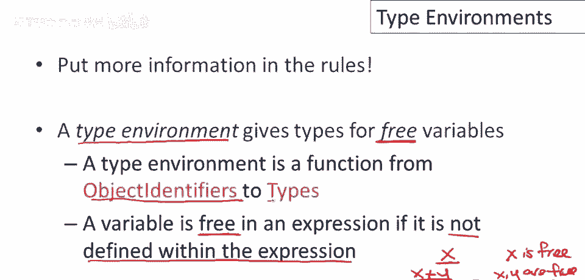

```
O |- e : T
```

这个符号应解读为：**在假设自由变量的类型由环境 `O` 给出的前提下，可证明表达式 `e` 具有类型 `T`**。它很好地区分了输入（假设 `O`）和输出（证明 `e : T`）。

## 更新现有规则

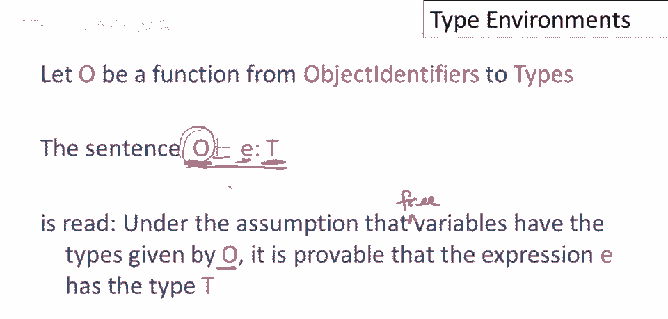

我们需要将类型环境添加到所有现有的规则中。

*   **整数字面量**：即使有关于变量类型的假设，整数字面量的类型也不变。
    *   **规则**：`O |- 5 : Int`
*   **加法表达式**：对于表达式 `e1 + e2`，我们需要在相同的环境 `O` 下分别检查 `e1` 和 `e2` 的类型。
    *   **规则**：如果 `O |- e1 : Int` 且 `O |- e2 : Int`，那么 `O |- e1 + e2 : Int`。

## 新的变量规则

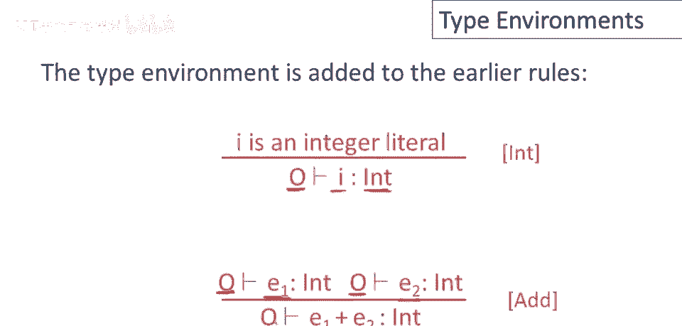

有了类型环境，自由变量的问题就迎刃而解了。要确定变量 `x` 的类型，只需在环境 `O` 中查找。

*   **变量引用**：如果环境 `O` 中包含 `x : T` 的映射，那么就可以证明 `x` 具有类型 `T`。
    *   **规则**：`O |- x : T` （当 `O(x) = T` 时）

## `let` 表达式的规则

`let` 表达式引入了一个新的变量绑定，这会影响类型环境。回顾一下，`let x: T0 <- e0 in e1` 的作用是：声明一个新变量 `x`（类型为 `T0`，初始值为 `e0`），该变量在表达式 `e1` 中可见。

如何类型检查 `e1`？我们需要在一个**修改后的环境**中检查它。

*   **规则**：
    1.  首先，在原始环境 `O` 下检查初始化表达式 `e0`，确保其类型为 `T0`：`O |- e0 : T0`。
    2.  然后，为了检查 `e1`，我们创建一个新的环境 `O[x -> T0]`。这个新环境是原始环境 `O` 的扩展，它将变量 `x` 映射到类型 `T0`，而其他变量的映射保持不变。
    3.  在这个新环境下检查 `e1`，得到其类型 `T1`：`O[x -> T0] |- e1 : T1`。
    4.  整个 `let` 表达式的类型就是 `e1` 的类型 `T1`。

**形式化规则**：
```
O |- e0 : T0     O[x -> T0] |- e1 : T1
--------------------------------------
      O |- let x: T0 <- e0 in e1 : T1
```

这个规则体现了类型环境的一个重要特点：**类型环境从抽象语法树（AST）的根部向下传递到叶子**。当我们遇到像 `let` 这样的定义时，类型环境会用新的定义进行扩展。因此，随着我们向 AST 的叶子节点移动，环境会不断增长。而**类型则是从叶子向上计算到根**，我们从简单的叶节点（如常量）开始获取类型，或根据环境查找变量的类型，然后根据规则组合出更复杂表达式的类型。

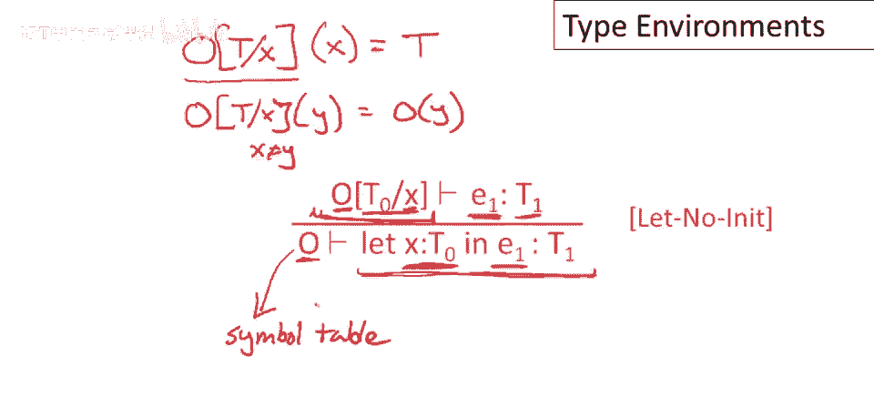

---

## 总结

本节课中，我们一起学习了：

1.  **类型环境**的核心作用：为当前作用域中的**自由变量**提供类型信息。没有这些信息，我们无法对包含变量的表达式进行有意义的类型检查。
2.  类型环境的形式化定义：它是一个从变量名到类型的映射函数（`O`）。
3.  如何使用类型环境：通过形如 `O |- e : T` 的断言，在给定环境 `O` 的前提下推导表达式 `e` 的类型 `T`。
4.  类型环境在 AST 遍历过程中的动态变化：它从根向下传递并随着变量定义的引入而扩展；类型信息则从叶子向上计算并汇总。
5.  类型环境实质上形式化了编译器符号表所携带的信息，是连接变量声明与其使用点的关键桥梁。

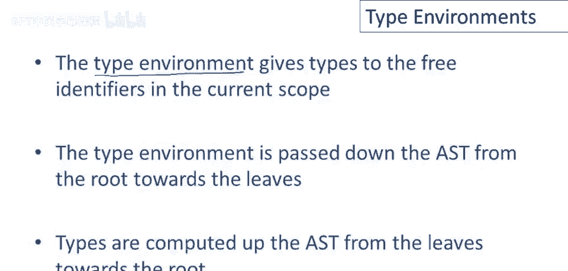

理解类型环境是构建任何静态类型检查器的基石。在接下来的课程中，我们将利用这个概念来处理更复杂的语言特性。