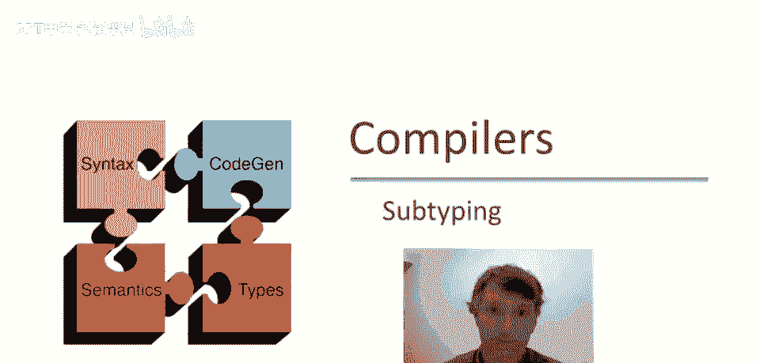
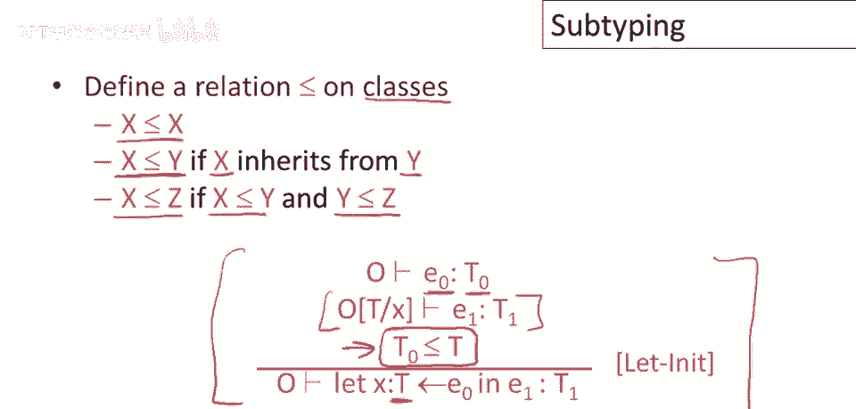
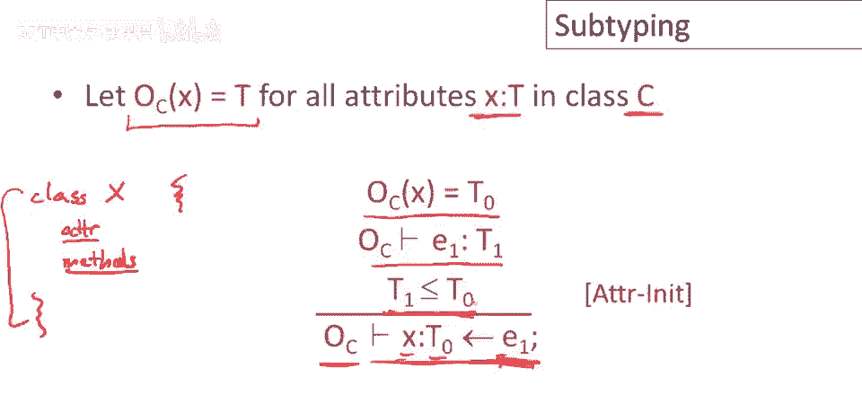
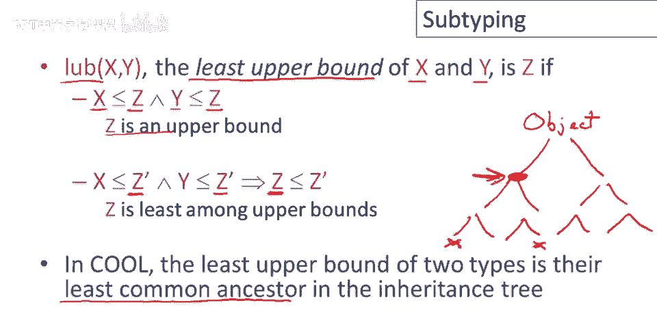
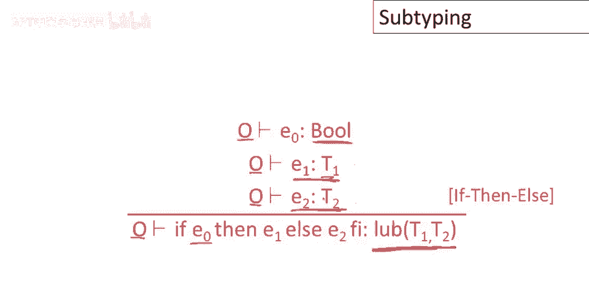

# 课程 P48：子类型化 🧬



在本节课中，我们将要学习面向对象编程中的一个核心概念——子类型化。我们将探讨它在类型系统中的作用，以及如何利用它来编写更灵活、更强大的类型检查规则。

---

## 从 Let 初始化规则开始

上一节我们介绍了基本的 `let` 表达式规则。本节中，我们来看看当 `let` 语句包含初始化器时，规则会发生什么变化。

首先，规则的主体部分与之前几乎完全相同。我们在类型环境 `Γ` 中检查表达式 `e1`，并得到类型 `t1`，这将是整个表达式的类型。

新的部分在于对初始化器的检查。以下是其工作原理：


1.  我们在环境 `Γ` 中检查初始化表达式 `e0`，得到其类型 `t0`。
2.  请注意，新定义的变量 `x` 在 `e0` 中并不可用。如果 `e0` 中使用了名称 `x`，它引用的是 `let` 语句外部定义的 `x`。
3.  此规则的核心要求是：**`e0` 的类型 `t0` 必须与变量 `x` 声明的类型 `T` 完全相同**。

这个规则相当严格，因为它要求初始化器的类型必须与变量声明的类型精确匹配。

---

## 引入子类型关系

如果我们引入类之间的子类型关系，就能制定出更宽松且依然正确的规则。

最明显的子类型形式基于类的继承：
*   如果类 `X` 直接继承自类 `Y`（即代码中有 `X inherits Y`），那么 `X` 是 `Y` 的子类型。
*   子类型关系具有传递性：如果 `X` 是 `Y` 的子类型，且 `Y` 是 `Z` 的子类型，那么 `X` 也是 `Z` 的子类型。
*   子类型关系具有自反性：每个类都是其自身的子类型。



利用子类型，我们可以改进 `let` 的初始化规则。新规则如下：

1.  规则主体部分的处理与之前完全一致。
2.  我们检查初始化表达式 `e0`，得到其类型 `t0`。
3.  新规则只要求：**`t0` 必须是 `T` 的子类型**（记作 `t0 ≤ T`）。

这里的 `T` 是变量 `x` 声明的类型。这个更宽松的规则允许 `e0` 的类型与 `x` 的类型不同，只要前者是后者的子类型即可。因此，更多程序能够通过类型检查并正确运行。

---

## 子类型在其他规则中的应用

子类型化概念会出现在类型系统的许多地方。接下来，我们看看它在赋值和属性初始化规则中的作用。

### 赋值规则



赋值规则在很多方面与 `let` 规则相似。对于语句 `x <- e1`：

1.  在环境 `Γ` 中查找变量 `x` 的类型，得到 `t0`。
2.  在相同的环境 `Γ` 中检查表达式 `e1`，得到其类型 `t1`。
3.  为了使赋值正确，`x` 必须能够持有类型 `t1` 的值。因此，约束条件是：**`x` 的类型 `t0` 必须是 `t1` 的超类型**（即 `t1 ≤ t0`）。

### 属性初始化规则


在类定义中初始化属性时，规则与普通赋值非常相似，主要区别在于检查时所处的环境。

回忆一下，COOL 语言中的类定义包含属性和方法。一个属性定义如下所示：
```cool
x : T <- e1;
```
属性初始化表达式 `e1` 的类型检查在一个特殊的环境 `Γ_{sub C}` 中进行，这个环境记录了类 `C` 中所有已声明属性的类型。

检查过程如下：
1.  在环境 `Γ_{sub C}` 中查找属性 `x` 的类型为 `t0`。
2.  在相同环境中检查初始化表达式 `e1`，得到其类型 `t1`。
3.  与赋值类似，要求 **`t1` 是 `t0` 的子类型**（即 `t1 ≤ t0`）。

---

## 条件表达式的类型检查



现在看另一个有趣的例子：如何检查 `if-then-else` 表达式的类型。

关于 `if-then-else` 重要的是，在类型检查时，我们无法知道程序运行时将执行哪个分支。因此，整个 `if` 表达式的类型必须是两个分支类型的某种“公共”类型。

最好的做法是取两个分支类型的**最小上界**。两个类型 `X` 和 `Y` 的最小上界 `Z`（记作 `Z = lub(X, Y)`）满足：
*   `Z` 是 `X` 和 `Y` 的上界（即 `X ≤ Z` 且 `Y ≤ Z`）。
*   `Z` 是所有上界中最小的一个（即对于任何其他上界 `Z‘`，有 `Z ≤ Z’`）。

在 COOL 和大多数面向对象语言中，两个类型的最小上界就是它们在继承树中的**最近共同祖先**。

基于此，我们可以给出 `if-then-else` 的类型检查规则：
1.  所有子表达式都在相同的环境 `Γ` 中进行类型检查，因为 `if` 表达式不会改变环境。
2.  条件表达式 `e0` 必须具有布尔类型 `Bool`。
3.  检查 `then` 分支 `e1`，得到类型 `t1`。
4.  检查 `else` 分支 `e2`，得到类型 `t2`。
5.  整个 `if` 表达式的类型就是 `t1` 和 `t2` 的最小上界：`lub(t1, t2)`。



---

## Case 表达式的类型检查

`case` 表达式的规则是我们目前见过最复杂的，但它本质上是 `if-then-else` 的一个变体。让我们先回顾一下 `case` 的作用：

1.  它计算表达式 `e0` 的值。
2.  获取 `e0` 的运行时类型（动态类）。
3.  按顺序检查各个分支 `(x1 : T1 => e1, ..., xn : Tn => en)`。
4.  选择第一个其声明类型 `Ti` 是 `e0` 运行时类型的超类型，并且是所有匹配分支中最具体的（即最小超类型）的那个分支。
5.  执行该分支，将变量 `xi` 绑定到 `e0` 的值（并将其类型视为 `Ti`），然后计算表达式 `ei`。

其类型检查规则如下：
1.  首先，在环境 `Γ` 中检查表达式 `e0`，得到其静态类型 `t0`。
2.  对于每个分支 `(xi : Ti => ei)`：
    *   创建一个扩展的环境 `Γ‘ = Γ ∪ {xi : Ti}`。
    *   在这个新环境 `Γ‘` 中检查分支体 `ei`，得到类型 `ti‘`。
3.  由于在编译时无法确定运行时将匹配哪个分支，整个 `case` 表达式的类型就是所有分支体类型 `t1‘, t2‘, ..., tn‘` 的**最小上界**（`lub`）。

---

## 总结

本节课中，我们一起学习了子类型化这一核心概念。我们看到了如何利用类之间的继承关系来定义子类型，从而使类型系统更加灵活。具体内容包括：

*   改进了 `let` 语句的初始化规则，允许初始化器类型是变量声明类型的子类型。
*   将子类型应用于赋值规则和类属性初始化规则。
*   学习了如何为 `if-then-else` 和 `case` 这类条件表达式确定类型，即通过计算分支类型的最小上界。
*   理解了最小上界在继承树中对应的是最近共同祖先。


掌握子类型化是理解面向对象语言类型系统如何支持多态和代码复用的关键。