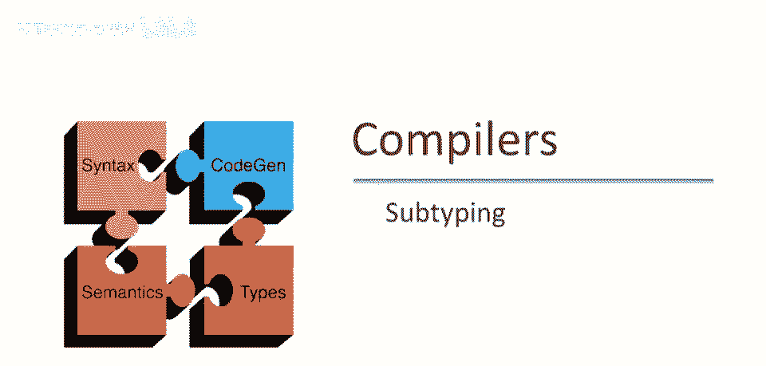
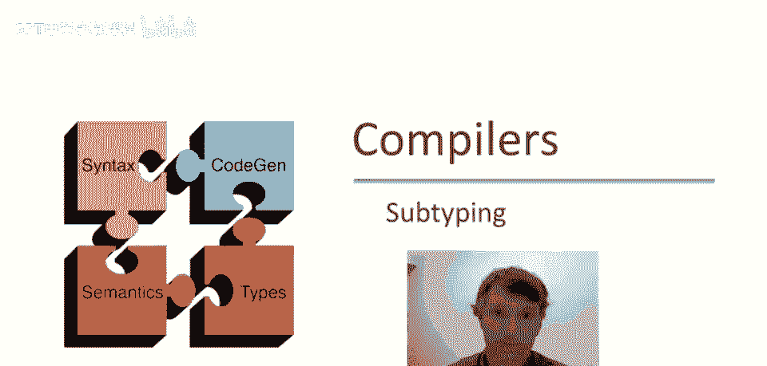
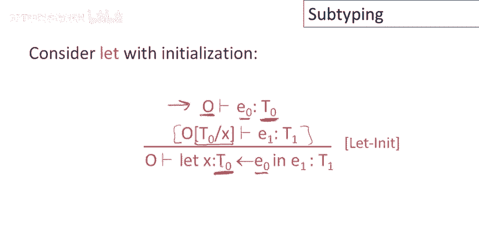
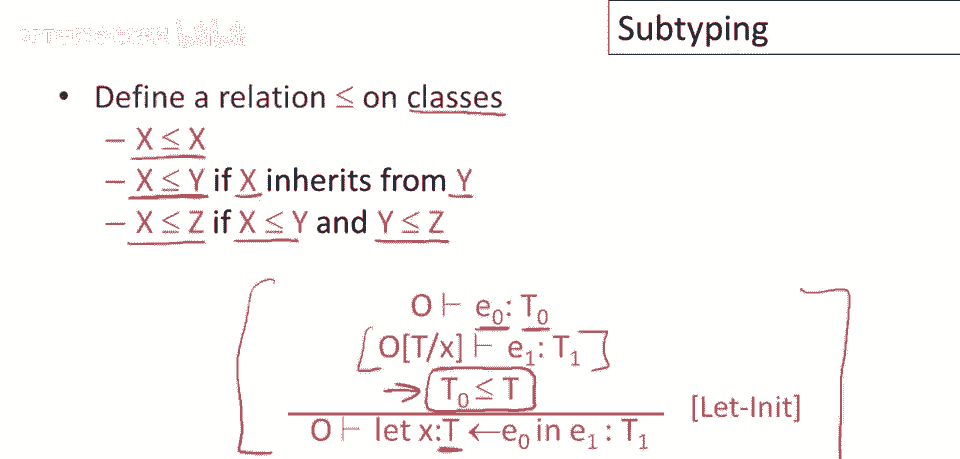
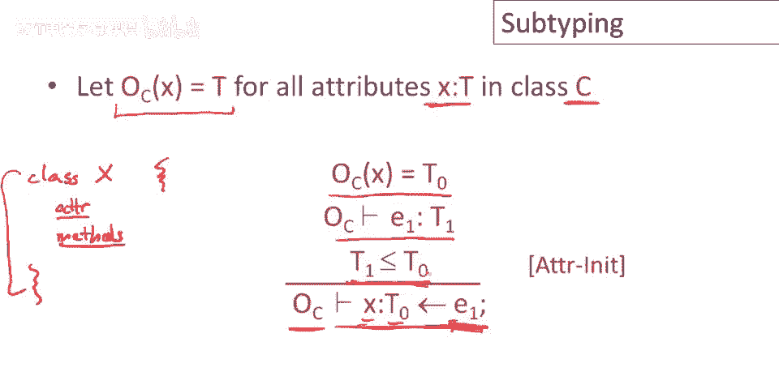
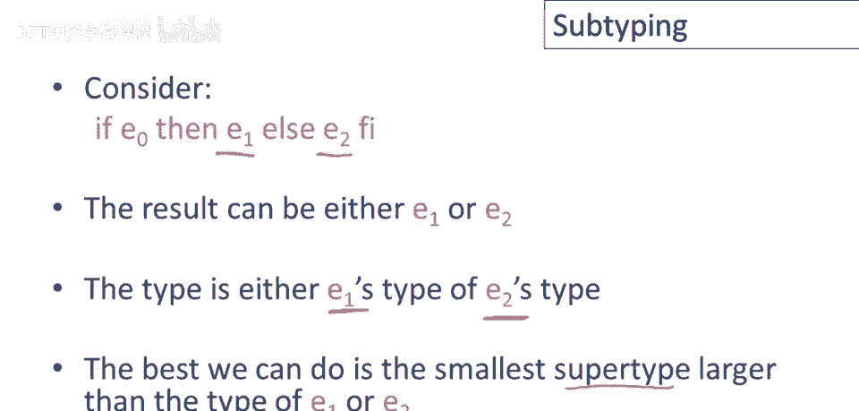
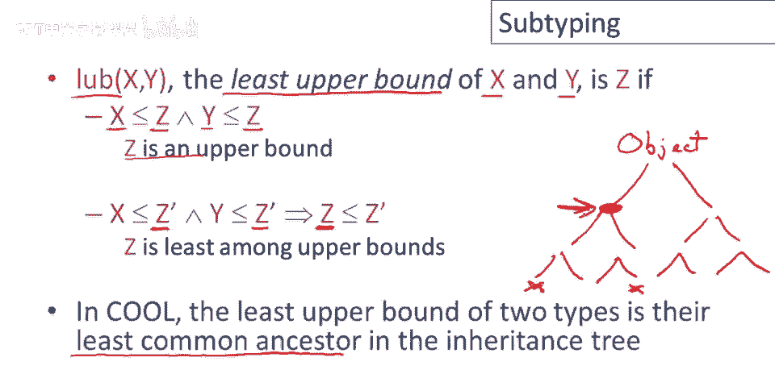
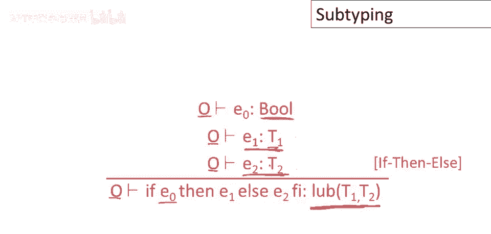
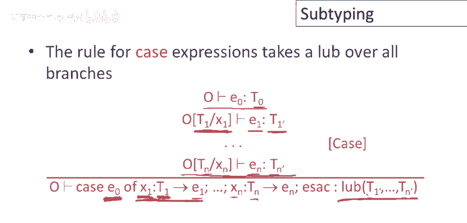

# P48：p48 09-07-_Subtyping - 加加zero - BV1Mb42177J7

本视频中，将讨论子类型，面向对象语言中的重要概念。

从let初始化类型规则开始，上次看了let规则，但没有初始化，现在看看添加初始化如何改变，这里会发生什么，首先，注意规则的主体几乎相同，我们在类型为t0的环境中检查e1，类型在let中声明。

其他变量具有o赋予它们的任何类型，我们得到一些类型t1，那将是整个东西的类型，所以这块与之前完全一样，所以新的东西是这行，我们检查初始化器，那么它是如何工作的呢，首先，在假设下，哦，我们检查类型e。

我们得到类型t零，现在这是对主要观点的旁注，但请注意，我们特别使用环境o中的x，新定义的x在e零中不可用，因此，如果e零使用名称x，这意味着它使用名称x的其他定义，该定义在let之外。

因为我们没有包括这个x的定义，在类型检查e零的环境中，现在，但主要观点，我想在这张幻灯片上指出，e0这里为t0类型，与x类型完全相同，是此规则的要求，规定e0必须与x类型相同，实际上相当宽松。

因为实际上没有问题，如果e0的类型是t0的子类型，t0可以包含任何t0的子类型，这绝对没问题，但这里，我们限制自己只允许与x类型完全匹配的初始化器。

若引入类子类型关系，我们能做得更好，最明显的子类型形式是，若x是类，直接继承自y，意味着代码中有x继承自y的语句，则x应是y的子类型，且此关系为传递性，若x是y的子类型，y是z的子类型。

则x也是z的子类型，最后，这也是反射性的，因此每个类都是其自身的子类型，使用子类型，我们可以写出更好的let规则初始化版本，所以再次，主体，规则中处理主体部分，与之前完全一样，所以让我们不要看那个。

现在我们要做的是类型检查e零，我们得到一些类型t零，现在t零只需是t的子类型，所以这里是一条假设，它只是说t零必须是t的子类型，那么t是什么？t现在是x声明的类型，这允许e零具有与x类型不同的类型。

这里唯一的问题是更多的程序，将使用此规则和之前的规则进行检查，之前的规则肯定是正确的，任何使用该规则编译的程序都将正确运行，但这是一个更宽松且仍然正确的规则，更多的程序，呃将编译和类型检查正确。

呃，使用此规则，子类型在许多地方出现在酷类型系统中，这是赋值规则，在很多方面与let规则相似，那么赋值是如何工作的呢？在左侧是变量，右侧是表达式，我们将评估表达式并将返回的任何值，分配给左侧的变量。

那么如何类型检查这个？首先，我们必须在环境中查找x的类型，我们发现它具有某些类型t零，然后我们在相同的环境中类型检查e一，这里的变量集没有变化，因此我们在环境o中类型检查e一，我们得到一些类型t一。

现在什么必须为真，以便此赋值正确？嗯，x必须能够持有类型t一的值，所以x的类型t零必须是t一的超类型，必须大于t一的类型，所以如果此约束得到满足，那么赋值就是正确的。

另一个使用子类型的例子是属性初始化规则，除了标识符的范围外，非常，非常类似于正常赋值规则，所以回忆一下类看起来像什么，}，可在cool中声明类，顶部有属性及方法集合，属性定义看起来如何？看起来像这样。

声明变量具有某种类型，右侧可有初始化值，初始化类型在哪检查？在特殊环境o_sub_c中检查，仅包含类c声明的属性类型，因此需遍历类定义，提取所有属性定义，所有变量名及其类型，构建记录这些信息的环境。

然后检查初始化类型，记住属性初始化，可引用类中任何属性，让我们看看如何实现，在环境中查找x类型为t0，在相同环境中检查e1类型为t1，与赋值类似，t1需是，或t0的子类型。

现在看另一个有趣例子，如何检查if then else类型，关于if和else重要的是，类型检查时不知道执行哪分支，不知道程序将执行e1或e2，通常，实际上这个if语句，或这个if表达式在程序运行中。

可能多次执行，有时执行一次，有时执行两次，因此if then else的类型，是e1或e2类型之一，编译时不知道是哪一个，因此最好的做法是类型为。

e1或e2中最大的超类型，计算两个或更多类型上界，经常出现，将操作命名为，lub或x和y的最小上界，x和y的最小上界是z，如果z是上界，意味着它大于x和y，并且是最小的上界，所以这条线说存在另一个z'。

大于x和y，那么z必须小于z'，所以z是最小的，是所有可能上界中最小的，在cool和多数面向对象语言中，两个类型的上界就是它们继承树中的最近共同祖先，通常继承树以对象为根，或类似命名的类。

包含程序中所有可能的类，然后有一个层次结构，是一个从对象延伸下来的树，如果我想找到两个类型的上界，比如这个类型和这个类型，我只需要沿着树向上走，直到找到它们的最近共同祖先，所以在这种情况下。

如果我从我树中挑选出这两个类型，这就是这两个类型的上界。

现在我们可以给if-then-else一个类型检查规则，首先要注意的是，if-then-else表达式不会影响环境，if-then-else既不会引入也不会从环境中删除任何变量。

所以所有子表达式都在与整个表达式相同的环境中进行类型检查，现在f和lc零的谓词，应该具有布尔类型，因为那是我们的决定，我们是要走真分支还是假分支，但两个分支可以具有不同的类型，E一只需具有某种类型t一。

E二只需具有某种类型t二，所以再次注意，这说的是什么，这只是在说，E一和E二确实进行了类型检查，它们必须是类型正确的，但我们并不关心类型是什么，类型可以是任何类型，然后整个表达式的类型就是。

t一和t二的上界，因为那将是我们可以给出的，对表达式最终类型的最佳估计，考虑到真分支可能返回t一类型的某些东西，而假分支可能返回t二类型的某些东西。

case表达式的规则是我们迄今为止看到的最复杂的，但实际上它只是一个，嗯，if-then-else的变体，如果我们只是把它拆开，就相对容易理解了，所以让我们先提醒自己case的作用，首先它查看e零。

它评估a零，然后它查看e零的运行时类型，所以它获取e零的动态类，然后它查看第一个分支，它将做什么，它将比较e零在运行时的类型与类型t一，如果t一是e零运行时类型的超类型。

并且实际上它是所有可能分支中最小的，它是所有可能分支中最小的超类型，那么它将选择这个分支，将x1绑定到值，赋予它类型t1，所以将x1绑定到e0的值，将其重新类型化为类型t1，然后评估e1。

所以你可以看到它在什么意义上，是一个华丽的，如果-那么-否则，我们只是在选择最佳匹配的分支，那个声明类型，呃，与e0的运行时类型最接近的分支，然后我们将执行该分支，用在该分支中命名的变量。

绑定到e0的类型，所以让我们看看类型是如何工作的，所以首先我们类型检查e，我们得到一些类型t0，现在会发生什么？如果我们选择第一个分支，那么我们将环境，并扩展它以包含新的变量x1，它将具有类型t1。

所以我们只采取这个分支，记住，如果e0的运行时类型与t1最接近，但如果我们确实采取它，那么我们将执行执行e1在这个环境中，我们将得到一些类型t1 prime的东西，类似地对于所有其他分支，直到最后分支。

这完全与第一个分支相同，只是用字母n替换数字1，并且因为我们不知道哪个分支将在运行时匹配，可能是实际执行的任何一个分支，因此，整个表达式的类型将是所有分支类型，的最小上界。

我在这里只是将最小上界从二元操作扩展到n元操作，这应该足够清楚，我们只是将最小上界取自所有这些类型。

