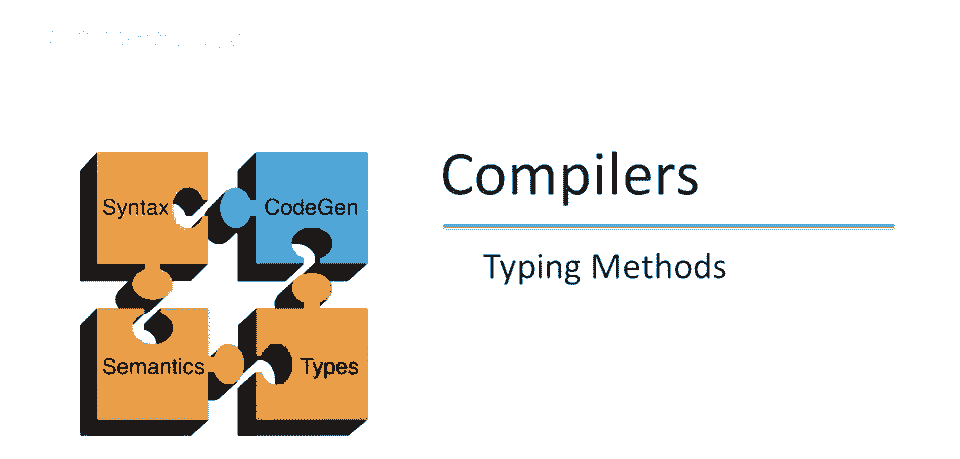
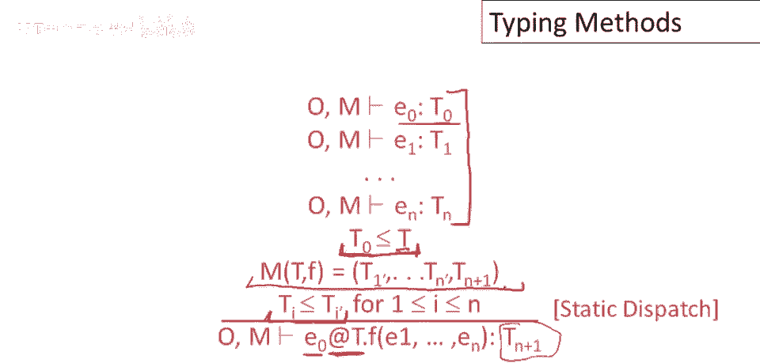
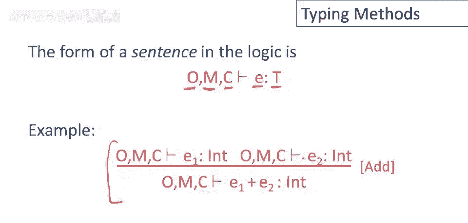
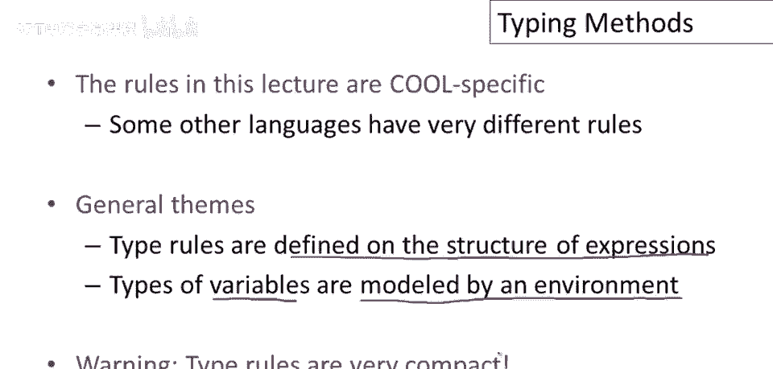

# 课程 P49：类型检查方法调用 🧪


在本节课中，我们将学习如何对面向对象语言中的方法调用进行类型检查。我们将探讨动态调度和静态调度的类型规则，并理解如何通过环境来管理方法和对象的类型信息。

---

## 方法调用的类型检查问题


上一节我们介绍了变量引用的类型检查。本节中我们来看看如何类型检查一个方法调用。

假设我们有一个表达式 `e0.f(e1, ..., en)`。我们需要类型检查接收者表达式 `e0` 和所有参数 `e1` 到 `en`。`e0` 将有一个类型 `T0`，每个参数也有其类型。核心问题是：这个方法的调用返回什么类型？我们无法仅凭方法名 `f` 就知道其行为，除非我们了解其定义所在的类 `T0` 的行为。

## Cool语言中的命名空间

在Cool语言中，方法与对象标识符分属不同的命名空间。这意味着，在同一作用域内，可以同时存在一个名为 `foo` 的方法和一个名为 `foo` 的对象，而不会产生混淆。因此，在类型规则中，我们需要两个独立的环境来分别记录对象和方法的类型信息。

以下是两个关键的环境映射：
*   **对象环境 (O)**：将对象标识符映射到其类型。
*   **方法环境 (M)**：记录每个方法的签名。

一个方法的**签名**定义了其输入和输出类型。在方法环境 `M` 中，一项记录的形式为：`M(C, f) = [T1, T2, ..., Tn, T_return]`。这表示在类 `C` 中，方法 `f` 接受 `n` 个参数，其类型依次为 `T1` 到 `Tn`，并返回类型为 `T_return` 的值。


## 动态调度的类型规则

在引入了方法环境 `M` 后，我们现在可以为动态调度（即普通的方法调用 `e0.f(...)`）编写类型规则。

首先，我们使用当前环境（包含 `O` 和 `M`）对子表达式进行类型检查，得到 `e0` 的类型 `T0` 以及各个参数 `ei` 的类型 `Ti`。

然后，我们在方法环境 `M` 中查找类 `T0` 中名为 `f` 的方法签名。该签名必须存在，并且参数数量必须匹配。接着，我们检查每个实际参数的类型 `Ti` 是否是其对应形式参数声明类型 `T'i` 的子类型（即 `Ti ≤ T'i`）。

如果所有这些检查都通过，那么整个调度表达式的类型就是方法签名中声明的返回类型 `T_return`。

该规则可以用以下形式化描述：
```
O, M, C ⊢ e0 : T0
O, M, C ⊢ e1 : T1
...
O, M, C ⊢ en : Tn
M(T0, f) = [T'1, ..., T'n, T_return]
T1 ≤ T'1, ..., Tn ≤ T'n
——————————————————————————————————————
O, M, C ⊢ e0.f(e1, ..., en) : T_return
```


## 静态调度的类型规则

静态调度（即 `e0@T.f(...)`）的类型规则与动态调度非常相似。

语法上的唯一区别是程序员显式指定了希望调用方法 `f` 的类 `T`，而不是由 `e0` 的运行时类型决定。

在类型规则中，我们同样先对 `e0` 和所有参数进行类型检查。额外的要求是：`e0` 的类型 `T0` 必须是显式指定的类 `T` 的子类型（即 `T0 ≤ T`）。这意味着 `T` 必须是 `T0` 在继承层次中的祖先类。



然后，我们检查类 `T` 中是否存在方法 `f`，其签名匹配，并且实际参数类型是形式参数类型的子类型。如果满足所有条件，则整个表达式的类型就是该方法签名的返回类型。

该规则形式化如下：
```
O, M, C ⊢ e0 : T0
O, M, C ⊢ e1 : T1
...
O, M, C ⊢ en : Tn
T0 ≤ T
M(T, f) = [T'1, ..., T'n, T_return]
T1 ≤ T'1, ..., Tn ≤ T'n
——————————————————————————————————————
O, M, C ⊢ e0@T.f(e1, ..., en) : T_return
```


## 完整类型检查环境

方法环境 `M` 需要被添加到整个类型检查系统中。对于大多数表达式（如加法），其类型规则本身不直接使用 `M`，但需要将 `M` 传递给其子表达式进行类型检查。


因此，Cool语言完整的类型检查环境由三部分组成：
1.  **对象环境 (O)**：对象标识符到类型的映射。
2.  **方法环境 (M)**：方法签名映射。
3.  **当前类 (C)**：正在被类型检查的表达式所在的类。

一个完整的类型判断语句读作：在假设对象标识符具有 `O` 给出的类型、方法具有 `M` 给出的签名、且表达式位于类 `C` 中的前提下，我们可以证明表达式 `e` 具有类型 `T`。



例如，带有完整环境的加法规则如下：
```
O, M, C ⊢ e1 : T1    O, M, C ⊢ e2 : T2    T1 = Int    T2 = Int
———————————————————————————————————————————————————————————————
O, M, C ⊢ e1 + e2 : Int
```

## 类型检查的普遍主题

虽然不同语言的规则各异，但类型检查有一些普遍主题：
*   **结构归纳**：类型规则通常基于表达式的结构进行归纳定义。一个表达式的类型取决于其子表达式的类型。
*   **环境建模**：表达式中的自由名称（如变量、方法名）的类型由环境（映射）来建模和提供假设。
*   **规则紧凑性**：类型规则用紧凑的符号包含了大量信息，需要仔细阅读和理解。

---



本节课中我们一起学习了如何对方法调用进行类型检查。我们理解了动态调度与静态调度的区别及其对应的类型规则，认识了Cool语言中分离的对象环境与方法环境，并了解了类型检查系统如何通过环境传递和利用这些信息来保证程序的安全性。掌握这些规则是构建类型检查器的核心基础。