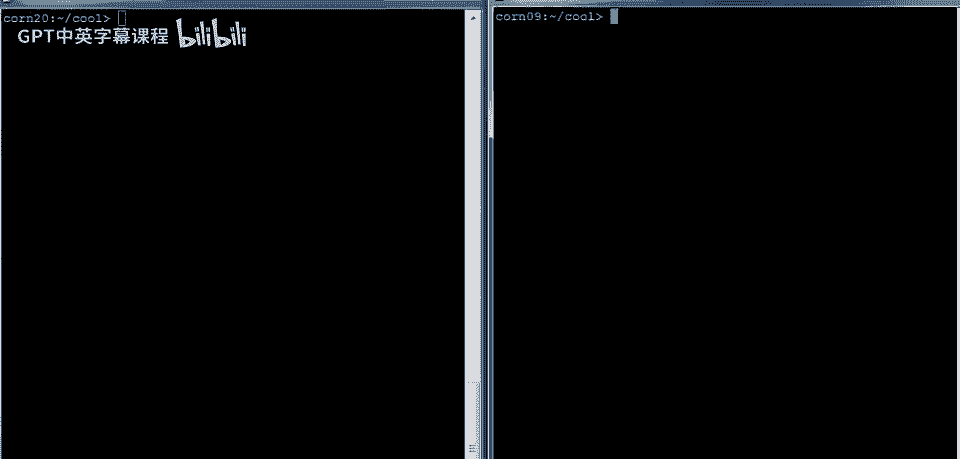
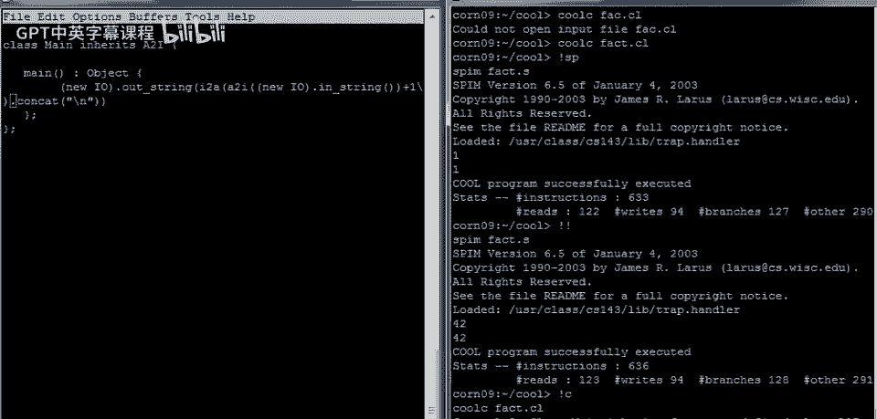
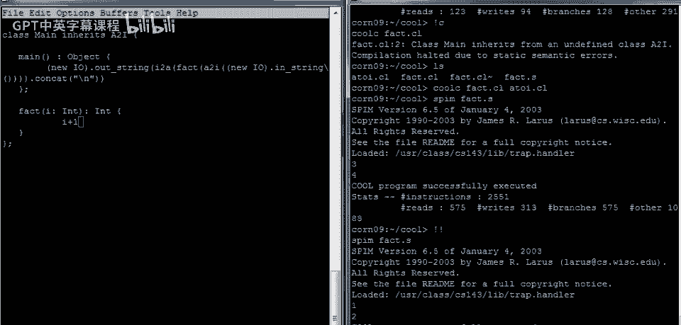
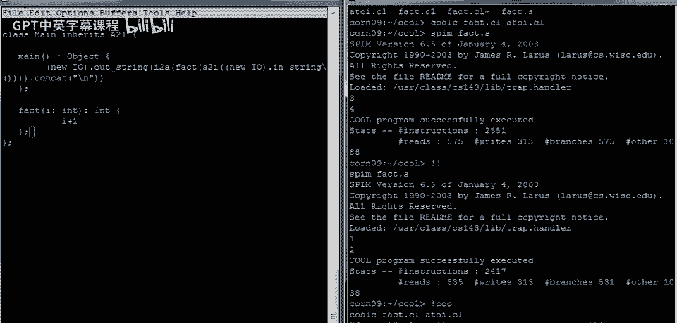
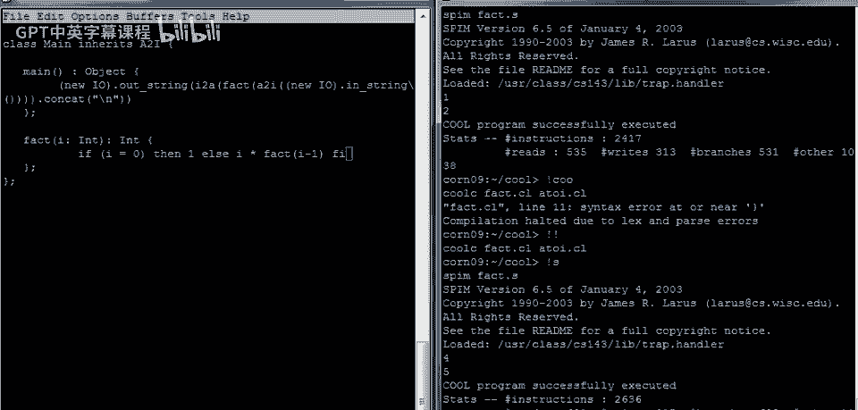
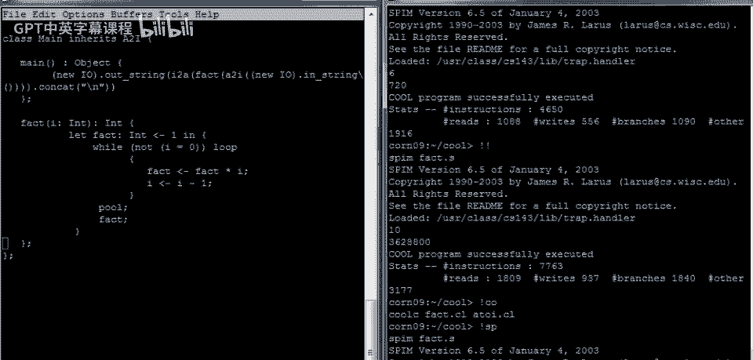
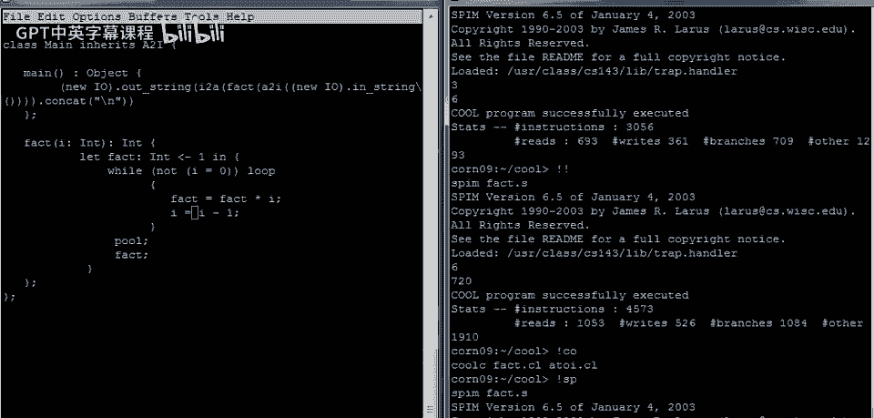

# Cool编程教程 P5：阶乘函数实现 🧮



在本节课中，我们将学习如何在Cool编程语言中实现一个阶乘函数。我们将从简单的输入输出开始，逐步构建一个能够读取用户输入、进行整数计算并输出结果的完整程序。课程将涵盖基本的I/O操作、字符串与整数的转换、递归与循环结构，并指出一个常见的编程错误。

---

## 概述与程序骨架

上一节我们介绍了Cool语言的基本结构。本节中，我们来看看如何构建一个完整的程序。

每个Cool程序都需要一个主类，主类中必须包含一个`main`方法。我们首先搭建程序的基本骨架。

```cool
class Main {
    main(): Object {
        -- 程序主体将写在这里
    };
};
```

`main`方法返回一个`Object`类型的对象。现在，我们可以在其中编写代码了。

---

## 基础输入与输出


在编写阶乘函数之前，我们需要掌握如何与用户交互，即输入和输出。

为了进行I/O操作，我们需要一个IO对象。IO对象提供了诸如打印字符串等方法。

以下是一个简单的程序，用于打印数字“1”。

```cool
class Main {
    main(): Object {
        (new IO).out_string("1\n")
    };
};
```

编译并运行此程序，它将在屏幕上输出“1”。

---

### 读取用户输入

接下来，我们学习如何读取用户输入的字符串。


IO对象有一个`in_string`方法，用于读取字符串。我们将读取的字符串与换行符连接，以确保输出格式整洁。


```cool
class Main {
    main(): Object {
        (new IO).out_string((new IO).in_string().concat("\n"))
    };
};
```

编译并运行此程序。程序会等待用户输入。输入“1”则返回“1”，输入“42”则返回“42”。



---


## 字符串与整数的转换


阶乘计算需要处理整数，而非字符串。因此，我们需要将字符串转换为整数，计算后再转换回字符串。

Cool语言提供了一个名为`A2I`的库（ASCII to Integer），用于字符串和整数之间的转换。主类需要继承`A2I`的功能。

以下程序读取一个字符串，将其转换为整数并加1，然后再转换回字符串输出。

```cool
class Main inherits A2I {
    main(): Object {
        (new IO).out_string(
            i2a(
                a2i((new IO).in_string()) + 1
            ).concat("\n")
        )
    };
};
```



在编译时，需要同时指定主程序文件和`A2I`库文件。

```bash
coolc fact.cl A2I.cl
```


运行程序，输入“3”将输出“4”，输入“1”将输出“2”。



---

## 实现递归阶乘函数

现在，我们可以开始实现阶乘函数了。首先，我们定义一个`fact`方法，它接受一个整数参数并返回一个整数。




我们从一个简单的版本开始：让`fact`方法返回参数加1。


```cool
class Main inherits A2I {
    main(): Object {
        (new IO).out_string(
            i2a(
                fact(a2i((new IO).in_string()))
            ).concat("\n")
        )
    };

    fact(i: Int): Int {
        i + 1
    };
};
```

编译并运行，输入“4”将返回“5”。

---

### 编写递归阶乘逻辑

阶乘的递归定义是：如果`i`等于0，则阶乘为1；否则，阶乘为`i`乘以`(i-1)`的阶乘。

在Cool中，我们使用`if`、`then`、`else`、`fi`关键字来构建条件语句。

```cool
class Main inherits A2I {
    main(): Object {
        (new IO).out_string(
            i2a(
                fact(a2i((new IO).in_string()))
            ).concat("\n")
        )
    };

    fact(i: Int): Int {
        if i = 0 then
            1
        else
            i * fact(i - 1)
        fi
    };
};
```

编译并运行程序。输入“3”输出“6”，输入“6”输出“720”。递归阶乘函数工作正常。

---

## 实现迭代阶乘函数

作为练习，我们将递归阶乘函数改写为迭代版本，使用循环而非递归。

我们需要一个累加器变量来保存阶乘计算结果。在Cool中，使用`let`表达式声明局部变量。

循环使用`while`、`loop`、`pool`关键字构建。在循环体内，我们更新累加器和计数器。


```cool
class Main inherits A2I {
    main(): Object {
        (new IO).out_string(
            i2a(
                fact(a2i((new IO).in_string()))
            ).concat("\n")
        )
    };

    fact(i: Int): Int {
        let fact: Int <- 1 in {
            while (not (i = 0)) loop
                {
                    fact <- fact * i;
                    i <- i - 1;
                }
            pool;
            fact;
        }
    };
};
```


注意，在Cool中，赋值使用`<-`操作符。`let`表达式的主体是一个代码块，其最后一个表达式的值（此处为`fact`）成为整个`let`表达式的结果。



编译并运行，迭代版本同样能正确计算阶乘。


---

## 常见错误：误用等号


来自C或Java背景的程序员可能习惯使用等号`=`进行赋值。但在Cool中，单个等号`=`是比较运算符，而非赋值运算符。


以下是一个错误示例：



```cool
fact(i: Int): Int {
    let fact: Int <- 1 in {
        while (not (i = 0)) loop
            {
                fact = fact * i;  -- 错误：这是比较，不是赋值
                i = i - 1;        -- 错误：这是比较，不是赋值
            }
        pool;
        fact;
    }
};
```

此代码可以编译，但运行时会陷入无限循环。因为`fact = fact * i`和`i = i - 1`并没有修改变量的值，它们只是进行布尔比较，导致循环条件永远为真。

---

## 总结

本节课中，我们一起学习了如何在Cool语言中实现阶乘函数。我们从程序的基本骨架开始，逐步引入了输入输出操作、字符串与整数的转换。我们分别用递归和迭代两种方式实现了阶乘计算，并理解了它们的工作原理。最后，我们指出了一个常见的错误，即混淆赋值运算符`<-`和比较运算符`=`，这可能导致程序逻辑错误或无限循环。


通过本课，你应该对Cool语言的基本控制流、I/O操作和类型转换有了更深入的理解。