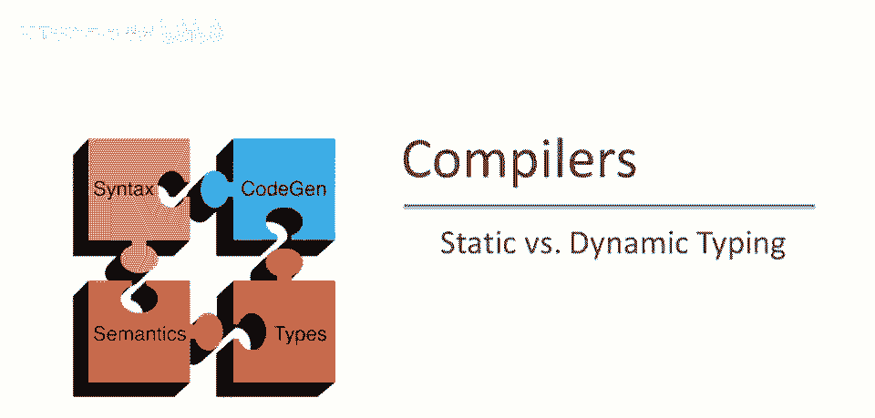
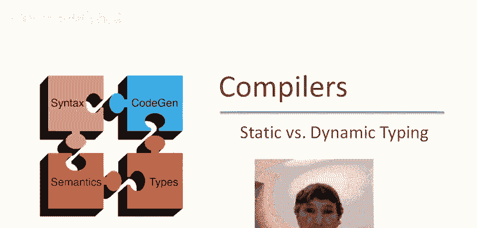
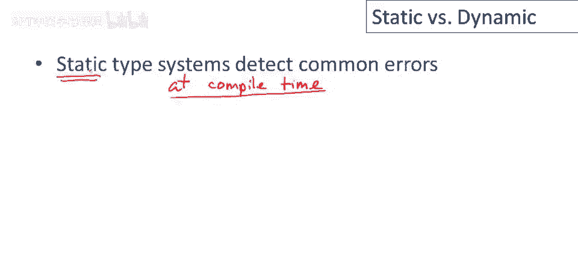
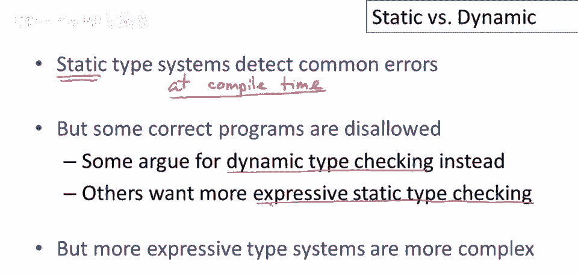
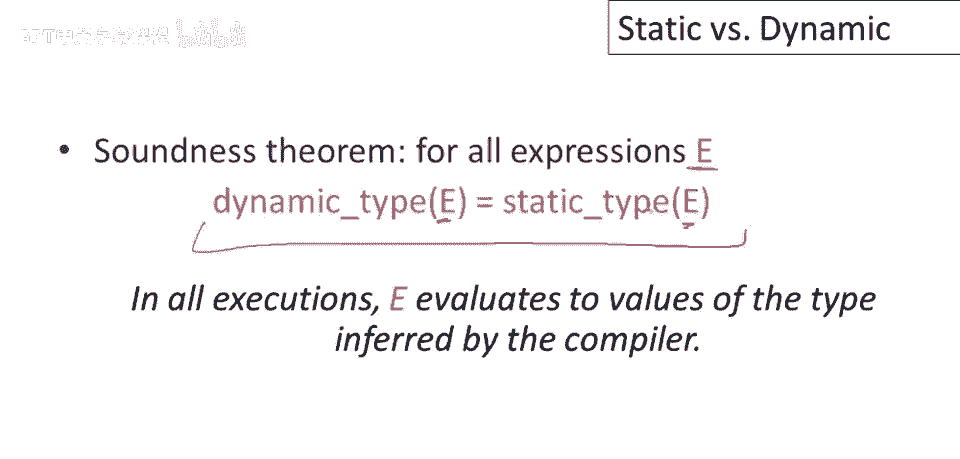
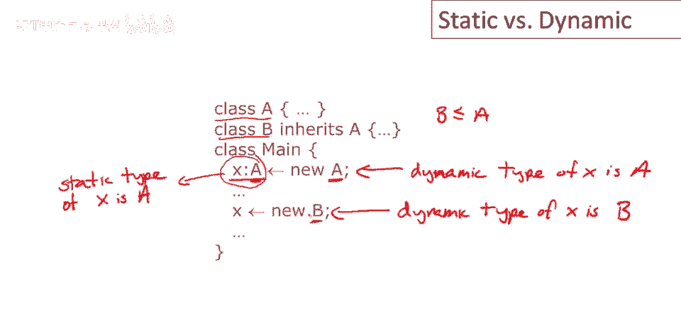
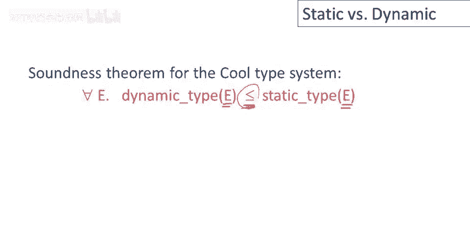

# 课程 P50：静态类型与动态类型 🧠



在本节课中，我们将要学习编程语言中两个核心概念：静态类型与动态类型。我们将探讨它们的定义、区别、目的以及它们如何影响程序的编写与执行。

---

## 概述



类型系统的主要美学目标之一是防止常见的编程错误。它们通过在编译时检查代码来实现这一点，并且是在不了解程序任何输入的情况下进行的。因此，检查的唯一依据就是程序文本本身。这就是我们称之为“静态”的原因，因为它不涉及任何动态行为。

上一节我们介绍了类型系统的静态检查特性，本节中我们来看看动态类型检查的概念。

## 静态类型与动态类型的定义

程序的实际执行行为发生在运行时。任何正确的静态类型系统都必须在编译时做出判断，但它无法完全精确地推理程序运行时可能发生的一切。这意味着，一些实际上能够正确运行的程序会被类型检查器禁止。

以下是两种不同的类型概念：



*   **动态类型**：指的是对象或值在**运行时**实际具有的类型。
*   **静态类型**：这是一个**编译时**的概念，是类型检查器所知道的关于对象的信息。

为了使静态类型检查器正确工作，静态类型和动态类型之间必须存在某种关系。这种关系可以通过一个定理来形式化证明。


## 类型正确性定理

我们想了解的是，对于编程语言中的每个表达式 `e`，其静态类型（编译器推断的类型）与动态类型（运行时实际值的类型）之间的关系。

一种表述是：如果你实际运行程序，得到的结果应该与静态类型检查器预期的结果一致。静态类型检查器应该能够正确预测运行时将出现的值。

在早期简单的编程语言中，定理可以表述为：对于每个表达式 `e`，其静态类型等于其动态类型。用公式可以表示为：
`type_static(e) == type_dynamic(e)`



然而，对于像 Cool 这样支持继承和子类型的语言，情况变得更加复杂。

## Cool 语言中的类型示例

让我们看一个典型 Cool 程序的执行示例。这里有两个类：类 `A` 和继承自 `A` 的类 `B`。因此，`B` 是 `A` 的子类型，我们写作 `B <: A`。

```cool
class A {};
class B inherits A {};

-- 在某个方法中
let x: A <- new A in -- x 的静态类型是 A，此时动态类型也是 A
    x <- new B;      -- 执行后，x 的动态类型变为 B，但静态类型仍是 A
```

在这个例子中：
*   `x` 的**静态类型**是 `A`。这是编译器在整个 `x` 作用域内所知道并使用的类型。
*   在运行时，由于赋值操作，`x` 可以持有不同类型的对象。因此，`x` 的**动态类型**可以是 `A` 或 `B`。

这是一个非常重要的区别：静态类型在编译时是恒定且已知的，而动态类型在运行时可以变化。



## 子类型化与类型安全

这意味着，Cool 类型系统的正确性定理比简单类型系统的定理更复杂。在存在子类型的情况下，我们想要的属性是：对于一个给定的表达式 `e`，其静态类型 `S` 必须是其所有可能动态类型 `D` 的“超类型”。用公式可以表示为：
对于所有可能的执行路径，`type_dynamic(e) <: type_static(e)`



这基于子类型的一个关键特性：如果 `C'` 是 `C` 的子类（`C' <: C`），那么 `C'` 的对象必须能用于任何期望 `C` 类型对象的上下文中。因为子类只会**添加**属性和方法，而不会移除或改变父类中已有方法的类型签名（尽管可以重写方法实现）。

这是许多面向对象语言的标准设计。

---

## 总结

本节课中我们一起学习了静态类型与动态类型的核心区别：
1.  **静态类型**是编译时的概念，用于在程序运行前检查类型错误。
2.  **动态类型**是运行时的概念，描述了值在内存中的实际类型。
3.  在支持继承的语言（如 Cool）中，对象的静态类型（声明类型）可以是其动态类型（实际类型）的超类型，这通过子类型化（`<:`）关系来保证类型安全。
4.  类型系统的目标是减少错误，但静态类型系统可能会拒绝一些实际上能正确运行的程序，这是其设计上的权衡。


理解这两种类型系统有助于我们更好地理解不同编程语言的设计哲学，并写出更健壮的代码。