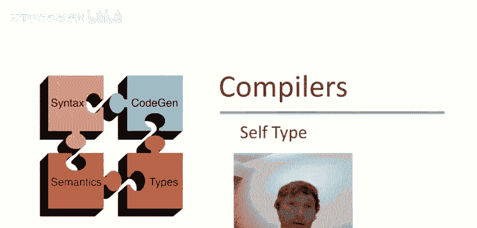
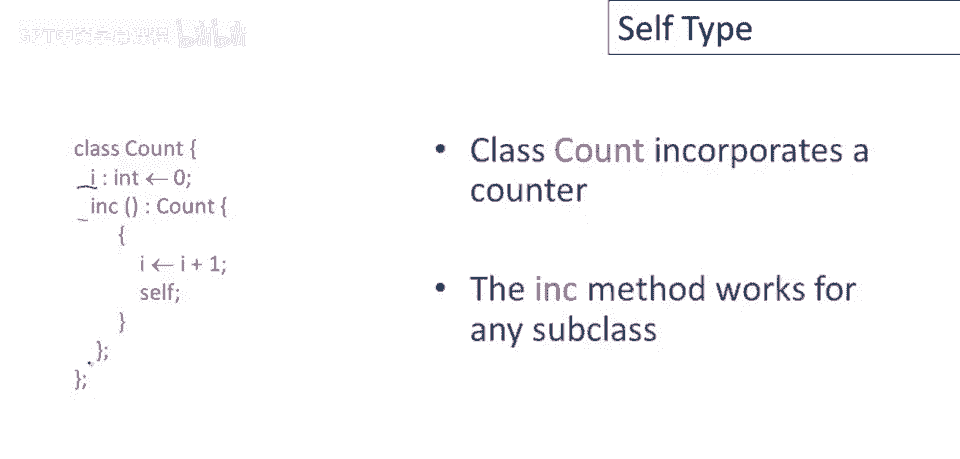
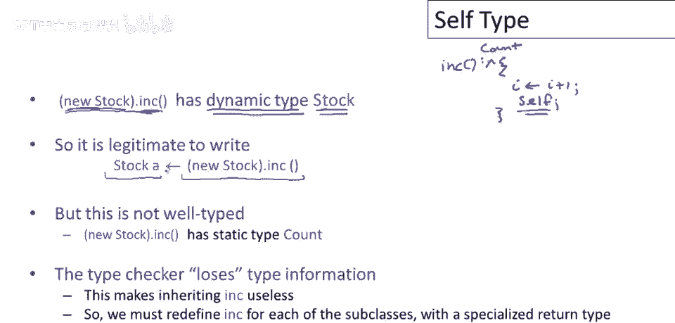
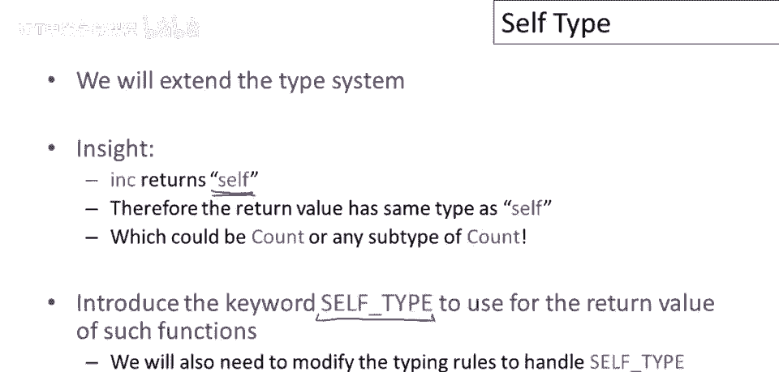
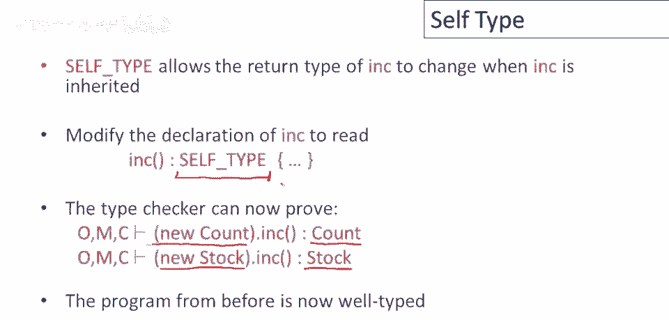
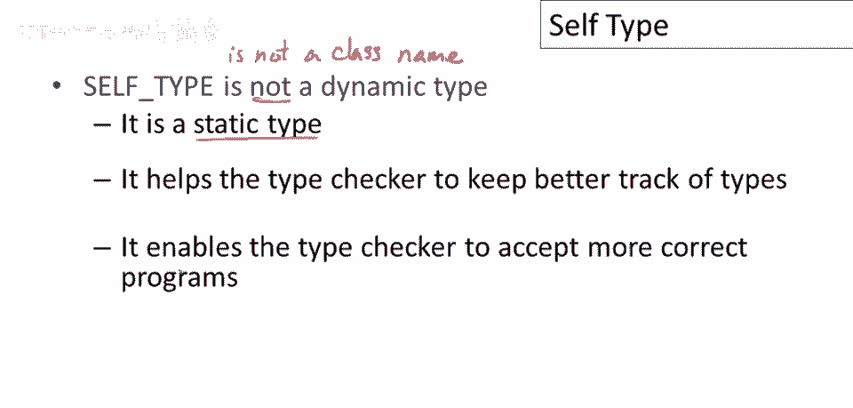
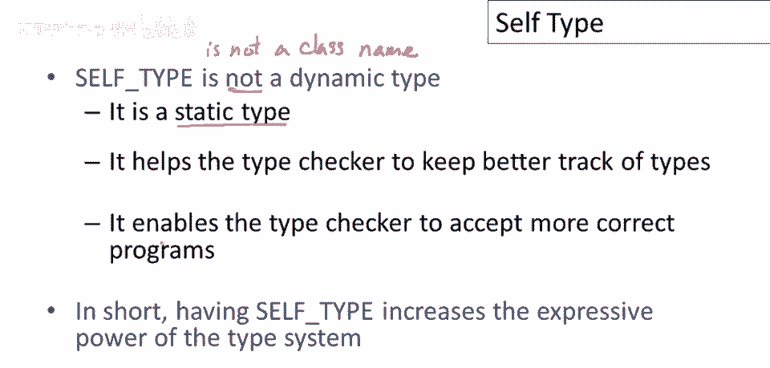

# 课程 P51：自类型 (Self Type) 🧬



在本节课中，我们将学习一个名为“自类型”的静态类型系统特性。我们将了解它要解决的问题、它的基本概念以及它如何增强类型系统的表达能力。


---

在上个视频中，我们讨论了静态和动态类型之间的区别，以及静态类型系统越来越具表现力的趋势。本节中，我们将通过“自类型”来具体感受这种更具表现力的类型系统。

## 一个简单的问题场景 🔍



首先，让我们通过一个简单的类定义来了解自类型要解决的问题。这里有一个 `Count` 类，它实现了一个计数器功能。

```python
class Count:
    i: int = 0

    def increment(self) -> Count:
        self.i += 1
        return self
```

这个类有一个整数字段 `i`，初始化为 0。`increment` 方法将计数器加一并返回 `self` 对象。这可以被视为一个提供计数功能的基类。

## 继承带来的类型问题 ⚠️

现在，考虑定义一个 `Count` 的子类 `Stock`，用于跟踪库存物品。

```python
class Stock(Count):
    name: str


# 尝试使用
s: Stock = Stock()
s = s.increment()  # 这里会出现类型错误！
```

这段代码在静态类型检查下会报错。原因是：`increment` 方法在父类 `Count` 中被声明为返回 `Count` 类型。即使 `Stock` 继承了该方法，其返回类型签名也不会改变，仍然是 `Count`。因此，尝试将 `Count` 类型的返回值赋给 `Stock` 类型的变量 `s` 会导致类型不匹配。

实际上，在运行时，`s.increment()` 返回的确实是 `Stock` 对象（因为返回的是 `self`）。但静态类型检查器丢失了这个信息，它只知道方法签名返回的是 `Count`。

## 自类型的引入 💡



为了解决这个问题，我们需要扩展类型系统。关键在于，`increment` 方法返回的是 `self` 对象，其类型应该与调用该方法的对象类型相同（可能是 `Count`，也可能是其任何子类型，如 `Stock`）。

为此，我们引入一个新的类型关键字：**自类型 (Self Type)**。我们将 `increment` 方法的返回类型改为 `Self`。


```python
class Count:
    i: int = 0

    def increment(self) -> Self:  # 使用 Self 类型
        self.i += 1
        return self
```



`Self` 类型表示方法的返回值具有与 `self` 参数相同的类型。当我们进行这个更改后，类型系统就能进行更精确的推理：
*   当在 `Count` 对象上调用 `increment` 时，`self` 类型为 `Count`，因此返回类型也是 `Count`。
*   当在 `Stock` 对象上调用 `increment` 时，`self` 类型为 `Stock`，因此返回类型也是 `Stock`。

这样，之前的 `Stock` 示例代码就能通过类型检查了。

## 关于自类型的重要说明 📝

需要明确两点：
1.  **自类型是静态类型**：`Self` 是静态类型系统的一部分，用于在编译时进行更精确的类型推理，而不是一个运行时概念。
2.  **自类型不是类名**：与 `int`、`Count` 等类型不同，`Self` 是一个特殊的类型占位符，其具体含义取决于使用的上下文（即哪个类的 `self`）。



通过引入自类型，类型系统能够接受更多在逻辑上正确、但之前因类型信息不足而被拒绝的程序，从而增强了表达能力和实用性。



---



本节课中，我们一起学习了自类型 (`Self Type`)。我们从一个简单的继承问题出发，看到了静态类型系统在表达方法返回“自身类型”时的局限性。通过引入 `Self` 类型，我们允许方法的返回类型随调用者的实际类型而动态变化，从而解决了子类中继承方法返回类型不精确的问题，增强了类型系统的表达能力。