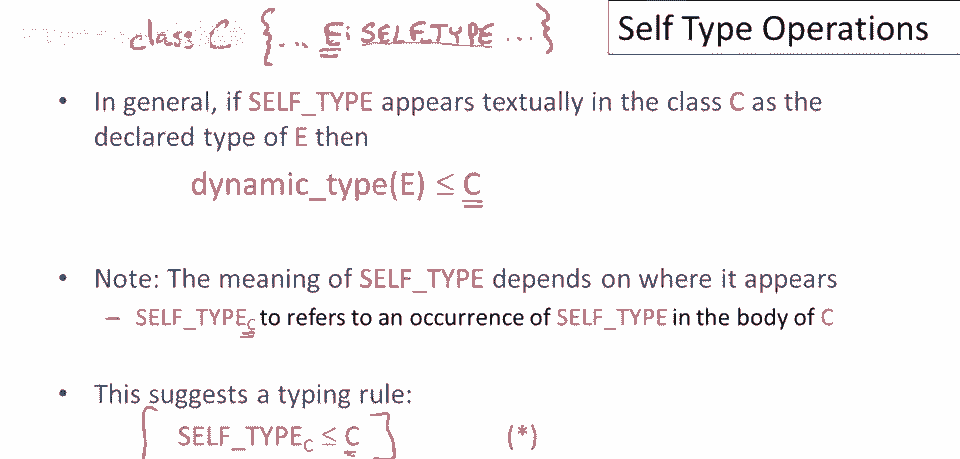
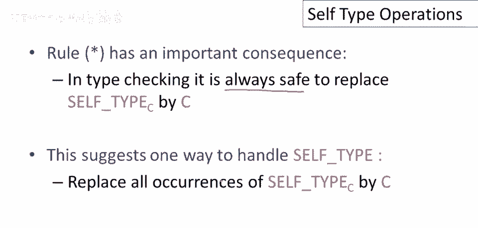
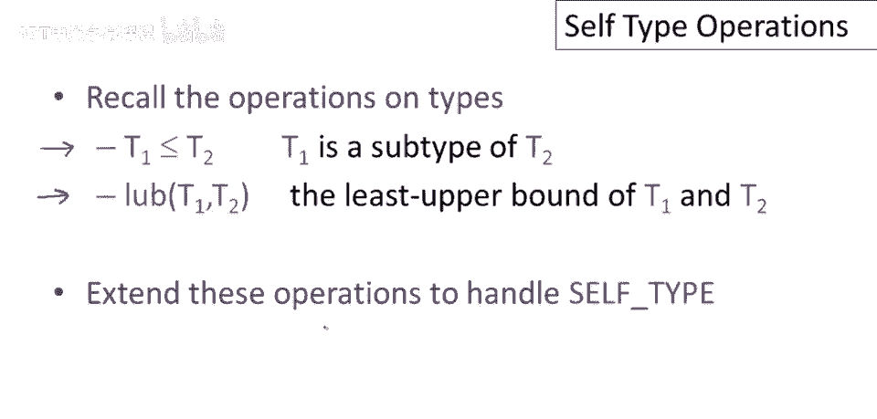
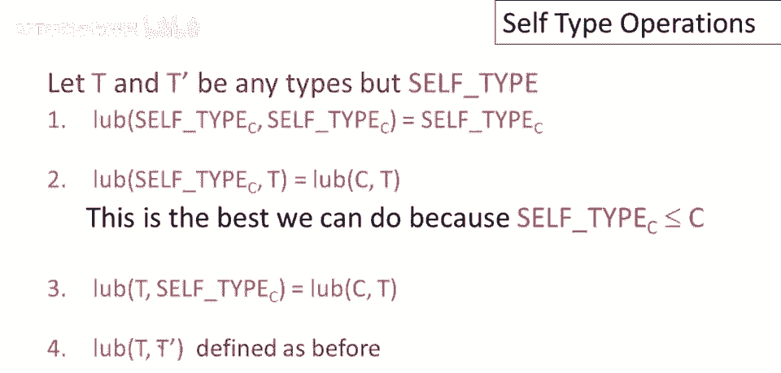

# 课程 P52：Self 类型操作详解 🧩


在本节课中，我们将深入探讨 Self 类型，并学习其核心操作。理解这些操作对于掌握 Self 类型在类型系统中的作用至关重要。

---


## 回顾与引入

上一节我们介绍了 Self 类型的基本概念。本节中，我们来看看如何通过定义子类型关系和上确界操作来形式化地处理 Self 类型。

让我们从回顾上节课的例子开始。我们有一个名为 `Count` 的类，它包含一个初始化为零的整数字段 `i`，以及一个名为 `inc` 的方法。

```java
class Count {
    int i = 0;
    Self inc() {
        this.i++;
        return this;
    }
}
```

`inc` 方法的返回类型是 `Self`。问题是，`inc` 实际返回的对象的动态类型是什么？答案是，它可以是 `this` 对象的动态类型。在一个大型程序中，可能有多个类继承自 `Count`，因此 `inc` 可以返回 `Count` 或其任何子类。



## Self 类型的含义

让我们考虑一个通用情况。假设在类 `C` 中，有一个表达式 `e` 具有 `Self` 类型。那么表达式 `e` 的可能动态类型是什么？根据之前的讨论，`e` 的动态类型将是包含 `Self` 类型的类 `C` 的子类型。

这表明，`Self` 类型的含义实际上取决于其所在的上下文。在类 `C` 中，`Self` 类型意味着 `C` 的某个子类型。这引出了一个非常简单的类型规则：**`Self` 类型是其所处类的子类型**。



一个关键的想法是：`Self` 类型 `C` 是 `C` 的某个子类型。这有助于说明，`Self` 类型最好被视为一个类型变量，其取值范围覆盖了其出现所在类的所有子类。



## 子类型关系操作

为了将 `Self` 类型纳入类型系统，我们需要扩展两个核心操作：子类型关系和上确界操作。首先，让我们从子类型关系开始。

在我们的定义中，我们将使用一些类型 `T` 和 `T'`，它们代表正常的类名，而不是 `Self` 类型。

以下是处理 `Self` 类型的子类型关系规则：

1.  **两边都是 `Self` 类型**：`Self` 类型 `C` 是 `Self` 类型 `C` 的子类型。这很容易理解，因为我们可以为这个“变量”插入 `C` 的任何子类型，关系依然成立。

2.  **左边是 `Self` 类型，右边是常规类型**：`Self` 类型 `C` 是 `T` 的子类型，当且仅当 `C` 是 `T` 的子类型。这是因为 `C` 是任何 `Self` 类型 `C` 可能代表的超类。


3.  **左边是常规类型，右边是 `Self` 类型**：常规类名 `T` **永远不是** `Self` 类型 `C` 的子类型。即使 `T` 是 `C` 的子类，我们也不能允许这种关系成立，因为 `Self` 类型 `C` 可以代表 `C` 的任何子类（比如另一个子类 `A`），而 `T` 不一定是 `A` 的子类型。

4.  **两边都是常规类型**：使用之前为正常类名定义的子类型规则，没有改变。

## 上确界操作

接下来，我们讨论上确界操作。上确界操作 `lub(T, T')` 返回比两个参数类型都“大”的最小类型。

以下是处理 `Self` 类型的上确界规则：

1.  **两个参数都是 `Self` 类型**：`Self` 类型 `C` 和 `Self` 类型 `C` 的上确界就是 `Self` 类型 `C`。

2.  **一个参数是 `Self` 类型，另一个是常规类型**：`Self` 类型 `C` 和 `T` 的上确界是类 `C` 和 `T` 的上确界。这是因为 `C` 是 `Self` 类型可能成为的最大类型。

3.  **两个参数都是常规类型**：使用之前定义的类名上确界规则，没有改变。

## 总结


本节课中，我们一起学习了 `Self` 类型的核心操作。

*   我们明确了 `Self` 类型是其所在类的子类型变量。
*   我们定义了扩展后的**子类型关系**，明确了 `Self` 类型与常规类型、以及 `Self` 类型自身之间如何进行比较。
*   我们定义了扩展后的**上确界操作**，说明了如何计算包含 `Self` 类型的类型的最小上界。



理解这些操作是构建支持 `Self` 类型的健壮类型系统的关键。下一节，我们将利用这些规则来实际进行类型检查。