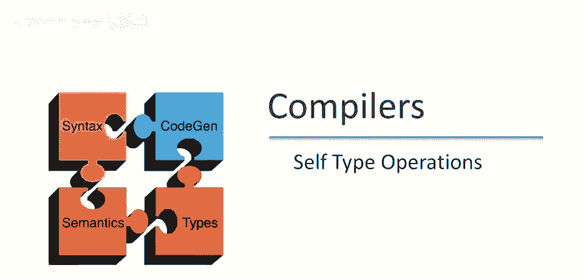
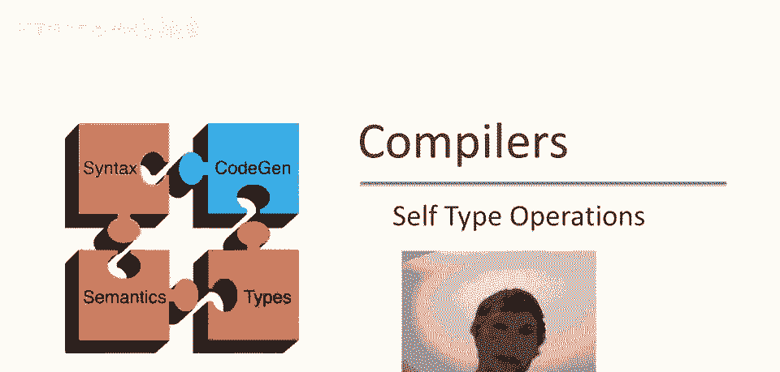
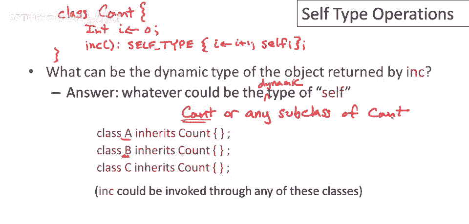
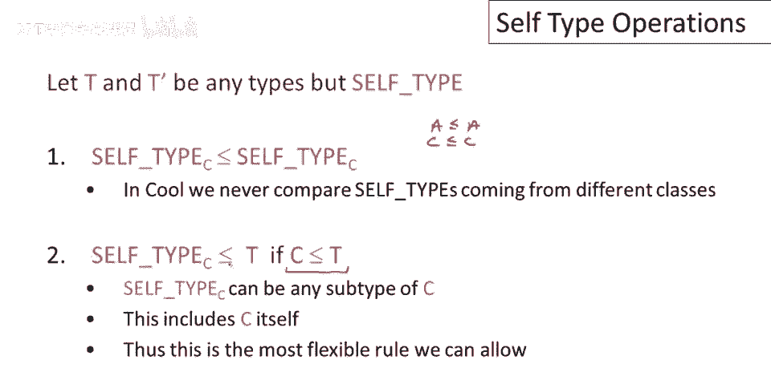
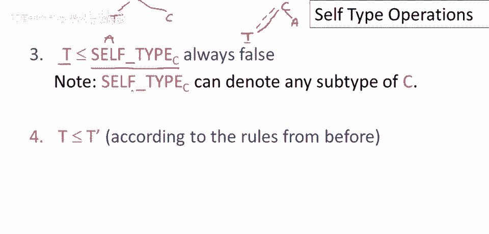

# P52：p52 10-03-_Self_Type_Operat - 加加zero - BV1Mb42177J7

本视频中，我们将继续讨论self类型，通过讨论self类型的操作，这将有助于澄清self类型是什么。

及其在类型系统中的作用，所以让我们从思考上次讨论的例子开始，如果你忘了那是什么，让我快速写下来，我们有一个名为count的类，count有一个字段，一个初始化为零的整数i，它有一个名为ink的方法。

返回类型为self类型的某个东西，所有ink所做的就是增加计数器字段，并返回self对象，我可能犯了一些语法错误，但那并不重要，这是count类的基本代码，问题是ink实际返回的对象的动态类型是什么。

答案是它可以是self对象的动态类型，self对象的动态类型，如果我们考虑一个大程序，其中多个类继承自count，那么答案是ink可以返回，count或count的任何子类，所以它将返回至少。

count。

但它可以返回更具体的类型，动态类型可以是更具体的，它可以是count的子类，或count子类的子类，任何直接或间接继承自count的类都是可能的，那么一般情况是什么，让我们考虑一个类c，在这个类c中。

有一些表达式内部具有self类型，这个表达式如何获得self类型并不重要，我们只需说它具有这种类型，以某种方式，那么表达式的可能动态类型是什么，根据我们上一页的讨论，显然表达式的动态类型，当你运行e时。

你将得到c类的子类型，包含self类型的类，这很有趣，因为它向我们展示了self类型的含义实际上取决于上下文，所以self类型意味着，c类的子类型，如果我在类d中写了self类型。

在类d的定义的某个地方，将self类型实例替换为类名，So self类型c，这里将指向关键词的一个语法实例，类c中的self类型，这还暗示了一个非常简单的类型角色，关于self类型第一个有用的事实是。

即self类型sub c是c的子类型，这确实是一个关键的想法，一个self类型的类c是c的某个子类型，因为这也有助于说明self类型，真正最好的思考方式是self类型，是一个类型变量。

其范围涵盖所有子类，它出现的类，所以self类型sub c你应该认为是一个类型变量，它没有固定的类型，但保证是某种类型，受限于c，所以它将是直接继承。

或间接从类c继承的类之一，self类型c是c的子类型的规则有一个重要的后果，这意味着当我们使用self类型进行类型检查时，总是安全的，总是安全地将self类型sub c替换为c。

所以它是安全的提升任何self类型c，它可能是c或c的子类型，就说好吧，我们只是说它是c就对了，这暗示了一种处理self类型的方式，即用c替换所有self类型sub c的出现，不幸的是。

那最终并不是很有用，它是正确的，这样做是正确的，但那真的就像根本没有self类型一样，就像我们回到上一视频中做的例子，我们开始时没有self类型，我们发现我们不能按预期使用继承。

所以为了做得比仅仅扔掉所有self类型更好，我们需要将self类型纳入类型系统，我们将要做的，是通过查看类型系统中的操作来做到这一点，有两个操作，我们之前讨论过的子类型关系。

所以当一个类型是另一个类型的子类型时，以及告诉我们两个参数类型中较小类型的最小上界操作，它比两个参数类型都大，我们所有要做的就是我们现在要做的。

是扩展这些操作以处理类型self type，所以让我们从子类型关系开始，在我们的定义中，我们将使用一些类型t和t prime，它们只是正常的类名，它们是任何类名，但不是self类型。

所以一种可能是我们在子类型关系的两边都有self类型，在这种情况下，显然，self类型子类c应是self类型的子类，子类c，为了说服自己这一点，再次将self类型视为变量，我们可以为该变量插入。

c的任何子类型，但就像代数中的变量一样，如果我们为一个变量的出现插入一个特定类，对于该变量的每个出现，我们都必须选择相同的类，特别是，如果我们选择c的某个子类a，那么我们最终会得到a是a的子类。

如果我们为两边插入a，我们可以看到这种关系同样成立，c是c的子类，对于我们可能选择的任何其他子类型，如果我们将这个变量绑定到该子类型，我们现在可以看到这种关系将是真实的，你可能还会想，嗯。

如果self类型子类c与另一个类的self类型进行比较，比如d的self类型，结果发现，在酷类型规则中，这永远不会发生，酷类型规则被编写成，我们永远不需要比较来自不同类的self类型。

我还没有向你展示这一点，但当我们实际遍历self类型的类型规则时，你会看到这是真的，现在另一种可能是我们有一边的self类型，而另一边是常规类型，那么，何时self类型子类c是t的子类型？嗯，我们将说。

如果这是真的，那么c是t的子类型，我们在这里使用我们的规则，总是安全地将self类型替换为其索引的类，在这种情况下，由于c是任何self类型子类c可能是的超类，如果c是t的子类型。

如果t至少是c或更高层次类层次中的某些东西，那么t将是任何self类型子类c可能代表的超类。

另一种情况是，当我们在子类型关系的一边有常规类名时，而self类型在右边，在这种情况下，我们发现我们必须说这种关系是错误的，即t是常规类名，永远不会是self类型子类c的子类型，要看到这一点。

只需考虑可能性，所以c和t可能在类型层次结构中的位置，所以如果t和c无关，你知道，如果它们继承自对象，且彼此无关，那么显然t不能是self类型sub c的子类型，它们只是两个无关的类。

所以唯一可能奏效的方式是，如果它们以某种方式相关，如果t是c的子类型，那么你可能认为这可以奏效，但结果是我们不能允许它，即使在那种情况下，这是原因，考虑一个t有子类的层次结构，假设它有一个子类a，现在。

因为self类型sub c遍历c的所有可能子类型，我们可以将a插入这里，t不是a的子类型，它们处于错误的关系中，因此，因为这对b c的所有可能子类型都不奏效，我们不能说这是真的，我们必须说它是假的。

现在有一个非常特殊的情况，有人可能会认为我们应该允许这是真的，那就是在t实际上是类层次结构的叶节点的情况下，让我实际上以不同的方式绘制这个，以强调这一点，假设c是一个上面的类，然后t，你知道。

通过一些继承关系是c的子类型，它不是直接的，但可能还有其他类在中间，只是强调这不是不，这种关系不必是直接继承，它可以是传递继承，现在如果t是层次结构的叶节点，并且它是c的唯一叶节点，如果c没有其他子类。

那么实际上t是self类型sub c的子类型，因为它是c子类型层次结构中唯一的极小类型，但问题是这非常脆弱，不起作用，如果你修改程序，特别是如果程序员过来添加一个与t无关的类a，但也是c的子类。

那么这将不再奏效，因为如果我将a插入self类型sub c中，那么我看到t不是a的子类型，所以我们可以在非常特殊的情况下允许它，即c只有继承链，而不是下面的通用树，并且t是该链的叶节点。

但这是对未来程序扩展非常脆弱的，我们知道，如果你通过在这里添加另一个类打破了它，突然之间，你会在之前经过类型检查并工作的代码片段中收到类型错误，而且这些代码片段根本没有改变。

它就不会是一个很好的语言设计，所以，我们不会允许它在非常特殊的情况下，即c只有继承链，总结：t不是self类型的子类型，最后，嗯，如果我们比较两个非self类型的正常类型，那么我们就使用之前给出的规则。

对于正常类名的子类型规则没有改变，这涵盖了所有四种情况，两边都可以有self类型，self类型可以只在左边或只在右边。

最后，我们可以有一个没有self类型的子类型关系，现在让我们继续讨论上确界操作，tnt prime可以是任何类型，除了self类型，self类型的上确界就是self类型，我认为这很清楚。

self类型的上确界，Sub c和t将是类c和t的上确界，这是因为c是self类型可能成为的最大类型，因此，最大的类型确保覆盖，c和t的self类型将是c和t的上确界，上确界是一个对称操作。

所以如果我反转这两个参数，答案是一样的，最后，如果self类型不是上确界参数之一，那么我们之前做过的就做之前的事，上确界定义，对不起，没有改变类名的上确界。

