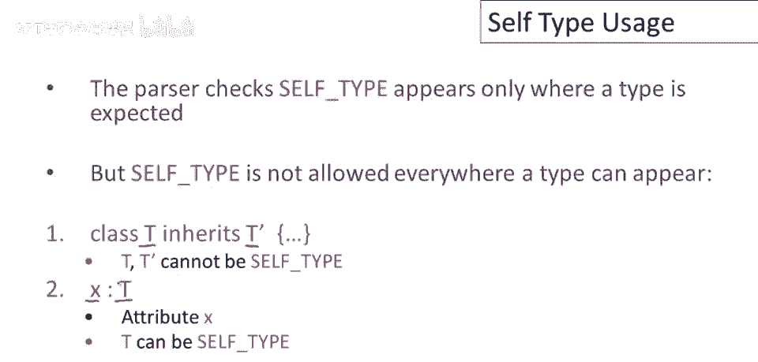

# 课程 P53：自类型 (`Self`) 的使用规则 🧩


在本节课中，我们将要学习 Scala 中自类型（`Self` 类型，通常写作 `this.type` 或 `T` 在上下文中）的具体使用规则。自类型是一个特殊的类型，它代表当前对象的精确类型，对于实现一些高级的面向对象模式非常有用。我们将详细探讨它可以在哪些地方使用，以及为什么在某些地方被禁止。

上一节我们介绍了自类型的基本概念，本节中我们来看看它在代码中的具体应用场景和限制。

## 自类型的基本规则 📏



自类型不是一个具体的类名，因此它不能出现在类定义中作为类名或继承的父类。然而，在声明属性时，属性的类型可以是自类型。

以下是自类型允许出现的位置：


*   **属性声明**：声明一个类型为自类型的属性是允许的。
    ```scala
    class MyClass {
      val mySelf: this.type = this // 允许
    }
    ```
*   **局部变量**：在方法内部，使用 `let` 或 `val` 绑定一个自类型的局部变量是允许的。
*   **对象创建**：使用 `new T` 创建一个新的自类型对象是允许的，并且它会创建一个与当前 `self` 对象动态类型相同的新对象。

## 自类型的禁止场景 🚫

解析器检查自类型时，规则比实际更宽松。有些地方看似可以出现其他类型，但自类型不行。

以下是自类型不允许出现的位置：

*   **类定义**：自类型不能作为类的名称，也不能出现在 `extends` 或 `with` 后面作为父类。
*   **美学调度（Aesthetic Dispatch）**：在类似模式匹配或类型调度的场景中，命名的类型必须是一个具体的类名，不能是自类型。
*   **方法参数类型**：**方法的形式参数类型不能是自类型**。这是一个关键限制。

## 为什么方法参数不能是自类型？ 🤔

上一节我们列出了规则，本节中我们重点理解为什么方法参数禁止使用自类型。这主要有两个原因。

首先，从类型系统的角度考虑。假设我们有一个方法调用 `e.m(e')`，其中实际参数 `e'` 的类型为 `T0`。根据方法调用规则，`T0` 必须是形式参数声明类型的子类型。如果允许形式参数为自类型 `S`，那么就需要证明 `T0 <: S`。然而，自类型 `S` 可以代表当前类及其所有子类型，我们通常无法证明一个具体的类型 `T0` 是这种“动态范围”类型的子类型，这会导致类型系统无法进行安全的推导。

其次，通过一个代码示例可以更直观地理解。考虑以下类结构：
```scala
class A {
  def comp(other: this.type): Boolean = { ... } // 假设允许
}

class B extends A {
  val b: Int = 10
  override def comp(other: this.type): Boolean = {
    this.b == other.b // 这里会出问题！
  }
}
```
现在看使用代码：
```scala
val x: A = new B() // 静态类型A，动态类型B
x.comp(new A())    // 传递一个A的实例
```
类型检查时，由于 `x` 的静态类型是 `A`，参数 `new A()` 也是 `A` 类型，所以通过。但在运行时，由于 `x` 的动态类型是 `B`，会调用 `B` 类中的 `comp` 方法。该方法试图访问参数 `other` 的 `b` 字段，但传入的参数动态类型是 `A`，根本没有 `b` 字段，这将导致程序崩溃。

因此，禁止自类型作为方法参数类型，是保证类型安全和避免运行时错误的关键设计。

## 方法返回类型的特殊允许 ✅

与方法参数不同，**方法的返回类型可以是自类型**。这是允许且常见的，常用于实现链式调用（Fluent Interface）等模式。

考虑一个简单的方法定义：
```scala
def exampleMethod(x: SomeType): this.type = {
  // ... 一些操作
  this // 返回当前对象自身
}
```
这里，形式参数 `x` 的类型 `SomeType` 必须是具体类型，而返回类型 `this.type` 是允许的自类型。调用该方法后，返回值的精确类型与调用者对象的动态类型一致，这非常有用。


本节课中我们一起学习了 Scala 自类型（`Self`）的核心使用规则。我们明确了它可以在属性、局部变量和对象创建中使用，也可以作为方法的返回类型，以实现灵活的设计。同时，我们重点理解了它不能用于类定义、类型调度，尤其是**不能作为方法参数类型**的原因——这是为了维护类型系统的健全性和避免运行时错误。掌握这些规则，能帮助你在实践中更安全、有效地使用自类型这一强大特性。