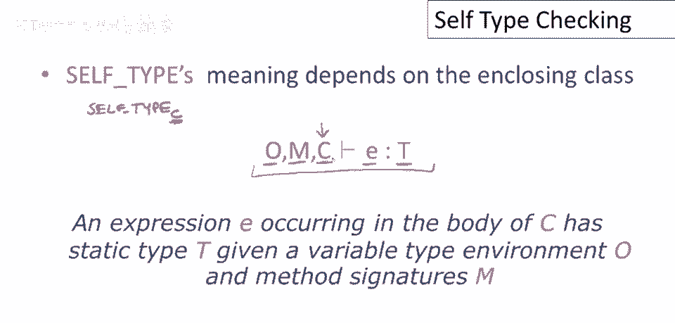
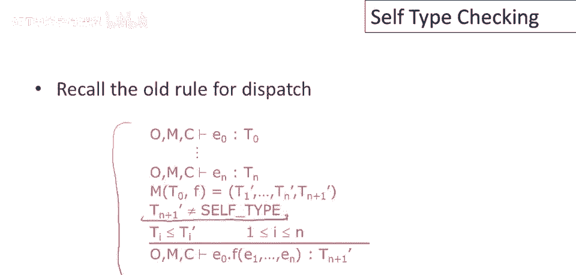
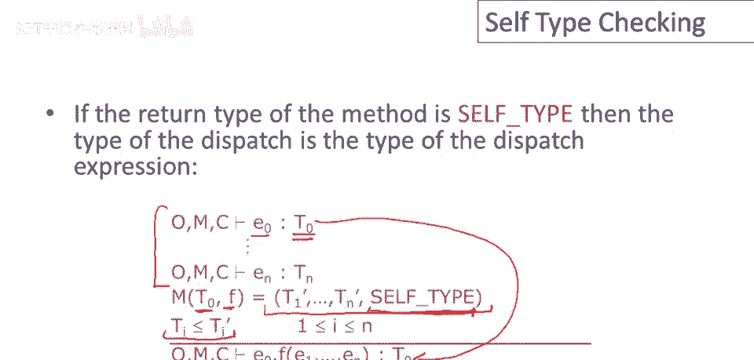
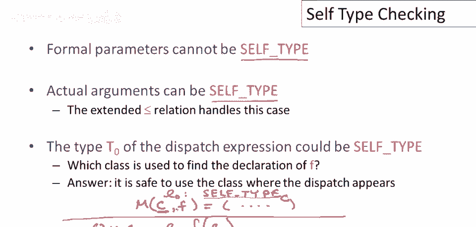
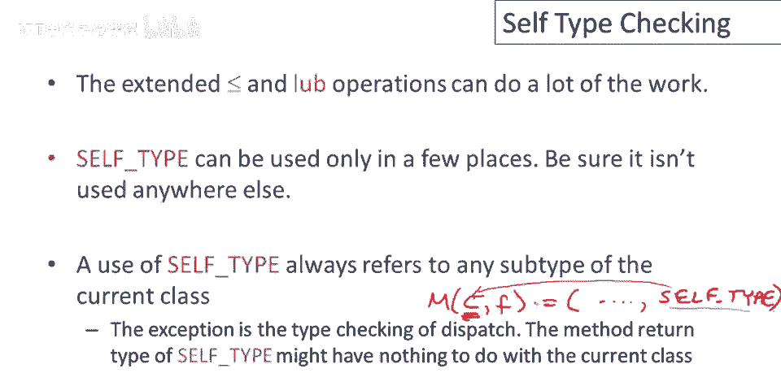
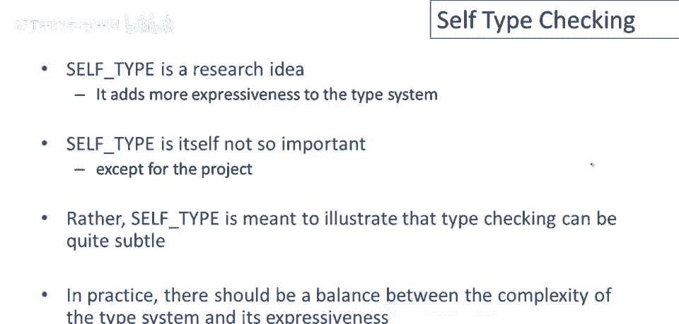

# 课程 P54：自类型检查规则详解 🧩


在本节课中，我们将学习如何将自类型（Self Type）的概念融入 COOL 语言的类型检查规则中。我们将回顾现有的规则，并详细解释在引入自类型后，哪些规则需要调整以及如何调整。

---

## 回顾 COOL 类型检查规则



上一节我们介绍了自类型的基本概念，本节中我们来看看如何将其融入类型检查。

COOL 的类型检查规则在逻辑上表现为一系列判断句，用于证明在特定环境下，表达式具有某种类型。这个环境包括：
*   对象标识符的类型假设（记作 `o`）。
*   方法的签名和所属类（记作 `m`）。
*   当前进行类型检查的类（记作 `c`）。


引入“当前类 `c`”这一环境信息至关重要，因为自类型 `SELF_TYPE` 的具体含义依赖于它所在的类。回忆一下，我们用 `SELF_TYPE_C` 来表示在类 `C` 中出现的自类型。因此，在类型检查过程中，我们必须时刻跟踪当前所在的类 `c`，以便正确理解遇到的 `SELF_TYPE`。

---



## 融入自类型后的通用规则

在引入了自类型并扩展了子类型（`<:`）和最小上界（`lub`）操作的定义后，许多类型检查规则的形式可以保持不变。

例如，赋值规则看起来和之前一样：
```
Γ, o, m, c ⊢ e0 : T0
Γ, o, m, c ⊢ e1 : T1
T1 <: T0
------------------------------------ [ASSIGN]
Γ, o, m, c ⊢ e0 <- e1 : T1
```
但请注意，这里的子类型关系 `T1 <: T0` 现在使用的是包含了自类型的新定义。因此，这条规则现在同样适用于 `SELF_TYPE` 和普通类名。

---



## 需要调整的规则：动态分发

对于动态分发（即普通的方法调用），当方法的返回类型不是 `SELF_TYPE` 时，规则无需改变。这条规则的核心限制是：**方法的返回类型不能是 `SELF_TYPE`**。而这正是自类型想要突破的限制，以实现更丰富的表达能力。

因此，我们需要为返回类型是 `SELF_TYPE` 的情况制定新规则。以下是动态分发的新规则：

检查形如 `e0.f(e1, ..., en)` 的表达式：
1.  在环境 `(Γ, o, m, c)` 下，分别对表达式 `e0`, `e1`, ..., `en` 进行类型检查。
2.  设 `e0` 的类型为 `T0`。
3.  在类 `T0` 中查找方法 `f`，获取其签名 `(T1, ..., Tn) -> T_r`。
4.  检查每个实际参数 `ei` 的类型是否与对应的形式参数类型 `Ti` 兼容（即满足子类型关系 `T_ei <: Ti`）。
5.  如果以上检查都通过，并且返回类型 `T_r` 是 `SELF_TYPE`，那么整个表达式的类型就是 `T0`（即 `e0` 的类型）。



**公式描述：**
```
Γ, o, m, c ⊢ e0 : T0
Γ, o, m, c ⊢ e1 : T1'
...
Γ, o, m, c ⊢ en : Tn'
mbody(f, T0) = (x1:T1, ..., xn:Tn): SELF_TYPE
∀i. Ti' <: Ti
------------------------------------ [DISPATCH-SELF]
Γ, o, m, c ⊢ e0.f(e1, ..., en) : T0
```


**关键点解析：**
*   方法的正式参数类型不能是 `SELF_TYPE`，但实际参数的类型可以是。扩展后的子类型关系会处理这种情况。
*   如果 `e0` 的类型就是 `SELF_TYPE_C`（在当前类 `c` 中），那么在查找方法时，我们可以安全地将 `SELF_TYPE_C` 替换为 `C` 来进行查找。

---

## 需要调整的规则：静态分发


静态分发（即 `e0@T.f(e1, ..., en)`）的规则也需要类似的更新。

当方法返回类型不是 `SELF_TYPE` 时，规则不变。当返回类型是 `SELF_TYPE` 时，规则如下：


检查形如 `e0@T.f(e1, ..., en)` 的表达式：
1.  在环境 `(Γ, o, m, c)` 下，分别对表达式 `e0`, `e1`, ..., `en` 进行类型检查。
2.  设 `e0` 的类型为 `T0`，且必须满足 `T0 <: T`（`T` 是静态指定的类名）。
3.  在类 `T`（而不是 `T0`）中查找方法 `f`，获取其签名 `(T1, ..., Tn): SELF_TYPE`。
4.  检查参数类型兼容性：`∀i. T_ei <: Ti`。
5.  如果检查通过，整个表达式的类型是 `T0`。

**公式描述：**
```
Γ, o, m, c ⊢ e0 : T0
T0 <: T
Γ, o, m, c ⊢ e1 : T1'
...
Γ, o, m, c ⊢ en : Tn'
mbody(f, T) = (x1:T1, ..., xn:Tn): SELF_TYPE
∀i. Ti' <: Ti
------------------------------------ [STATIC-DISPATCH-SELF]
Γ, o, m, c ⊢ e0@T.f(e1, ..., en) : T0
```

**关键点解析：**
*   这里的结果类型是 `T0` 而不是 `T`。因为即使我们静态调用了类 `T` 中的方法，`self` 参数（即 `e0`）的运行时类型仍然是 `T0`。方法的返回类型 `SELF_TYPE` 指的是这个 `self` 参数的类型。

---


## 关于 `self` 和 `new SELF_TYPE` 的规则

此外，还有两条直接涉及自类型的简单规则：
*   `self` 表达式：在类 `c` 中，`self` 具有类型 `SELF_TYPE_C`。
    ```
    ------------------------------ [SELF]
    Γ, o, m, c ⊢ self : SELF_TYPE_C
    ```
*   `new SELF_TYPE` 表达式：在类 `c` 中，`new SELF_TYPE` 创建一个类型为 `SELF_TYPE_C` 的对象。
    ```
    ------------------------------ [NEW-SELF]
    Γ, o, m, c ⊢ new SELF_TYPE : SELF_TYPE_C
    ```

---



## 实现自类型检查的要点总结

本节课中我们一起学习了如何为包含自类型的 COOL 语言设计类型检查规则，以下是核心总结：

1.  **基础工作**：扩展子类型和最小上界操作的定义是核心。完成这一步后，大多数类型规则无需修改。
2.  **主要更改点**：需要为**动态分发**和**静态分发**中，方法返回类型为 `SELF_TYPE` 的情况制定特殊规则。这两条规则的结果类型都是调用者表达式（`e0`）的类型 `T0`。
3.  **使用限制**：自类型只能在语言允许的少数几个地方（如 `self`、`new SELF_TYPE`、方法返回类型）使用。类型检查器必须确保它没有在其他地方被非法使用。
4.  **类型查找中的自类型**：在分发规则的方法查找步骤中，我们可能会在某个类 `T` 中找到返回类型为 `SELF_TYPE` 的方法。这个 `SELF_TYPE` 指的是类 `T` 中的自类型，与当前类型检查的类 `c` 可能无关。幸运的是，在 COOL 的规则中，我们不需要比较不同类上下文中的 `SELF_TYPE`，避免了复杂的交叉处理。



自类型是一个增强类型系统表达能力的学术概念，它展示了类型检查不仅仅是简单的类型匹配，还涉及复杂的上下文推理。在实际语言设计中，需要在表达能力和类型系统的复杂性之间取得平衡。通过本课程，我们深入理解了这一复杂但强大的特性是如何被整合到形式化类型检查框架中的。