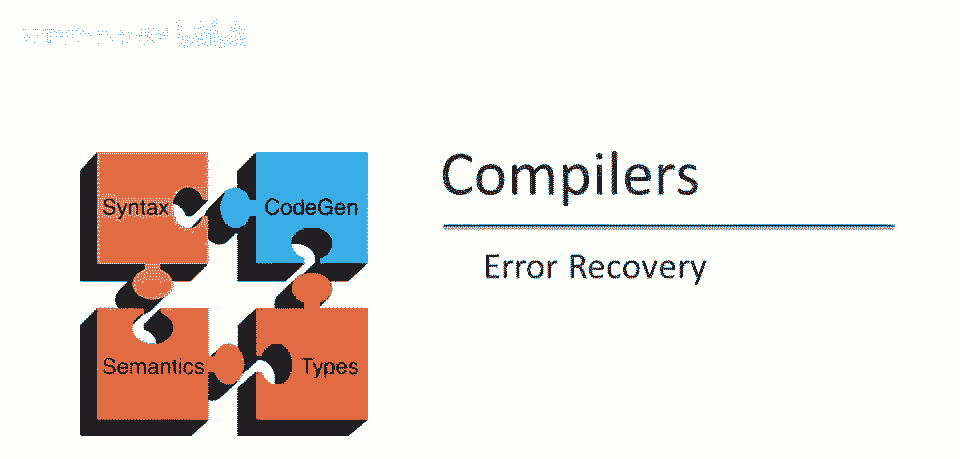
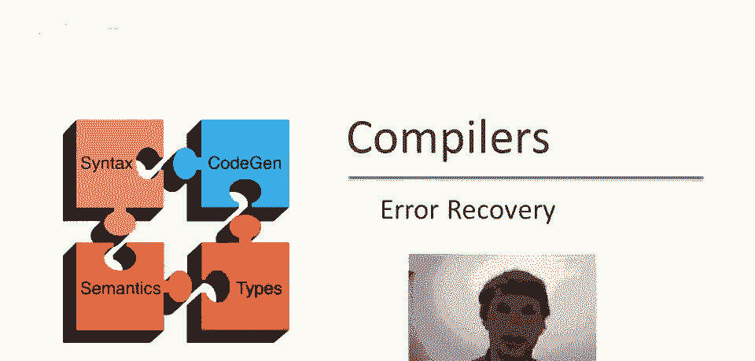

# 课程 P55：类型检查中的错误恢复 🛠️



在本节课中，我们将结束关于类型检查的系列讨论，重点学习如何从类型检查过程中遇到的错误中恢复。我们将探讨两种主要的恢复策略，并分析它们的优缺点。

与词法分析、语法分析等所有前端阶段一样，从类型检查中恢复错误非常重要。但与语法分析不同，从类型检查器中恢复错误要容易得多，因为我们已经有了抽象语法树，因此无需像在语法分析之前那样跳过代码的部分。

在知道程序的结构存在问题之前，类型检查器通过结构归纳工作，它不能停止。因此，如果我们发现某个子表达式没有可以赋予它的有意义的类型，我们仍然必须对它进行处理，以便可以继续类型检查它周围的表达式。

## 策略一：使用 `object` 类型进行恢复

一种可能性是简单地分配类型 `object` 作为任何错误类型表达式的类型。


这里的直觉是，即使我们无法确定表达式的类型应该是什么，可以肯定的是，它是某种 `object` 的子类型。因此，将任何表达式分配为 `object` 类型肯定是安全的。

让我们考虑这种策略在简单代码片段中的应用。

以下是示例代码片段：
```java
int y = x + 2;
```
我们假设这里的 `x` 未定义。实际上代码中有一个错误，那就是 `x` 没有绑定，所以 `x` 没有任何类型。

那么当我们类型检查这个时会发生什么？我们将递归地向下遍历抽象语法树，最终会到达叶子节点并尝试类型检查 `x`。然后我们会发现 `x` 没有任何地方有类型，这将导致一个错误消息，说 `x` 未定义。

为了继续类型检查以恢复，我们将不得不分配一个类型。因此，我们将假设 `x` 的类型为 `object`，因为那是我们的恢复策略。

然后我们将继续类型检查。当我们向上遍历抽象语法树时，接下来将尝试类型检查这个加法操作。我们将看到我们正在将类型为 `object` 的东西添加到整数。当然，加法不适用于类型为 `object` 的东西。

因此我们将得到一个错误，类似于“加法应用于 `object`”。然后我们现在必须决定，既然我们不能类型检查这个加法，那么 `x + 2` 的类型是什么？当然，我们的恢复策略是，它也有类型 `object`。

现在抽象语法树中的下一个部分是这里的初始化赋值。我们将 `y` 赋值为这个表达式的结果，但我们无法类型检查这个表达式，所以它具有 `object` 类型。现在，类型检查器看到，我们将类型为 `object` 的东西赋值给类型为 `int` 的东西。我们得到了第三个错误，说我们有一种错误的赋值。

所以这里的问题是，这种简单的恢复策略虽然奏效，如果我们恢复，我们继续类型检查，但一个错误可能引发更多错误。这是一个可行的解决方案，它实现了恢复目标，但通常会导致连锁错误。一旦有一个类型错误，该类型错误将导致更多错误，因为 `object` 类型的东西能做的操作不多，而代码可能假设更特定的类型。这些错误将向上传播至抽象语法树。

## 策略二：引入 `Untyped` 类型

另一种可能是引入新类型，专为错误类型表达式设计的节点类型 `Untyped`。`Untyped` 并不特殊，不是程序员可用的类型，仅编译器可用，用于错误恢复和类型检查。


`Untyped` 的特殊性质是，它将是所有其他类型的子类型。如果你记得，`object` 是相反的，`object` 是所有类型的超类型。`object` 有坏处，因为 `object` 上定义的方法很少。所以，如果你将类型 `object` 插入到期望其他类型的地方，很可能类型检查不会通过。

我们可以通过引入 `Untyped` 来解决这个问题。`Untyped` 将有特殊属性，即每个操作都定义于 `Untyped`。此外，我们将说它产生 `Untyped` 作为结果。所以，语言中任何接受类型参数的操作，如果参数是 `Untyped`，将产生类型结果为 `Untyped`。因此 `Untyped` 类型将向上传播。

现在让我们看看相同的代码片段，分析一下如果我们使用 `Untyped` 类型会发生什么。

我们再次遍历抽象语法树，到达这个叶子 `x`。我们看到 `x` 未定义，我们产生一个错误，说 `x` 未定义。然后需要给 `x` 赋类型，因此我们说 `x` 的类型为 `Untyped`。

现在考虑加法操作。加法接受类型为 `Untyped` 和整数，这样不错，不会报错，被认为是类型正确，结果也为 `Untyped` 类型。

现在进行赋值。`Untyped` 与任何类型不兼容，`Untyped` 不是任何类型的子类型。此赋值也类型正确，该阶段也不会报错。

所以你可以看到，`Untyped` 类型向上传播到抽象语法树，就像 `object` 类型之前一样。但由于 `Untyped` 是一种特殊类型，仅用于错误恢复，我们可以将其与其他常规类型区分开来。我们知道不应该在产生第一个错误消息后打印出后续的错误消息。

## 两种策略的对比与选择

真正的编译器，生产编译器将使用类似 `Untyped` 的东西进行错误恢复。但 `Untyped` 存在实现问题。


特别是，`Untyped` 是所有其他类的子类型这一事实，意味着类层次结构不再是树。如果你考虑一下，你有一个 `object` 在顶部，然后有一个树形结构向外分支。但 `Untyped` 是所有类型的子类型，所以 `Untyped` 成为底部元素。现在是一个有向无环图，而不是树。

这使得实现稍微困难一些，而不是只能使用树算法。现在你必须有，要么为 `Untyped` 设置特殊情况，要么做更一般的事情，这只是额外的麻烦。

我个人认为不值得为课程项目做。我建议你使用 `object` 解决方案。

---


本节课中我们一起学习了类型检查中的错误恢复。我们介绍了两种主要策略：使用 `object` 类型和使用 `Untyped` 类型。`object` 策略简单但可能导致连锁错误；`Untyped` 策略更优雅但实现更复杂。对于课程项目，建议采用简单的 `object` 类型恢复策略。