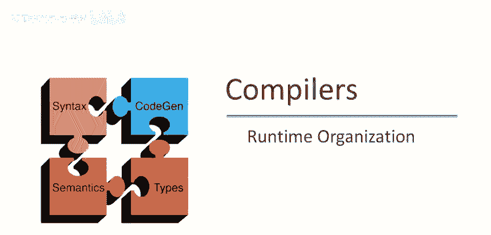
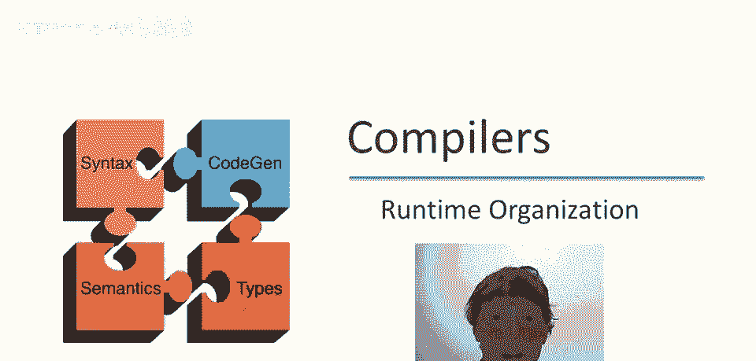
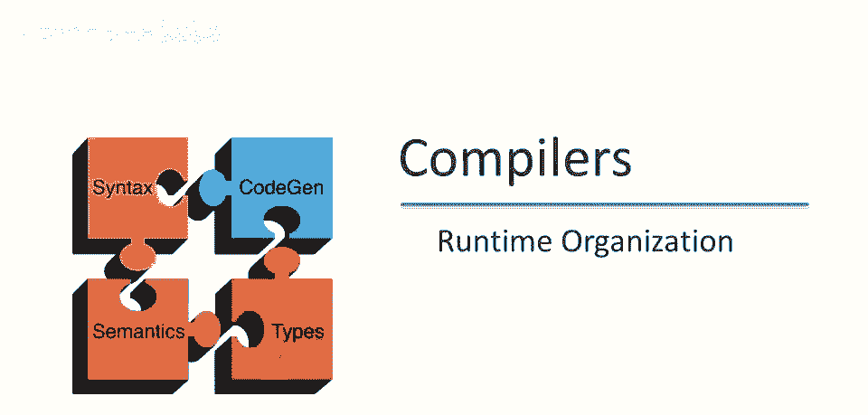
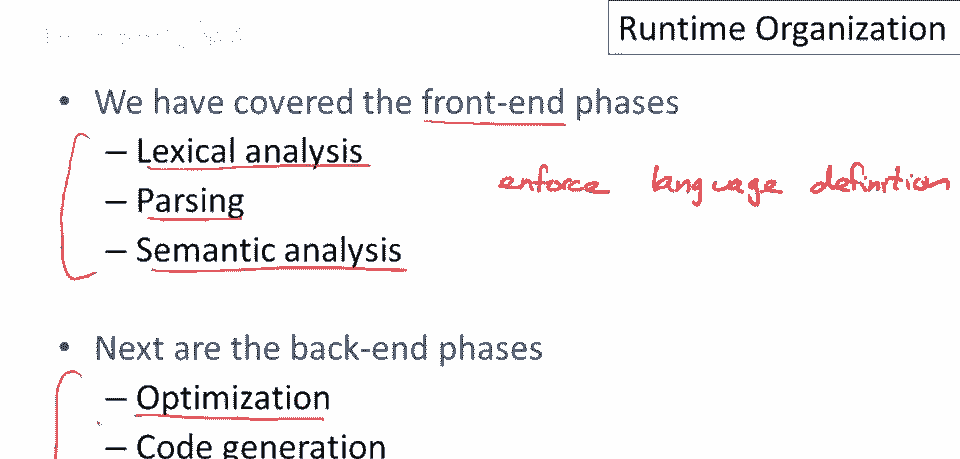
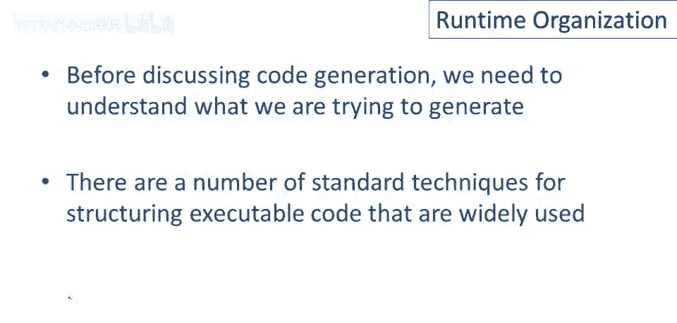
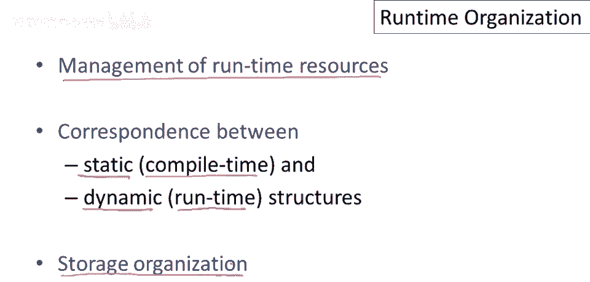
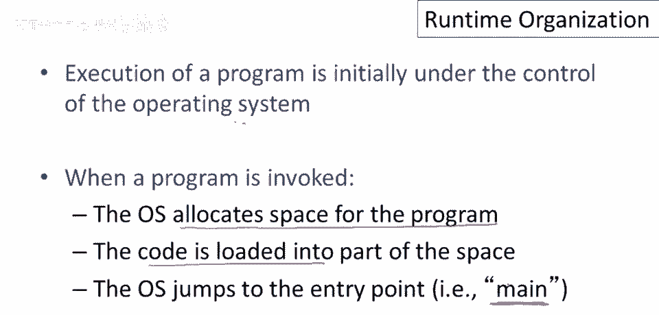
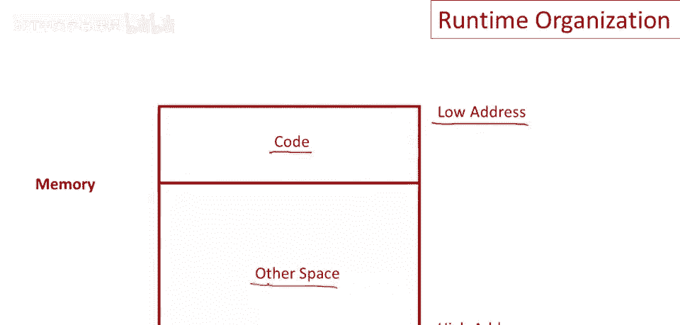
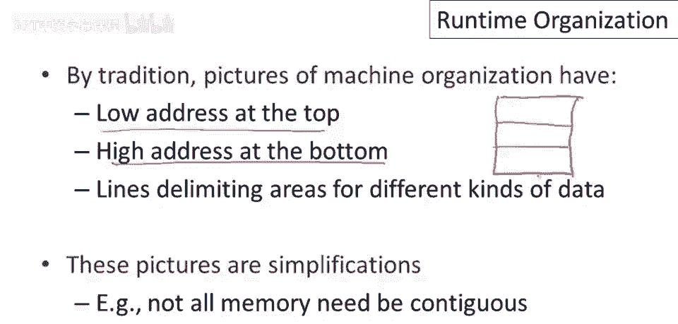
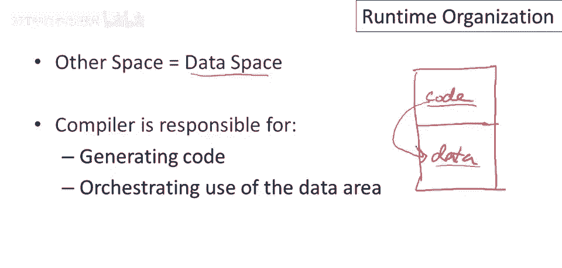

# 课程 P56：运行时组织基础 🧠



在本节课中，我们将要学习编译器后端工作的起点——运行时系统。我们将探讨程序在内存中是如何被组织和管理的，这是理解代码生成和程序优化的基础。



## 概述：从编译器前端到后端

上一节我们介绍了编译器前端的全部工作，包括词法分析、语法解析和语义分析三个阶段。这三个阶段共同完成了检查程序是否符合语言定义的任务。

一旦前端工作完成且没有发现错误，程序就被确认为有效的。此时，编译器的工作重心转向生成可执行代码，这属于后端的范畴。代码生成是后端的一部分，另一大部分是程序优化。

但在讨论如何生成代码之前，我们需要先明确**要生成什么**。因此，我们首先需要理解翻译后的程序及其在运行时的组织结构。



## 为什么需要了解运行时组织？ 🤔

理解运行时组织至关重要，因为它定义了代码生成的目标。我们需要先知道程序在内存中如何布局，然后才能讨论生成这些布局的算法。这是一个有成熟标准技术的领域，本课程将涵盖这些内容，并鼓励你在项目中使用。



## 核心概念：静态结构与动态结构

本系列视频的核心内容是运行时资源管理。其中，最关键的是理解**静态结构**与**动态结构**的区别：
*   **静态结构**：在**编译时**就存在并确定的结构。
*   **动态结构**：在程序**运行时**才创建和存在的结构。

清晰地区分编译器所做的工作（编译时）和生成的目标程序所做的工作（运行时），是真正理解编译器原理的关键。我们还将讨论**存储组织**，即内存如何被用来存储程序运行时的各种数据。



## 程序如何开始运行？ 🚀

最初，只有操作系统在机器上运行。当用户要求运行一个程序时，会发生以下步骤：
1.  操作系统为程序分配内存空间。
2.  程序的代码被加载到该内存空间中。
3.  操作系统执行跳转，指向程序的入口点（例如 `main` 函数）。
4.  你的程序开始运行。



## 内存布局一览

当操作系统开始执行一个编译好的程序时，内存的组织大致如下图所示。我们通常将内存画成一个矩形，**低地址在顶部，高地址在底部**，这只是一种绘图惯例。

```
+------------------+ 低地址
|     代码区       |
|  (程序指令)      |
+------------------+
|                  |
|     数据区       |
|  (程序数据)      |
|                  |
+------------------+ 高地址
```



*   整个矩形代表操作系统分配给该程序的所有内存。
*   其中一部分空间包含程序的**代码**（即编译后的机器指令），通常位于内存空间的一端（例如低地址端）。
*   剩余的大部分空间则用于存储程序的**数据**。

> **关于图示的说明**：这些内存布局图都是简化的。在实际的虚拟内存系统中，并不能保证这些区域在物理上是连续的。但这种简化有助于我们理解不同类型的数据及其管理方式。

## 代码与数据的协同设计

回到运行时组织图，我们有存放代码的区域和存放数据的区域。代码生成的难点在于，**编译器**需要同时负责：
*   **生成操作代码**。
*   **编排数据布局**。



编译器必须决定数据在内存中如何摆放，并生成能够正确操作这些数据的代码。代码中会包含对数据的引用。因此，**代码生成和数据布局必须共同设计**，以确保生成的程序能够正确运行。

实际上，程序中不止有一种类型的数据。在下一个视频中，我们将深入探讨不同种类的数据，以及数据区内不同区域的区别。

## 总结



本节课中，我们一起学习了运行时组织的基本概念。我们了解到编译器后端的工作始于对程序运行环境的理解，关键是要区分**编译时**的静态结构和**运行时**的动态结构。程序启动时，其内存被划分为**代码区**和**数据区**，而编译器的核心任务之一就是协同设计代码生成与数据布局，为后续的代码生成算法打下基础。