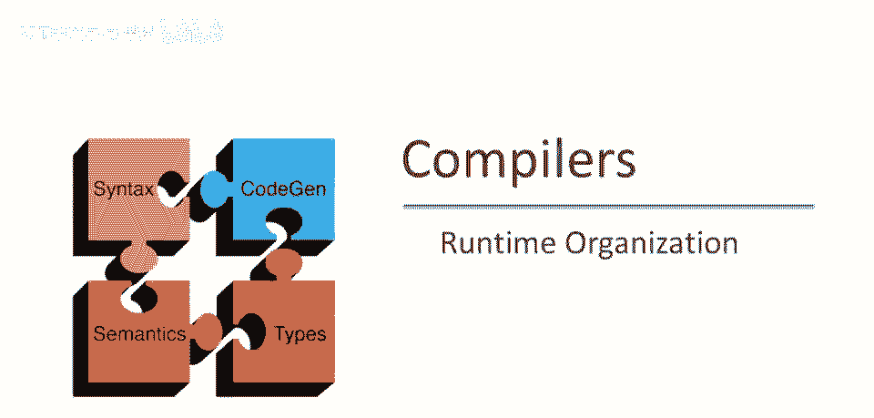
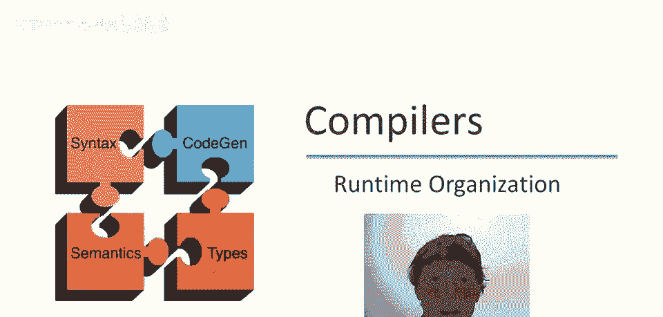
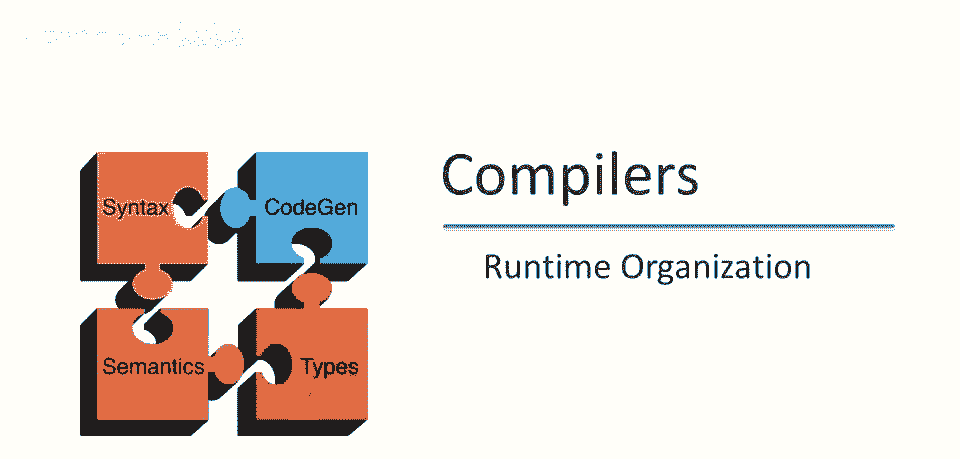
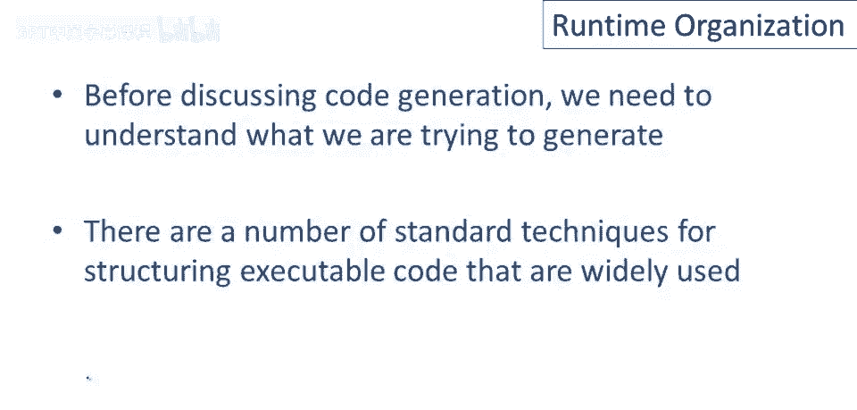
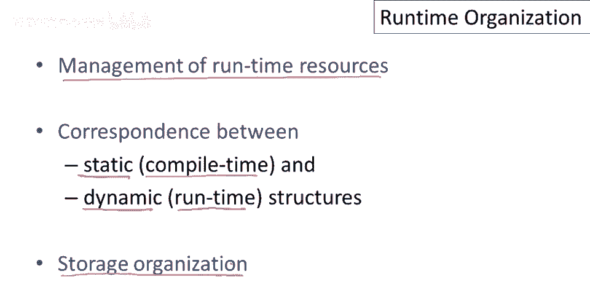
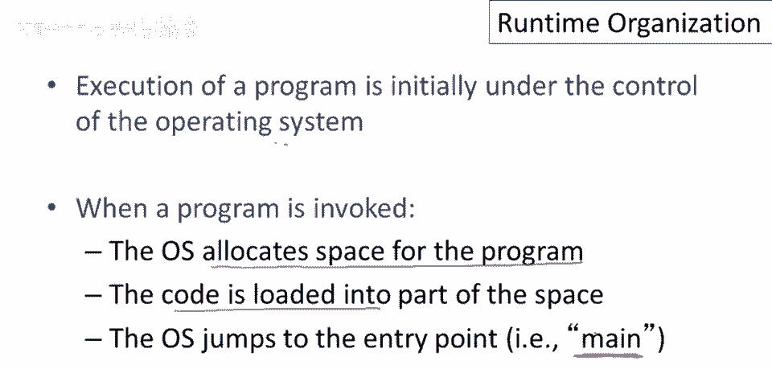
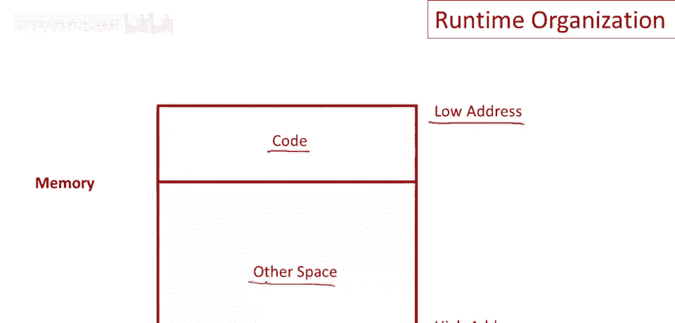
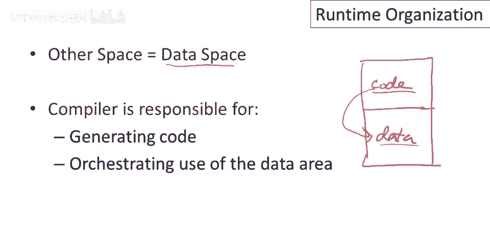

# P56：p56 11-01-_Runtime_Organiza - 加加zero - BV1Mb42177J7

本视频中，我们将开始讨论运行时系统。

现在这一点，实际上我们已涵盖编译器前端全部，包括三个阶段，词法分析，解析和语义分析，这三个阶段或这三个步骤一起，其工作是真正执行语言语义或语言定义，因此我们知道，这三阶段完成后，若无错误产生。

程序实际上为编译语言的有效程序，此时编译器将能产生代码，生成程序的可执行翻译，应说明的是，当然，执行语言定义仅前端目的之一，前端还构建生成代码所需的数据结构，如我们所见，一旦通过前端，真正变化是。

我们不再试图判断是否为有效程序，现在真正开始生成代码，这是后端的工作，代码生成当然是其中一部分，后端另一大部分是程序优化，进行改进程序的转换，但在谈论任何一件事之前，我们需要谈论，运行时组织。

为什么需要了解，因为我们需要知道，在谈论如何生成和如何有意义之前，我们试图生成什么，首先讨论翻译程序，及其组织结构，然后讨论算法，代码生成，实际产生这些的算法，这是一个理解良好的领域。

至少有一些广泛使用的标准技术，这些是我们将涵盖并鼓励你在项目中使用的。

本系列视频主要内容，是运行时资源管理，特别是，我将强调静态和动态结构的对应和区别，因此，静态结构是编译时存在的，动态结构是运行时存在的，这可能是你最需要理解的区别，如果你想真正理解编译器的工作原理。

编译时发生了什么，运行时发生了什么，在脑海中清楚地分离编译器所做的工作，以及推迟到目标程序或生成的程序实际运行时的工作，这是真正理解编译器工作原理的关键，我们还将讨论存储组织。

所以内存如何用于存储执行程序的数据结构。

所以让我们从开始开始，嗯，所以最初，嗯，操作系统是唯一在机器上运行的程序，当程序被调用时，当用户说他想要运行一个程序时，操作系统将分配空间给程序时发生了什么，程序的代码将被加载到该空间中。

然后操作系统将执行跳转到入口点，或程序的主要函数，然后你的程序将开始运行。

所以让我们看看内存的组织大致是什么样子，当操作系统开始执行编译的程序时，我们将像这样绘制内存的图片，将有一个大块，有一个起始地址在低地址和高地址，这是分配给程序的所有内存。

其中一部分空间将包含程序的代码，程序的实际编译代码将被加载，通常在分配给程序的内存空间的一端，然后有一大块其他空间，嗯，将用于其他事情，我们将在下一分钟内讨论这一点。

在继续之前，我想说几句关于这些运行时组织图片的话，因为我将在接下来的几个视频中画很多这样的图片，所以传统上将内存绘制为矩形，低地址在顶部，高地址在底部，这并没有什么魔力，这只是一种惯例。

我们完全可以颠倒地址的顺序，这没什么大不了的，然后我们将绘制线条来划分内存的不同区域，显示不同类型的数据，以及它们在分配给程序的内存中是如何存储的，显然这些图片都是简化的，如果这个是一个虚拟内存系统。

例如，没有保证这些数据实际上是以连续的方式排列的，但有助于理解，你知道不同类型的数据是什么以及编译器需要做什么，嗯，才能有像这样简单的图片。

所以回到我们的运行时组织图片，我们有一块内存，其中第一部分是程序实际生成的代码，然后有那个其他空间，里面有什么，程序数据在此空间，所有数据在其余空间，代码生成难点在于编译器，负责生成代码和编排数据。

编译器需决定数据布局，并生成正确操作数据的代码，代码中引用数据，当然，代码与数据需共同设计，代码与数据布局，请共同设计，确保生成程序正确运行，现在，实际上不止一种数据，编译器会感兴趣。

下视频将讨论不同种数据，以及数据区不同种类的区别。

