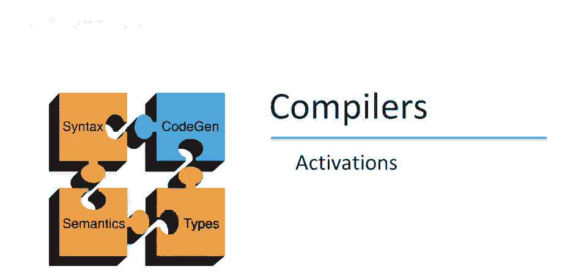
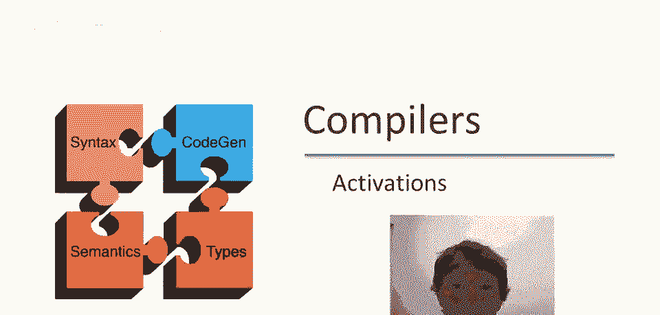
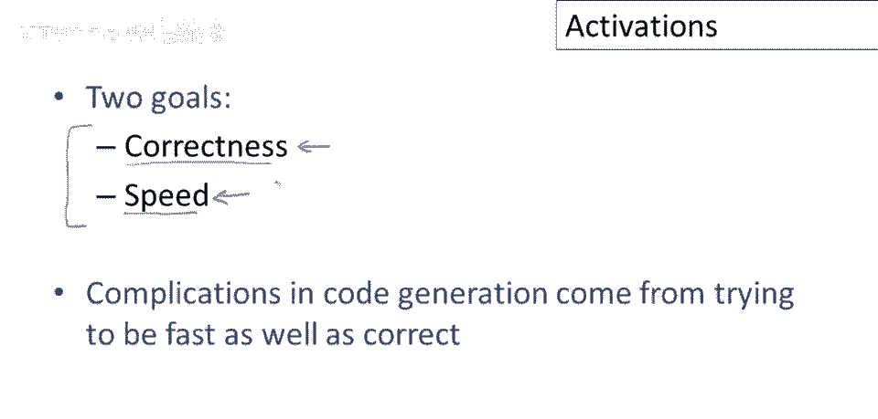
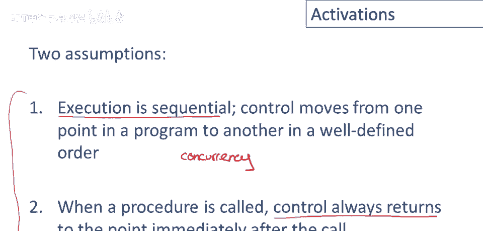
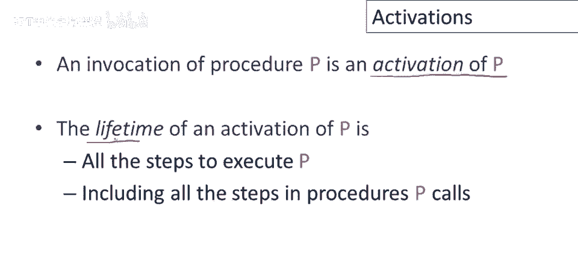
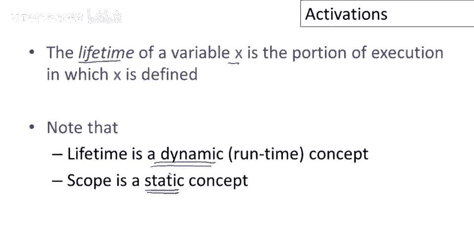
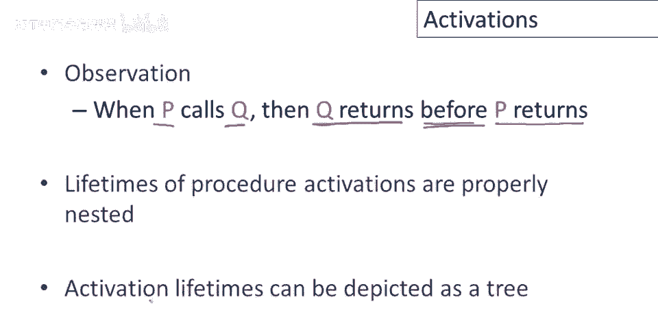
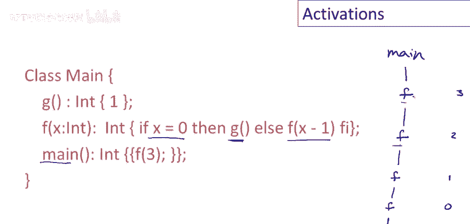
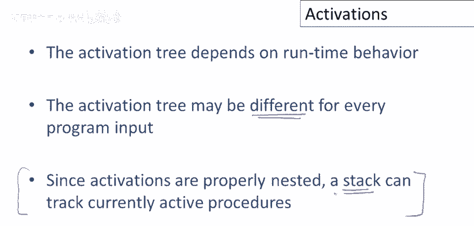
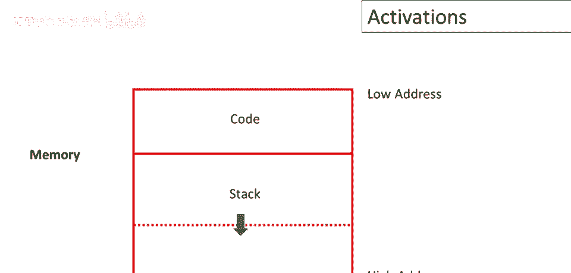

# 课程 P57：运行时结构与过程激活 🧠



在本节课中，我们将学习代码生成中的核心概念——**过程激活**。我们将探讨如何通过理解程序的运行时结构，来生成既正确又高效的代码。课程将从激活的基本定义开始，逐步深入到其实现方式，特别是如何利用**栈**来管理激活。

---

## 概述：代码生成的两个目标

在代码生成中，我们有两个总体目标。
第一个目标是**正确生成代码**，即忠实实现程序员的程序。
第二个目标是**高效**，生成的代码应充分利用资源，特别是要运行快速。

这两个目标需要同时解决。
如果只关心正确性，生成代码很简单，但可能很慢。
如果只关心速度而不关心正确性，生成代码更容易，但会得到错误答案。
因此，代码生成的所有复杂性都来自于试图同时解决这两个问题。
一个复杂的框架已经发展出来，用于说明如何生成代码和构建运行时结构以实现这两个目标。
谈论它的第一步是谈论**激活**。



---

## 基本假设

我们将对生成代码的编程语言类型做出两个假设。

第一个假设是**执行是顺序的**。
给定我们执行了一个语句，下一个将被执行的语句很容易预测。
实际上，它只是我们刚刚执行的语句的函数。
因此，控制将从程序中的一个点移动到另一个点，遵循某种明确的顺序。

第二个假设是**当过程被调用时，控制将始终返回调用点后的点**。
也就是说，如果我执行一个过程 `F`，一旦 `F` 完成，执行控制将始终返回调用 `F` 的点的下一句。

当然，存在违反这些假设的编程语言和特性。
违反假设一的最重要的编程语言类别是那些具有**并发性**的。
在并发程序中，仅仅因为我执行了一个语句，没有简单的方法可以预测下一个将被执行的语句，因为它可能在完全不同的线程中。

对于假设二，高级控制结构如**异常**和 `call/cc`（如果你知道它是什么）会违反假设。
特别是，在 Java 和 C++ 中抛出异常时，异常可能在被捕捉前逃逸多个过程。
因此，当你调用一个过程时，无法保证该过程抛出异常后控制会立即返回过程后的点。

本课余下部分将使用这些假设。
未来视频中会简略讨论如何适应这些高级特性。
我们将涵盖的内容是所有实现的基础，即使有并发和异常的语言，也基于我们将讨论的想法。

---



## 激活与生命周期的定义

首先定义，当我们调用过程 `p` 时，将称其为**过程 `p` 的激活**。
过程 `p` 激活的**寿命**，将是执行过程 `p` 所涉及的所有步骤，包括 `p` 调用的所有步骤。
所以将是所有从 `p` 被调用至返回的所有语句，包括所有 `p` 自身调用的函数或过程。



我们可以定义变量的类似生命周期。
所以变量 `x` 的**生命周期**，将是 `x` 被定义的执行部分。
这意味着从 `x` 首次创建，至被销毁或分配的所有执行步骤。

注意，**生命周期是动态的**，这适用于正在执行的程序。
我们讨论的是变量首次存在的时刻，直到它消失并超出范围的时刻。
另一方面，**作用域是一个静态概念**，它指的是程序文本中变量可见的部分。
这与变量的生命周期是完全不同的概念。
再次强调，在脑海中区分运行时（动态）和编译时（静态）发生什么是很重要的。

---

## 激活的嵌套与激活树



结合我们之前的假设，我们可以做一个简单观察：当过程 `p` 调用过程 `q` 时，`q` 将在 `p` 返回之前返回。
这意味着过程的生命周期将**正确嵌套**。
此外，这意味着我们可以用**激活树**来形象地表示这种嵌套关系。

以下是一个简单的例子来说明激活树。



```java
// 示例程序
class Example {
    void main() {
        g();
        f();
    }
    void f() {
        g();
    }
    void g() {
        // 做一些事情
    }
}
```

对于这个程序，第一个激活（激活树的根）是 `main` 方法。
`main` 将调用方法 `g`，`g` 的生存期完全包含在 `main` 的执行期间。
因此，我们可以使 `g` 成为 `main` 的子节点，表明 `main` 调用 `g`。
`g` 返回后，`main` 将调用 `f`，因此 `f` 也将是 `main` 的子节点。
然后 `f` 本身将再次调用 `g`，所以它将有一个 `g` 的另一个激活作为子节点。

这棵树说明了若干件事：
*   它显示了生存期的包含（例如，`g` 的生存期包含在 `main` 内）。
*   它显示了一些生存期关系（例如，`g` 的激活和 `f` 的激活的生存期完全不重叠，因为它们是树中的兄弟节点）。
*   激活树中可以有相同方法的多次出现（每次方法被调用都是一个单独的激活）。

这是一个涉及递归函数的更复杂例子：

```java
// 递归示例
class RecursiveExample {
    void main() {
        f(3);
    }
    void f(int n) {
        if (n == 0) {
            g();
        } else {
            f(n - 1);
        }
    }
    void g() {
        // 做一些事情
    }
}
```

激活树如下：
*   根节点：`main`
*   `main` 的子节点：`f(3)`
*   `f(3)` 的子节点：`f(2)`
*   `f(2)` 的子节点：`f(1)`
*   `f(1)` 的子节点：`f(0)`
*   `f(0)` 的子节点：`g()`

请注意，程序的同一运行中可以有多个过程激活，这仅仅表明同一个过程可以被多次调用。
递归过程将导致激活的嵌套（相同的函数调用自身）。

---

## 使用栈管理激活

由于激活是正确嵌套的，我们可以使用**栈**来实现或跟踪当前活动的激活。
栈不会跟踪整个激活树，它只会跟踪当前正在运行的激活。
在程序的每一步，栈应包含所有当前活动或运行的激活。

让我们用之前的非递归例子，看看如何使用栈来跟踪激活。

**执行步骤与栈的变化：**
1.  开始执行 `main`。栈：`[main]`
2.  `main` 调用 `g`。将 `g` 推入栈。栈：`[main, g]`
3.  `g` 执行完毕返回。将 `g` 弹出栈。栈：`[main]`
4.  `main` 调用 `f`。将 `f` 推入栈。栈：`[main, f]`
5.  `f` 调用 `g`。将 `g` 推入栈。栈：`[main, f, g]`
6.  `g` 执行完毕返回。将 `g` 弹出栈。栈：`[main, f]`
7.  `f` 执行完毕返回。将 `f` 弹出栈。栈：`[main]`
8.  `main` 执行完毕返回。将 `main` 弹出栈。栈：`[]`



**核心操作：**
*   **过程调用**：为该过程在栈上推入一个激活。
*   **过程返回**：从栈中弹出该激活。

由于激活的生命周期正确嵌套，这种方法将完美工作。

---

## 运行时内存组织



现在，让我们将激活栈的概念放入程序的运行时内存组织中。
你可能还记得，我们为程序分配了一块内存。

典型的内存布局如下：

```
+-------------------+
|      代码区        |  <-- 程序本身的代码
+-------------------+
|      数据区        |  <-- 全局/静态数据等
+-------------------+
|      堆区          |  <-- 动态分配的内存（向上增长）
+-------------------+
|      栈区          |  <-- 激活栈（向下增长）
+-------------------+
```

栈区通常在代码和数据区之后开始，并向程序内存空间的另一端（通常是低地址方向）增长。
*   当过程被调用时，栈将增长（推入新的激活记录）。
*   当过程返回时，栈将收缩（弹出激活记录）。

正如我们将看到的，数据区还有其他内容（如全局变量），但激活栈是管理过程调用和局部数据的核心运行时结构。

---

## 总结

本节课中，我们一起学习了代码生成中关于**运行时结构**的基础——**过程激活**。

我们首先明确了代码生成**正确性**与**高效性**的双重目标。
然后，基于顺序执行和控制流返回的假设，定义了**激活**和**生命周期**这两个动态概念，并与静态的**作用域**进行了区分。

我们了解到，由于过程调用的嵌套特性，激活的生命周期也正确嵌套，这可以用**激活树**来形象表示。
更重要的是，这种嵌套特性使得我们可以使用**栈**这一数据结构来高效地管理正在运行的激活。

最后，我们将激活栈置于程序的**运行时内存布局**中，看到它通常与代码区、全局数据区和堆区共同构成程序的内存空间，并通过增长和收缩来响应过程的调用与返回。



理解过程激活和栈机制，是后续学习**活动记录**（或栈帧）、**参数传递**、**局部变量存储**等更具体实现细节的基石。🚀