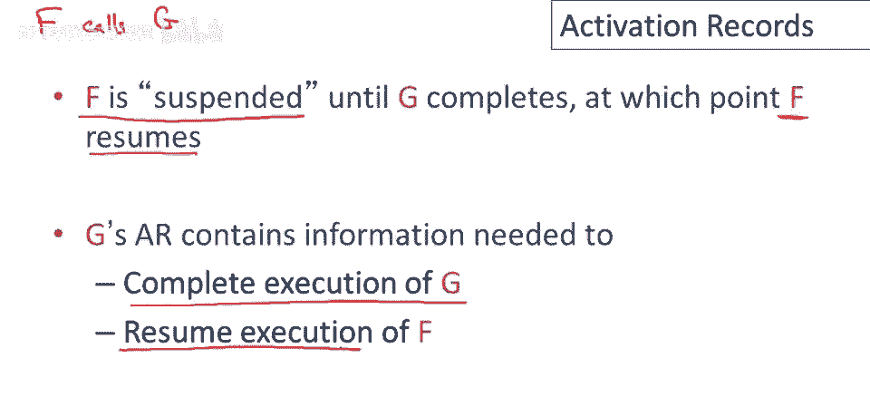
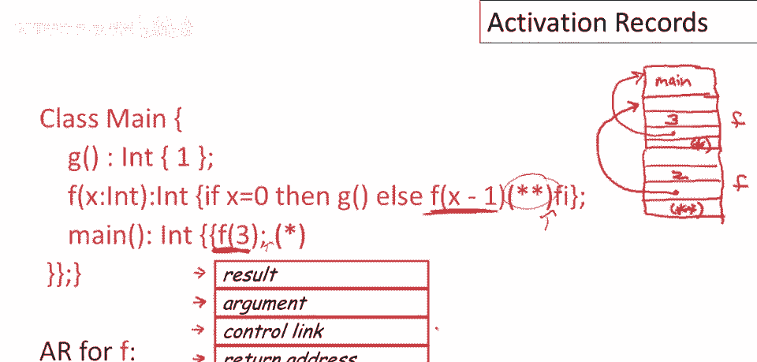
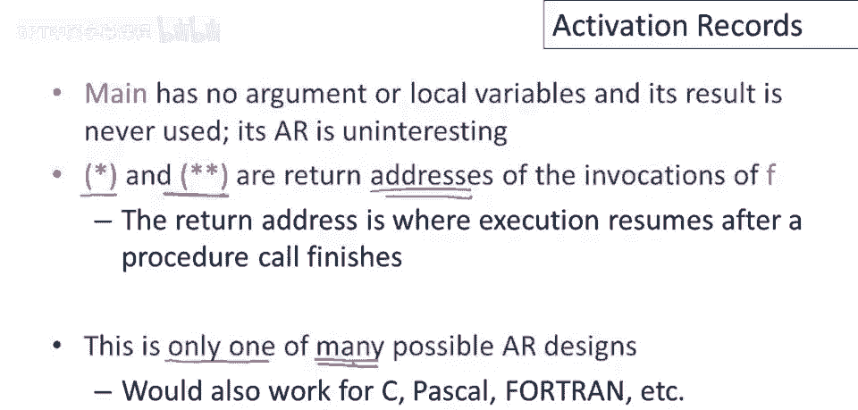
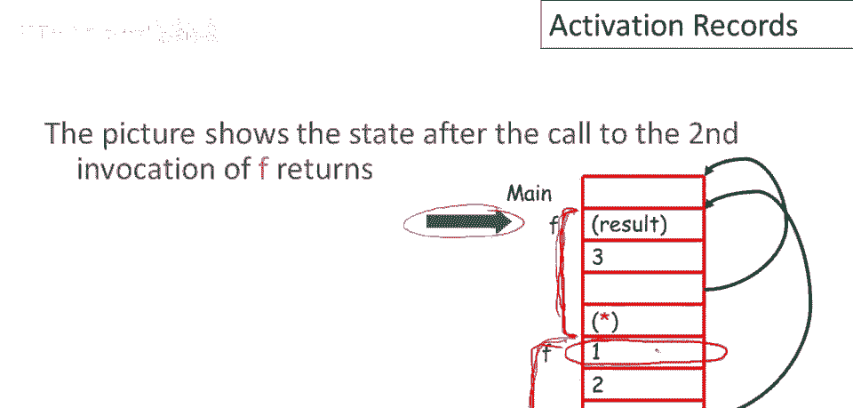
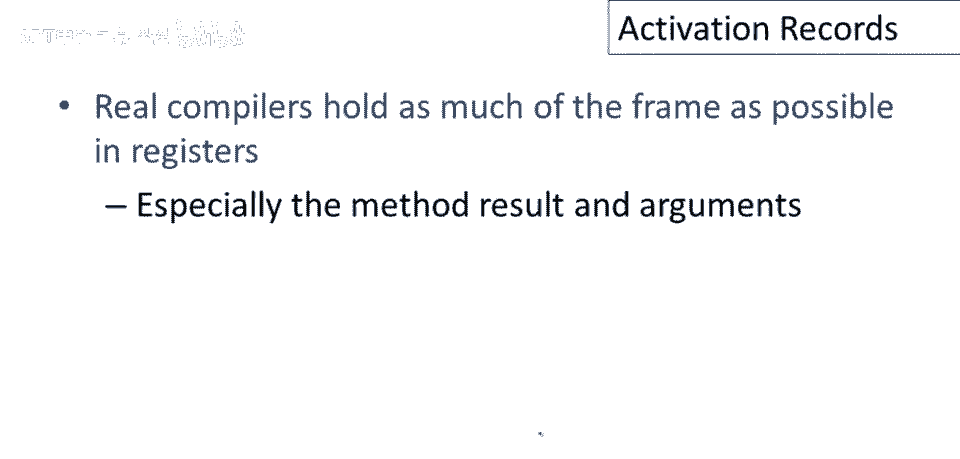
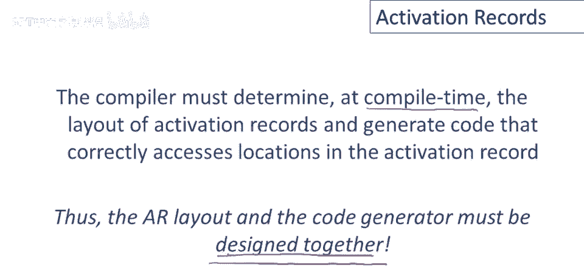

# 课程 P58：激活记录详解 📚

在本节课中，我们将要学习程序执行过程中的一个重要概念——**激活记录**。我们将了解什么是激活记录、它包含哪些信息、以及它在函数调用和返回过程中扮演的角色。

---

## 什么是激活记录？📖

上一节我们介绍了函数激活的概念，本节中我们来看看管理这些激活所需的信息。

激活记录是管理过程激活所需的所有信息。这通常也称为**帧**，与激活记录是完全相同的概念，只是同一事物的两个不同名称。

关于过程激活的一个有趣事实是，它们包含的信息比你预期的要多。特别是，当过程 `f` 调用过程 `g` 时，`g` 的激活记录不仅包含关于 `g` 的信息，也经常包含关于调用函数 `f` 的信息。通常，过程的激活记录将包含关于该过程的信息，以及关于调用它的过程的信息。

---

## 为什么需要激活记录？🤔

到目前为止，我们还没有说过为什么要保留关于激活的信息。原因是每个过程都有一个与之相关的状态（激活），为了正确执行该过程，我们必须在某处跟踪它。这就是激活记录的作用，它将用于存储正确执行过程所需的信息。

让我们更详细地看一下。考虑过程 `f` 调用过程 `g` 的情况。概念上，当 `f` 调用 `g` 时，`f` 被暂停。`f` 将在 `g` 运行时停止执行，所以 `g` 将使用处理器和机器的所有资源。但当 `g` 完成时，我们希望再次执行 `f`，`f` 将恢复。所以在中间，当 `g` 运行时，我们必须将过程 `f` 的状态（激活）保存在某个地方，以便我们正确地恢复它。这又是激活记录的作用。

因此，`g` 的激活记录将必须包含信息，这将帮助我们完成 `g` 的执行（所以会有一些关于 `g` 的信息），但 `g` 的激活记录还必须存储我们需要能够恢复过程 `f` 执行的任何东西。

---

## 一个具体的例子 🔍

以下是我们在上一期视频中看到的一个程序，这是过程 `f` 的具体激活记录设计。

我们将有一个位置用于 `f` 的结果，这将持有 `f` 执行完成后返回的值。这里有一个位置用于 `f` 的参数（`f` 只接受一个参数，所以只需要一个字来存储）。将有一个**控制链接**，指向前一个（调用者）的激活。我们还将有一个用于**返回地址**的插槽，即内存中的地址，或我们应在 `f` 执行完成后跳转到的指令的地址。

现在让我们手动执行这个程序，并计算出栈上的激活记录将是什么样子。

当程序首次被调用时，它将调用 `main`，将有一个 `main` 的激活记录。然后 `main` 将调用 `f`。当 `main` 调用 `f` 时，一个激活记录将被推入栈中，它有四个字段：

1.  **结果**：函数刚开始运行，此处暂无内容，将在 `f` 返回时填充。
2.  **参数**：这将是数字 `3`。
3.  **控制链接**：这将指向 `main` 的激活。
4.  **返回地址**：这取决于函数被调用的位置。在 `main` 中调用 `f` 后，我们希望返回到调用 `f` 后的指令地址（标记为 `*`）。

然后 `f` 的主体执行，参数 `3` 不是 `0`，因此我们最终会再次调用 `f`。这意味着另一个激活记录将被推入堆栈，它也有四个插槽：

1.  **结果**：最初为空。
2.  **参数**：这将是 `2`。
3.  **控制链接**：这将指向 `f` 的前一个激活。
4.  **返回地址**：这将是 `f` 内部条件语句结束后需要返回的地址（标记为 `**`）。

在两次调用 `f` 之后，堆栈将呈现这种特定的激活记录设计。

---

## 激活记录在内存中的布局 🧱

这个激活记录堆栈，并不是像你在数据结构课上学到的那种抽象堆栈。运行时系统将它们视为明确的激活记录，但它们也像一个巨大的数组，所有这些数据都只是连续地排列在内存中。这些都是连续的地址，一个激活记录紧接着在先前激活记录的下一个地址之后。

编译器作者将经常利用这些激活在内存中相邻的事实来设计一些技巧。

总结一下这个例子的亮点：
*   `main` 的激活记录（包含参数、结果等）在本例中并不重要，我们主要关注 `f` 的激活记录。
*   示例中使用的 `*` 和 `**` 都是实际的内存地址，指向代码中调用 `f` 后需要继续执行的指令地址。
*   这真的只是许多可能激活记录设计中的一种。你可以为 `f` 设计不同的激活记录，其中包含不同的信息。这取决于其余代码生成器和运行系统的结构。

关于激活记录的重要一点是，它只需要包含足够的信息，以使生成的代码能够正确执行被调用的过程，以及恢复调用程序的执行。

---

## 函数返回时发生了什么？🔄

到目前为止我们只看了程序调用时的激活记录，我们还没有谈论激活返回时会发生什么。

让我们考虑在我们的例子中会发生什么。在第二次调用 `f` 之后，栈顶的激活（参数为 `2` 的那个）返回。此时，调用者（参数为 `3` 的那个激活）成为当前激活，即栈的新顶部。

有趣的是要注意，虽然一个激活已恢复为当前过程，但之前被“弹出”的数据（如下层激活的结果）实际上仍在内存中。当 `f` 再次执行时，它需要查找该结果，以了解被调用过程的结果。

将返回值放在帧首位的优点是，调用者可以从自己的帧的固定偏移处找到它。例如，当第二次调用 `f` 返回，第一个调用已恢复执行时，该调用的代码知道此激活记录的大小为 4 个字。因此它可以找到被调用过程的结果，在偏移 4 个字（即第 5 个字）的位置。即使该数据已从逻辑栈中弹出，我们仍可以立即读取函数调用结果，并在调用过程继续执行中使用它。

---

## 设计考量与总结 🎯

再次强调，激活记录的组织方式绝对没有魔力。我们可以重新排列帧中元素的顺序，可以不同地分配调用者和被调用者的责任。实际上，唯一的衡量标准是，如果一个组织能导致更快的代码或更简单的代码生成器，那么它就更好。

我之前也提到过，但在生产编译器中也是一个重要点：我们将尽可能多地将帧内容放入寄存器中。特别是，将方法结果和方法参数传递到寄存器中，因为这些被频繁访问。

最后，总结我们对激活和激活记录的讨论。核心问题是编译器必须在编译时确定激活记录的静态布局，并且还需要生成正确访问该激活记录位置的代码。这意味着**激活记录布局**和**代码生成器**必须一起设计。你不能只设计你的代码生成器，然后后来再决定你的激活记录布局将会是什么，反之亦然。这两件事需要一起设计，因为它们相互依赖。

---

本节课中我们一起学习了**激活记录**的概念、作用、内存布局以及在函数调用与返回过程中的行为。理解激活记录是理解程序运行时行为、栈管理和编译器代码生成的关键一步。