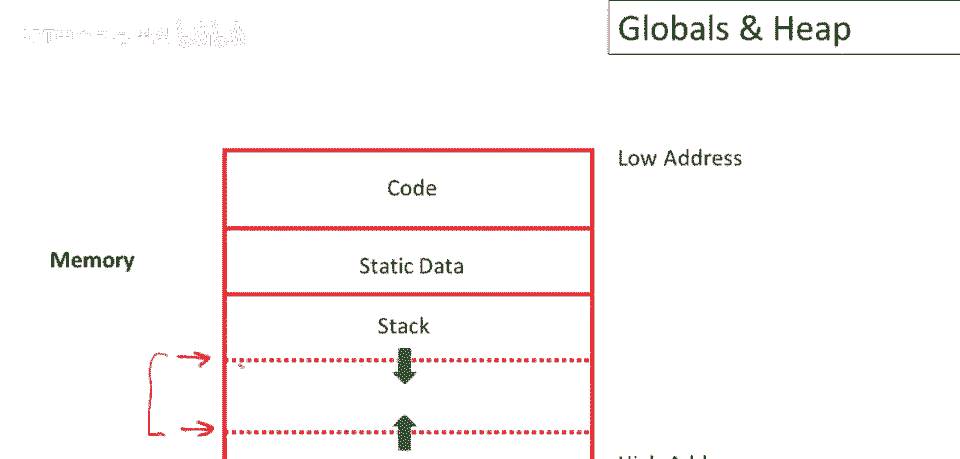

# 课程 P59：运行时组织 - 全局变量与堆 🧠

在本节课中，我们将继续探讨程序的运行时组织，重点讲解编译器如何处理**全局变量**和**堆**这两种数据结构。理解这些概念对于掌握程序如何在内存中运行至关重要。


---


## 全局变量与静态分配 🌍

上一节我们介绍了栈和激活记录，本节中我们来看看**全局变量**。全局变量的核心特性是：程序中的所有引用都指向同一个对象。这意味着它们不能被存储在激活记录中，因为激活记录会在过程调用结束后被释放。

因此，全局变量通过**静态分配**来实现。以下是其关键点：

*   **固定地址**：所有全局变量在程序启动时被分配一个固定的内存地址。
*   **编译时决定**：编译器在编译阶段就决定了这些变量的存储位置。
*   **生命周期**：它们在程序的整个执行期间都存在于这个固定位置。

除了全局变量，某些语言中的其他值（如静态局部变量）也可能采用静态分配，其行为与全局变量一致。


---

## 运行时组织图的更新 🗺️

引入了全局变量后，我们的运行时内存组织图需要更新。


内存布局现在如下所示：
```
[ 代码区 | 静态数据区（全局变量等） | 堆 | ...空闲内存... | 栈 ]
```
*   **代码区**：存放程序指令。
*   **静态数据区**：紧接着代码区，存放全局变量等静态分配的数据。
*   **栈**：从内存的另一端（通常是高地址端）开始，向低地址方向增长，用于存储激活记录。
*   **堆**：位于静态数据区之后，向高地址方向增长，用于动态分配的数据。

栈的起始位置现在是静态数据区的末尾。

---

## 堆的引入与必要性 📦

现在转向**堆**。任何比创建它的过程生命周期更长的值，也不能存储在激活记录中。


考虑以下伪代码场景：
```c
Object foo() {
    Object bar = new Object(); // 动态分配一个对象
    return bar; // 返回这个对象
}
```
在 `foo` 函数的激活记录中分配 `bar` 对象是不行的。因为当 `foo` 返回时，其激活记录被释放，`bar` 对象也会随之消失。但 `bar` 需要作为返回值，在 `foo` 调用结束后依然可用。

因此，**动态分配的数据**必须存储在激活记录之外。支持动态数据分配的语言（如 Java, C++ 等）通常使用**堆**来实现这一点。

---

## 内存区域总览与堆栈协作 🤝

此时，语言实现需要管理几种不同的内存区域：

1.  **代码区**：存放程序指令。通常是只读的。
2.  **静态数据区**：存放全局变量等静态分配、固定大小的数据。
3.  **栈**：用于存储每个当前活跃过程的**激活记录**。每个激活记录大小固定，包含局部变量和临时数据。
4.  **堆**：用于存储所有**不属于以上类别**的数据，即动态分配、生命周期不确定的对象。

在像 C 这样的语言中，堆由程序员通过 `malloc` 和 `free` 显式管理。在 Java 等语言中，使用 `new` 进行分配，并由**垃圾回收器**自动管理回收。


堆和栈都在增长，因此必须防止它们相互覆盖。一个经典且高效的解决方案是：**让堆和栈从内存的两端开始，向中间方向增长**。

---

## 堆栈协作的详细机制 ⚙️

让我们回顾并细化这个运行时组织图：

```
低地址
    |
[ 代码区 ]
[ 静态数据区 ]
[ 堆 ]  ---> (向高地址增长)
    |
    |  (空闲内存)
    |
[ 栈 ]  <--- (向低地址增长)
    |
高地址
```

*   **堆的增长**：堆从静态数据区末尾开始，向高地址增长。它的大小会随着 `new` 或 `malloc` 而增加，也可能随着垃圾回收或 `free` 而减少。
*   **栈的增长**：栈从内存高端开始，向低地址增长，随着函数调用和返回而伸缩。
*   **协作与溢出**：系统维护两个指针：
    *   **堆指针**：指向下一个可分配堆内存的地址。
    *   **栈指针**：指向当前栈顶（下一个栈帧将分配的位置）。
    只要这两个指针不相等（即没有相遇），程序就有内存可用。如果它们相遇，则意味着内存耗尽，运行时系统可能报错或尝试回收内存。

这种设计的优势在于，它能自动适应不同程序的内存使用模式（需要大堆小栈，或大栈小堆），只要堆和栈的总和不超过程序可用的总内存。

---

## 总结 📚

本节课中我们一起学习了：
1.  **全局变量**通过**静态分配**实现，在编译时获得固定地址，生命周期贯穿整个程序。
2.  **堆**用于存储动态分配、生命周期不确定的数据，解决了数据比其创建过程存活更久的问题。
3.  程序运行时内存被划分为**代码区、静态数据区、堆和栈**。
4.  堆和栈通常从内存两端向中间增长，通过两个指针的协作来高效共享内存空间，并检测内存溢出。



理解全局变量和堆的管理机制，是深入理解程序内存布局和运行原理的关键一步。