# P5：p05 02-02-_Cool_Example_II - 加加zero - BV1Mb42177J7

欢迎回到本视频，我们将看另一个酷编程示例。

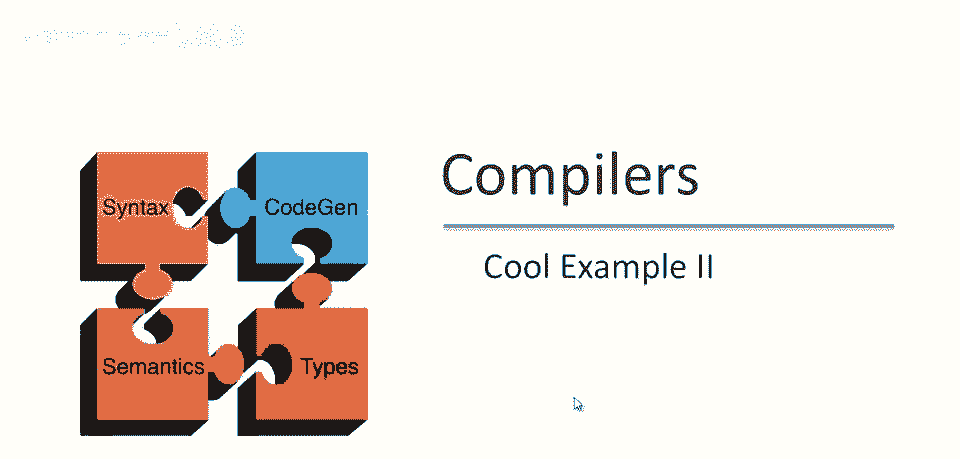

这次让我们超越简单的Hello World，转向更令人兴奋的东西。

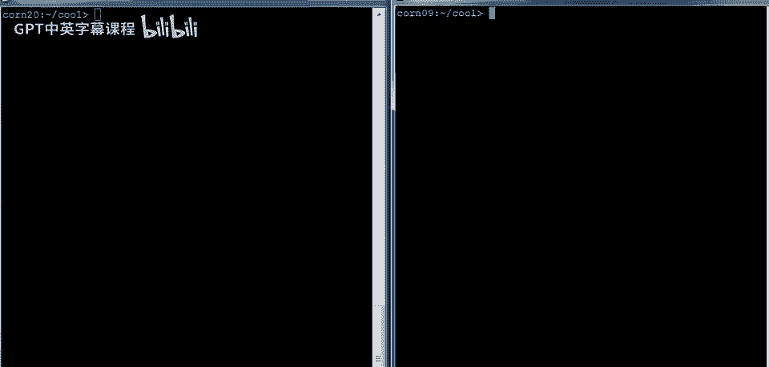

比如流行的阶乘函数，因此为了编写阶乘，我们需要打开一个可以编写代码的文件，让我开始并回忆上次，每个酷程序都需要有一个主类，主类需要有一个main方法，我们不在乎main方法返回什么，所以我们将有它。

返回某种类型的对象，让我在这里填充文件的骨架，所以现在我们可以编写一些代码，所以main方法将做什么，在我们实际编写阶乘之前，在我们深入这个程序之前，实际上并不难，我们需要更多地谈论io。

因为我们需要能够读写数字，我们将能够从运行程序的用户那里读取数字，并打印它们，所以让我们回顾一下io的一些内容，为了调用io函数，我们需要一个io对象，其中一个io函数是打印字符串的。

所以让我们编写一个我们已经知道如何做的程序，只是为了确认我们记得，现在我们可以编译这个程序，它应该只打印一，让我们看看确实如此，它做到了，好的，所以它打印出数字一，所以现在，嗯，让我们回到这里。

谈谈如何做输入，所以不是只打印数字一，让我们打印出用户输入的字符串，所以在这里我们将读取一个字符串，为了做到这一点，我们需要一个io对象，因为还有一个函数，另一个方法叫做in_string，好的。

这将读取一个字符串，然后嗯，返回一个字符串，然后为了确保我们得到漂亮的输出，让我们将这个字符串连接到一个新行，以确保我们得到漂亮的输出，这就是为了，当它打印字符串时，它将另起一行打印。

所以让我们尝试编译这个，编译成功，现在我们可以运行spin，记住Unix中的感叹号命令会运行以相同字母开头的上一个命令，现在程序运行了，它在等待，因为它在等我输入，如果我输入1，它返回1。

如果我输入42。

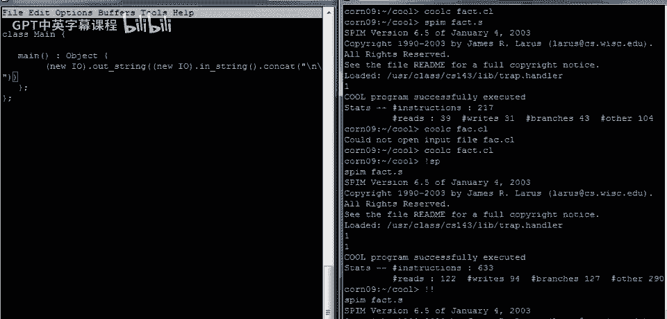

它返回42，好的，现在我们需要讨论的是如何将字符串转换为整数，因为如果我们做阶乘，我们想处理整数而不是字符串，目前我们只是在读写字符串，所以Cool中有一个库用于整数和字符串之间的转换。

我们将给这个主类，赋予那个类的功能，嗯，它被称为a2i，I代表ascii到整数，它定义了一组可以将字符串和整数相互转换的方法，所以让我们在这里添加这些命令，这是我们的字符串，我们读入的。

现在我们要将其转换为整数，让我在这里添加几个括号，这是我们的字符串，好的，现在我们要调用那个方法，抱歉，我们要调用那个函数，那个方法，a2i，让我们再检查一下，确保参数在正确的位置，这是a2i的参数。

现在我想起当我们有一个方法分发，它单独存在，没有对象，它是对self对象的分发，self对象是当前类中的对象，在这种情况下是main对象，它继承了a2i方法，因此a2i函数应该在那里定义。

现在我们有了一个整数，我们可以用那个整数做点什么，如果我们喜欢，让我们再加些括号，假设我们只给整数加1，好的，然后我们处理完整数，无论我们想对整数做什么操作，我们需要将其转换回字符串。

这样我们才能打印出来，有一个逆函数，I到a的函数会这样做，我不知道此时括号是否都放在正确的位置，那就确认是，看起来可行，嗯，这将读取字符串，转换，转换为整数，加1，嗯，转换回字符串，拼接新行并输出。

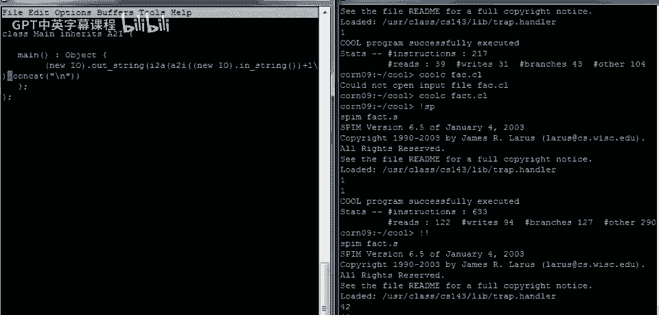

看看是否都管用，运行编译器，有问题，啊，说我们有个未定义类a到i。

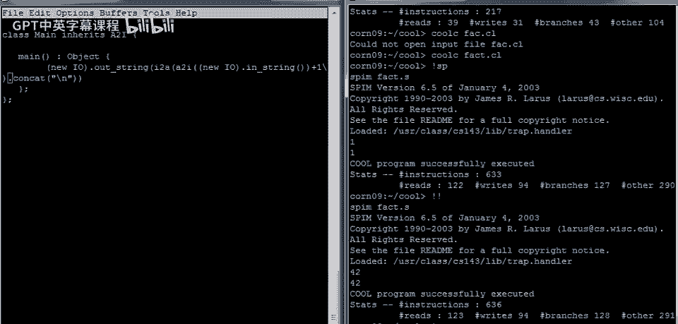

原因是没提供a2的代码，所以看目录，已复制a2的类文件，鼓励你去看代码，很有趣，看如何在Cool中写转换，现在谈如何编译用库的程序，你这样做的方式，非常简单，编译时，只需在命令行列出所有类文件。

它会读取所有文件并视为单个程序，在这种情况下，我们编译compile fact和a two。

编译完成。

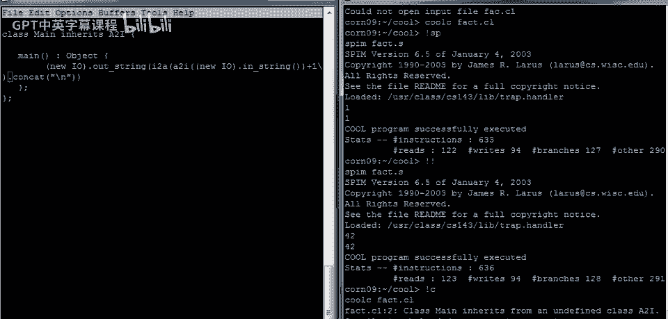

然后可以运行，现在如果我输入3。

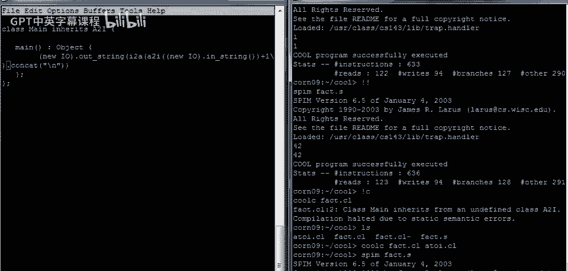

输出4，如果我输入1。

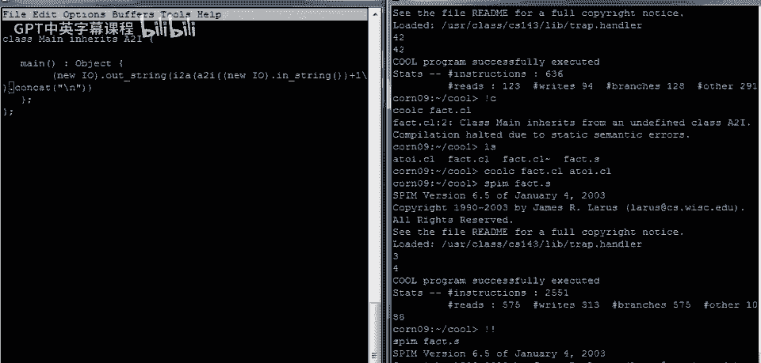

打印两个，程序似乎运行正常，现在我们可以编写阶乘函数了，阶乘中我们想做什么，嗯，我们不想只是加一，相反，我们想调用特殊函数阶乘，让我们在这里插入阶乘的调用，好的，去掉加1，然后检查所需括号。

关闭a的阶乘，调用i至a的调用，最后一个是输出字符串调用，没问题，现在可以添加fact方法，实际上，它将接受整数参数，这里需要参数，类型为int，当然，整个将返回一个整数，然后，嗯，我们需要函数的主体。

可能是个好主意，只是为了确保我们做得对，做一些简单的事，所以让我们试着做一个返回其参数加一的函数，这将做与之前完全相同的事情，让我们确认那是工作的。

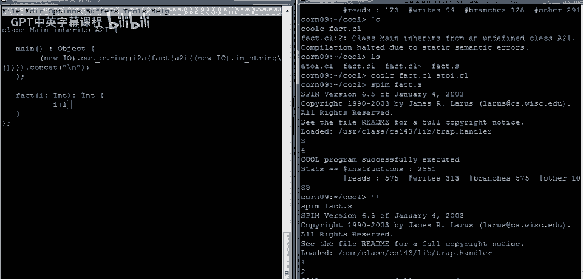

所以我们用两个i库编译，现在我们有语法错误，我们发现我忘了方法后的分号，记住，嗯，类体是一个方法列表，每个方法以分号结束。

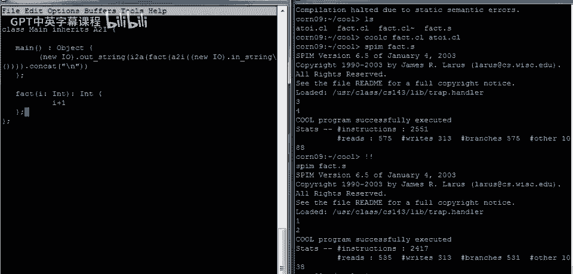

让我们再次编译，现在编译成功。

让我们运行它，我们输入4，返回5，没问题，现在可以写阶乘代码了，这可能会很平淡，因为代码实际上很简单，如果我们递归编写，那么让我们这样做，那么这将如何工作呢，每个人都记得定义，我希望如果i等于0。

那么0的阶乘是1，我们有一个关键字，然后一个，否则，嗯，阶乘将是，嗯，我乘以i减一的阶乘，对吧，然后if语句很酷，嗯，总是以关键字fee结束，所以它是一个if-then-else-fee结构。

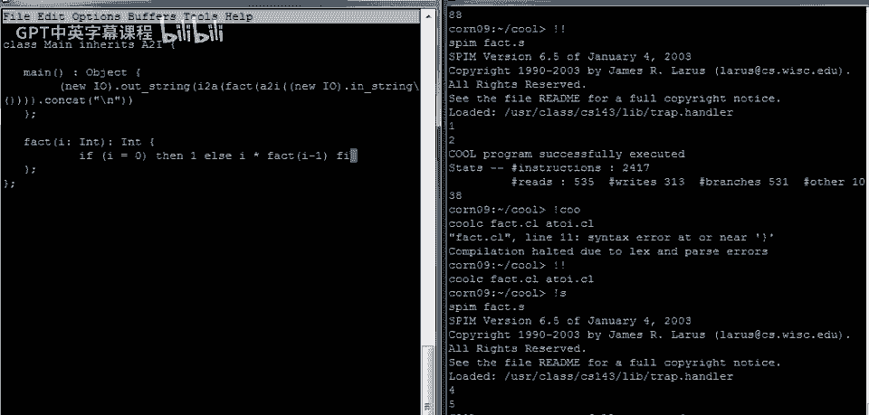

现在应有一个计算阶乘的程序，编译成功，现在运行它。

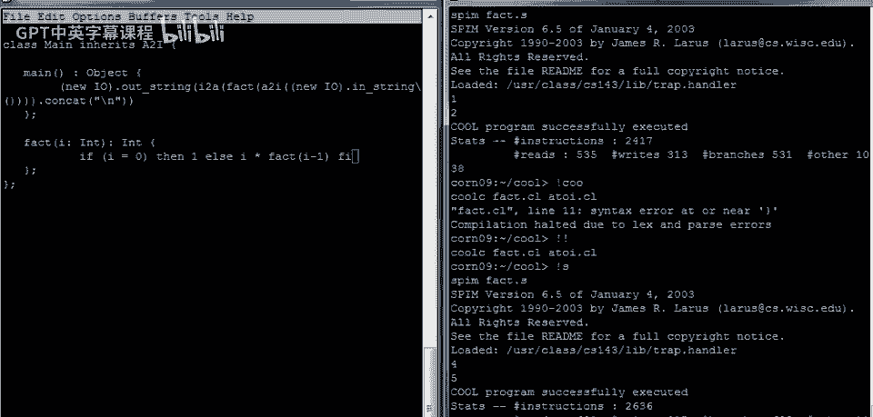

3的阶乘是6。

6的阶乘是720，看起来正确，再试一次，用个大数，得到一个，得到一个很大的数，我们认为可能是正确的，总之，阶乘函数，工作正常，现在回到这里，作为练习，嗯，重写这段代码为迭代，不用递归函数，用循环写。

为此，去掉这段代码，需要什么，嗯，需要一个累加器，需要一个，局部变量来累加阶乘计算结果，在Cool中声明局部变量用let语句或let表达式，所以有，叫fact的变量表示阶乘结果。

注意这里变量名可与函数名相同，编程语言Cool不会混淆，因为变量和函数扮演不同角色，阶乘fact，抱歉，类型为int，初始化为1，好，这样乘法，会工作，嗯，整数默认初始化为0。

如果我们乘fact和其他数，就不好了，好，let有两部分，声明的变量或变量列表，实际上可以是一个变量列表，这次只有一个，然后是主体，fact变量可用的表达式或计算，我们想做什么，嗯，所以我认为我们需要。

这是一个语句块，我们需要不止一个连续的语句，我们马上就会明白为什么，但接下来我们想要一个循环，那么我们的循环会做什么呢，我们会说，当i不等于0时，我们要做什么，我们需要做什么，嗯，循环体的开头。

开头的关键字叫做loop，现在我认为我们要进入另一个语句块，所以让我们打开一个块，我们可能需要做不止一件事，第一件事是我们想要有fact，是fact乘以i，好的，我们知道i不是0。

所以我们需要将i的当前值乘以fact来累积结果，然后我们想要从i中减去1，注意在cool中，赋值语句是这样的箭头，这就是你如何做赋值，它也是你如何做初始化的，初始化和赋值，看起来一样。

然后我们可以关闭语句块，好的，while循环的主体总是单个表达式，在这种情况下，这个表达式是一个块，由两个语句组成，然后我们可以关闭循环，循环的关闭是pool关键字，呃，然后呃。

现在我们处于一个语句块中，所以这个必须以分号结束，上面的语句块从let开始，现在我们需要let块的结果，或者是let表达式的结果是阶乘，所以无论我们从while循环中得到什么。

无论我们在while循环中计算了什么，我们希望那成为整个let表达式的结果，这是块中的最后一个语句，记住，块中的最后一个语句，是块的值，let的主体是let的结果。

所以fact也将是整个let语句的结果，它只是语句块的值，由于阶乘方法的主体本身只是一个let表达式，fact将是整个东西的结果，所以如果我们写对了，未犯任何错误。

应为阶乘的迭代版本，所以让我们编译这个。

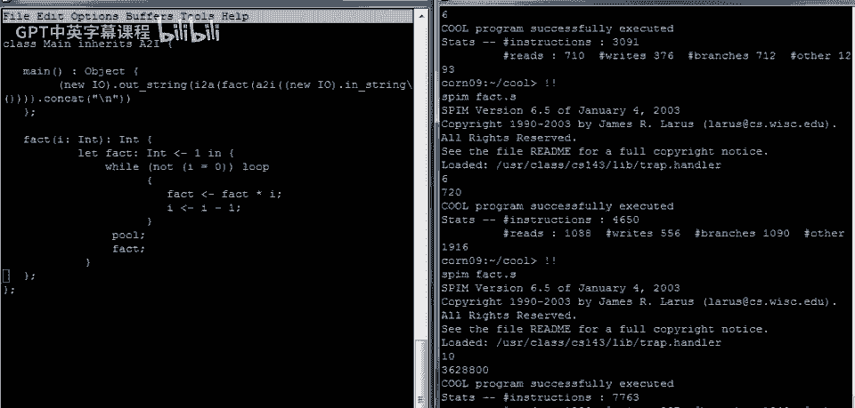

令人惊讶的是第一次编译成功，现在让我们运行它。

哇，它实际上起作用了，所以我们得到了六，让我们再做一次测试，看看它是否承诺我们。

事情进展顺利，现在让我指出一个常见的错误，你可以很容易地犯，也是我犯的错误，当我有一段时间没有编写酷程序时，如果你是C或程序员或Java程序员，你可能会考虑像这样编写赋值。

所以我只是使用等号来编写看起来完全正确的赋值，如果你熟悉这些语言或习惯于在这些语言中编程。

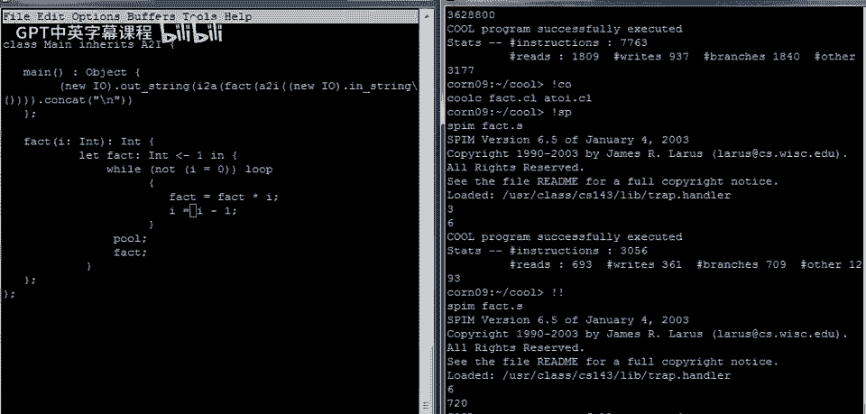

现在让我们看看当我们尝试编译时会发生什么，这个编译得很好。

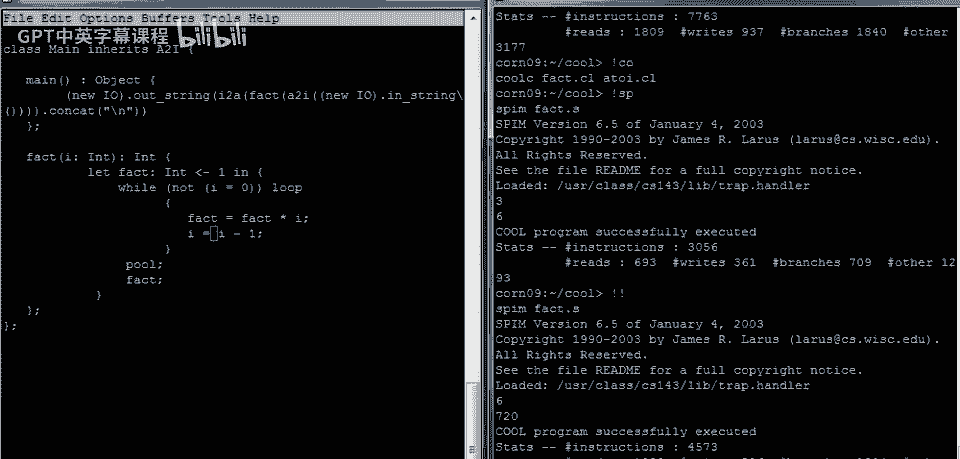

然后当我们尝试运行它时会发生什么。

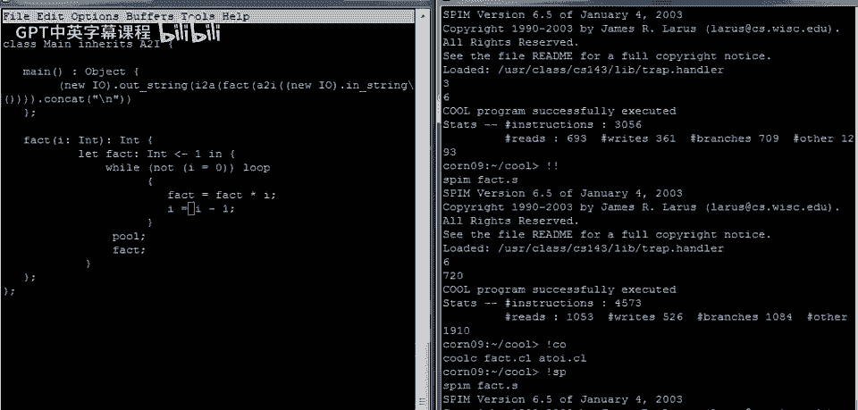

哦，它运行了，对于一个输入，所以让我们给它一个输入，然后我们看到我们耗尽了热量，看起来像一个无限循环，所以我们一直在循环中转圈，不知何故消耗着内存，我们将在课程稍后讨论为什么这个循环实际上会消耗内存。

但显然我们在循环中没有足够的内存，最终我们耗尽，所以那是一个无限循环的明确标志，所以这里发生了什么，嗯，问题是，在酷中，等于等于运算符是比较运算符，所以在这里，如你所知，我们比较了i是否为零。

那返回一个布尔值，所以这些都是完全有效的酷表达式，它们只是碰巧是布尔值，所以你实际上并没有在这个程序中更新i或阶乘，你只是在比较fact与fact乘以i，以及i与i减一，程序很高兴这样做，嗯。

它只是没有计算阶乘函数，永远不会终止，因为i从未达到零，所以这结束了我们的阶乘示例，我们下次再做另一个更复杂的酷程序示例，带有一些非平凡的数据结构，这就是全部。

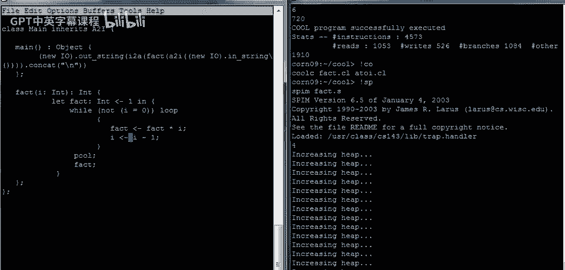