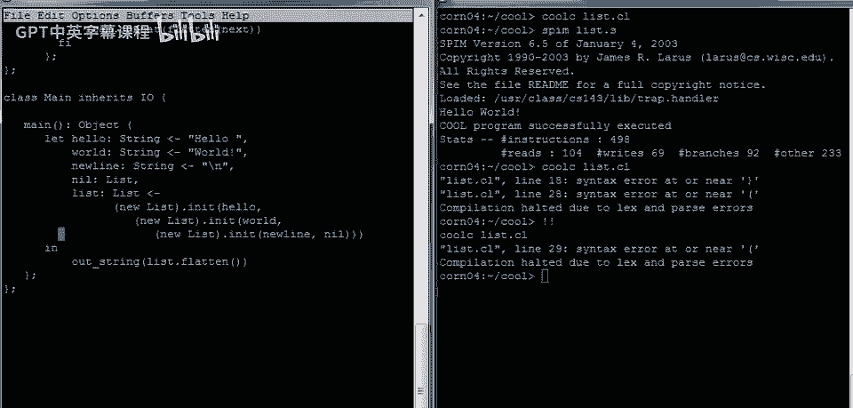
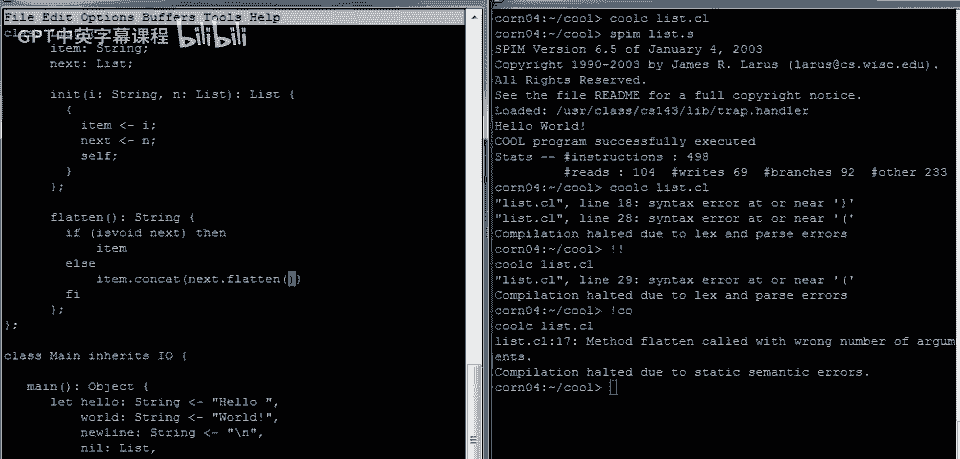

# Cool 语言教程 P6：一个综合示例 🧩


在本节课中，我们将通过一个综合性的示例程序来结束对 Cool 语言的概述。这个程序将操作一个有趣的数据结构——链表，并演示如何定义类、方法、处理多种数据类型以及使用 `case` 表达式进行类型分发。

## 程序概览与基础结构

首先，我们创建一个名为 `list.cl` 的新文件，并定义主类和 `main` 方法。为了让程序能够进行输入/输出操作，我们的主类将继承自 `IO` 类。

```cool
class Main inherits IO {
    main() : Object {
        {
            -- 程序主体将在这里编写
        }
    };
};
```


## 构建字符串列表

上一节我们介绍了程序的基本结构，本节中我们来看看如何手动构建一个字符串链表。我们将首先定义几个字符串变量，然后将它们连接并打印出来。

以下是使用单个 `let` 表达式进行多个变量绑定的方法：

```cool
let hello : String <- "Hello",
    world : String <- "World",
    newline : String <- "\n"
in
    out_string(hello.concat(world.concat(newline)))
```

**注意**：在 `let` 表达式中，多个绑定之间使用逗号 `,` 分隔，而不是分号。

## 定义链表抽象

现在，我们不直接连接字符串，而是创建一个链表抽象。链表中的每个节点包含一个数据项（`item`）和一个指向下一个节点的指针（`next`）。

以下是 `List` 类的定义，包含一个初始化方法 `init`：

```cool
class List {
    item : Object;  -- 存储任意类型的对象
    next : List;    -- 指向下一个链表节点

    -- 初始化方法，设置 item 和 next，并返回对象本身
    init(i : Object, n : List) : List {
        {
            item <- i;
            next <- n;
            self;  -- 返回初始化后的对象本身
        }
    };

    -- 其他方法将在这里定义
};
```

## 使用链表并实现展平功能

有了链表类，我们可以在 `main` 方法中构建一个包含三个字符串的链表。链表的末尾需要一个空指针，在 Cool 中，我们通过声明一个未初始化的 `List` 类型变量来实现，其值为 `void`。

以下是构建链表并调用展平方法的代码：



```cool
    let hello : String <- "Hello",
        world : String <- "World",
        newline : String <- "\n",
        nil : List,  -- 一个空指针，用于链表末尾
        mylist : List <- (new List).init(hello,
                        (new List).init(world,
                        (new List).init(newline, nil)))
    in
        out_string(mylist.flatten())
```



接下来，我们需要在 `List` 类中实现 `flatten` 方法。该方法将链表展平为一个字符串。逻辑是：如果当前节点是最后一个（`next` 为 `void`），则返回其 `item` 的字符串表示；否则，返回当前 `item` 的字符串表示与剩余链表展平结果的连接。


```cool
    flatten() : String {
        if isvoid(next) then
            -- 处理最后一个元素
        else
            -- 连接当前元素和剩余链表
        fi
    };
```


## 处理多种数据类型

目前，我们的链表只能很好地处理字符串。为了让它能处理任何类型的对象（如整数），我们需要在 `flatten` 方法中根据 `item` 的实际类型进行不同的操作。Cool 语言提供了 `case` 表达式来实现运行时类型检查。

以下是使用 `case` 表达式改进后的 `flatten` 方法核心逻辑：


```cool
flatten() : String {
    let s : String in
        {
            -- 根据 item 的类型决定如何获取字符串表示
            s <- case item of
                    i : Int => i2a(i);      -- 如果是整数，转换为字符串
                    s : String => s;        -- 如果是字符串，直接使用
                    o : Object => {         -- 其他类型（默认情况）
                        abort();            -- 终止程序
                        "";                 -- 仅为满足类型检查，返回空字符串
                    };
                esac;

            -- 判断是否是链表末尾
            if isvoid(next) then
                s
            else
                s.concat(next.flatten())
            fi;
        }
};
```

**注意**：为了使 `i2a`（整数转字符串）方法可用，`List` 类需要继承自 `A2I` 类。

## 测试泛型链表

最后，我们可以测试这个泛型链表。在 `main` 方法中，我们可以构建一个包含字符串和整数的链表。

```cool
    let mylist : List <- (new List).init("Hello",
                        (new List).init("World",
                        (new List).init(42,    -- 插入一个整数
                        (new List).init("\n", nil))))
    in
        out_string(mylist.flatten())
```

编译并运行程序，它应该能成功输出 “HelloWorld42”。

---

本节课中我们一起学习了如何用 Cool 语言构建一个泛型链表数据结构。我们涵盖了类的定义、方法的实现、`let` 表达式的多绑定、递归方法调用以及使用 `case` 表达式处理多种数据类型。通过这些练习，你应该对 Cool 语言的核心特性有了更深入的理解。要了解更多细节和未在本课展示的特性，可以参考 Cool 语言示例目录中的其他程序。