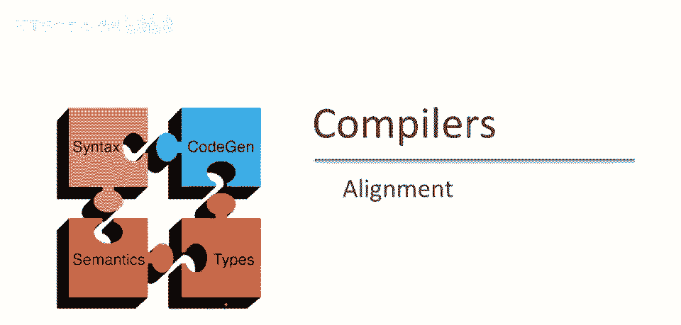
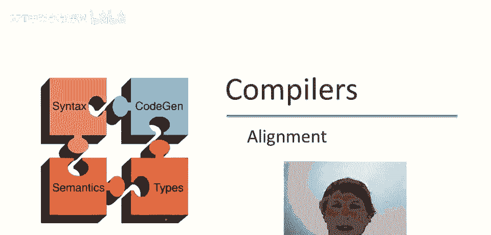
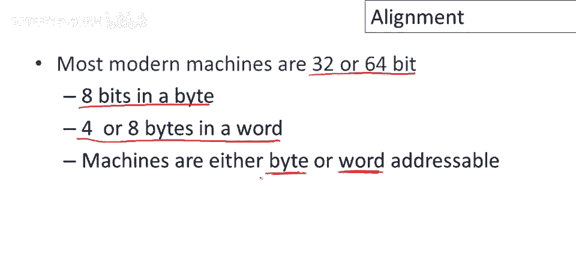
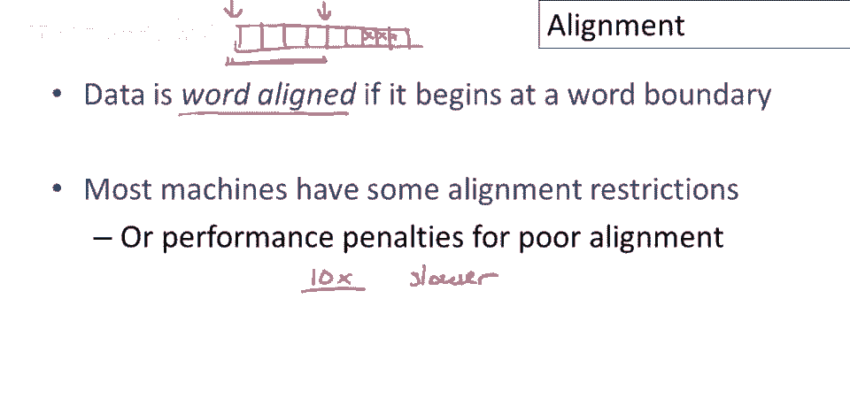
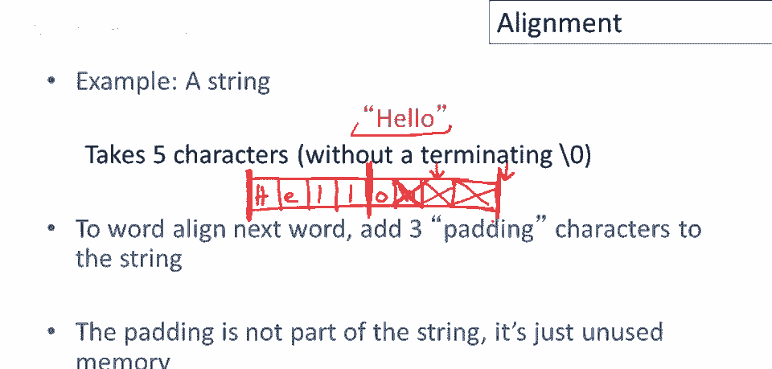

# 课程 P60：内存对齐详解 🧱

在本节课中，我们将学习计算机体系结构中一个非常底层但至关重要的细节——内存对齐。理解对齐对于编写高效且正确的程序至关重要。

---

## 现代机器的属性回顾

上一节我们引入了对齐的概念，本节中我们来看看为什么对齐如此重要。首先，我们需要回顾现代计算机的一些基本属性。

目前大多数现代机器是32位或64位的。这意味着机器的“字长”是32位或64位。字是机器处理数据的基本单位，它可以被细分为更小的单位。

以下是关于内存组织的基本事实：
*   一个字节有8位。
*   4个字节（32位）或8个字节（64位）组成一个字，具体取决于机器。

另一个关键属性是机器的寻址方式。机器可以是“字节寻址”或“字寻址”。
*   在机器码中，字节寻址的机器可以引用内存中的单个字节。
*   字寻址的机器可能只能以整个字为单位来命名或引用内存。

---

## 什么是数据对齐？🎯

理解了字和字节的关系后，我们现在可以正式定义“数据对齐”。

我们说数据是**字对齐的**，当且仅当它从一个字的边界开始。为了更直观地理解，让我们想象一下内存的组织方式。

假设这是一台32位机器，因此4个字节构成一个字。内存被划分为连续的字节。一个字从这里开始，下一个字从这里开始。

*   如果一块数据被分配在字的边界上（例如，占据这连续的4个字节），那么它就是字对齐的。
*   如果一块数据开始于一个字的中间（例如，从这个位置开始），那么它就不是字对齐的。

---

## 为什么对齐很重要？⚠️

对齐之所以重要，是因为机器本身有**对齐限制**。这些限制主要带来两类问题：

1.  **正确性问题**：有些机器严格要求数据必须正确对齐。如果你试图访问一个未按机器要求方式对齐的数据，机器可能无法执行该指令，导致程序甚至系统挂起。因此，未正确对齐的数据会导致程序无法正确运行。

2.  **性能问题**：另一些机器虽然允许数据任意存放，但需要付出巨大的性能代价。访问字边界对齐的数据通常比访问非对齐的数据要快得多。这种性能惩罚往往是巨大的，访问错位数据的速度可能比访问对齐数据慢十倍。

---

## 对齐问题的常见场景：字符串分配 📝

对齐问题最常出现在处理可变长度数据时，例如字符串分配。让我们通过一个例子来具体看看。

假设我们有一个字符串 `"Hello"`，我们想将它存入内存。我们将内存画成一个字节序列，并标出字边界（假设是32位机器）。

如果我们希望数据对齐，我们会将字符串分配在字边界开始。因此，字符 `H` 会放入第一个字节，接着是 `e`, `l`, `l`, `o`。这里可能还有一个终止空字符 `\0`。

现在问题来了：**下一个数据项应该放在哪里？**
如果我们非常注重节省内存，可能会紧挨着字符串结束的位置开始存放下一个数据项。但请注意，那个位置很可能不在字边界上，这会导致我们之前提到的正确性或性能问题。

简单的解决方案是：**直接跳到下一个字边界**，再从那里开始分配下一个数据项。那么这两个字节（或更多）会怎样？它们就变成了未被使用的“填充”字节。程序永远不会引用它们，它们的值无关紧要。

总结一下，当机器有对齐限制时，处理流程如下：
1.  数据必须从要求的边界（通常是字边界）开始分配。
2.  如果分配的数据长度不是字的整数倍，没有直接结束在下一个边界上。
3.  那么我们就跳过中间的任何字节（填充），让下一个数据从下一个边界开始。

---

## 总结 📚

本节课中，我们一起学习了内存对齐的核心概念。我们了解到，现代计算机有字长的概念，并且数据从字边界开始存放称为“对齐”。对齐至关重要，因为它关系到程序的正确性和运行效率。未对齐的数据可能导致程序错误或严重的性能下降。在处理像字符串这样的可变长度数据时，我们经常需要通过添加“填充”字节来确保每个数据项都正确对齐，从而为后续操作奠定良好的基础。