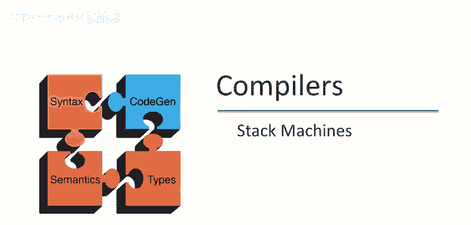
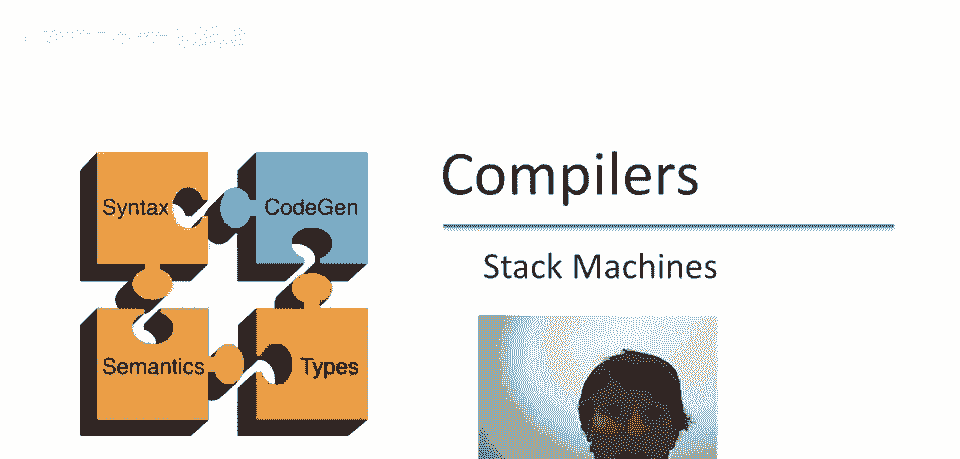
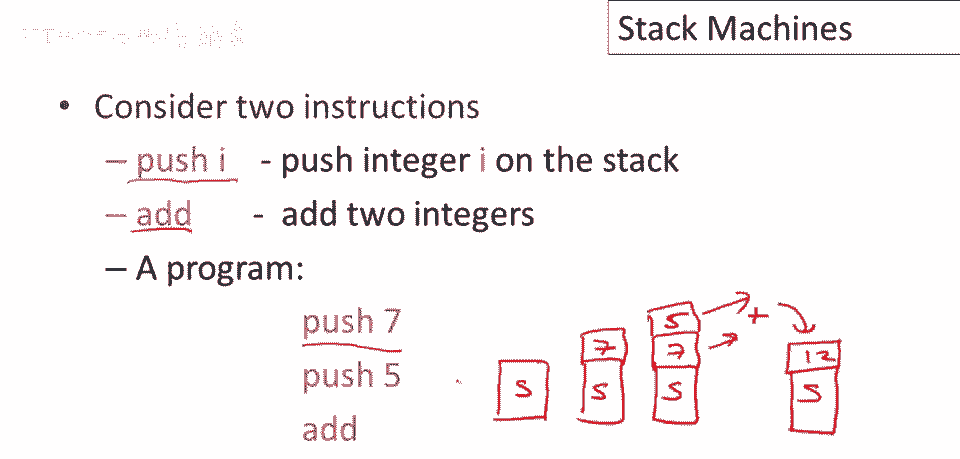
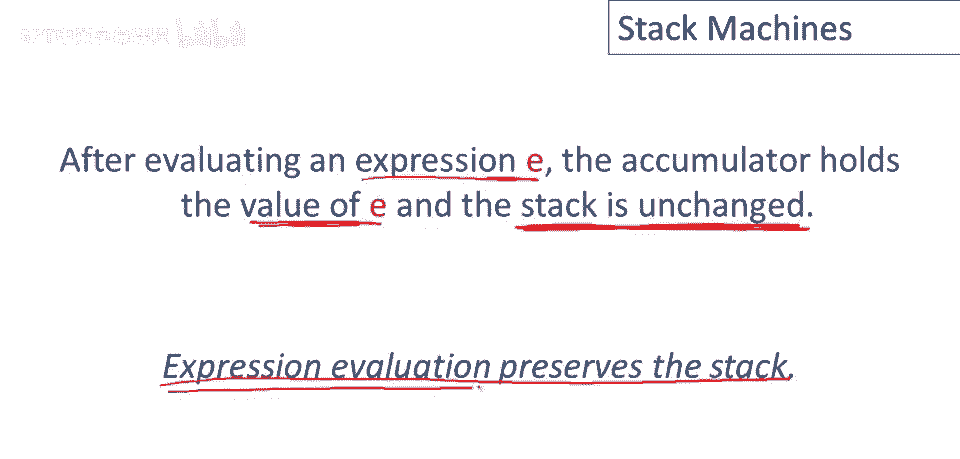

# 课程 P61：代码生成与堆栈机 🧱



在本节课中，我们将要学习代码生成的基础知识，特别是最简单的代码生成模型——堆栈机。我们将了解它的工作原理、核心属性以及如何用它来评估表达式。


---

## 什么是堆栈机？📚


上一节我们介绍了代码生成的主题，本节中我们来看看堆栈机的基本概念。

堆栈机的主要存储结构是一个堆栈。它的工作方式是执行指令，所有指令都遵循一种形式：它们接受一些参数，并产生一个结果。

具体来说，指令会从堆栈顶部弹出操作数（参数 `a1` 到 `an`），然后使用这些操作数计算函数 `f`，最后将结果 `r` 推回到堆栈顶部。

**公式**：`指令执行: pop(a1, ..., an) -> compute f(a1, ..., an) -> push(r)`

---


## 一个简单的例子：计算 7 + 5 ➕

为了理解堆栈机如何工作，让我们看一个计算 `7 + 5` 的例子。

首先，我们需要将数字 `7` 和 `5` 放入堆栈。假设堆栈初始时可能已有其他内容，但我们不关心它们。



以下是计算步骤：
1.  将 `7` 推入堆栈。
2.  将 `5` 推入堆栈。
3.  执行加法指令。该指令会从堆栈弹出两个参数（`5` 和 `7`），执行加法运算，然后将结果 `12` 推回堆栈顶部。

在这个过程中，堆栈机有一个关键属性：在评估表达式后，结果位于栈顶，而评估开始前的栈内容保持不变。

---


## 堆栈机编程与指令集 💻

现在思考如何为堆栈机编程。假设我们有一种简单的语言，只有两个指令：
*   `push n`: 将整数 `n` 推入堆栈。
*   `add`: 将堆栈顶部的两个整数相加。

以下是一个计算 `7 + 5` 的程序：
```
push 7
push 5
add
```


程序执行过程如下：
1.  执行 `push 7`，栈顶为 `7`。
2.  执行 `push 5`，栈顶变为 `5` 和 `7`。
3.  执行 `add`，弹出 `5` 和 `7`，相加得到 `12`，并将 `12` 推回栈顶。原始栈内容得以保留。


---

## 堆栈机 vs. 寄存器机 ⚖️

堆栈机代码有一个有趣的属性：指令中不明确指定操作数和结果的位置，因为它们总是与栈顶相关。


这与寄存器机（或传统的汇编代码）形成对比。在寄存器机中，一条加法指令通常会明确指定两个源寄存器和一个目标寄存器。

**代码对比**：
*   **堆栈机指令**：`add` （隐含操作数来自栈顶，结果放回栈顶）
*   **寄存器机指令**：`add r1, r2, r3` （明确表示 `r1 = r2 + r3`）

堆栈机指令更紧凑，程序体积更小，这是 Java 字节码早期采用栈评估模型的原因之一。然而，寄存器机代码通常执行更快，因为它能更精确地控制数据位置，减少不必要的栈操作（如推入和弹出）。

---

## 混合模型：单寄存器堆栈机（累加器）🔋

介于纯堆栈机和纯寄存器机之间，有一种有趣的中间状态，称为 **n 寄存器堆栈机**。其中一种特别重要的变体是 **单寄存器堆栈机**，也称为 **累加器架构**。


在这种模型中：
*   一个专用的寄存器（称为**累加器**）用于保存堆栈的“顶部”元素。
*   其他所有数据都存储在内存中的堆栈上。

累加器直观地用于累积操作的结果。这种设计减少了内存访问次数，从而提升了性能。

例如，在纯堆栈机中，`add` 指令需要三次内存操作（加载两个参数，存储一个结果）。而在单寄存器堆栈机中，`add` 指令可能只需要一次内存引用（从内存堆栈加载第二个参数），因为一个参数和结果都在累加器寄存器中。

---

## 评估任意表达式的通用策略 🧮

上一节我们介绍了累加器的概念，本节中我们来看看如何使用单寄存器堆栈机评估任意复杂的表达式。


假设有一个操作需要 `n` 个参数，且这些参数本身可能是需要评估的表达式。通用策略如下：

1.  **评估前 n-1 个参数**：按顺序递归评估每个子表达式。每个子表达式评估后，结果在累加器中。然后，**将这个结果从累加器推入内存堆栈**保存起来，以便为评估下一个参数腾出累加器。
2.  **评估最后一个参数**：递归评估最后一个子表达式。评估后，**结果保留在累加器中**，不需要推入堆栈。
3.  **执行操作**：此时，累加器中是最后一个参数的值，内存堆栈顶部依次保存着前 `n-1` 个参数的值。执行操作指令（如 `add`），它会从内存堆栈弹出所需的值，与累加器中的值组合计算，并将最终结果存回累加器。



这个策略维护了一个重要的**不变性**：在评估任何表达式 `e` 之后，评估结果 `v` 位于累加器中，而内存堆栈的内容与开始评估 `e` 之前完全相同。

---

## 复杂表达式评估示例：3 + (7 + 5) 🧩

让我们通过一个更复杂的例子 `3 + (7 + 5)` 来演示上述策略。这里，外加的一个参数本身是一个复合表达式（内加）。

**初始状态**：累加器为空，堆栈有初始内容。

**执行步骤**：
1.  评估外加的第一个参数 `3`：将 `3` 加载到累加器。
2.  保存第一个参数：将累加器中的 `3` 推入内存堆栈。
3.  开始评估外加的第二个参数 `(7 + 5)`，这本身是一个加法：
    *   评估内加的第一个参数 `7`：将 `7` 加载到累加器。
    *   保存内加的第一个参数：将累加器中的 `7` 推入内存堆栈。
    *   评估内加的第二个参数 `5`：将 `5` 加载到累加器。
    *   **执行内加**：从内存堆栈弹出 `7`，与累加器中的 `5` 相加，结果 `12` 存回累加器。此时内加评估完成，堆栈恢复到评估内加之前的状态（顶部是 `3`）。
4.  **执行外加**：从内存堆栈弹出 `3`，与累加器中的 `12` 相加，结果 `15` 存回累加器。

**最终状态**：累加器中为整个表达式的结果 `15`，内存堆栈与评估表达式前完全相同。

你可以观察到，在评估子表达式 `7 + 5` 的过程中，同样遵守了“结果在累加器，堆栈不变”的规则。

---

## 总结 📝


本节课中我们一起学习了代码生成的基础模型——堆栈机。我们了解了纯堆栈机的工作原理，它使用栈作为唯一存储，指令隐含地对栈顶进行操作。接着，我们对比了堆栈机与寄存器机的优缺点。然后，我们介绍了一种性能更好的混合模型：单寄存器堆栈机（累加器架构），并详细讲解了使用它评估任意表达式所遵循的递归策略和重要的栈不变性。最后，通过一个复杂表达式的例子，我们完整演示了评估过程。掌握堆栈机模型是理解许多现代虚拟机（如 JVM）执行机制的重要基础。