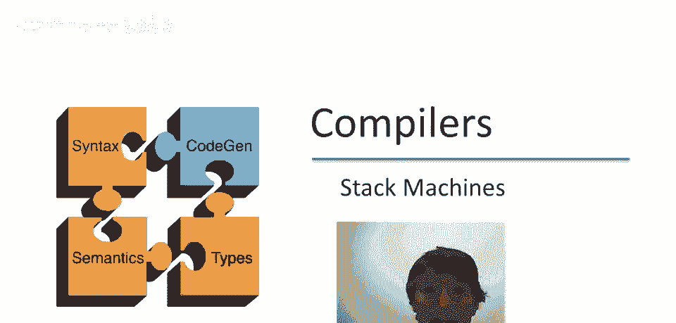
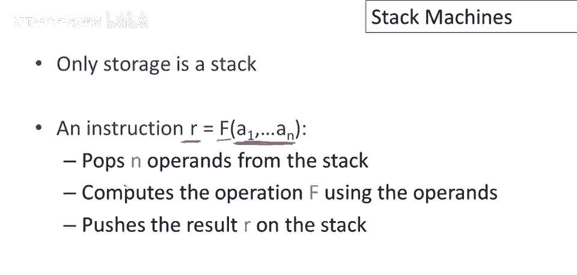
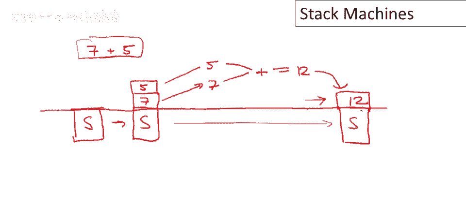
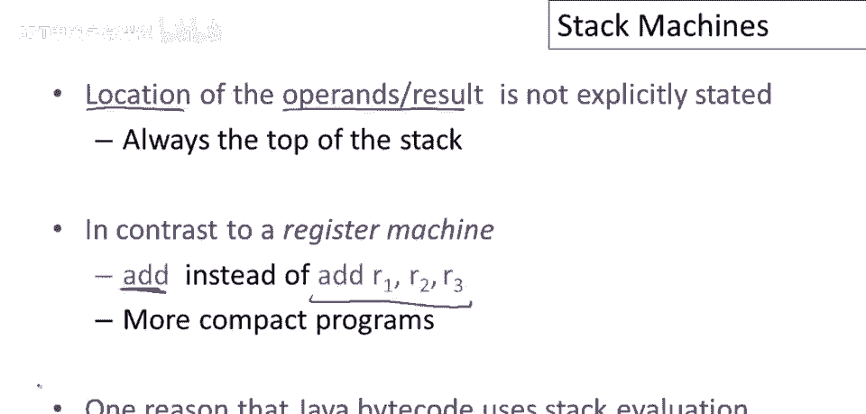
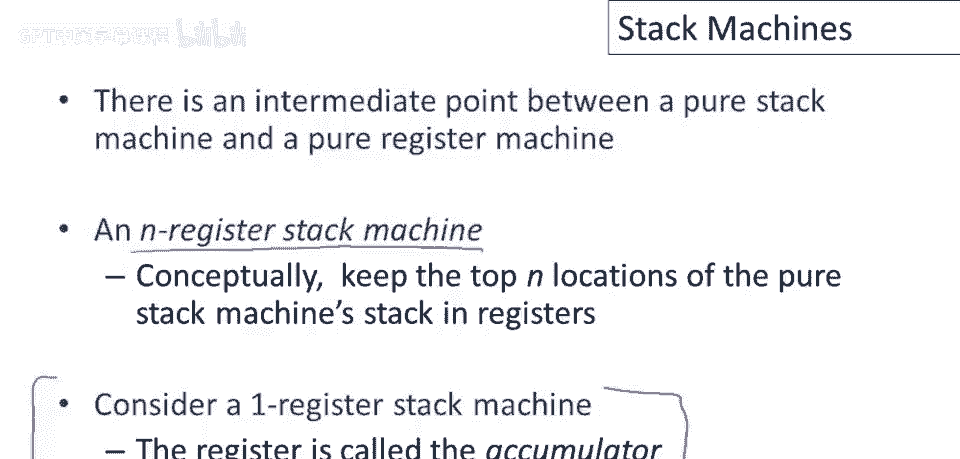
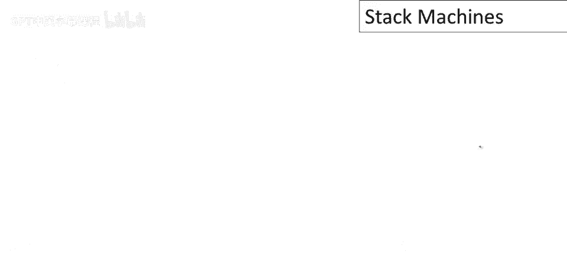
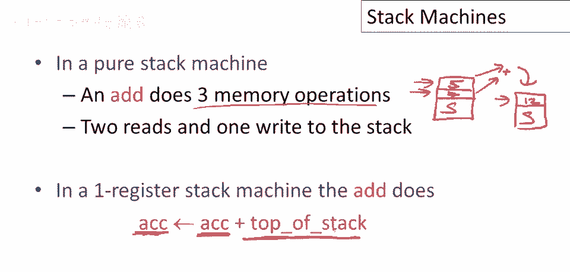
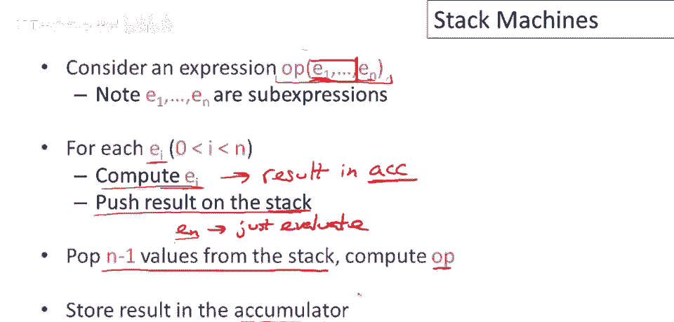
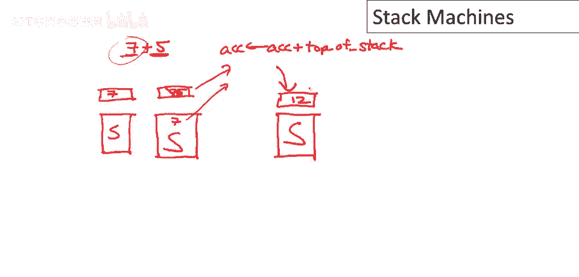

# P61：p61 11-06-_Stack_Machines - 加加zero - BV1Mb42177J7

本视频中，我们将讨论运行时组织之外的内容，开始讨论代码生成，在这第一部分，将是一系列关于代码生成的长视频。

我们将讨论最简单的代码生成模型，称为堆栈机。

所以在一个堆栈机中，你可能会猜到主要存储是一种堆栈，你猜对了，事实上，堆栈机唯一的存储就是一个堆栈，堆栈机的工作方式是执行指令，所有指令都有这种形式，有一些函数的某些参数，它们产生一个结果。

它所做的就是，它会从堆栈中弹出操作数，因此，参数a1到an存储在堆栈的顶部，然后它将使用这些操作数计算函数f，并将结果r推回到堆栈的顶部。

好的，让我们看一个简单的例子，让我们看看如何使用堆栈机计算七加五，所以我们会有一个堆栈，堆栈最初可能已经有一些东西在上面，但我们不在乎那些东西是什么，所以执行七加五，我们首先，必须将七和五放在堆栈上。

所以当它们被推入堆栈时，我们稍后会详细讨论这一点，但假设七和五都在堆栈上，所以现在我们要计算七和五的加法，加法需要两个参数，所以我们会弹出两个参数从堆栈，我们最终会得到五和七，嗯，从堆栈弹出。

我们会执行操作，加，然后结果会被推回到堆栈上，所以这将等于十二，然后十二会被推回到我们的堆栈上，好的，现在注意我，嗯，指出堆栈上可能已经有一些其他东西，让我给这些东西起个名字。

让我们谈谈堆栈机的一个非常重要的属性，请注意，当我们评估七加五时，我们最终处于一种情况，即该操作的结果在堆栈的顶部，好的，初始堆栈内容保持不变，这个堆栈，下面的东西，我们感兴趣的参数没变，好的，所以。

它经所有操作未变，这是堆栈机的关键属性，一般而言，属性是，评估表达式时，结果在栈顶，表达式开始评估前的栈内容保留。

现在思考如何编程堆栈机，让我们有一种只有两个指令的语言，可以推整数到栈上，然后有操作加，将栈顶两个整数相加，现在看看这个程序，推七然后推五，然后不加，思考程序如何工作，好的，我们有栈内容。

现在第一条指令是推七，结果栈上有七，它加到栈上，现在推五，好的，下一步栈顶有五和七，然后执行加，弹出这两个元素相加并推回，结果栈上有十二，原始栈内容保留，现在。

堆栈机代码有趣属性，指令中操作数和结果位置未明确，因为这些指令总是指栈顶，与寄存器机或寄存器指令相反，明确命名操作数来源和结果位置，例如，你可能熟悉过去的机器码或汇编代码。

一个加指令可能通常取三个寄存器，两个为参数的寄存器，两个为参数的寄存器相加，一个为结果的寄存器，而在堆栈机中，我们只有一个字加，无明确参数命名，因为参数来源固定，参数总是从栈弹出，参数来源总是固定。

参数总是从栈弹出，结果总放栈顶，有趣性质是更紧凑，指令中需说更少，程序实际小得多，Java字节码用栈评估模型原因之一，导致更紧凑程序，特别是Java早期，通过互联网分发昂贵，小紧凑代码是好属性。

为何偏好寄存器机，答案通常是寄存器机码更快，因为我们能准确放置数据，通常会有更少的中间操作和栈操作，推入弹出以获取所需数据，和，介于纯栈机和纯寄存器机之间有一种中间状态，这很有趣，这称为n寄存器栈机。

概念上，背后的想法是，寄存器堆栈机仅用于保持堆栈顶和位置，我们特别关注的特定管理堆栈机器变体，单寄存器栈机器是否，原来有一个注册也有很大好处，献给堆栈的顶端，这个寄存器称为累加器。

这里专用的寄存器称为累加器，因其直观地累积操作结果。

其他数据都存于栈上。

好的，让我们思考加法指令及其在纯栈机中的工作方式，所以在纯栈机中，加法指令将做什么？它将从栈中弹出两个参数，比如五和七，并将它们相加，然后将结果放回栈中，让我们称其余的栈内容，这需要三个内存操作：

加载两个参数，然后存储一个结果，嗯，但在单寄存器堆栈机中，加法操作实际上做了很多工作，嗯，一个寄存器，因此，一个参数已经存储在寄存器中，因为那是概念上的堆栈顶部，结果将推回到堆栈顶部。

这再次是累加器寄存器，因此，一个参数和右值都是从寄存器中获取的，仅有一个内存引用，获取栈中存储的第二参数。

总的来说，思考如何评估任意表达式，使用栈机，现在这不是，应该说，现在，仅是栈机代码，如之前所看，这不是字节码操作序列，实际上是一个完整表达式，正如你在酷中可能找到的，因此。

某些操作内部嵌套了其他复杂表达式，因此，如果我们有一个操作需要n个参数，并且这些参数本身是需要被评估的表达式，这里有一个使用栈机的一般策略，因此，对于每个子表达式，按顺序的每个参数。

我们将递归地使用相同的栈机策略进行评估，最终结果将存储，评估时，递归地，结果在累加器中，好的，结果确实在累加器中，然后将结果推入内存栈，我们将取那个结果，我们将，将累加器清空并保存到栈上，栈的部分。

它在内存中，好的，因此我们评估前n-1个参数的子表达式，除了最后一个，好的，对于最后一个参数，我们将使用相同的策略，我们只是评估，我们不将结果推入栈中，这意味着结果留在累加器中，好的。

现在累加器中有op的一个参数，我们最后评估的一个，其他n减一个在栈顶，在内存中，所以我们要做的就是，从栈中弹出n减一个值并组合，然后使用n减一个值和累加器中的值计算，并将结果存回累加器，好的。

评估表达式的总体策略。

现在让我们举个简单例子，用我们一直在用的例子，计算七加五的表达式，我们如何做到这一点呢，我们正在评估加法表达式，它需要两个参数，两个表达式，因此我们不得不评估每一个，首先我们评估表达式七。

实际上让我画一下我们的堆栈，好的，这是堆栈的初始内容，这是初始累加器，所以现在我们在评估七，好的，当然常数将直接评估为其本身，结果存储在累加器中，好的，评估七后的第一步，现在因为那是加法的第一个参数。

它必须被推入堆栈，主内存中的堆栈部分，所以，现在我们的情况看起来像这样，好吧，当然七仍然在累加器中，但我们即将覆盖它，我们不会再使用那个值，因为接下来我们要做的是评估加法的第二个参数。

碰巧在这种情况下也是一个常数表达式，五，因此它将得到评估并存储在累加器中，好的，我将覆盖七，好的，所以那里会有一个五，好吧，现在我们评估了所有参数，好的，记住，对于只有两个参数的情况。

第一个参数被评估并保存在堆栈上，所以它不会丢失，当我们评估第二个参数时，由于它是最后一个，我们可以将其留在累加器中，现在我们可以实际评估加法，好的，所以我们将执行累加器，获取累加器加上内存栈的顶部。

所以在这种情况下，结果就是加7和5，然后我们结束，然后我们，当然我们从内存栈弹出参数，好的，所以我们有，仅仅，呃，原始内容在那里，现在累加器中有值12。

所以正如你可以从例子中看到的，我们将在栈机上维护的不变量是，在我们评估表达式e之后，累加器持有值v，所以评估e的结果最终在累加器中，栈保持不变，好的，所以栈，栈的内存部分在我们开始评估e之前是什么。

这是一个非常，非常重要的表达式评估保持栈不变的性质。

所以现在让我们看一个更复杂的例子，只是稍微更复杂一点3加7加5，关于这个例子有趣的是现在外加的其中一个参数本身，是一个复合表达式，所以我们必须，那将必须被递归地评估，作为评估整个表达式的部分。

所以让我们看看这是如何工作的，所以首先将要发生的是，我们正在评估外加的，我们要评估那个加的第一个参数，那只是常数3，所以那将被加载到累加器中，好的，这是评估3的结果，而现在因为它是加的第一个参数。

我们必须保存它，在我们开始评估加法本身的时候，所以那个结果，呃，被推送到栈上，现在我们要评估外加的第二个参数，它本身有两个参数，那个内加的第一个参数，是7，所以那最终被存储在模拟器中，这是评估7的结果。

然后因为内加有两个参数，我们必须评估第二个，评估内加的第二参数，七必须保存到栈上，所以现在栈上有七，三和之前开始前的任何内容，接下来将评估内加的第二个参数，因此评估常数五将导致五被加载到累加器中。

现在我们已评估了内加的所有参数，好的，因此我们知道从我们的堆栈纪律来看，最后一个参数在累加器中，第一个参数将在栈的顶部，所以接下来会发生的是我们将从栈中弹出第二个参数，将其添加到累加器中并存储回累加器。

所以现在累加器中有加法的结果，我们还需要从栈中弹出七，好的，最后，我们现在已评估了外加的第二个参数，所以现在我们可以执行外加了，那涉及什么，它取栈的内容，并将其添加到当前栈顶的值，即值为三。

这是我们很久以前保存的，以记住它，当我们想要执行外加时，当我们弹出栈后，最终在累加器中有十五，这是整个表达式的结果，并且使用的栈与开始时相同，好的，评估整个表达式导致结果在累加器中，并且栈保持不变。

如果你看子表达式，你可以看到同样的事情发生了，所以让我们看看七加五的评估，嗯，那发生在哪，嗯，那从这里开始，好的，开始，嗯，在这个指令，并且一直持续到这里，你可以看到七加五的评估，涵盖了这五个表达式。

导致十二被放在栈的顶部，这是七加五的结果，它没有影响内容，对不起，它们导致十二被放置在累加器中，并且让栈保持不变，从它所在的地方，评估七加五开始，这是开始和保存的值，栈顶是三，评估七加五完成，确实再次。

值为三，所有其他先前的东西仍在栈上。

