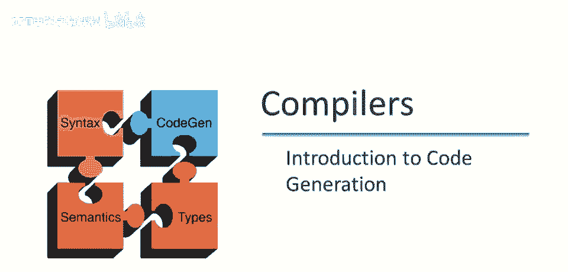
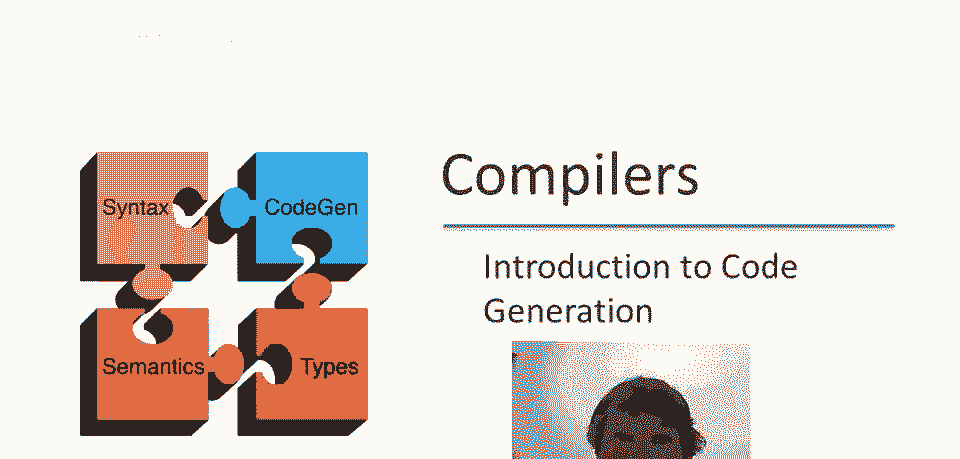
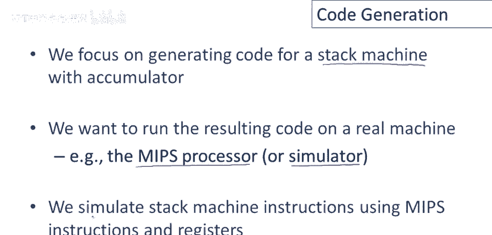
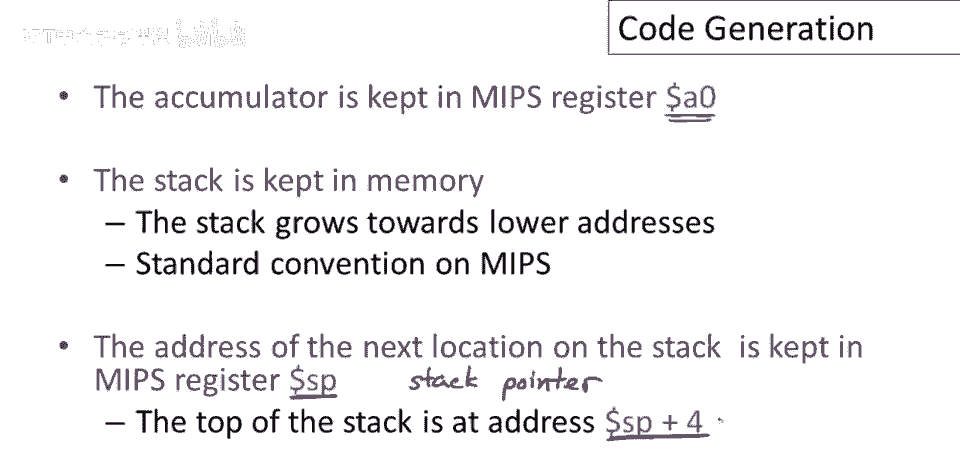
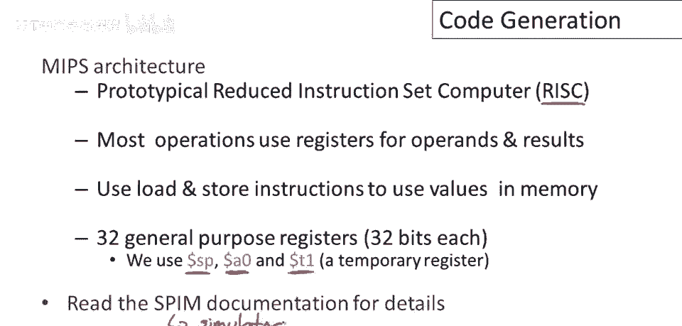
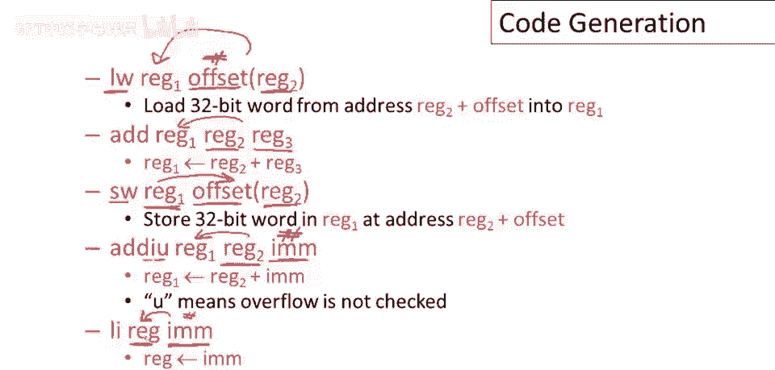
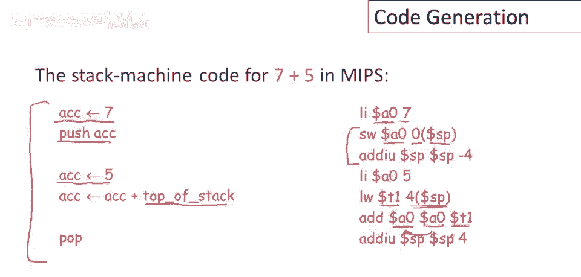

# 课程 P62：代码生成简介 🚀



在本节课中，我们将学习如何为栈式虚拟机生成实际的机器代码。我们将以 MIPS 处理器为目标，使用其模拟器来运行生成的代码，并理解将抽象栈机指令映射到具体 CPU 指令的基本策略。

---

## 目标与策略 🎯



在之前的课程中，我们讨论了运行时环境、组织结构和栈式虚拟机。现在，我们终于可以开始讨论代码生成了。

我们将聚焦于为栈式虚拟机生成代码。这可能是最简单的策略，通常不会产生最高效的代码，但这种方法非常有趣，也并非完全不切实际。对于我们的目的来说，它足够复杂。我们将在真实的硬件模拟器上运行生成的代码，具体将使用 MIPS 处理器及其模拟器。

它几乎可以在任何硬件上运行，这对于课程项目来说非常方便。基本思想和策略是使用 MIPS 指令来模拟栈式虚拟机的操作。

---

## MIPS 架构与寄存器设计 🏗️



上一节我们介绍了代码生成的目标，本节中我们来看看目标机器的架构。MIPS 架构设计于 20 世纪 80 年代，是典型的精简指令集计算机（RISC）。其理念是使用相对简单的指令集，大多数操作以寄存器作为操作数和结果，然后通过加载和存储指令在寄存器和内存之间移动数据。

MIPS 有 32 个通用寄存器（32位机器）。我们只会用到其中三个：
*   **`$sp` (栈指针)**：指向内存中栈的下一个未使用位置。
*   **`$a0` (累加器)**：模拟栈机中逻辑栈的顶部。为避免混淆，我们称其为累加器，以区别于内存中的栈。
*   **`$t1` (临时寄存器)**：用于存储临时值，例如进行运算时的第二个操作数。

在 MIPS 中，栈向低地址增长，这是标准惯例。栈指针 `$sp` 指向栈上下一个未分配的字（word）的地址。因此，当前的栈顶实际上位于 `$sp + 4` 的地址处。

---

## 核心 MIPS 指令集 ⚙️



为了为 MIPS 生成代码，我们只需要很少的几条指令。以下是实现我们第一个示例所需的五个核心指令：

**1. 加载字 (lw)**
```mips
lw $rt, offset($rs)
```
将寄存器 `$rs` 中的值加上 `offset`（代码中嵌入的常数）作为内存地址，将该地址的值加载到寄存器 `$rt` 中。

**2. 加法 (add)**
```mips
add $rd, $rs, $rt
```
将寄存器 `$rs` 和 `$rt` 中的值相加，结果存入寄存器 `$rd`。

**3. 存储字 (sw)**
```mips
sw $rt, offset($rs)
```
将寄存器 `$rt` 中的值存储到内存中，内存地址为寄存器 `$rs` 中的值加上 `offset`。

**4. 无符号立即数加法 (addiu)**
```mips
addiu $rt, $rs, immediate
```
将寄存器 `$rs` 中的值与 `immediate`（代码中嵌入的常数）相加，结果存入寄存器 `$rt`。“无符号”意味着不检查溢出。

**5. 加载立即数 (li)**
```mips
li $rt, immediate
```
将常数 `immediate` 直接加载到寄存器 `$rt` 中。

---



## 第一个代码生成示例：7 + 5 ➕

现在我们可以尝试生成第一个程序了。不出所料，它就是我们在之前视频中看过的那个计算 `7 + 5` 的程序。以下是栈机指令序列：
```
push 7
push 5
add
```

我们的目标是使用上述 MIPS 指令来实现这个程序。以下是具体的映射和解释：

**1. 将 7 加载到累加器 (`push 7` 的第一步)**
```mips
li $a0, 7
```
使用 `li` 指令将立即数 `7` 加载到累加器寄存器 `$a0` 中。

**2. 将累加器的值压入栈 (`push 7` 的第二步)**
这需要两步完成：
```mips
sw $a0, 0($sp)   # 将 $a0 的值存储到栈指针指向的内存地址
addiu $sp, $sp, -4 # 栈向低地址增长，因此栈指针减4，指向新的“下一个未使用位置”
```
第一条指令将累加器的值存到栈上（偏移量为0）。第二条指令将栈指针下移4个字节，以维持“`$sp` 指向下一个未使用位置”的不变性。

**3. 将 5 加载到累加器 (`push 5` 的第一步)**
```mips
li $a0, 5
```
与第一步类似，将立即数 `5` 加载到 `$a0`。

**4. 执行加法 (`add`)**
加法操作需要两个操作数：一个在累加器 (`$a0`) 中，另一个需要从栈顶加载。
```mips
lw $t1, 4($sp)   # 从栈顶加载值。因为 $sp 指向未使用位置，所以栈顶在 $sp+4
add $a0, $a0, $t1 # 执行加法，$a0 = $a0 + $t1，结果存回累加器
```
首先，使用 `lw` 指令将栈顶的值（位于 `$sp + 4`）加载到临时寄存器 `$t1`。然后，使用 `add` 指令将 `$a0` 和 `$t1` 相加，结果存回 `$a0`。

**5. 弹出栈 (`add` 操作的收尾)**
栈顶的值已经被使用，需要弹出栈。这只需调整栈指针即可：
```mips
addiu $sp, $sp, 4 # 栈指针加4，相当于丢弃已使用的栈顶元素
```

---

## 总结 📝



本节课中，我们一起学习了代码生成的第一步：将简单的栈式虚拟机程序映射到真实的 MIPS 指令。我们了解了 MIPS 作为 RISC 架构的基本特点，定义了用于模拟的寄存器（`$sp`, `$a0`, `$t1`），并学习了五个核心的 MIPS 指令（`lw`, `sw`, `add`, `addiu`, `li`）。最后，我们通过 `7 + 5` 这个具体示例，一步步演示了如何将栈机指令翻译成等价的 MIPS 指令序列，包括值的压栈、运算和弹栈过程。这为我们后续生成更复杂程序的代码奠定了基础。