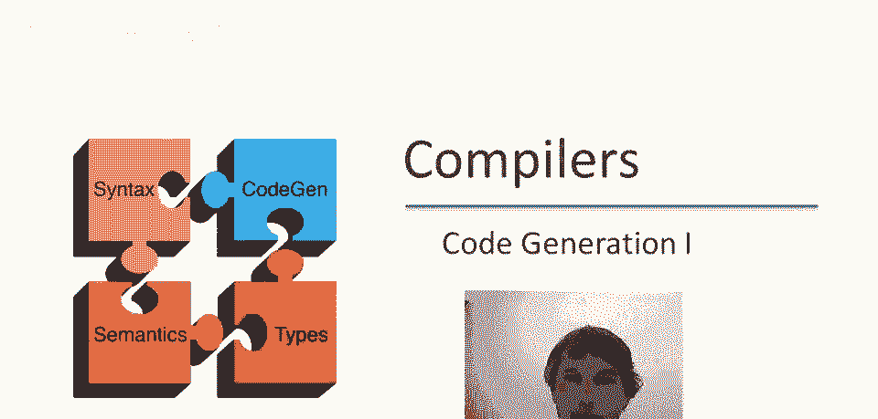
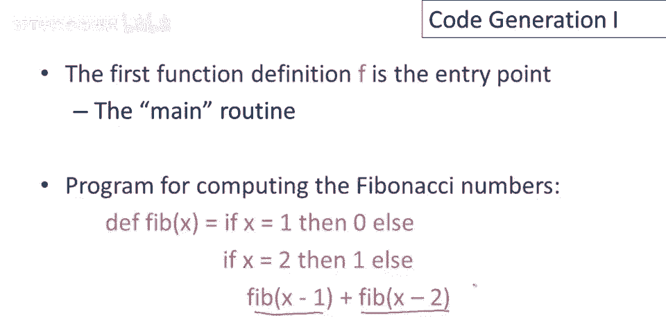
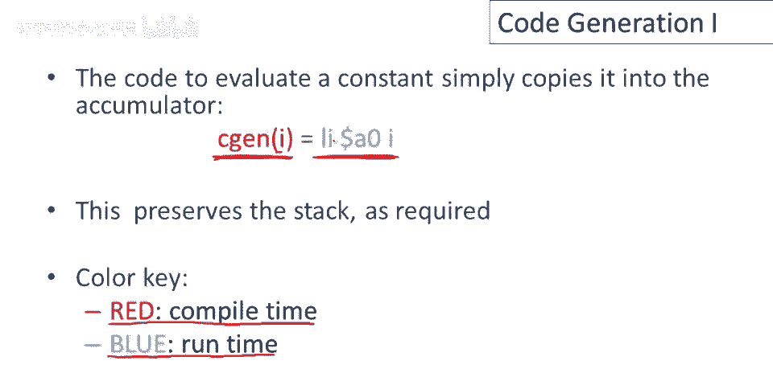
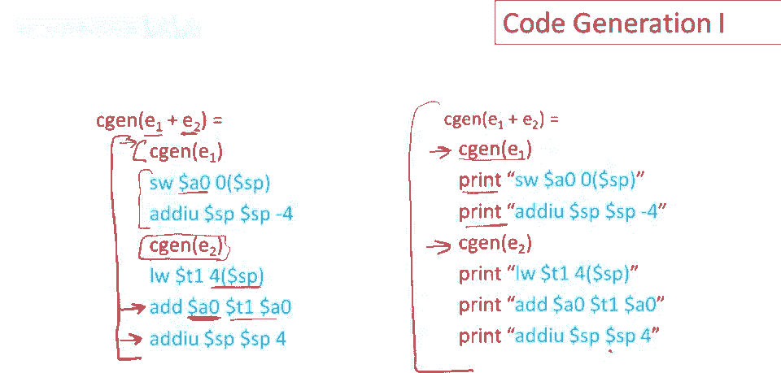
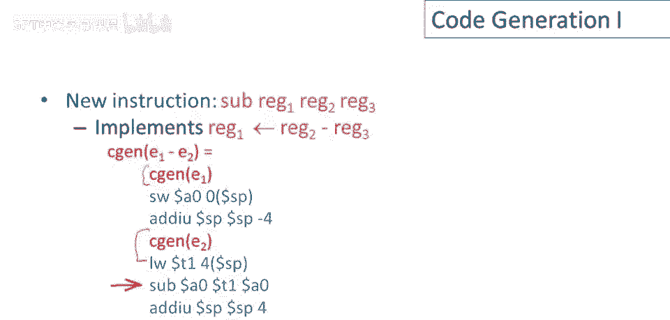

# 课程 P63：代码生成基础 🧠



在本节课中，我们将学习如何为一种包含整数、运算和条件判断的简单编程语言生成MIPS汇编代码。我们将从核心概念和约定开始，逐步讲解如何为不同类型的表达式（如常量、加法、减法、条件判断）生成代码，并理解代码生成过程中的关键原则，如栈的使用和递归下降。

---


## 概述 📋



代码生成是将高级语言结构转换为目标机器指令的过程。本节我们将研究一种比栈机语言更高级的语言的代码生成。这种语言包含整数、基本运算和函数定义。我们的目标是为每个表达式生成MIPS代码，该代码计算表达式的值并将其存储在累加器 `$a0` 中，同时保持栈的状态不变。

---

## 语言语法与示例 📝


程序由一系列函数声明组成。每个函数定义包括函数名、参数列表（仅为标识符）和一个作为函数体的表达式。

**语法**可以概括为：
```
程序 -> 声明列表
声明 -> 函数定义
函数定义 -> 函数名(参数列表) { 表达式 }
表达式 -> 整数 | 标识符 | if (表达式 == 表达式) then 表达式 else 表达式 | 表达式 + 表达式 | 表达式 - 表达式 | 函数调用(参数列表)
```

列表中的第一个函数是程序的入口点（主函数）。这种语言足以编写如斐波那契数列这样的函数。

**斐波那契函数示例**：
```
fib(x) {
    if (x == 1) then 0 else
        if (x == 2) then 1 else
            fib(x-1) + fib(x-2)
}
```



---

## 代码生成的核心约定 🎯

我们定义一个代码生成函数 `cgen(e)`，它为表达式 `e` 生成MIPS代码。生成的代码需要满足两个核心不变量：
1.  **计算结果**：代码执行完毕后，表达式 `e` 的值将存储在累加器 `$a0` 中。
2.  **栈不变性**：代码执行前后，栈指针 `$sp` 和栈的内容必须保持一致。

在后续讲解中，我们使用颜色来区分不同阶段：
*   **红色**：表示在**编译时**由编译器执行的操作（如调用 `cgen` 函数）。
*   **蓝色**：表示生成的、将在**运行时**由目标程序执行的指令。

---

## 为常量生成代码 🔢

为整数常量 `i` 生成代码是最简单的情况。我们只需要一条指令将常数值加载到累加器中。

**代码生成公式**：
```
cgen(i) = li $a0, i
```

*   `li $a0, i` 是一条MIPS指令，将立即数 `i` 加载到寄存器 `$a0`。
*   这条指令不修改栈指针或栈内容，完美满足我们的两个不变量。

在编译时，我们执行 `cgen(i)`，它会生成这条蓝色的运行时指令。

---

## 为加法表达式生成代码 ➕



上一节我们介绍了最简单的常量代码生成。本节中我们来看看如何处理二元操作，以加法表达式 `e1 + e2` 为例。其核心挑战是：我们只有一个累加器 `$a0`，但需要计算两个子表达式的值。

**思路**：
1.  先计算 `e1`，将其值临时保存。
2.  再计算 `e2`，此时 `e2` 的结果在 `$a0` 中。
3.  取出之前保存的 `e1` 的值，与 `$a0` 相加，结果存回 `$a0`。

我们应该把 `e1` 的值保存在哪里？答案是**栈**。

**代码生成模板**：
```
cgen(e1 + e2) =
    cgen(e1)        // 计算 e1，结果在 $a0
    sw $a0, 0($sp)  // 将 $a0 的值压入栈顶
    addiu $sp, $sp, -4 // 调整栈指针
    cgen(e2)        // 计算 e2，结果在 $a0
    lw $t1, 4($sp)  // 从栈中取回 e1 的值到临时寄存器 $t1
    add $a0, $t1, $a0 // 执行加法：$a0 = $t1 + $a0
    addiu $sp, $sp, 4  // 弹出栈，恢复栈指针
```

**关键点**：
*   这是一个**代码模板**：固定指令（如 `sw`, `add`, `lw`）与可插入的子表达式代码（`cgen(e1)`, `cgen(e2)`）的结合。
*   **递归下降**：`cgen(e1 + e2)` 的实现递归调用了 `cgen(e1)` 和 `cgen(e2)`。
*   **栈的作用**：栈为嵌套表达式的中间结果提供了安全的存储空间，避免了寄存器冲突。

---

### 为什么必须使用栈？🚫

一个自然的优化想法是：不用栈，而用另一个固定的临时寄存器（如 `$t1`）保存 `e1` 的结果。让我们看看为什么这行不通。

考虑表达式 `(1 + 2) + 3`。如果使用固定寄存器 `$t1`：
1.  计算 `1`，存入 `$a0`，然后 `move $t1, $a0`。
2.  开始计算 `(2 + 3)`。计算 `2`，存入 `$a0`，然后 `move $t1, $a0`。**问题出现**：这里覆盖了 `$t1` 中原来保存的 `1`！
3.  继续计算 `+ 3`，得到 `5` 在 `$a0`。
4.  执行外层加法 `add $a0, $t1, $a0`。此时 `$t1` 中是 `2`，所以结果是 `2 + 5 = 7`，而不是正确的 `6`。

这揭示了在递归生成代码时，同类型的嵌套表达式会竞争相同的临时寄存器。**栈提供了动态的、后进先出的存储，完美匹配了表达式的递归求值顺序**。

---


## 为减法表达式生成代码 ➖

理解了加法后，减法表达式的代码生成就非常类似了。模式完全相同，只是最后的运算指令不同。

**代码生成模板**：
```
cgen(e1 - e2) =
    cgen(e1)        // 计算 e1
    sw $a0, 0($sp)  // 压栈保存 e1
    addiu $sp, $sp, -4
    cgen(e2)        // 计算 e2
    lw $t1, 4($sp)  // 取回 e1
    sub $a0, $t1, $a0 // 执行减法：$a0 = $t1 - $a0
    addiu $sp, $sp, 4  // 弹栈
```


可以看到，除了将 `add` 指令替换为 `sub` 指令，其余部分与加法完全一致。这体现了代码模板的复用性。

---

## 为条件表达式生成代码 ⚖️



现在我们来处理更复杂的控制流结构：`if (e1 == e2) then e3 else e4`。这需要引入MIPS的跳转指令。

**需要用到的MIPS指令**：
*   `beq $rs, $rt, label`：如果寄存器 `$rs` 和 `$rt` 的值相等，则跳转到 `label`。
*   `j label`：无条件跳转到 `label`。


**生成代码的思路**：
1.  计算条件 `e1 == e2`。这需要先后计算 `e1` 和 `e2`。
2.  比较两者的值。
3.  如果相等，跳转到计算 `e3` 的代码块（真分支）。
4.  如果不相等，则顺序执行计算 `e4` 的代码块（假分支）。
5.  两个分支最终需要汇合到同一个结束点。

**代码生成模板**：
```
cgen(if (e1 == e2) then e3 else e4) =
    cgen(e1)                 // 计算 e1
    sw $a0, 0($sp)           // 保存 e1 到栈
    addiu $sp, $sp, -4
    cgen(e2)                 // 计算 e2，结果在 $a0
    lw $t1, 4($sp)           // 取回 e1 到 $t1
    addiu $sp, $sp, 4        // 弹栈
    beq $a0, $t1, TRUE_LABEL // 比较：若 e2($a0) == e1($t1)，跳转到真分支
    cgen(e4)                 // 假分支：计算 e4
    j END_IF_LABEL           // 跳过真分支
TRUE_LABEL:
    cgen(e3)                 // 真分支：计算 e3
END_IF_LABEL:
```

**执行逻辑**：
*   如果条件为真，执行 `beq` 跳转到 `TRUE_LABEL`，计算 `e3`，然后到达 `END_IF_LABEL`。此时 `$a0` 中是 `e3` 的值。
*   如果条件为假，则顺序执行 `cgen(e4)`，然后通过 `j` 指令跳过真分支，到达 `END_IF_LABEL`。此时 `$a0` 中是 `e4` 的值。
*   无论走哪个分支，最终 `$a0` 中都存储了整个条件表达式的正确结果，并且栈状态得以保持。

---

## 总结 🎓

本节课中我们一起学习了为一种简单语言生成MIPS代码的基础知识。我们掌握了以下核心内容：

1.  **代码生成函数** `cgen(e)` 的目标是生成计算表达式值并保持栈不变的代码。
2.  **代码生成是递归的**，遵循抽象语法树的结构进行下降。
3.  **栈的核心作用**是安全地存储嵌套表达式求值过程中的中间结果，避免寄存器冲突。
4.  **代码生成遵循固定模板**：对于每种表达式类型（常量、加法、减法、条件判断），我们都有一套固定的指令框架，其中“插入”了子表达式的生成代码。
5.  我们详细分析了**加法**、**减法**和**条件表达式**的代码生成过程，理解了其背后的模式和原理。


这些概念是理解更复杂代码生成（如函数调用、变量访问）的基石。下一节，我们可以在此基础上探讨如何为函数调用和标识符生成代码。