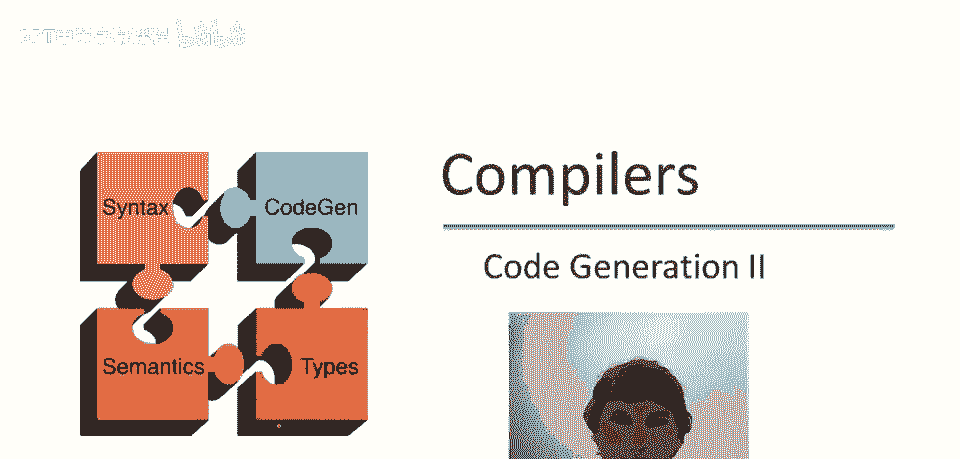
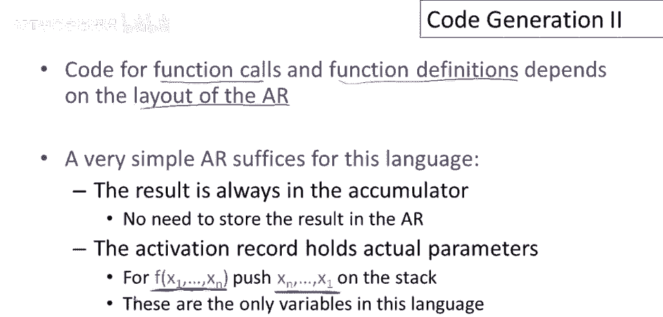
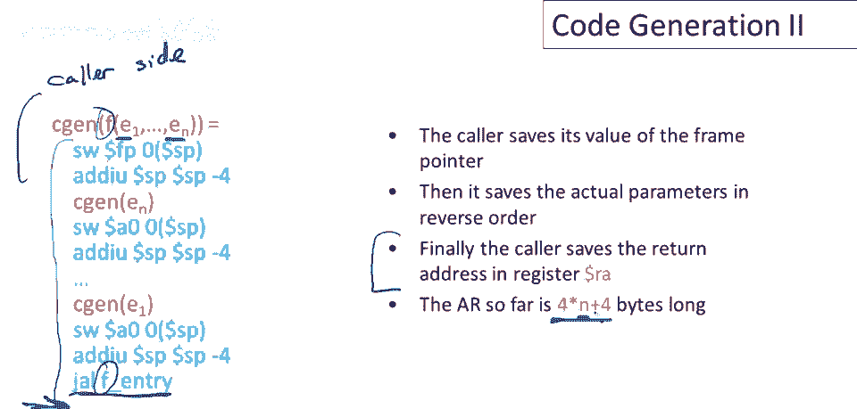
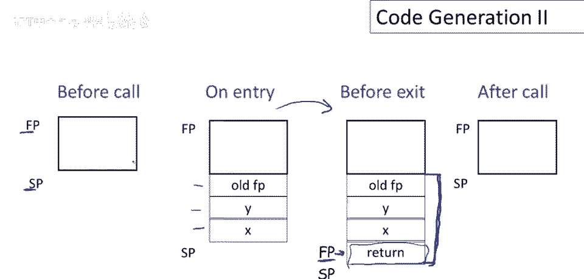
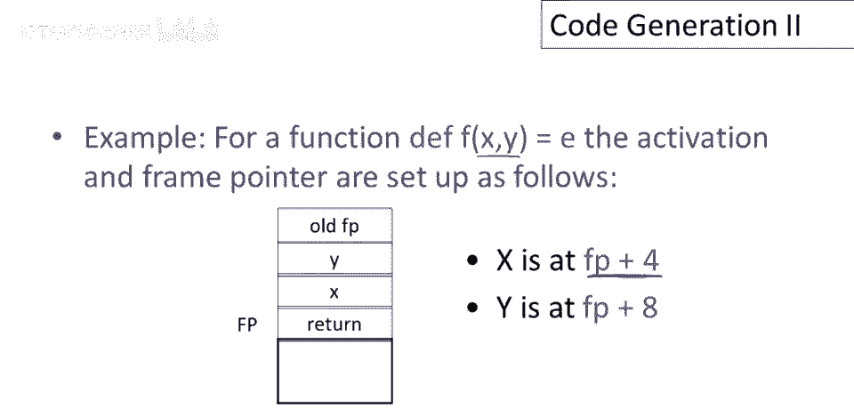
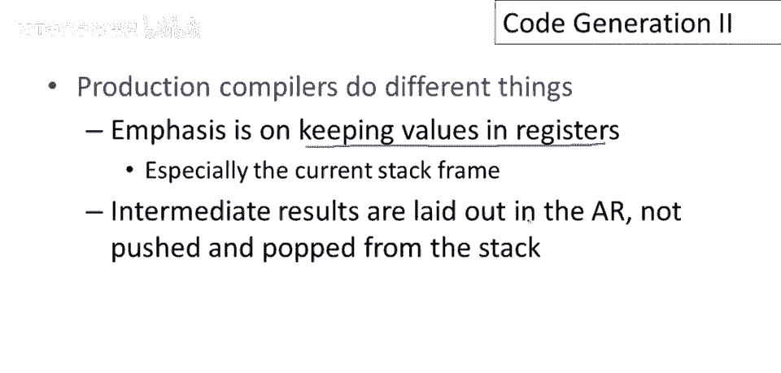

# 编译器构建课程 P64：简单语言的代码生成（续）🚀



在本节课中，我们将继续学习简单语言的代码生成。我们将重点完成函数调用、函数定义以及变量引用的代码生成。理解这些概念对于构建一个完整的编译器至关重要。


---

## 概述 📋



本视频是前一个视频的续集，我们将完成简单语言的代码生成，处理函数调用、函数定义和变量引用。

为了回顾，我们的简单语言包含多种表达式。在上次课程中，我们处理了除变量引用和函数调用之外的所有表达式。此外，我们还有一个函数定义结构。

## 核心结构与设计挑战 ⚙️


我们将要查看的三个核心结构是：
*   变量引用
*   函数调用
*   函数定义

设计函数调用和函数定义代码生成的主要挑战在于，它们都紧密依赖于**激活记录**的布局。因此，函数调用的代码生成、函数定义的代码生成以及激活记录的布局需要作为一个整体来协同设计。

对于这种特定语言，一个非常简单的激活记录就足够了。因为我们使用栈机模型，函数调用的结果将始终存放在累加器（`A0`）中，这意味着无需在激活记录中存储函数调用的结果。激活记录将主要保存**实际参数**。

当我们计算一个带有参数 `x1` 到 `xn` 的函数调用时，我们会将这些参数推入栈中。在这个语言中，除了函数调用的参数外，没有其他局部或全局变量。因此，这些参数是激活记录中唯一需要存储的变量。


## 激活记录布局设计 🏗️

栈机模型保证，在函数调用期间栈指针保持不变。这意味着当从函数调用退出时，栈指针与进入时完全相同。因此，我们不需要在激活记录中存储**控制链接**（用于寻找前一个激活记录）。


然而，我们需要存储**返回地址**。此外，一个指向当前激活记录的指针（**帧指针**）将非常有用。这个指针通常存放在寄存器 `fp` 中，它指向当前栈帧的顶部。

以下是该语言激活记录的总结：
*   调用者的帧指针（旧的 `fp`）
*   函数的实际参数（按逆序推入栈中）
*   返回地址

考虑一个调用函数 `f` 的例子，它有两个参数 `x` 和 `y`。在执行函数体之前，激活记录将如下布局：

```
| ...          | 高地址
| 参数 y       |
| 参数 x       |
| 旧帧指针     | <-- 调用者的 fp 指向这里
| 返回地址     | <-- 当前 fp 指向这里
| ...          | 低地址
```

参数按逆序（最后一个参数先入栈）推入，这使得后续通过索引访问参数变得更容易。



## 函数调用的代码生成（调用者侧）📞

调用序列是调用者和被调用者共同设置函数调用的指令序列。我们将使用 `jal`（跳转并链接）指令。`jal L` 会跳转到标签 `L`，并将下一条指令的地址保存在 `ra`（返回地址）寄存器中。

假设我们有一个函数调用 `f(e1, e2, ..., en)`。以下是调用者侧代码生成的步骤：

1.  保存当前帧指针（调用者的 `fp`）到栈上，并移动栈指针。
2.  为参数生成代码（从最后一个参数 `en` 开始到第一个参数 `e1` 结束）：
    *   计算表达式 `ei`，结果在累加器 `A0` 中。
    *   将 `A0` 的值存储到栈上，并移动栈指针。
3.  执行 `jal f_entry` 指令，跳转到函数 `f` 的入口点。

此时，栈上已经构建了部分激活记录（旧帧指针和所有参数），`ra` 寄存器中保存了返回地址。

## 函数定义的代码生成（被调用者侧）🏠

被调用者侧是函数定义本身的代码。我们需要 `jr`（跳转寄存器）指令来返回到调用者。

函数 `f` 的代码生成如下：


```
f_entry:          # 函数入口标签
    move $fp, $sp # 设置当前帧指针，指向栈顶（返回地址将存放的位置）
    sw $ra, 0($sp) # 将返回地址保存到栈帧中（0($fp)的位置）
    addi $sp, $sp, -4 # 移动栈指针

    # ... 为函数体生成代码 ...

    # 函数返回序列
    lw $ra, 4($sp)   # 从栈帧中恢复返回地址
    addi $sp, $sp, z # 弹出整个激活记录，z = 4*n + 8
    lw $fp, 0($sp)   # 恢复旧的帧指针
    jr $ra           # 跳转回调用者
```

**注意**：`z` 是激活记录的总大小。对于有 `n` 个参数的函数，`z = 4*n + 8`（`n`个参数占 `4*n` 字节，加上旧帧指针和返回地址各占4字节）。

调用者负责在函数调用后，通过调整栈指针来清理（弹出）传递的参数和保存的旧帧指针。



## 变量引用的代码生成 🔍

在这种简单语言中，变量即函数的参数。它们存储在激活记录中。由于函数体执行时，栈指针会因中间计算结果而变动，我们不能依靠栈指针来定位参数。


解决方案是使用**帧指针**（`fp`）。帧指针在函数执行期间固定指向当前激活记录的顶部（返回地址处），因此我们可以相对于它来定位变量。


对于函数的第 `i` 个参数 `xi`（按参数列表顺序，从1开始计数），它在激活记录中的位置是：
`偏移量 = 4 * i`

因为参数是按逆序压栈的，最后一个参数在 `fp + 4`，倒数第二个在 `fp + 8`，以此类推。

因此，为变量引用 `xi` 生成代码非常简单：
`lw $a0, offset($fp)`  // offset = 4 * i


**示例**：对于函数 `f(x, y)`：
*   变量 `x`（第一个参数）的偏移量是 4。代码为：`lw $a0, 4($fp)`
*   变量 `y`（第二个参数）的偏移量是 8。代码为：`lw $a0, 8($fp)`



## 总结与要点 📝

本节课我们一起学习了简单语言中函数调用、函数定义和变量引用的完整代码生成过程。


**核心要点总结：**

1.  **协同设计**：激活记录的布局必须与代码生成协同设计，两者不能孤立进行。
2.  **递归遍历**：代码生成可以通过抽象语法树（AST）的递归遍历来实现，这与类型检查类似，是一种清晰的方法。
3.  **栈机模型**：对于学习和实现编译器项目，栈机模型是一个优秀的起点。它概念简单，为问题分解提供了清晰的框架。
4.  **生产编译器差异**：需要了解生产级编译器与教学用栈机编译器的主要区别。生产编译器更注重**寄存器分配**，尽可能将值（包括临时变量和局部变量）保留在寄存器中，而不是频繁地访问栈内存。它们会为所有局部数据在激活记录中分配固定的位置。



通过掌握这些知识，你已经为理解更复杂的代码生成技术和优化策略奠定了坚实的基础。