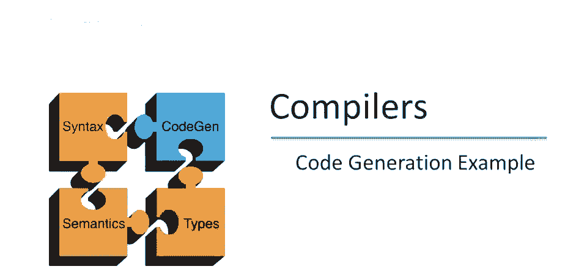
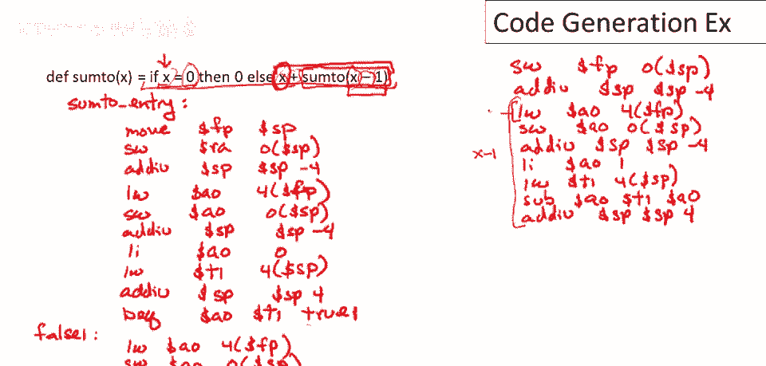

# 课程 P65：代码生成基础 🧩


在本节课中，我们将学习如何为一个简单的递归函数生成汇编代码。我们将以计算从 `0` 到 `x` 的整数和为例，逐步剖析代码生成的完整过程，并理解如何将高级语言结构转换为底层的机器指令。

---

## 概述

我们将要分析的程序接受一个正整数 `x`，并计算从 `0` 到 `x` 的所有数字之和。其逻辑可以描述为：如果 `x` 为 `0`，则结果为 `0`；否则，结果为 `x` 加上从 `0` 到 `x-1` 的所有数字之和。虽然程序逻辑简单，但它完整地展示了代码生成中的核心概念，如函数调用、条件判断和算术运算。

---

## 函数入口与调用者序言

上一节我们介绍了程序的基本逻辑，本节中我们来看看如何为函数设置入口点并生成调用者序言代码。

首先，为函数的入口点定义一个标签，例如 `sum_to_entry`。调用者序言代码负责建立新的栈帧。

以下是生成调用者序言代码的步骤：

1.  设置帧指针。其值等于当前栈指针的值，标记此激活记录的起始位置。
2.  存储返回地址。将返回地址保存在当前栈指针指向的位置。
3.  移动栈指针。每当在栈上存储数据后，都需要将栈指针移动到下一个未使用的位置。

```assembly
sum_to_entry:
    move $fp, $sp        # 设置帧指针
    sw $ra, 0($sp)       # 存储返回地址
    addi $sp, $sp, 4     # 移动栈指针
```

---

## 生成条件判断（if-then-else）的代码

上一节我们设置了函数框架，本节中我们来看看如何为 `if-then-else` 结构生成代码。这需要为条件谓词和两个分支生成相应的指令。

首先，需要为条件谓词的第一个子表达式生成代码。在本例中，谓词是判断 `x == 0`，因此第一个子表达式是变量 `x`。

为变量生成代码意味着在栈帧的特定偏移量处查找其值。由于 `x` 是此过程的唯一参数，它存储在帧指针偏移 `4` 的位置。

计算完第一个子表达式后，需要将其值临时保存在栈上，因为接下来要为第二个子表达式（立即数 `0`）生成代码。这是一个二元运算符（相等比较）的标准处理流程。

以下是生成条件判断代码的步骤：

1.  加载变量 `x` 的值到累加器。
2.  将该值保存到栈上，并移动栈指针。
3.  加载立即数 `0` 到累加器。
4.  将之前保存的 `x` 的值从栈中加载到临时寄存器。
5.  比较两个值是否相等。
6.  根据比较结果，使用分支指令跳转到真分支或假分支的标签。

```assembly
    # 谓词：x == 0
    lw $a0, 4($fp)       # 加载变量 x
    sw $a0, 0($sp)       # 保存 x 到栈
    addi $sp, $sp, 4     # 移动栈指针
    li $a0, 0            # 加载立即数 0
    lw $t1, -4($sp)      # 重新加载 x 到临时寄存器 t1
    addi $sp, $sp, -4    # 弹出栈（回收临时空间）
    beq $a0, $t1, true1  # 如果 x == 0，跳转到真分支
    j false1             # 否则，跳转到假分支
```

---

## 生成假分支（Else Branch）的代码

上一节我们完成了条件跳转，本节中我们来看看假分支的代码生成。假分支对应 `x` 不为 `0` 的情况，需要计算 `x + sum_to(x-1)`。

这是一个加法表达式，因此需要先生成第一个操作数 `x` 的代码，然后生成第二个操作数（函数调用 `sum_to(x-1)`）的代码。

生成函数调用代码的第一步是设置新的激活记录。这包括保存旧的帧指针、计算参数（`x-1`）并将其压栈，最后执行跳转链接指令。



以下是生成假分支代码的步骤：

1.  加载 `x` 的值并保存到栈上（作为加法的第一个操作数）。
2.  为函数调用 `sum_to(x-1)` 生成代码：
    *   保存旧的帧指针。
    *   计算参数 `x-1`（这本身是一个减法表达式）。
    *   将计算结果（参数）压入新激活记录。
    *   执行 `jal sum_to_entry` 进行函数调用。
3.  函数返回后，从栈中重载加法的第一个操作数。
4.  执行加法操作，得到最终结果。
5.  清理栈上的临时值。

```assembly
false1:
    # 计算 x + sum_to(x-1)
    lw $a0, 4($fp)       # 加载 x (加法第一操作数)
    sw $a0, 0($sp)       # 保存 x 到栈
    addi $sp, $sp, 4

    # 开始设置函数调用 sum_to(x-1)
    sw $fp, 0($sp)       # 保存旧帧指针
    addi $sp, $sp, 4

    # 计算参数 x-1
    lw $a0, 4($fp)       # 加载 x (减法第一操作数)
    sw $a0, 0($sp)       # 保存 x 到栈
    addi $sp, $sp, 4
    li $a0, 1            # 加载立即数 1
    lw $t1, -4($sp)      # 重载 x 到 t1
    addi $sp, $sp, -4    # 弹出栈
    sub $a0, $t1, $a0    # 计算 x - 1
    # 参数计算完毕

    sw $a0, 0($sp)       # 将参数 (x-1) 存入新帧
    addi $sp, $sp, 4
    jal sum_to_entry     # 调用函数

    # 函数调用返回，继续执行加法
    lw $t1, -8($sp)      # 重载之前保存的 x
    add $a0, $t1, $a0    # 计算 x + sum_to(x-1)
    addi $sp, $sp, -8    # 弹出栈上临时值
    j if_done1           # 跳转到 if 结构结束处
```

---

## 生成真分支（Then Branch）与函数返回

上一节我们生成了复杂的假分支，本节中我们来看看相对简单的真分支以及函数如何返回。真分支对应 `x == 0` 的情况，只需返回 `0`。

真分支的代码非常简单，仅需一条加载立即数指令。之后，程序流会汇聚到 `if` 结构的结束标签。

函数定义的结尾部分需要生成返回序列。这包括从栈中恢复返回地址和旧的帧指针，调整栈指针以销毁当前激活记录，最后跳转回调用者。

以下是生成真分支及返回序列的步骤：

1.  真分支：加载立即数 `0` 到累加器。
2.  `if` 结构结束标签。
3.  返回序列：
    *   从栈中加载返回地址。
    *   弹出当前激活记录（返回地址、旧帧指针、参数，共 `12` 字节）。
    *   恢复旧的帧指针。
    *   使用 `jr` 指令跳转回返回地址。

```assembly
true1:
    li $a0, 0            # 真分支：返回 0

if_done1:
    # 函数返回序列
    lw $ra, -4($fp)      # 加载返回地址
    addi $sp, $sp, 12    # 弹出整个激活记录 (3个字)
    lw $fp, -8($sp)      # 恢复旧帧指针
    jr $ra               # 跳转回调用者
```

---

## 总结与关键点

本节课中，我们一起学习了为一个递归求和函数生成完整汇编代码的过程。我们从函数入口和调用者序言开始，逐步生成了条件判断、真假分支以及函数返回的代码。

总结关键点如下：

*   **代码由模板拼接**：生成的代码是多个标准模板（如函数调用、算术运算、条件分支）的组合结果。
*   **线性指令序列**：尽管生成过程是结构化的，但最终产物是一个线性的机器指令序列。
*   **简单策略的效率问题**：我们采用的这种简单直接的代码生成策略会产生许多低效操作，例如重复加载和存储同一变量。这为后续学习更智能的代码优化技术（如寄存器分配）提供了动机。

通过这个例子，你应该对如何将高级语言结构系统地翻译为底层代码有了基本的理解。理解这些模板的组合方式是掌握编译器代码生成阶段的基础。