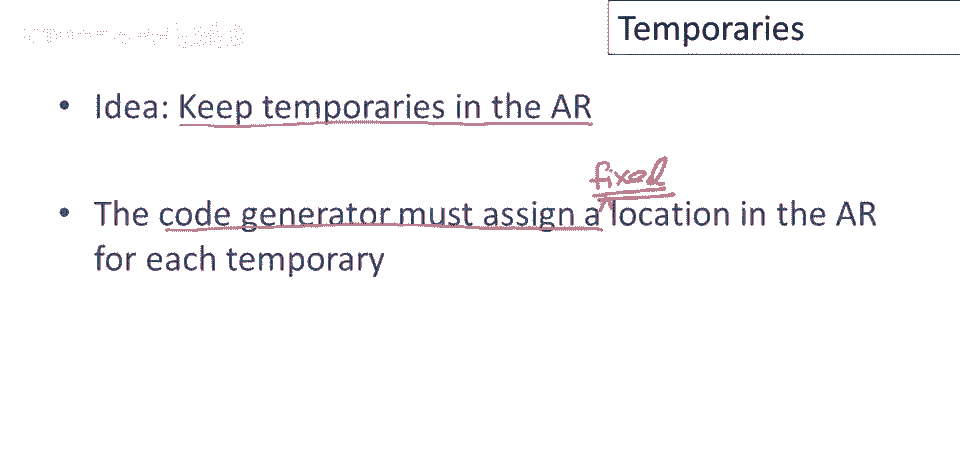
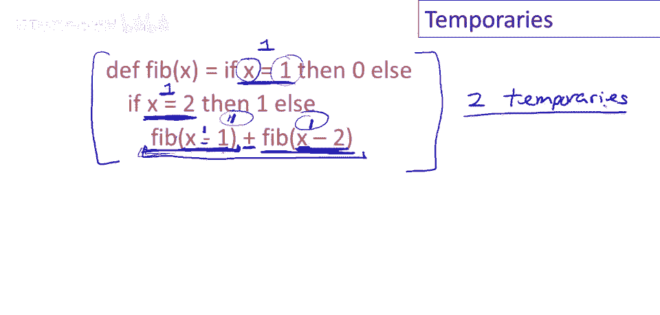
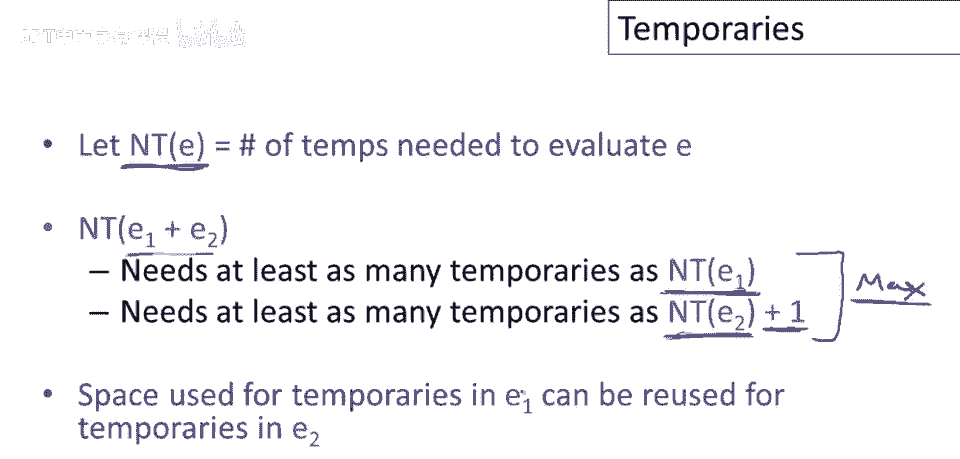
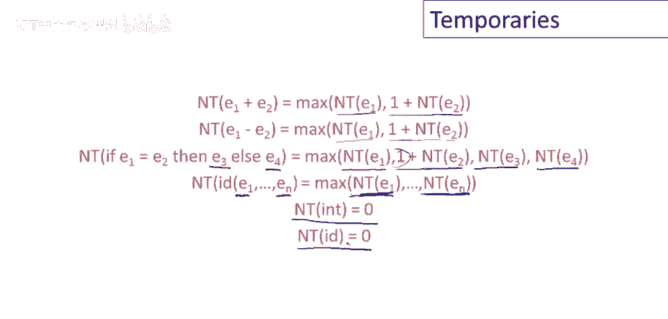
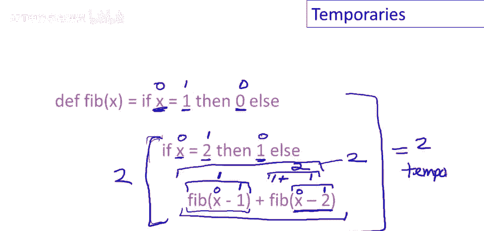
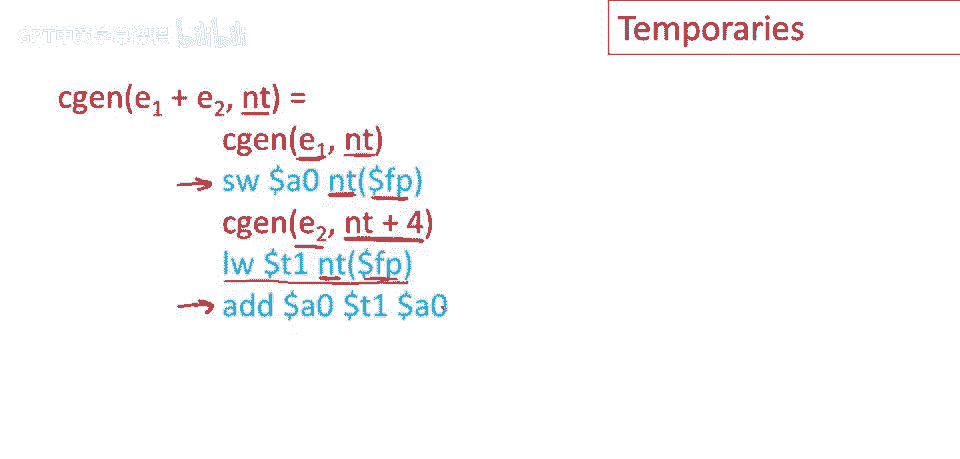

# 课程 P66：临时变量管理优化 🧠


在本节课中，我们将学习编译器如何更有效地管理临时变量。我们将探讨一种改进方法，即预先在函数的激活记录中为临时变量分配固定位置，从而避免在运行时频繁操作堆栈指针，以生成更高效的代码。


---


## 背景与问题引入

上一节我们讨论了简单编程语言的代码生成。在之前的视频末尾提到，实际编译器的处理方式略有不同，特别是会更有效地将值保存在寄存器中。



此外，编译器还需要管理在激活记录中必须存储的临时变量。本节将重点讨论第二个问题，即如何更好地管理这些临时值。

基本思想是，将临时值保存在激活记录中。虽然这不如将临时变量直接保存在寄存器中高效（那是未来课程的主题），但我们可以改进在激活记录中管理临时变量的方式。

---

## 核心思想：预分配固定位置

我们要做的改进是，让代码生成器为每个临时变量在激活记录中分配一个固定的位置。我们将预先分配内存（即激活记录中的位置），然后就可以保存和恢复临时变量，而无需在运行时动态操作堆栈指针。

让我们看一个简单编程语言的典型程序，这是斐波那契函数：

```pseudocode
function fib(x):
    if x < 2 then
        return x
    else
        return fib(x-1) + fib(x-2)
```

我们需要思考，评估这个函数体需要多少个临时变量。如果我们能提前知道所需临时变量的数量，就可以在激活记录中预先分配空间，而不是在运行时通过堆栈推入和弹出操作来分配。

以下是分析过程：



*   评估谓词 `x < 2` 需要一个临时变量来保存比较结果。
*   评估 `fib(x-1)` 时，需要先计算 `x-1`，这需要一个临时变量。
*   调用 `fib(x-1)` 的结果需要被保存，以便后续进行加法运算，这又需要一个临时变量。
*   在评估 `fib(x-2)` 的参数 `x-2` 时，我们仍然需要保留 `fib(x-1)` 的结果，因此这两个临时变量需要同时存在。

经过分析，这个特定函数可以用**两个临时变量**来评估。这就是计算该函数体所需的所有临时空间。

---

## 计算所需临时变量数



一般来说，我们可以定义一个函数 **`nt(e)`**，它计算评估表达式 `e` 所需的最小临时变量数。

以下是描述所需临时变量数量的方程系统：

*   **整数或变量引用**：不占用临时空间。
    *   `nt(int) = 0`
    *   `nt(id) = 0`
*   **二元操作（如 `e1 + e2`）**：需要评估 `e1` 和 `e2`。评估 `e1` 后，其使用的临时空间可以被回收，用于评估 `e2`，但需要额外一个位置来保存 `e1` 的结果。
    *   `nt(e1 op e2) = max(nt(e1), 1 + nt(e2))`
*   **条件表达式（`if e1 then e2 else e3`）**：需要分别考虑评估条件 `e1`、`then` 分支 `e2` 和 `else` 分支 `e3` 所需的空间，并取最大值。
    *   `nt(if e1 then e2 else e3) = max(nt(e1), 1 + nt(e2), 1 + nt(e3))`
*   **函数调用（`f(e1, ..., en)`）**：参数的计算结果保存在**新**的激活记录中，因此不计入当前激活记录的临时变量需求。只需考虑评估各个参数时所需临时空间的最大值。
    *   `nt(f(e1, ..., en)) = max(nt(e1), ..., nt(en))`

让我们使用这个方程系统，系统地计算斐波那契函数体所需的临时变量数 `nt(fib-body)`。

以下是计算步骤：
1.  计算外层 `if` 的谓词部分 `x < 2`：`nt(x) = 0`, `nt(2) = 0`，所以 `nt(x<2) = max(0, 1+0) = 1`。
2.  `then` 分支 `x`：`nt(x) = 0`。
3.  `else` 分支 `fib(x-1) + fib(x-2)`：
    *   计算 `fib(x-1)`：
        *   参数 `x-1`：`nt(x)=0`, `nt(1)=0`，所以 `nt(x-1) = max(0, 1+0) = 1`。
        *   因此 `nt(fib(x-1)) = max(nt(x-1)) = 1`。
    *   计算 `fib(x-2)`：同理，`nt(fib(x-2)) = 1`。
    *   计算加法 `... + ...`：`nt(e1 + e2) = max(nt(e1), 1 + nt(e2)) = max(1, 1+1) = 2`。
4.  因此，整个 `else` 分支需要 2 个临时变量。
5.  最后，计算整个 `if` 表达式：`nt(if...) = max(nt(谓词), 1+nt(then分支), 1+nt(else分支)) = max(1, 1+0, 1+2) = 3`。

经过计算，该函数体评估所需的最小临时变量数为 **3**。（注：此结果与之前直观分析的2个略有出入，展示了系统化计算的精确性）。

---

## 激活记录的新布局



一旦我们计算出函数体所需临时变量数 `nt`，就可以相应地扩展激活记录。

现在，激活记录需要 `2 + n + nt` 个存储单元（每个单元通常是一个字长，如4字节）：
*   `2`：用于返回地址和帧指针。
*   `n`：用于函数的 `n` 个参数。
*   `nt`：用于预分配的临时变量。

新的激活记录布局如下（地址从高到低增长）：

```
| ...                  | 高地址
| 临时变量 #nt         |
| ...                  |
| 临时变量 #1          |
| 返回地址             |
| 参数 n               |
| ...                  |
| 参数 1               |
| 前一帧的帧指针       | <- 当前帧指针 (FP) 指向这里
| ...                  | 低地址
```

临时变量区域位于返回地址**之后**。这样，通过帧指针（FP）加上固定的偏移量，就可以直接访问任何一个临时变量或参数。

---



## 代码生成策略


知道了函数所需临时变量总数以及它们在激活记录中的固定位置后，我们还需要知道在生成代码时，程序每一点正在使用哪些临时变量。


为此，我们为代码生成函数添加一个新的参数：**`next_temp`**。它表示激活记录中下一个可用的临时变量位置的偏移量。

临时变量区域将被用作一个**小型固定栈**。当一个表达式需要使用临时空间时，它就占用 `next_temp` 指示的位置，然后将 `next_temp` 增加（例如一个字的长度）。当该表达式计算完毕，其占用的临时空间被释放，`next_temp` 相应减少。这本质上与我们之前使用的栈纪律相同，但所有关于栈指针的计算现在都由编译器在编译时完成，生成的代码中只剩下简单的、固定偏移量的加载（`LOAD`）和存储（`STORE`）指令。

让我们对比一下优化前后，为表达式 `e1 + e2` 生成代码的差异：

**旧方案（动态栈操作）：**
```assembly
code(e1)                # 计算 e1，结果在累加器 ACC 中
PUSH ACC                # 将结果压入运行时栈
code(e2)                # 计算 e2，结果在 ACC 中
POP temp                # 弹出 e1 的结果到临时寄存器 TEMP
ADD ACC, TEMP, ACC      # ACC = TEMP + ACC
```


**新方案（固定偏移存取）：**
```assembly
code(e1, next_temp)     # 计算 e1，传入当前临时变量偏移量
STORE ACC, FP(next_temp)# 将结果存入固定位置 FP+next_temp
code(e2, next_temp+4)   # 计算 e2，传入下一个临时位置偏移量
LOAD TEMP, FP(next_temp)# 从固定位置加载 e1 的结果
ADD ACC, TEMP, ACC      # ACC = TEMP + ACC
```

可以看到，新方案用一条 `STORE` 指令替换了旧方案的 `PUSH` 和后续调整栈指针的隐式操作；用一条 `LOAD` 指令替换了 `POP` 指令。生成的代码序列更短，且完全避免了运行时对栈指针的修改，因此更加高效。


---

## 总结

本节课中，我们一起学习了编译器优化临时变量管理的一种重要方法。

1.  **核心目标**：通过预先分析确定函数所需临时变量的最大数量（`nt`），并在激活记录中为其分配固定位置，避免运行时堆栈指针操作。
2.  **关键计算**：我们学习了递归函数 `nt(e)`，用于系统化地计算任何表达式 `e` 所需的最小临时变量数。
3.  **记录布局**：激活记录布局被修改，在参数区和控制信息（返回地址、帧指针）之后，包含一个固定大小的临时变量区。
4.  **代码生成**：代码生成过程引入 `next_temp` 参数来管理临时变量的分配与释放，生成的代码使用基于帧指针的固定偏移量来存取临时变量，从而生成更短、更快的指令序列。



这种方法将管理临时变量的开销从运行时转移到了编译时，是编译器生成高效代码的常见优化手段之一。