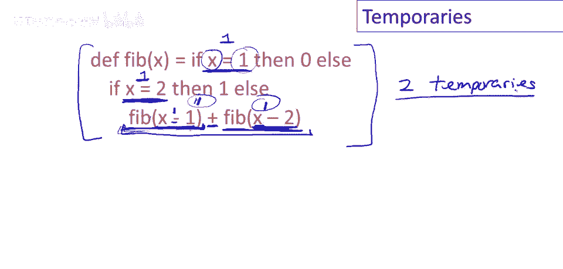
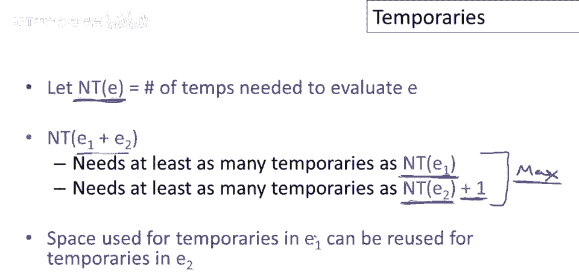
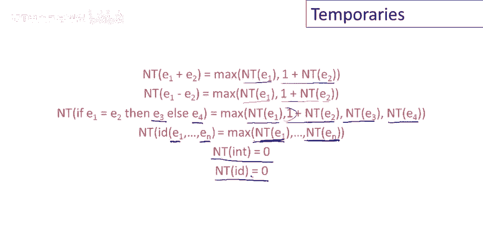
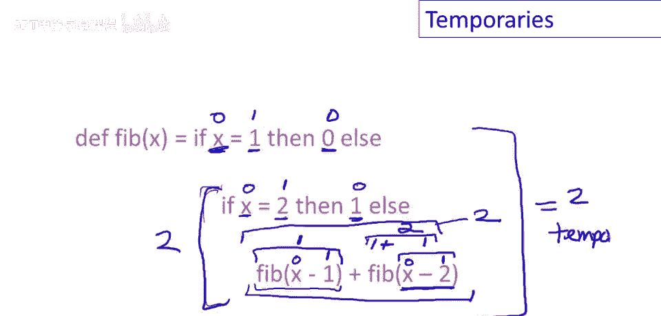
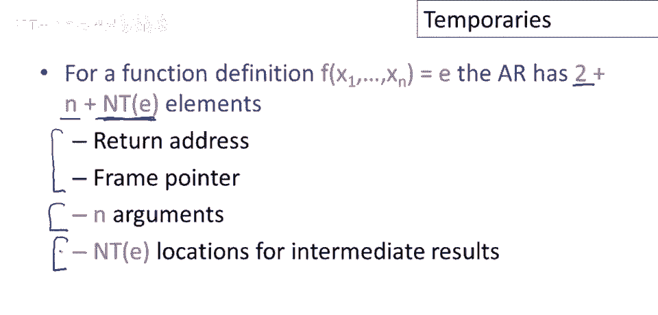
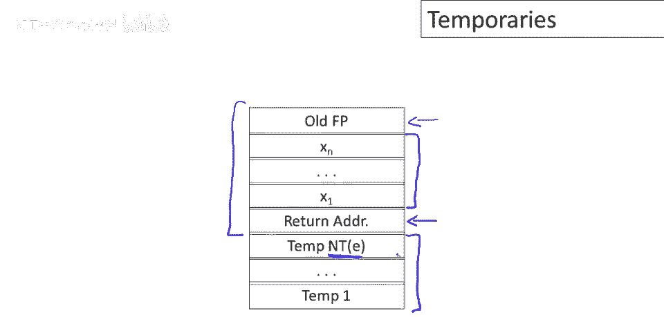

# P66：p66 12-05-_Temporaries - 加加zero - BV1Mb42177J7

前几视频中讨论了简单编程语言的代码生成，上期视频末提到，实际编译器处理方式略有不同，特别是更有效地将值保存在寄存器中。

以及管理激活记录中必须存储的临时变量，本期将讨论这两个问题，本视频仅讨论第二个问题，将讨论编译器更好地管理临时值的方法，基本思想是已见的，将临时值保存在激活记录中。

激活记录中保存临时变量的基本思想，现在这不如寄存器中临时变量高效，但那是未来视频的主题，今天不谈，我们要讨论的是，改进激活记录中临时变量的管理方式，无论原因，所以为什么在激活记录中不重要，但既然在那里。

我们能生成的最有效代码是什么，我们要做的改进是，让代码生成器为每个临时变量分配激活记录中的固定位置，我们将预分配内存或激活记录中的位置，然后我们可以保存和恢复临时变量，而无需使用堆栈。

指针操作，让我们看一下简单编程语言的典型程序，这是斐波那契函数再次，让我改变颜色以获得更多对比度，让我们思考需要多少临时变量，来评估此函数，因此，此函数体在执行时，若提前知临时数，可分配激活记录空间。

而非运行时堆栈推拉，让我们看看，若然后则将产生临时，因需进行谓词比较，需评估谓词首参数，并保存结果，同时评估谓词次参数，将涉及一个临时，为此谓词需一临时变量，类似地，为评估此谓词，因是二元操作比较。

同样需一临时变量，还有这边这个表达式，相当复杂，为此需多少临时变量，记住如何运作，先评估第一个表达式，然后将结果保存，这将需要一个临时变量存储调用fib的结果，在评估加法时必须保存该变量，现在。

在评估对fib的调用时，实际上，在评估对fib的调用之前，我们必须评估fib的参数，这涉及减法，因此，我们还需要一个临时变量来存储减法，那么，关于这个加法运算的另一边呢，嗯，这也涉及减法，好的，因此。

我们需要一个临时变量来存储x的值，在我们评估减法以计算参数值时，在调用fit之前，好的，那么总共需要多少个临时变量呢，我们需要一个用于谓词的临时变量，但请注意，一旦谓词被决定。

一旦我们知道这个谓词是真还是假，我们不再需要那个临时变量了，实际上，那个临时变量可以被回收，我们不需要，不再需要那个临时变量的空间了，当我们到达false分支时，同样，一旦这个谓词被评估。

我们不再需要那个临时变量的空间了，好的，所以现在我们处理加法，首先，我们评估第一次调用fib的参数，一旦评估完成，我们不再需要它的临时变量了，现在，fib的结果必须保存在某个地方，以便我们进行加法。

好的，然后，我们不得不评估第二次调用fib的参数，现在请注意，这发生在我们需要这个临时变量的时候，因此，事实上我们需要这两个临时变量同时存在，好的，因为在评估对fib的第二次调用的参数时。

我们仍然需要保留加法第一个参数，因此，实际上这个特定函数可以用两个临时变量来评估，这是计算这个函数体值所需的所有空间。

一般来说，我们可以定义一个函数nt(e)，它计算评估e所需的临时变量数，让我们只讨论一个例子，让我们看看评估e1加e2所需的临时变量数，因此，它将至少需要与e1相同的临时变量数，好的，因此。

如果我们需要一些临时变量k来评估，k个临时变量来评估，至少需要k个临时变量，也需要至少同样多的临时变量，来计算2加1，因为要保留v2的值，抱歉，在计算e2时要保留v1的值，好的，将是这两个的最大值。

所以将是最大数量，在评估1和1所需的最大临时变量数，加上评估2所需的临时变量数，将是总临时变量数，评估e1加e2所需的最小临时变量数，原因是最大，而不是总和，一旦评估了1，不再需要评估1时使用的空间。

所有临时变量都完成了，只需要答案，不需要中间结果，评估1时使用的临时变量。

可以重复使用，来评估，E，二，所以从那个例子概括，这是描述所需临时变量数量的方程系统，让我们看看，我们已经讨论了e1加e2，只是最大值，评估1和1所需的临时变量数，加上评估2所需的临时变量数。

所以e1减e2完全一样，具有相同的结构，是不同计算操作，但为二元操作，在评估e2时需要保存b1的值，现在公式相同，对于，如果-那么-否则，我们需要什么，我们需要一，抱歉，我们需要，将再次是最大值。

将是一些不同数量的最大值，可能需要多少临时变量，可能需要评估1所需同样多的临时变量，我们肯定至少需要这么多，好的，若取一定临时数，整个if then else至少需这些临时数，当然一旦e一评估完。

不再需要其临时数，然后可评估e二，好的，评估e二时，需保留e一结果，这就是oneplus的来源，评估e二时，需e二临时数加一，以保存所有计算临时数，一旦谓词完成，不再需要任何临时数，将评估e三或e四。

只需，这些表达式所需临时数，每个所需，这四个量中最大值，是最小临时数，评估整个if then else所需，让我们看函数调用，嗯，函数调用所需空间为，评估任一参数所需临时数最大值，实际上这是个有趣情况。

公式中无e一至n结果空间，当然一旦评估e一，需保存某处，可能认为公式中有数，代表评估这些表达式的临时空间，我们没有这些的原因是，这些值确实保存，不在当前激活记录中，e一结果和所有参数，结果，包括e n。

保存在新建激活记录中，e一至e n结果空间，这些值保存在新激活记录，不在当前激活记录，我们计算当前激活中，所需临时数，然后对于整数，不占用任何空间，不需要临时数，就是说，整数临时数为零。

变量引用也不需要。

现在让我们通过示例，系统地使用方程计算所需临时数，好的，那么，这里是为了这个，如果，那么，否则，记住，它将是所需评估e的最大值，那是01加上要评估e2的数字，这是谓词中的第二个表达式，所以那将是1。

因为数字1需要0个临时变量，而1和我们必须有，我们有一个来保留x，好的，然后分支的最大值，所以评估0需要0个临时变量，现在我们必须计算这里需要的数字，好的，所以再一次，为了评估这个，如果，那么。

否则需要0个临时变量来评估第二个一个将需要11，加上所需的1加0，嗯，评估那个常数需要0个临时变量，现在对于最后一个表达式，嗯，这个将需要多少，这将需要，嗯，0个对于这个家伙，1个对于第二个参数。

所以评估fib将需要1个临时变量，好的，然后它将是一，加上在这里我们必须保留结果，那里，x减2的值，那么那将需要多少，那将需要0和1加0的最大值，好的，所以这将是一，好吧，所以在这里，我们有1加1是2。

好的，现在我们在取最大值，所以那是2，好的，这是外层，如果，那么，否则的最后表达式，如果，那么，否则，这里将需要2个临时变量，好的，这是所需评估谓词中任何一部分的最大值，然后分支和否则分支。

现在整个表达式需要2个临时变量，那将是外层，如果，那么，否则的四个组成部分的最大值，所以然后对于整个表达式，我们得到。

一旦我们计算出，函数体所需临时变量数，可向激活记录添加相应空间，现在激活记录需2加n加nt元素，其中两个，当然，是返回地址和帧指针，n是函数的n个参数，其余为临时变量所需空间。

现在可讨论激活记录布局，嗯，我们将第一部分保持不变，返回地址前的所有内容，按逆序排列的n个参数，然后是返回地址，返回地址后是结束位置，或nt抱歉，临时变量位置。

现在知道函数所需临时变量数，以及临时变量在激活记录中的存储位置，为生成代码还需知道，程序中每点使用的临时变量数，换个颜色，我们将这样做，为代码生成添加新参数，下一个可用临时变量的位置，临时变量用完后。

代码生成参数会改变，允许其他表达式安全保存值，不会覆盖其他表达式已保存的临时变量，稍后示例中可见，激活记录的临时区域，将用作小型固定栈，本质上我们拥有之前相同的栈纪律，所有关于栈指针的计算。

或所有关于偏移量的讨论，编译器已全部完成，我们之前通过堆栈推入弹出元素，在生成的代码中，大量计算已移至编译器，现在仅是固定偏移量的存取，从帧指针。

所以让我们看看如何运作，这是旧方案下e一加e二的代码，激活记录中无单独的临时变量区域，我们将为e一生成代码，然后将e一的计算结果保存到栈上，这通过将累加器值保存到栈上来实现，然后需要调整栈指针。

在评估完二之后，然后加载e一的返回结果到临时寄存器，我们可以做加法，然后弹出栈上的值。

栈上的中间值，现在在新方案下，代码生成将接受第二个参数，说明下一个可用临时寄存器的位置，激活记录中下一个未使用的临时寄存器的位置，所以现在为e一生成代码并传递参数，好的，因为e一可能自己有一些临时变量。

它需要存储，然后在你评估完成后，现在，我们直接将值存储到激活记录中的偏移量，从帧指针，所以我们必须执行存储，我们必须保存，嗯，e一在激活记录中，这样我们稍后就有它了，但我们不需要对栈进行任何操作。

所以我们用一条指令替换了这里的两条，然后为e二生成代码，但现在我们只需在偏移量处保存临时值，从帧指针，下一个可用的临时寄存器将在地址nt或偏移量，抱歉，nt加四，然后e二评估完成后。

我们必须将e一的值加载回临时寄存器，再次，那是从当前激活记录的帧指针偏移nt处，然后我们可以做加法，再一次，我们保存了对栈指针的操作，这里的代码序列比之前短两条，实际上效率更高，并且实际上更加高效。

