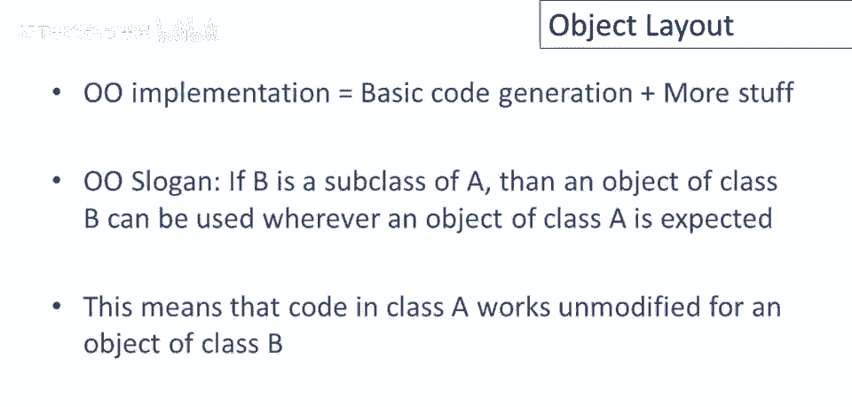

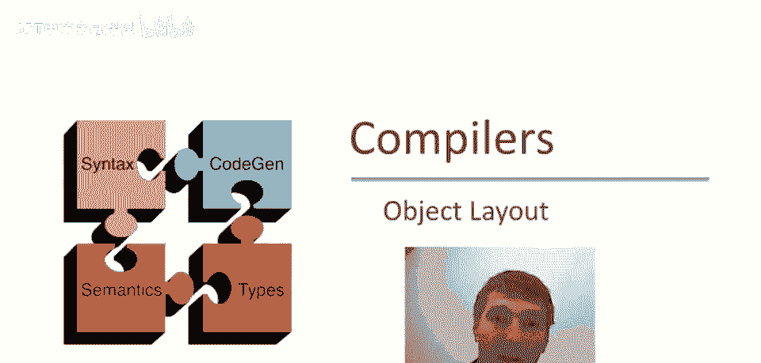

# 课程 P67：对象布局与动态分派 🧱

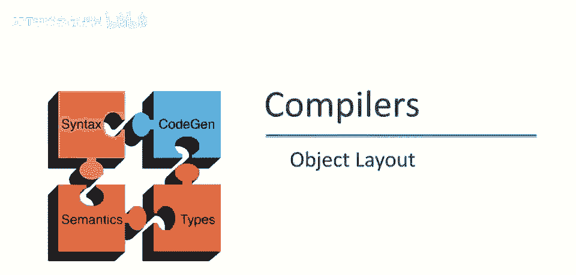

在本节课中，我们将学习面向对象编程中对象的代码生成策略，特别是对象在内存中的布局和动态方法分派的实现机制。这是对之前简单语言代码生成知识的扩展。

---

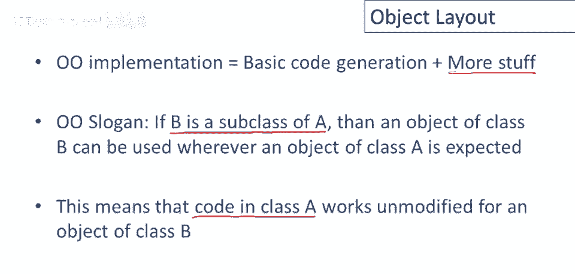

## 对象布局的基本原则 📐

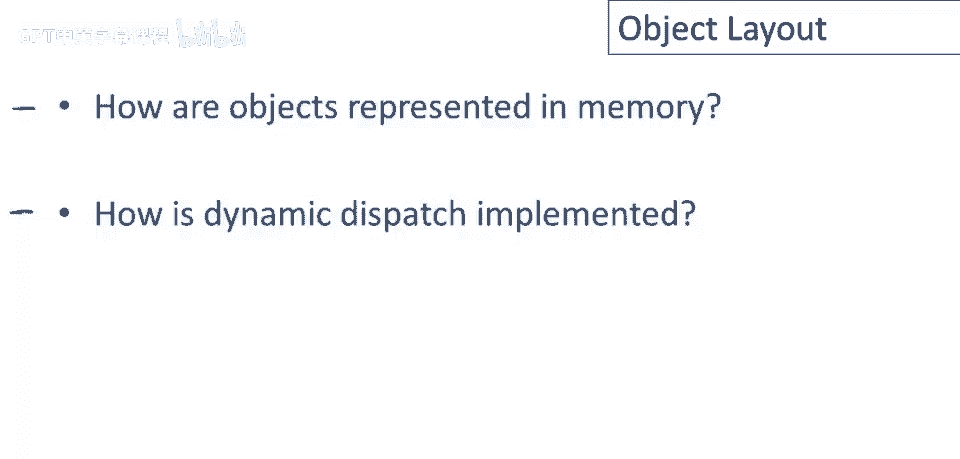

上一节我们介绍了代码生成的基础，本节中我们来看看如何为对象生成代码。关于对象，面向对象编程的核心特性之一是“替代能力”：如果类B是类A的子类，那么类B的对象可以在期望类A对象的地方使用。这意味着为类A生成的代码，必须能不加修改地应用于类B的对象。

为了实现这一点，我们需要解决两个核心问题：
1.  对象在内存中如何表示（对象布局）。
2.  动态分派（即根据对象实际类型调用正确的方法）如何实现。

我们将通过一个具体的例子来贯穿讲解。假设我们有三个类：
*   **类A**：基类，定义了属性 `a`、`d` 和方法 `f`。
*   **类B**：继承自A，添加了属性 `b` 和方法 `g`，并**重写**了方法 `f`。
*   **类C**：继承自A，添加了属性 `c` 和方法 `h`。

一个关键点是，所有类中的方法（包括继承的）都可能引用属性 `a`。因此，无论对象是A、B还是C的实例，属性 `a` 在每个对象中都必须位于**相同的内存位置**，这样编译好的方法代码才能正确找到它。

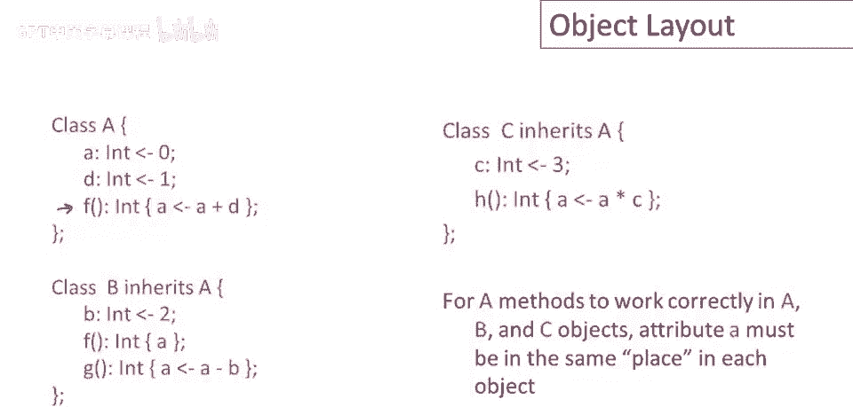

### 对象的内存表示

对象在内存中被安排在一块连续的区域中。对象的每个属性（字段）在这块内存中都有一个固定的偏移量。

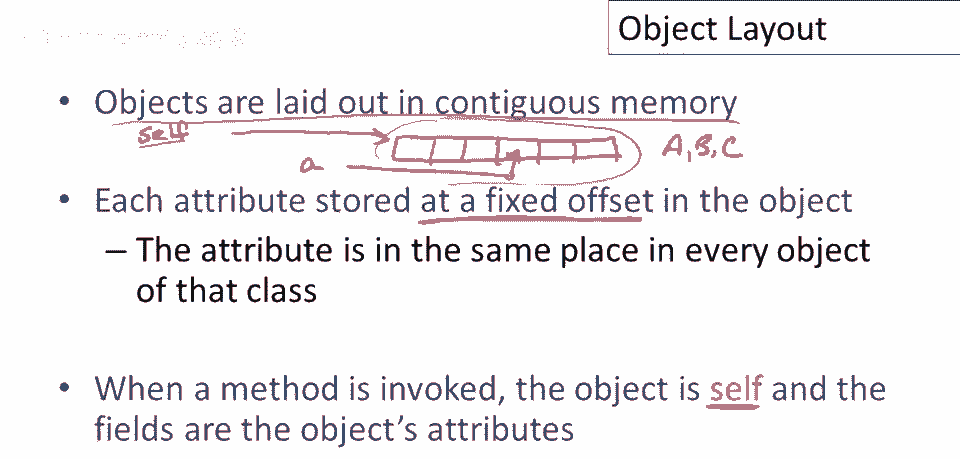

**核心概念**：当方法被调用时，对象本身作为隐含的 `self` 参数传入。`self` 是一个指向整个对象内存块的指针。通过 `self` 指针加上属性的固定偏移量，就能访问到具体的属性。

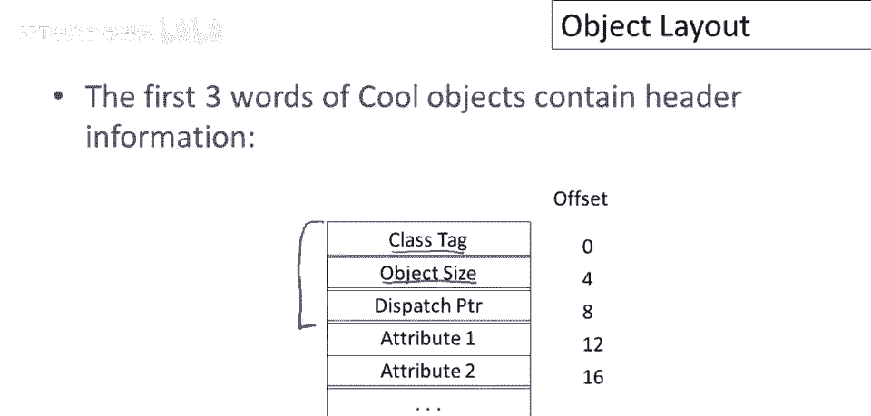

以下是COOL语言采用的一种典型对象布局：

```
对象内存布局示例：
+----------------+ 偏移量 0
|    类标记      |  (Class Tag)
+----------------+ 偏移量 4
|    对象大小    |  (Object Size)
+----------------+ 偏移量 8
|  分派表指针    |  (Dispatch Pointer)
+----------------+ 偏移量 12
|   属性 a       |  (Attribute a)
+----------------+ 偏移量 16
|   属性 d       |  (Attribute d)
+----------------+
|      ...       |  (其他属性)
+----------------+
```

*   **类标记**：一个唯一标识对象类的整数（例如，A=1, B=2, C=3）。
*   **对象大小**：对象占用的总字数（word）。
*   **分派表指针**：指向该类**方法表**的指针。
*   **属性**：按照编译器确定的顺序（通常是类定义中的文本顺序）依次排列。

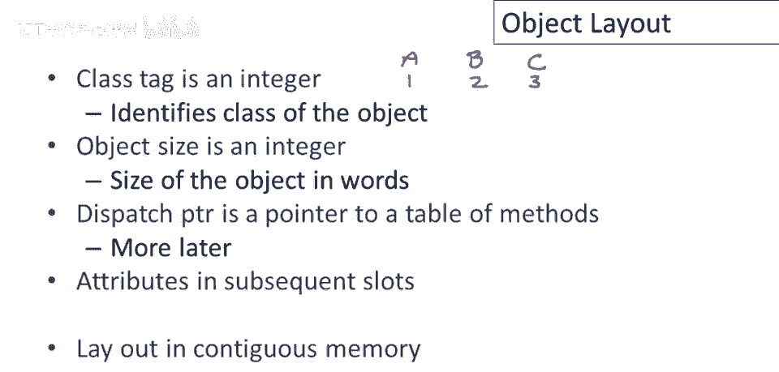

### 继承与布局扩展

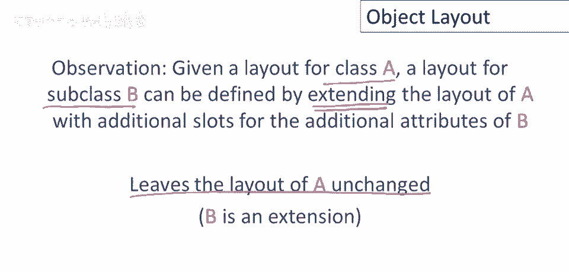

理解了单个类的布局后，我们来看看继承如何工作。核心思想是：**子类的对象布局通过扩展其父类的布局来实现**。父类的属性位置保持不变，子类新增的属性简单地附加在末尾。

这保证了“替代能力”：任何为父类编译的、访问父类属性的代码，在子类对象上运行时，依然能在相同的位置找到那些属性。

让我们看看示例中三个类的布局：

*   **类A的布局**：`[类标记，大小，分派指针， a, d]`。大小字段为5。
*   **类B的布局**：`[类标记，大小，分派指针， a, d, b]`。它继承了A的布局，并在末尾添加了新属性 `b`。大小字段为6。
*   **类C的布局**：`[类标记，大小，分派指针， a, d, c]`。它同样继承了A的布局，并在末尾添加了新属性 `c`。大小字段为6。

可以看到，属性 `a` 和 `d` 在A、B、C的所有对象中，偏移量都是相同的（12和16）。因此，类A的方法 `f` 可以无缝地作用于B或C的对象。

更一般地，对于一个继承链 `A1 <- A2 <- A3 ... <- An`，类 `An` 的对象布局将是：头部信息，后跟 `A1` 的所有属性，然后是 `A2` 的所有新增属性，以此类推，最后是 `An` 的新增属性。这个布局的每一个前缀都构成了其某个超类的有效对象布局。

---

## 动态分派的实现 🎯

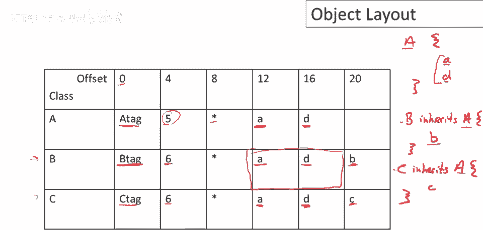

现在我们已经处理了对象属性的布局，可以转向讨论方法的布局和动态分派的实现。考虑动态调用 `e.f()`，我们需要根据 `e` 运行时的实际类型（可能是A、B或C）来决定调用哪个类中定义的 `f` 方法。

### 方法表（Dispatch Table）

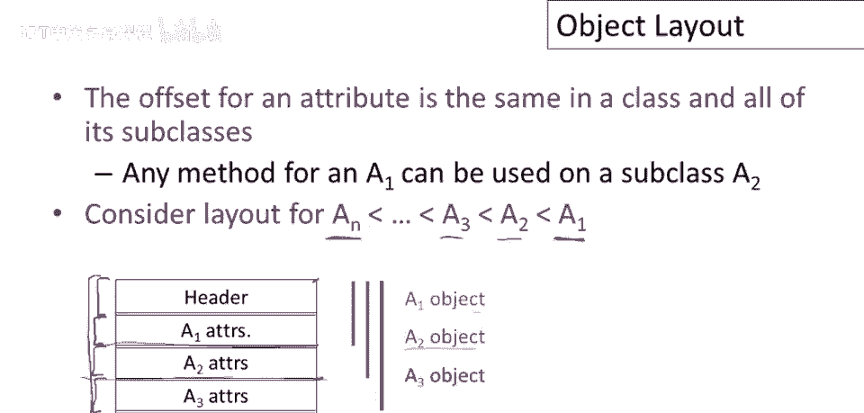

每个类都有一个固定的方法集合（包括继承的方法）。编译器可以在编译时为每个类确定其方法表。方法表是一个代码指针数组，每个条目指向一个方法的入口地址。

**核心原则**：一旦某个方法在继承体系中的某个偏移量被确定，这个偏移量将在所有相关类的方法表中保持不变。如果子类重写了该方法，只是该偏移量处的内容（指针）被替换为子类方法的地址。

以下是示例中三个类的方法表：

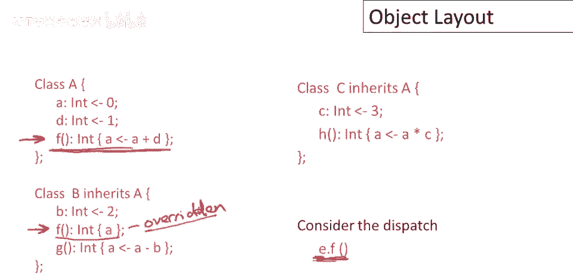

*   **类A的方法表**：`[ *A.f ]`
*   **类B的方法表**：`[ *B.f, *B.g ]` // f被重写，g是新增
*   **类C的方法表**：`[ *A.f, *C.h ]` // f继承自A，h是新增

注意，即使类B重写了 `f`，`f` 在方法表中的位置（偏移量0）与在类A中是一致的。不同的是，该位置存储的指针指向了 `B.f` 的代码。

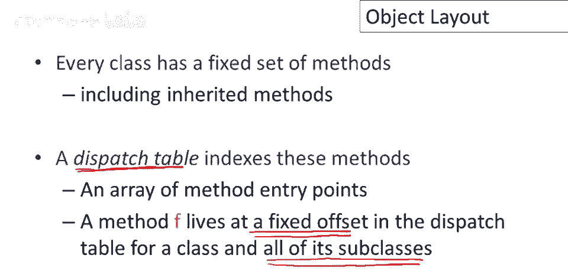

### 分派指针与共享

为什么对象头里需要一个指向方法表的指针，而不是把方法表直接嵌入每个对象？这是因为：
*   **属性是每个对象独有的**，所以每个对象都需要自己的属性副本。
*   **方法是同类所有对象共享的**。所有类A的实例都执行相同的 `A.f` 代码。

因此，让同类所有对象共享一个方法表可以节省大量内存。对象头中的**分派指针**就是用来找到这个共享方法表的。

### 动态分派步骤

现在，我们可以描述 `e.f()` 这个动态调用在运行时是如何执行的：

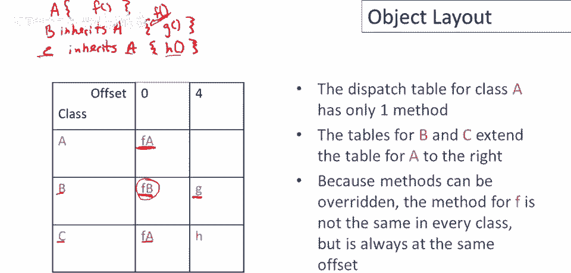

1.  **求值**：计算表达式 `e`，得到一个对象 `x`（即 `self`）。
2.  **取表**：从对象 `x` 的头部（固定偏移量，如8）取出**分派表指针**。
3.  **查偏移**：在分派表指向的方法表中，根据方法 `f` 的预编译偏移量（如0）找到对应的条目。
4.  **跳转**：跳转到该条目存储的代码地址，开始执行方法。执行时，`self` 被绑定为对象 `x`。

用伪代码描述这个过程：
```c
// 假设 e 的求值结果在寄存器 $a0 中
lw  $t1, 8($a0)      // $t1 = 对象的分派表指针
lw  $t1, 0($t1)      // $t1 = 分派表中f方法对应的代码地址（偏移量0）
jalr $t1             // 跳转到该地址执行，$a0 作为 self 参数传递
```

---

## 总结 📝

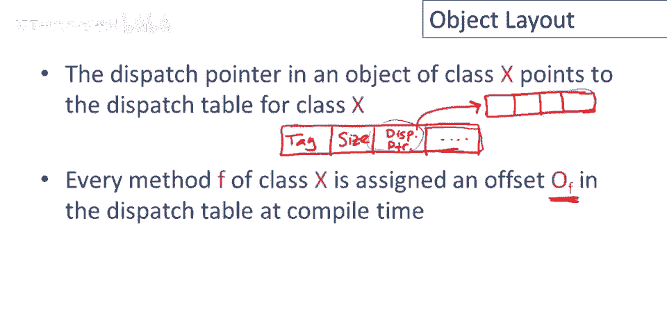

本节课中我们一起学习了面向对象语言中对象代码生成的两个核心部分：

1.  **对象布局**：对象在内存中连续存储，包含头部信息（类标记、大小、分派指针）和属性列表。子类通过**扩展**父类布局来实现继承，确保父类属性偏移量不变，从而支持替代能力。
2.  **动态分派**：通过**方法表**实现。每个类有一个方法表，存储该类所有方法的代码指针。同类对象共享此表。对象头中的分派指针指向它。方法调用时，通过对象得分派指针找到方法表，再根据编译时确定的方法偏移量找到正确的方法入口并跳转。

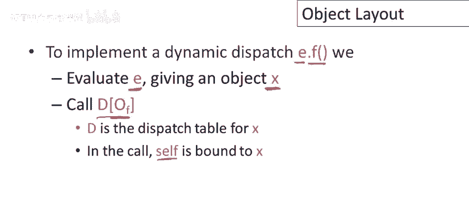

这种布局和分派机制是许多面向对象语言（如Java、C++）运行时系统的基础，它高效地支持了封装、继承和多态这三大特性。