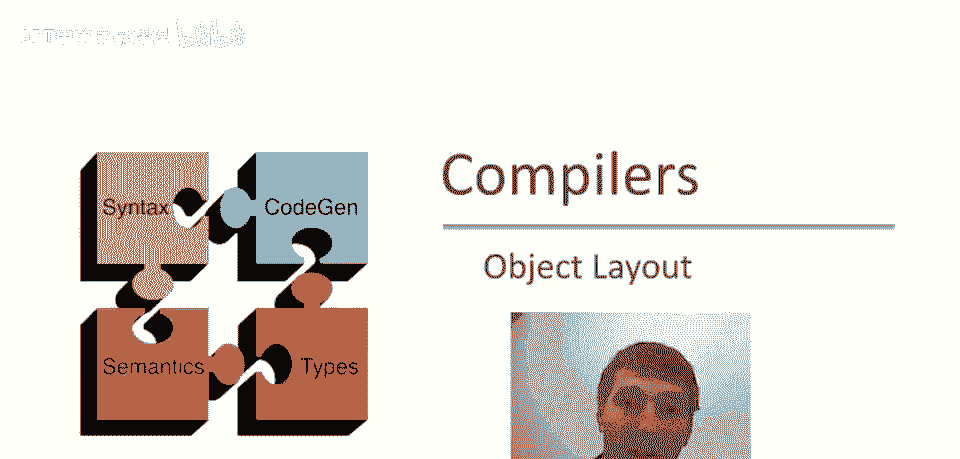
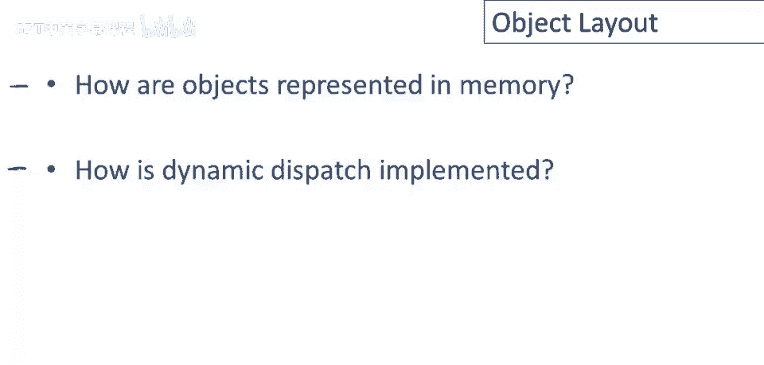
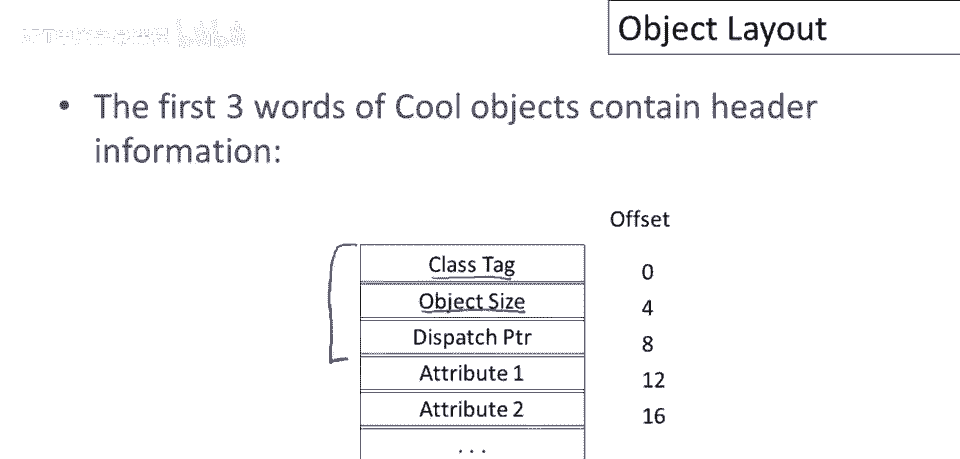
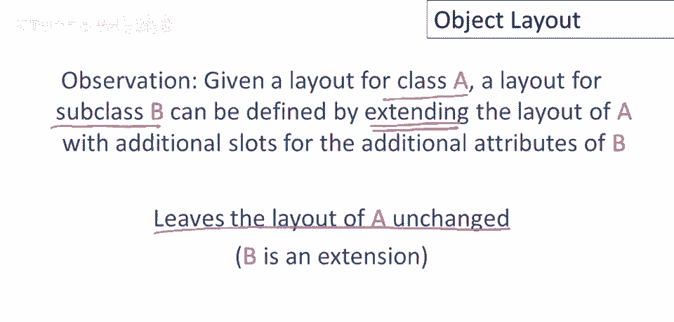
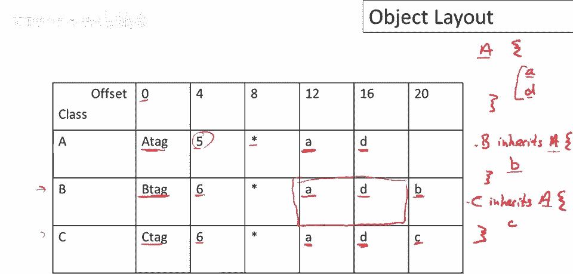
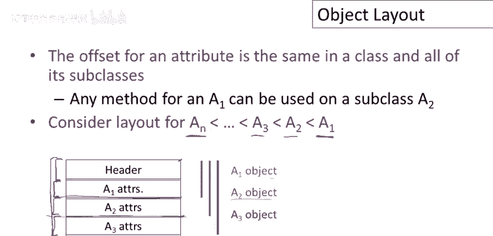
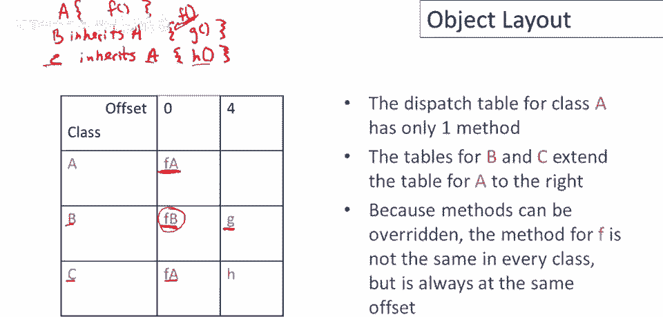

# P67：p67 12-06-_Object_Layout - 加加zero - BV1Mb42177J7

最近几段视频，我们讨论了简单编程语言的代码生成，在这段视频中，我们将看看更高级功能的代码生成。

对象。

幸运的是，对象的标准代码生成策略只是我们所学的一个扩展，之前学过的所有内容我们都会使用，然后会有一些专门针对对象做的事情，关于对象的重要事情，人们谈论面向对象编程时听到的口号是，如果b是a的子类。

那么类b的对象可以在类a对象期望的地方使用，所以有一个替代能力属性，如果我有一段代码可以工作在，那么也可以工作在b's和其他a的子类上，现在这意味着对于，对于代码生成的情况，我们为类a生成的代码。

即我们为类a的方法产生的代码，对于类b的对象也必须不作修改地工作，为了看到这一点，记住当我们编译a时，当我们编译类a时，我们可能甚至不知道a的所有子类，所以它们可能甚至还没有被定义，在未来。

某个程序员可能会出现，定义一个a的子类。

所以，我们只需要回答两个问题，以完整描述如何为对象生成代码，第一个问题是我们的对象如何在内存中表示，因此我们需要决定对象的布局和表示，第二个问题是动态调度是如何实现的，这是使用对象的特征性功能。

即我们可以在对象中调度到一个方法，我们需要这种实现的。

所以，具体来说，我们将使用这个小例子贯穿整个视频，嗯，这个视频，我在这里花一点时间指出一些特点，我们有三个类，类a，B和c注意a是基类，b和c都继承自a，所有三个类都定义了一些属性，一些字段。

以及一些方法，现在，这里有几个重要特征，注意因为b继承自a，并且c继承自a，它们都继承自两个类，从类a继承属性a和d，因此，在类a中定义的这两个属性在类b中可用，和在类c中。

所以即使类b的定义中没有提到a和d，例如，类b的方法仍然可以引用这些属性，它们是类b的属性的一部分，它们只是从a复制或继承而来，我想指出的这个例子的另一个特征是，所有这些方法都引用属性a。

所以在这个方法中，我们被引用，在这个方法中被引用两次，并且也在这个方法中，这意义就是我们几页前讨论的，为了使所有这些方法都能工作，属性a必须存在于某个地方，在某个地方，当它们生成的代码运行时。

它们都能找到它，特别是，让我们考虑方法f，所以方法f存在于所有三个类中，所有三个类在运行时，它将引用属性a，即使对象不同，在一个情况下，它可能在一个a对象上运行，另一个情况下在一个c对象上运行。

它需要能够找到属性a，因此，属性a必须在每个对象中处于相同的位置。

那么我们如何实现这一点呢？第一个原则是对象在连续的内存中排列，所以一个对象就是一块内存，好的，没有间隙，对象的所有数据都存储在该块内存的字中，每个属性在对象中都有一个固定的偏移量，例如。

这个对象中可能有一个地方，用于属性a，在这种情况下，它在对象中间，在第四个位置，无论对象是什么类型，无论是a，B或c对象，在我们的例子中，属性a将始终处于该位置，因此，任何引用a的代码。

任何引用a的方法都能找到，现在能找到a属性，理解另一重要事，这是与讨论稍偏，但它是，对象生成关键方面，方法被调用时，对象本身是self参数，所以self，当函数被调用，将指向整个对象。

所以把self看作，指向整个对象的指针，记住self像，变量，或Java中的名字，然后字段将指向，或对象的属性将指向，特定位置。

我们决定a属性，住在那里，这是COOL中使用的特定对象布局，COOL对象的前三个词包含头部信息，每个COOL对象总是有这些三个条目，第一个位置是类标记，偏移量为0，下一个字，偏移量为4，是对象的大小。

然后是一个称为分发指针的东西，然后所有属性，类标记是一个整数，只是标识对象的类，编译器将编号所有类，所以在我们例子中，我们有三个类a，B和c，编译器，例如，可能会分配它们数字1，2，和3。

这些数字是什么不重要，只要它们彼此不同，所以不必连续编号或类似，重要的是类标记是类的唯一标识符，每个类都有自己的独特位模式，告诉你对象是什么类型，这里的其他字段，对象大小也是一个整数。

只是对象的大小以单词为单位，分发指针是指向方法表的指针，所以方法存储在一边，分发指针是指向该表的指针，我们稍后会讨论更多，然后所有属性按编译器确定的顺序排列，在随后的插槽中。

所以编译器将为类中的属性固定和顺序，然后，该类所有对象将具有相同顺序的属性，这一切都安排在连续的内存块中。

现在我们可以讨论继承如何工作了，所以基本思想是，给定类a的布局，子类b的布局，因此，子类a的布局可以由扩展a的布局来定义，我们不需要移动a的任何属性，我们只需在a的布局末尾添加更多字段，因此。

a的布局将保持不变，这是一个很好的属性，因为这就是我，属性在对象a中的位置，对所有子类始终相同，本质上，一旦我们决定一个属性在类中的位置，我们将永远不会改变它，该对象子类的状态永不改变。

所以b只是布局a的扩展，让我们看看示例，了解如何运作，让我在这里简单写一下这些课程，我们有课A，它有2个属性，A和d，好的，类型或方法不重要，只看类名，和类中定义的属性名，然后有b继承自a和b。

添加了属性，小b，然后有c，也继承自a但与b无关，类c定义了一个属性，小c，好吧，所以这就是，示例的结构与，嗯，对象布局有关，好的，所以让我们谈谈类a的布局，位置零偏移零，会有一个标签，将是一个小整数。

编译器选择的i，将有一个大小，我们稍后回来，将有一个分发指针，好的，稍后讨论，然后是属性，它们按酷的C实现方式排列，它们在顺序中排列，它们在类中出现的文本顺序，所以在这种情况下，首先属性a。

然后是属性d，偏移量为12和16，现在由于对象，有两个属性和三个头部单词，这意味着对象的大小是五个单词，所以5在a对象的尺寸字段中输入，让我们看看b，好的，所以b将会有不同的标签。

B对象将会有不同的标签，因此，为了将它们与a对象区分开来，将有一个额外的字段，所以大小将更大，但现在布局保留了a的布局，a的属性出现在相同的位置，你可以认为实际上有一个a对象嵌入在b对象中。

如果我剥离这里的结尾，如果我只是，你知道，覆盖b的最后一部分，我会看到这里的对象具有相同的尺寸，和与a对象相同的属性，因此，任何可以处理a对象的代码也将有意义，现在在b对象上运行，当然标签不同。

因为它实际上是一个子类，你知道，并且有这个额外的字段，所以大小不同，但重点是任何引用这些字段的代码仍然会很好地工作，所以任何编译为引用a对象方法的a方法，嗯，仍然会在b对象中找到相同的属性。

当然这里还有一个额外的字段，这是b的新属性，它只是在这些字段之后排列，所以所有这些字段之后是所有这些字段，它们在类中出现的文本顺序，由于只有一个，只有一个新字段，现在看看类c，类c的故事非常相似。

所以c有自己的独特标签，它也比a多一个属性，所以它的大小是6，现在a属性仍然在相同的位置，现在c属性只是跟在a属性之后，所以请注意，a方法再次将在c对象上正常工作，因为属性在同一位置。

所以方法将找到它们期望的属性，但调用类b的方法在类c的对象上，好的，因为它们第三个位置的属性不同，这些可能有完全不同的类型，在类c的对象上调用类b的方法可能没有意义，但没关系。

因为如果我们看这里的继承层次，我们看到b和c实际上没有关系，它们都是a的子类，但它们彼此之间没有关系，b不是c的子类，c也不是b的子类，因此，除了它们与a共享的祖先之外，布局可以完全不同。

所以更一般地，如果我们有一个继承关系链，假设我们有一个基类，一个一和一个二，继承自一个一和一个三继承自一个二等等，在底部继承这个链的某个类an，经过一系列其他中间子类的长时间序列。

所有这些类的布局会是什么样子呢？会有一个头部，好的，三个字的标题，然后是一个一的属性，然后是一个二的属性，接着是一个三的属性等等，一直到an的属性在这里，好的，如果你再看一次，我们之前讨论过的事情。

这个标题的每个前缀本质上都是一个有效的对象，这些对象中的一个有效的一个，所以如果我看看第一个属性集，一直到a一属性的末尾，这形成了一个a一对象的有效布局，如果我停在a二属性，我有。

我有a二对象的有效布局，从头部一直到包括a一和a二对象，然后a三包括所有a一，a二和a三的属性，那么，好的，因此，每个前缀的uh，这个对象，这个an对象，Uh，有正确的布局对于一些，Uh。

对于n的一些超类。

现在处理了对象属性布局，我们可以转向讨论方法布局，及动态分派的实现，考虑一个分发调用，E，G，假设e是类b的实例，好的，我们希望发生什么？我们想调用类b中的g方法，好的，这似乎很简单。

现在考虑一个稍复杂的例子，如果我们调用e。f，如果我们调用f方法，如果有b对象，我们想要调用此方法，这个f方法，即b中定义的f方法，但如果我们有a对象，我们要确保调用此方法，好的，这个版本的f。

所以f在这里被覆盖，好的，我们重新定义了，嗯，类b中的方法f，此定义替换了b从a继承的方法定义，特别是类c，类c也有f方法，好的，如果我们调用f方法，如果e是类c的实例，那么应该调用哪个方法？

会是这一个，会是a中定义的，这三个类都有f方法，如果，如果对a、c或a对象动态分发，将执行类a中定义的，如果对b对象分发，将执行类b中定义的方法。

每个类都有固定方法集，包括继承的方法，所以如果你，如果你看，嗯，如果我告诉你一个类的名字，你就知道它有哪些方法，这些方法运行时不改变，好的，所以别在这混淆，因为覆盖是编译时的事，基本上是静态属性。

所以编译器可以确定，尽管你可以在子类中重定义方法，编译器可以确定编译时，特定类的所有方法在程序运行时不会改变，因此使用调度表或某种表格索引这些方法，这只是方法入口点的数组，本质上，对于类的每个方法。

数组中都有该方法的条目，就像属性一样，方法f将在类的分发表中，及其所有子类的固定偏移处存在，一旦我们确定了方法的位置，它在分发表中的位置，它将保持不变。

嗯，对于该类的某些类，让我们再次看看示例，并提醒您示例的结构，我们有类a，现在我们只关心方法，所以，类a查找f方法，然后我们有类b，它继承自a，并定义了g方法，然后有类C，也继承自A，定义了一个h方法。

好的，那么，这三个类和这三个方法，好的，所以类A的分派表只有一个方法，所以偏移量为0，存储指向A中定义的f方法的代码指针，好的，这实际上就是一个指向代码第一条指令的指针，将运行方法a。

这是调用方序列的指针，或指向标记指令的入口点，嗯，对于方法现在，那关于。让我们接下来看看，实际上在类c，好的，所以类c继承自a，将包含所有方法，它们将在相同偏移，特别是f方法将在类c偏移零出现。

指向与a中的一样的方法，因为它从a继承该方法，然后类c定义了自己的方法h，因此在表格的下一个位置放置h代码的指针，你知道，如果这些类中定义了更多方法，它们就会出现，你知道，按文本顺序排列，就像属性一样。

所以如果有两个方法在a中定义，这里将有两个条目，对于在a中定义的第一个方法和第二个方法，然后如果c定义了三个方法，然后表格中会有三个更多的条目等等，好的，现在有趣的情况是类b发生了什么，所以在类b中。

f方法被重新定义，我忘了指出这一点，所以让我在这里指出，所以f方法我们有了一个新的定义在类b，好的，所以重要的是要看到的是代码的指针，对于f方法位于相同的位置，仍然是表格中的第一个条目，好的。

类b的f方法在调度表中的位置完全相同，那永远不会改变，不同的是，只是那个位置的内容，表格中的第一个条目指向不同的函数，它指向在b中定义的方法而不是在a中定义的。

然后因为b定义了一些额外的方法或一个额外的方法被放置在。

呃，方法，呃，对于a，好的，你可能还记得我们之前谈论过对象头，我们提到了这个叫做调度指针的东西，所以让我们重温一下对象头中有什么，有一个标记，然后有一个大小，然后有一个调度指针，所以。

然后跟随调度指针是所有类的所有属性，现在，此派发指针仅指向该类的方法表，好的，这将是指向包含所有方法条目的表的指针，该类方法的所有入口点，使用这种间接级别的原因，好的，我们为什么有这个指向单独表的指针。

好的，为什么方法像这样布局，当所有属性都直接嵌入在类中时，如果我们想，可以直接将所有函数嵌入到对象中，你知道，只需将整个表放入对象中，并且不需要我们维护和跟随的额外指针，并且原因在于属性可以更新，好的。

对象的一个对象的属性可以独特于该对象，每个对象都可以有自己的属性集，好吧，但对象的方法永远不会改变，因此，给定类的相同对象表可以共享给所有对象，所以如果我有一百个a对象。

那么我可能有一百个不同的属性版本，因此，每个a对象都必须有自己的属性副本，但所有一百个对象将具有相同的方法，通过让它们共享一个常见的方法表，我可以节省大量空间，并且再次。

类的每个方法或任何类的每个方法都被分配了一个偏移量，我们将在编译时在调度表中称之为o_sub_f，因此，编译器的任务是找出类中的所有方法，然后为这些方法中的每一个，分配一个固定位置。

在那个调度表中的固定偏移量。

因此，如何实现动态调度，所以假设我们有一个对表达式e的调度，并且我们正在调用f方法，所以这是序列步骤的一个稍微简化的版本，所以首先我们评估表达式e，这将给我们返回一个对象x，好的。

然后我们将获取x的调度表，它来自哪里？它在x的头部，所以我们可以直接取对象x本身，并且我们知道在每一个对象中，在第三个单词中有一个调度指针，适合于x的类，所以我们取那个表，然后在调度表中查找f的入口点。

在f的偏移量处，好的，然后我们跳转到那个地址，好的，这是函数的入口点，当我们这样做时，我们将self绑定到x，因此f方法内的self参数将是x对象。

