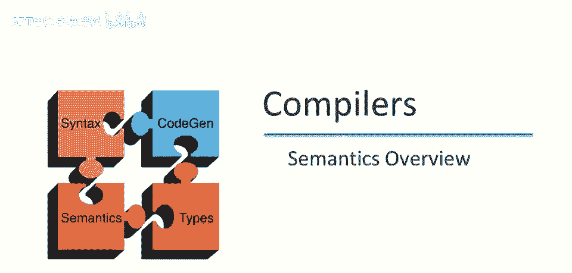
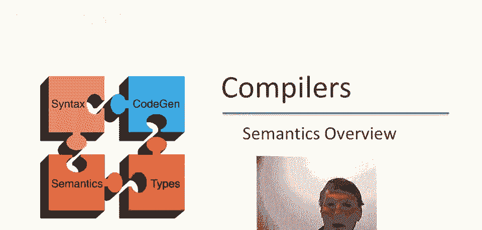
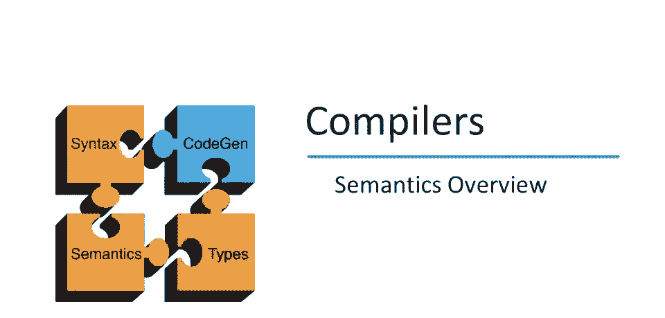
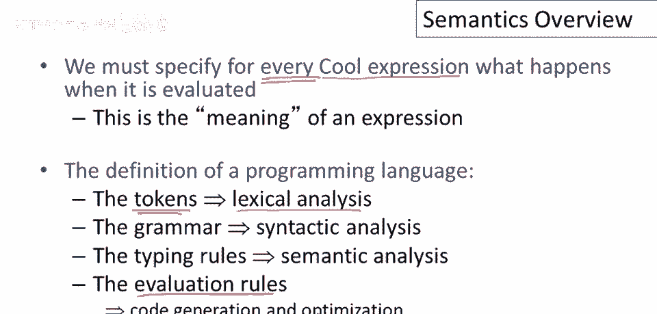
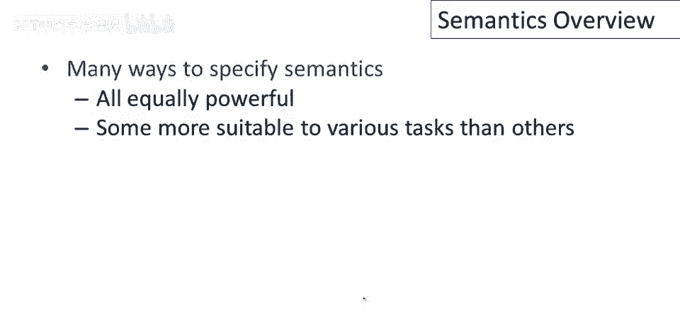
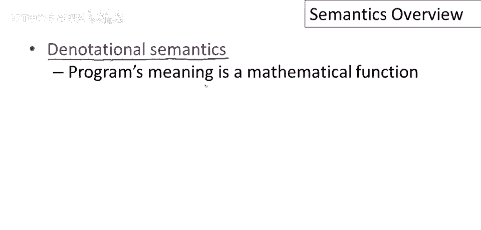

# 课程 P68：编程语言语义概述 🧠

在本节课中，我们将要学习编程语言语义的基本概念，特别是关于COOL语言的语义。我们将探讨什么是语义、为什么需要它，以及如何用不同的方式来描述程序的行为。

---

## 什么是编程语言语义？🤔

我们需要解决的问题是：当我们运行一个COOL程序时，我们期望的行为是什么？因此，对于COOL中的每一种表达式，我们必须说明它在被评估（执行）时会发生什么。我们可以将此视为表达式的“含义”，并通过某种规则来指定特定表达式会进行何种计算。

回顾一下我们之前是如何处理类似问题的，对于定义COOL的其他部分很有帮助。

---

## 语言定义的不同层面 📝

在之前的课程中，我们已经学习了如何定义语言的各个层面。

*   **词法分析**：我们使用**正则表达式**来定义一组标记（Token）。
*   **语法**：我们使用**上下文无关文法**来指定单词如何组合成COOL中有效的句子。
*   **语义分析**：我们给出了正式的**类型规则**。

现在，我们到了必须谈论程序实际运行的时候。因此，我们必须给出一些**评估规则**。这些规则将指导我们如何进行代码生成和优化，以决定程序应该做什么，以及我们可以对程序进行哪些转换以使其运行更快或使用更少空间。

---

## 间接指定评估规则的局限性 ⚠️

到目前为止，我们一直在间接地指定评估规则。我们通过给出完整的编译策略（一直到栈机代码）来做到这一点，然后我们讨论了栈机的评估规则（实际上是将栈机代码翻译成汇编代码）。这当然是一个完整的描述：你可以取生成的汇编代码并在机器上运行它，看看程序做了什么。这将是一个关于程序行为的合法描述。

那么问题来了：为什么这还不够好？为什么仅仅有一个语言的代码生成器，还不是关于如何执行代码的足够好的描述？

答案可能有点难以理解。如果没有写过几个编译器，人们从经验中得知，汇编语言描述的语言实现包含很多无关细节。当你得到如此完整的可执行描述时，有很多关于程序如何执行的事情你不得不说，但这些并非必要。

以下是几个例子：
*   我们使用栈机的事实，并非特定编程语言实现的固有属性。我们本可以使用其他代码生成策略。
*   栈的增长方向（向高地址还是低地址增长），你可以用两种方式实现。
*   整数的具体表示。
*   执行或实现特定语言结构的特定指令。

所有这些都是实现语言的一种方式，但我们不想它们被作为语言实现的唯一方式。所以我们真正想要的是一个完整的描述，但不要过于限制，一个允许不同实现的方式。

当人们没有尝试找到相对高级的方式来描述语言行为时，他们不可避免地陷入了一种情况：人们不得不去运行参考实现以决定它做什么。这并不令人满意，因为参考实现并不完全正确，会有漏洞，会有特定实现方式的痕迹（你并不想成为语言的一部分），但因为没有更好的定义，最终成为了语言形成中的意外。

---

## 指定语义的不同方法 🛠️

有很多方法可以实际指定适合任务的语义。这些方法同样强大，但有些更适合某些任务。

我们将使用的方法称为**操作语义**。操作语义通过抽象机器上的执行规则来描述程序评估。我们给出一些规则，假设你知道特定表达式的执行方式。可以将其视为非常高级的代码生成。这对于指定实现非常有用，也是我们将用来描述COOL语义的方法。

我想提及两种其他指定编程语言语义的方式，因为它们很重要，你可能在课程之外遇到它们。

---

### 谓词语义

在谓词语义中，程序的意义实际上被给定为一个数学函数。因此，程序文本被映射到一个从输入到输出的函数，这个函数是数学意义上的实际函数。这是一种非常优雅的方法，但它在定义适当函数类时引入了复杂性。我们实际上不需要考虑这些复杂性，只是为了描述实现。

**公式**：`[[Program]] : Input -> Output`

---

### 公理语义

在公理语义中，程序行为用某种逻辑描述。你在这个语言中写的基本陈述是：如果执行从满足条件X的状态开始，那么它将结束于满足条件Y的状态。其中X和Y是某种逻辑中的公式。这是许多自动分析程序的系统的基础，试图证明程序的事实，要么证明它们是正确的。

**公式**：`{X} Program {Y}`

---

## 总结 📚

本节课中我们一起学习了编程语言语义的基本概念。我们了解到，语义定义了程序运行时的预期行为。我们回顾了通过低级实现（如汇编）来间接定义语义的局限性，因为它引入了过多实现细节。最后，我们介绍了三种主要的语义描述方法：我们将要使用的**操作语义**，以及作为重要补充的**谓词语义**和**公理语义**。理解这些概念是深入掌握编程语言设计和实现的关键一步。