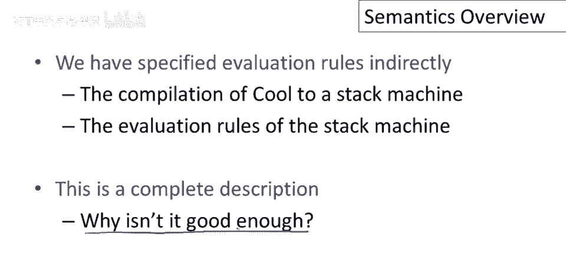
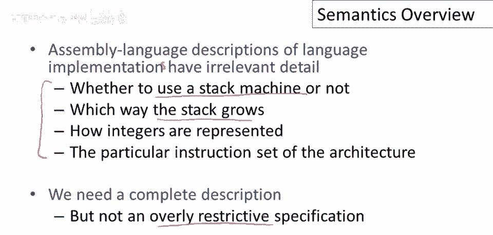
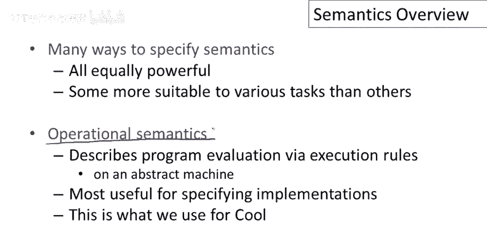
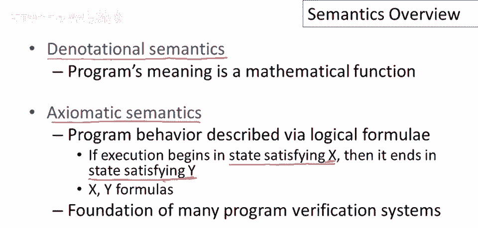

# P68：p68 13-01-_Semantics_Overvi - 加加zero - BV1Mb42177J7

这是关于编程语言语义的系列视频之一，特别是关于cool的语义，在深入技术细节之前，尽管我想花几分钟谈谈什么是编程语言语义。

以及为什么我们需要它们。

我们需要解决的问题是，当我们运行cool程序时，我们期望的行为是什么，因此，对于每种cool表达式，对于每个人，我们必须说明它在评估时会发生什么，我们可以将此视为表达式的含义，我们以某种方式给出规则。

指定特定，特定表达式进行何种计算，我认为回顾一下我们如何处理类似问题是有用的，在定义cool的其他部分，好的，我们在本课程中已经看过的早期内容，例如，对于词法分析，我们使用正则表达式定义了一组标记。

对于语言的语法，我们使用上下文无关文法来指定单词，如何组合成cool中有效的句子，然后，嗯，对于语义分析，我们给出了正式的类型规则，现在，呃，我们到了必须谈论程序实际运行的地方，因此。

我们必须给出一些评估规则，这些将指导我们如何做，代码生成和优化将决定程序应该做什么，以及我们可以对程序进行哪些转换以使其运行更快或使用更少的空间，或其他，任何其他我们想执行的优化。

到目前为止，我们一直在间接地指定评估规则，我们通过给出完整的编译策略一直到栈机代码来做到这一点，然后我们讨论了栈机的评估规则，实际上是将栈机代码翻译成汇编代码，这当然是一个完整的描述。

你可以取生成的汇编代码并在机器上运行它，看看程序做了什么，这将是一个关于程序行为的合法描述，然后问题是，你知道，为什么这还不够好，为什么仅仅有一个语言的代码生成器。

为什么这还不是关于如何执行代码的足够好的描述，答案可能有点难以理解，如果没有写过几个编译器的话，人们从经验中得知，汇编语言描述的语言实现，语言实现包含很多无关细节，当你得到如此完整的可执行描述时。

有很多事你不得不说，嗯，关于程序如何执行，这些并非必要，所以，例如，我们使用栈机的事实，并非特定编程语言实现的固有属性，我们本可用其他代码生成策略，你知道，无需栈机实现语言的事实，栈的增长方向。

是向高地址还是低地址增长，你可以两种方式实现，嗯，整数的具体表示，执行或实现特定语言结构的特定指令，所有这些都是实现语言的一种方式，但我们不想它们被，作为语言实现的唯一方式。

所以我们真正想要的是一个完整的描述，但不要过于限制，一个允许不同实现的方式，当人们没有这样做时，当人们没有尝试找到相对高级的方式来描述语言行为时，他们不可避免地陷入了一种情况，人们不得不去运行参考实现。

以决定它做什么等，这并不令人满意，一种情况，因为参考实现并不完全正确，会有漏洞，会有特定实现方式的痕迹，你并不想成为语言的一部分，但因为没有更好的定义，最终成为，嗯，固定，你知道，语言形成中的意外，嗯。

第一次实现。

有很多方法，嗯，实际指定适合任务的语义，结果这些同样强大。

但有些更适合某些任务，我们将使用的称为操作语义，操作语义通过抽象机器上的执行规则描述程序评估，我们给出一些规则，假设你知道特定表达式的，执行方式，可以将其视为非常高级的，代码生成。

这对于指定实现非常有用，也是我们将用来描述cool语义的，我想提及两种其他指定编程语言语义的方式。

因为它们，很重要，你可能在课程之外遇到它们，一种是谓词语义，程序的意义实际上被给定为一个数学函数，因此，程序文本被映射到一个从输入到输出的函数，这个函数是数学意义上的实际函数，这是一种非常优雅的方法。

但它在定义适当函数类时引入了复杂性，我们实际上不需要考虑这些复杂性，只是为了描述实现。

另一种重要的方法是公理语义，在这里，嗯，程序行为用某种逻辑描述，你在这个语言中写的基本陈述，或在这个公理语义中，是如果执行从满足x的状态开始，那么它将结束于满足y的状态，其中x和y是某种逻辑中的公式。

这是许多自动分析程序的系统的基础，试图证明程序的事实，要么证明它们是正确的。

